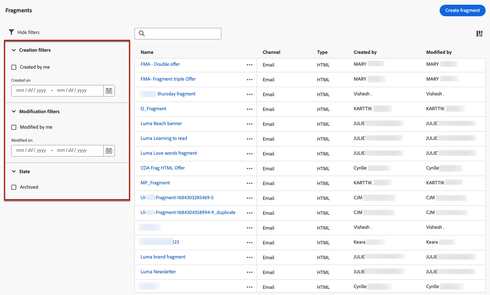

# Utilizzare i frammenti {#fragments}

Un frammento è un componente riutilizzabile a cui è possibile fare riferimento in una o più e-mail in [!DNL Journey Optimizer] campagne e percorsi.

Questa funzionalità consente di precreare più blocchi di contenuto personalizzati che possono essere utilizzati da utenti di marketing non tecnici per assemblare rapidamente i contenuti delle e-mail in un processo di progettazione migliorato.

<!--
➡️ [Learn how to create and use templates in this video](#video-templates)-->

>[!CAUTION]
>
>Per creare, modificare e archiviare i frammenti, è necessario disporre del **[!DNL Manage Library Items]** autorizzazione inclusa nel **[!DNL Content Library Manager]** profilo di prodotto. [Ulteriori informazioni](../administration/ootb-product-profiles.md#content-library-manager)

Per utilizzare al meglio i frammenti:

* Crea frammenti personalizzati. Consulta [Creare frammenti](#create-fragments)
* Utilizzali il numero di volte necessario nelle e-mail. Consulta [Utilizzare i frammenti](#use-fragments)

>[!NOTE]
>
>Attualmente questa funzione è disponibile solo per le e-mail.

## Accedere e gestire i frammenti {#access-manage-fragments}

Per accedere all’elenco dei frammenti, seleziona **[!UICONTROL Gestione dei contenuti]** > **[!UICONTROL Frammenti]** dal menu a sinistra.

Tutti i frammenti creati nella sandbox corrente, da **[!UICONTROL Frammenti]** utilizzando il menu [Salva come frammento](#save-as-fragment) opzione - vengono visualizzati.

Puoi filtrare i frammenti in base alla data di creazione o di modifica. Puoi scegliere di visualizzare tutti i frammenti o solo gli elementi creati o modificati dall’utente corrente. È inoltre possibile visualizzare **[!UICONTROL Archiviato]** frammenti. [Ulteriori informazioni](#archive-fragments)

Dalla sezione **[!UICONTROL Altre azioni]** accanto a ciascun frammento, puoi effettuare le seguenti operazioni:

* Duplica un frammento.

* Utilizza il **[!UICONTROL Esplora riferimenti]** per visualizzare i percorsi, le campagne o i modelli in cui viene utilizzato. [Ulteriori informazioni](#explore-references)

* Archivia un frammento. [Ulteriori informazioni](#archive-fragments)

### Modifica frammenti {#edit-fragments}

Per modificare un frammento, effettua le seguenti operazioni.

1. Fai clic sull’elemento desiderato da **[!UICONTROL Frammento]** elenco.
1. Dalle proprietà del frammento puoi [esplorare i riferimenti](#explore-references), [gestirne l’accesso](../administration/object-based-access.md) e aggiorna i dettagli del frammento.

   

1. Seleziona il pulsante corrispondente per modificare il contenuto, come faresti per creare un frammento da zero. [Ulteriori informazioni](#create-from-scratch)

>[!NOTE]
>
>Quando modifichi un frammento, le modifiche vengono propagate automaticamente a tutte le e-mail o ai modelli che lo contengono, ad eccezione delle e-mail utilizzate in **[!UICONTROL Live]** percorsi o campagne. Puoi anche interrompere l’ereditarietà dal frammento originale. [Ulteriori informazioni](#break-inheritance)

<!--Changes made to a fragment are not propagated to live journeys or campaigns where it is used.-->

<!--When added to an email, if you want to modify a fragment for a specific email, you can break the synchronization with the original fragment. The fragment becomes part of the email content and the changes will not be synchronized anymore. [Learn more](#break-inheritance)-->

### Esplora riferimenti {#explore-references}

Puoi visualizzare l’elenco dei percorsi, delle campagne e dei modelli di contenuto che attualmente utilizzano un frammento.

A tale scopo, seleziona **[!UICONTROL Esplora riferimenti]** dall&#39; **[!UICONTROL Altre azioni]** nell’elenco dei frammenti o dalla schermata delle proprietà del frammento.

Seleziona una scheda per passare da percorsi, campagne e modelli. Puoi visualizzarne lo stato e fare clic su un nome da reindirizzare all’elemento corrispondente in cui si fa riferimento al frammento.

>[!NOTE]
>
>Se il frammento viene utilizzato in un percorso, una campagna o un modello con un’etichetta che impedisce l’accesso, viene visualizzato un messaggio di avviso sopra la scheda selezionata. [Ulteriori informazioni su OLAC (Object Level Access Control)](../administration/object-based-access.md)

### Archivia frammenti {#archive-fragments}

Puoi eliminare dall’elenco i frammenti gli elementi che non sono più rilevanti per il tuo marchio.

A tale scopo, fare clic sul pulsante **[!UICONTROL Altre azioni]** accanto al frammento desiderato e seleziona **[!UICONTROL Archivia]**. Scomparirà dall’elenco dei frammenti, impedendo agli utenti di utilizzarlo in e-mail o modelli futuri.

>[!NOTE]
>
>Se archivi un frammento utilizzato in un messaggio e-mail o in un modello di contenuto, <!--it will remain in the email or template, but you won't be able to select it from the fragment list to edit it-->l’e-mail o il modello non subirà modifiche.

Per annullare l’archiviazione di un frammento, applica il filtro **[!UICONTROL Archiviato]** elementi e seleziona **[!UICONTROL Annulla archiviazione]** dal **[!UICONTROL Altre azioni]** menu. Ora è nuovamente accessibile dall’elenco dei frammenti e può essere utilizzato in qualsiasi e-mail o modello.

## Creare frammenti {#create-fragments}

Esistono due modi per creare i frammenti:

* Creare un frammento da zero utilizzando **[!UICONTROL Frammenti]** menu dedicato. [Scopri come](#create-template-from-scratch)

* Durante la progettazione di un’e-mail o di un modello di contenuto, salva una parte del contenuto come frammento. [Scopri come](#save-as-template)

Una volta salvato, il frammento è disponibile per l’utilizzo in un percorso, una campagna o un modello. Sia che sia creato da zero o da un contenuto esistente, ora puoi utilizzare questo frammento durante la creazione di qualsiasi [email](get-started-email-design.md) o [modello di contenuto](content-templates.md) entro [!DNL Journey Optimizer]. [Ulteriori informazioni](#use-fragments)

### Crea da zero {#create-from-scratch}

>[!CONTEXTUALHELP]
>id="ajo_create_fragment"
>title="Definisci un frammento personalizzato"
>abstract="Crea un frammento autonomo da zero per rendere i contenuti riutilizzabili in più percorsi e campagne."

Per creare un frammento da zero, segui la procedura riportata di seguito.

1. Accedere all’elenco dei frammenti tramite **[!UICONTROL Gestione dei contenuti]** > **[!UICONTROL Frammenti]** menu a sinistra.

1. Seleziona **[!UICONTROL Crea frammento]**.

1. Inserisci i dettagli del frammento, ovvero nome e descrizione (se necessario).

   

   >[!NOTE]
   >
   >Attualmente solo il **[!UICONTROL Frammento visivo]** tipo e **E-mail** sono supportati.

1. Per assegnare etichette di utilizzo dei dati personalizzate o di base al frammento, seleziona **[!UICONTROL Gestisci accesso]**. [Ulteriori informazioni su OLAC (Object Level Access Control)](../administration/object-based-access.md).

1. Fai clic su **[!UICONTROL Crea]**.

1. Il [E-mail Designer](get-started-email-design.md) visualizzazioni. Modifica il contenuto in base alle esigenze, come faresti per qualsiasi e-mail all’interno di un percorso o di una campagna.

   >[!NOTE]
   >
   >Puoi aggiungere campi di personalizzazione e contenuto dinamico, ma gli attributi contestuali non sono supportati nei frammenti.

   

1. Quando il frammento è pronto, fai clic su **[!UICONTROL Salva]**.

1. Se necessario, fai clic sulla freccia accanto al nome del frammento per tornare al **[!UICONTROL Dettagli]** e modificarlo.

   

Questo frammento è ora pronto per essere utilizzato durante la creazione di qualsiasi [email](get-started-email-design.md) o [modello di contenuto](content-templates.md) entro [!DNL Journey Optimizer]. [Scopri come](#use-fragments)

### Salva come frammento {#save-as-fragment}

Durante la progettazione di un [modello di contenuto](content-templates.md) o un [email](get-started-email-design.md) in una campagna o in un percorso, puoi salvare una parte del contenuto come frammento per riutilizzarlo in futuro. Per farlo, segui la procedura indicata di seguito.

1. In [E-mail Designer](get-started-email-design.md), fai clic sui puntini di sospensione in alto a destra dello schermo.

1. Seleziona **[!UICONTROL Salva come frammento]** dal menu a discesa.

   

1. Il **[!UICONTROL Salva come frammento]** schermo. Seleziona gli elementi da includere nel frammento, inclusi i campi di personalizzazione e il contenuto dinamico. Gli attributi contestuali non sono supportati nei frammenti.

   >[!CAUTION]
   >
   >Potete selezionare solo le sezioni adiacenti. Non puoi selezionare una struttura vuota o un altro frammento.

   

1. Fai clic su **[!UICONTROL Crea]**. Inserisci i dettagli del frammento, ovvero nome e descrizione (se necessario).

   

   >[!NOTE]
   >
   >Attualmente solo il **[!UICONTROL Frammento visivo]** tipo e **E-mail** sono supportati.

1. Per assegnare etichette di utilizzo dei dati personalizzate o di base al frammento, seleziona **[!UICONTROL Gestisci accesso]**. [Ulteriori informazioni su OLAC (Object Level Access Control)](../administration/object-based-access.md).

1. Clic **[!UICONTROL Crea]** di nuovo. Il frammento viene salvato in **[!UICONTROL Frammenti]** , accessibile dalla [!DNL Journey Optimizer] menu dedicato.

   Diventa un frammento autonomo che può essere [accesso eseguito](#access-manage-fragments), [modificato](#edit-fragments) e [archiviato](#archive-fragments) come qualsiasi altro elemento di tale elenco.

Ora puoi utilizzare questo frammento durante la creazione di qualsiasi [email](get-started-email-design.md) o [modello di contenuto](content-templates.md) entro [!DNL Journey Optimizer]. [Scopri come](#use-fragments)

>[!NOTE]
>
>Eventuali modifiche apportate al nuovo frammento non vengono propagate all’e-mail o al modello di origine. Allo stesso modo, quando il contenuto originale viene modificato all’interno dell’e-mail o del modello, il nuovo frammento non viene modificato.

## Utilizzare i frammenti {#use-fragments}

È possibile utilizzare un frammento in una [email](get-started-email-design.md) in un percorso, in una campagna o in un [modello di contenuto](content-templates.md).

1. Apri qualsiasi contenuto e-mail o modello utilizzando [E-mail Designer](get-started-email-design.md).

1. Seleziona la **[!UICONTROL Frammenti]** dalla barra a sinistra.

   

1. Viene visualizzato l’elenco di tutti i frammenti creati nella sandbox corrente. Puoi eseguire le seguenti operazioni:

   * Cerca un frammento specifico iniziando a digitarne l’etichetta.
   * Ordina i frammenti in ordine crescente o decrescente.
   * Modifica la modalità di visualizzazione dei frammenti (scheda o elenco).

1. Puoi anche aggiornare l’elenco.

   >[!NOTE]
   >
   >Se alcuni frammenti sono stati modificati o aggiunti durante la modifica del contenuto, l’elenco verrà aggiornato con le modifiche più recenti.

1. Trascina un frammento dall’elenco nell’area in cui desideri inserirlo.

   

1. Come qualsiasi altro componente, puoi spostare il frammento all’interno del contenuto.

1. Seleziona il frammento per visualizzare il riquadro corrispondente a destra. Da lì puoi eliminare il frammento dal contenuto o duplicarlo. Puoi anche eseguire queste azioni direttamente dal menu contestuale visualizzato sopra il frammento.

   

1. Dalla sezione **[!UICONTROL Impostazioni]** , è possibile:

   * Scegli i dispositivi su cui vuoi visualizzare il frammento.
   * Apri il frammento in una nuova scheda per modificarlo, se necessario. [Ulteriori informazioni](#edit-fragments)
   * Esplora i riferimenti. [Ulteriori informazioni](#explore-references)

1. Puoi personalizzare ulteriormente il frammento utilizzando **[!UICONTROL Stili]** scheda.

1. Se necessario, puoi interrompere l’ereditarietà con il frammento originale. [Ulteriori informazioni](#break-inheritance)

1. Aggiungi tutti i frammenti desiderati e **[!UICONTROL Salva]** le tue modifiche.

### Interrompi ereditarietà {#break-inheritance}

Quando modifichi un frammento, le modifiche vengono sincronizzate. Vengono propagati automaticamente a tutti **[!UICONTROL Bozza]** percorsi/campagne e modelli di contenuto contenenti tale frammento.

>[!NOTE]
>
>Le modifiche non vengono propagate alle e-mail utilizzate in **[!UICONTROL Live]** percorsi o campagne.

I frammenti aggiunti a un messaggio e-mail o a un modello di contenuto vengono sincronizzati per impostazione predefinita.

Tuttavia, puoi interrompere l’ereditarietà dal frammento originale. In tal caso, il contenuto del frammento viene copiato nella progettazione corrente e le modifiche non verranno più sincronizzate.

Per interrompere l’ereditarietà, effettua le seguenti operazioni:

1. Seleziona il frammento.

1. Fai clic sull’icona Sblocca nella barra degli strumenti contestuale.

   

1. Il frammento diventa un elemento autonomo non più collegato al frammento originale. Modificalo come qualsiasi altro componente del contenuto. [Ulteriori informazioni](content-components.md)

<!--

## How-to video {#video-templates}

Learn how to create, edit, and use fragments in [!DNL Journey Optimizer].

>[!VIDEO](https://video.tv.adobe.com/v/3413743/?quality=12)

-->
