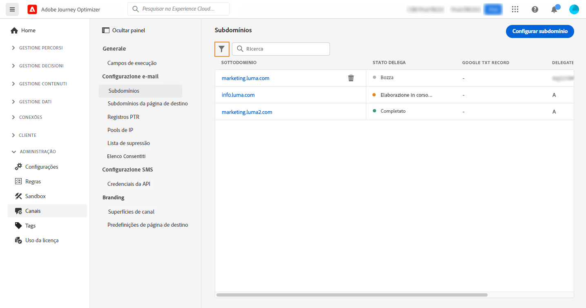
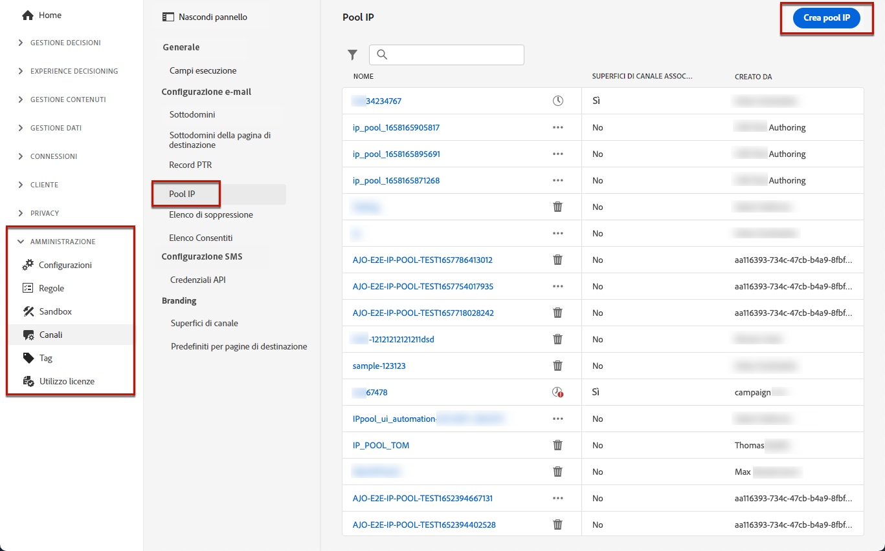
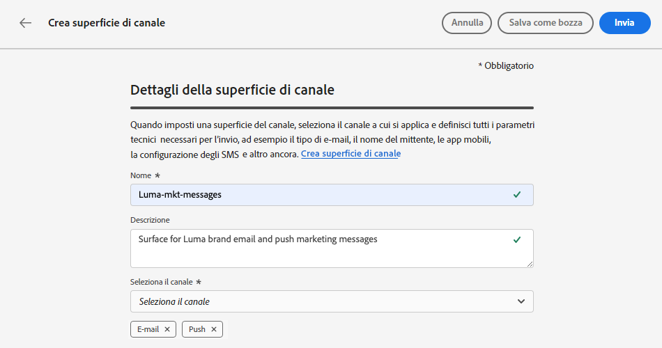
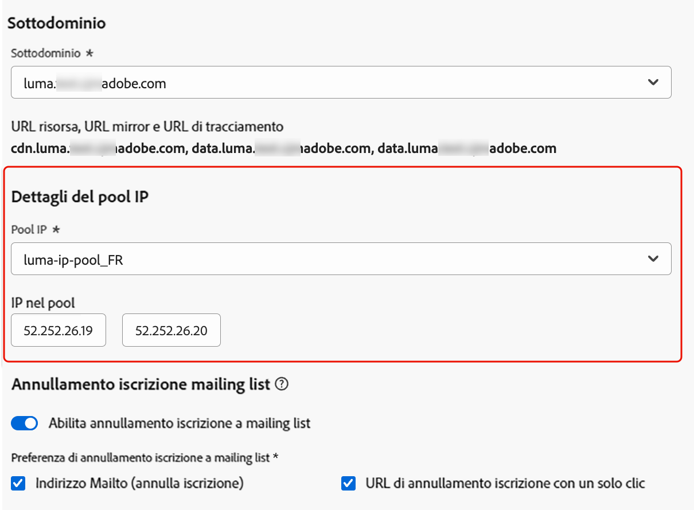
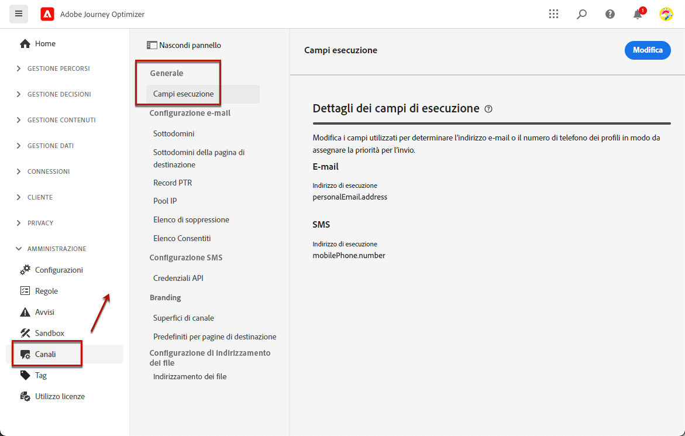
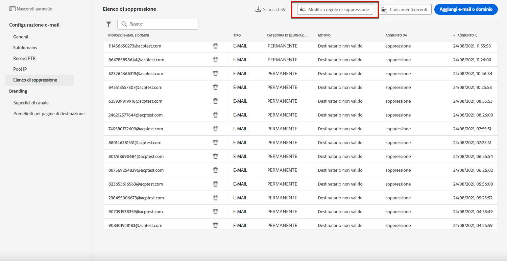

# Introduzione alla configurazione e-mail {#get-starte-email-config}

Per inviare e-mail tramite percorsi e campagne in [!DNL Journey Optimizer], devi seguire diversi passaggi di configurazione.

1. Per garantire la recapitabilità ottimale e proteggere la reputazione, inizia **delegando a Adobe i sottodomini** con cui invierai le e-mail con [!DNL Journey Optimizer]. Questi sottodomini determineranno elementi quali le pagine web da tracciare e gli URL della pagina mirror. [Ulteriori informazioni](../configuration/about-subdomain-delegation.md)

   

1. Crea pool IP per **raggruppare gli indirizzi IP** per i quali è stato eseguito il provisioning con la tua istanza. [Ulteriori informazioni](../configuration/ip-pools.md)

   

1. Crea **configurazioni dei canali** e seleziona il canale **[!UICONTROL e-mail]**. [Ulteriori informazioni](../configuration/channel-surfaces.md)

   

1. In ogni configurazione dei canali e-mail, configura tutti i **parametri tecnici** necessari per inviare e-mail. [Ulteriori informazioni](email-settings.md)

   * In questo punto è possibile selezionare il sottodominio da utilizzare per inviare le e-mail e i pool IP da associare alla configurazione. [Ulteriori informazioni](email-settings.md#ip-pools)

   

   * Il **[!UICONTROL Prefisso e-mail Da]** e il **[!UICONTROL Prefisso e-mail di errore]** utilizzano il [sottodominio delegato](../configuration/about-subdomain-delegation.md) attualmente selezionato. Facoltativamente, **[!UICONTROL Nome mittente]** e **[!UICONTROL Indirizzo e-mail mittente]** possono identificare un&#39;altra parte trasmittente (indirizzo completo **Mittente**, non associato al suffisso del sottodominio). [Ulteriori informazioni](header-parameters.md#sender-header)

   

1. Determina quali **campi di esecuzione** utilizzare in priorità per i destinatari quando sono disponibili più indirizzi in Adobe Experience Platform. [Ulteriori informazioni](../configuration/primary-email-addresses.md)

   

1. Gestisci il numero di giorni durante i quali vengono eseguiti **nuovi tentativi** prima di inviare indirizzi e-mail all’elenco di soppressione. [Ulteriori informazioni](../configuration/manage-suppression-list.md)

   
