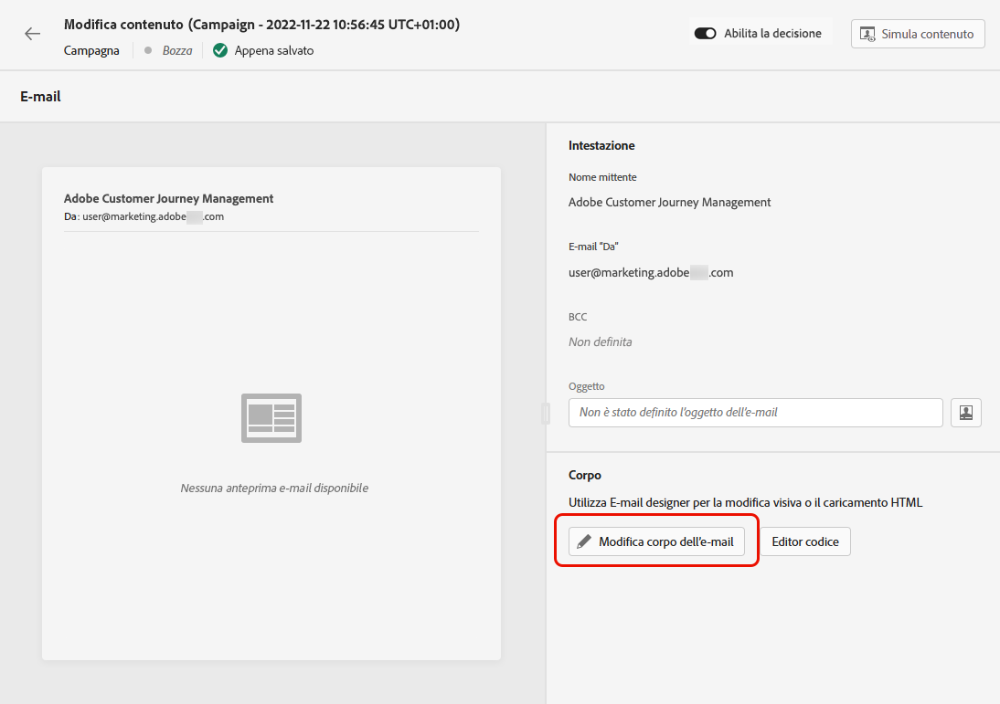
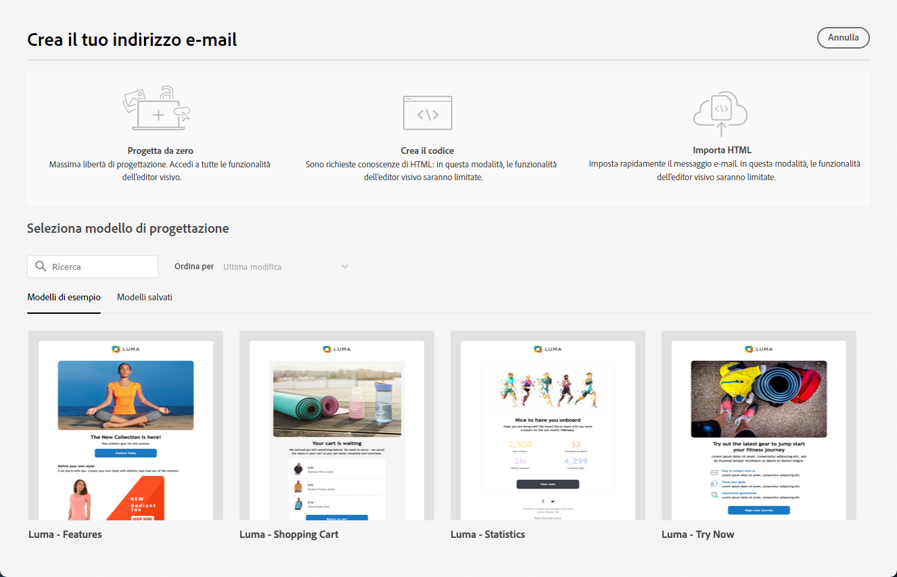

# Introduzione alla progettazione delle e-mail {#get-started-content-design}

Per accedere a E-mail Designer e iniziare a progettare il contenuto delle e-mail, devi prima [creare un’e-mail](create-email.md) in un percorso o in una campagna.

Puoi quindi utilizzare la **funzionalità di progettazione e-mail** di [!DNL Journey Optimizer] per importare contenuto esistente o iniziare a creare e-mail dinamiche da zero. [Ulteriori informazioni](content-from-scratch.md)

E-mail Designer consente inoltre di:

* Sfrutta **Adobe Experience Manager Assets Essentials** per arricchire le e-mail e creare e gestire un tuo database di risorse. [Ulteriori informazioni](../integrations/assets.md)

* Trova **foto Adobe Stock** per creare i contenuti e migliorare la progettazione delle e-mail. [Ulteriori informazioni](../integrations/stock.md)

* Migliora l’esperienza dei clienti creando messaggi personalizzati e dinamici in base ai loro attributi di profilo. Ulteriori informazioni su [personalizzazione](../personalization/personalize.md) e [contenuti dinamici](../personalization/get-started-dynamic-content.md).

➡️ [Scopri questa funzione nel video](#video)

## Passaggi chiave per la creazione di contenuti e-mail {#key-steps}

Dopo aver creato un’e-mail, puoi iniziare a progettarne il contenuto.

1. Dalla schermata di configurazione del percorso o della campagna, passa alla schermata **[!UICONTROL Modifica contenuto]** per accedere a E-mail Designer. [Ulteriori informazioni](create-email.md#define-email-content)

   

1. Nella pagina home di E-mail Designer, scegli come desideri progettare l’e-mail tra le seguenti opzioni:

   * **Progetta l’e-mail da zero** tramite l’interfaccia di E-mail designer e sfrutta le immagini da [Adobe Experience Manager Assets](../integrations/assets.md). Scopri come progettare il contenuto delle e-mail in [questa sezione](content-from-scratch.md).

   * **Codifica o incolla HTML non elaborato** direttamente in E-mail designer. Scopri come codificare il tuo contenuto in [questa sezione](code-content.md).

     >[!NOTE]
     >
     >In una campagna, puoi anche selezionare il pulsante **[!UICONTROL Editor di codice]** dalla schermata **[!UICONTROL Modifica contenuto]**. [Ulteriori informazioni](create-email.md#define-email-content)

   * **Importa contenuto HTML esistente** da un file o da una cartella .zip. Scopri come importare un contenuto e-mail in [questa sezione](existing-content.md).

   * **Converti le progettazioni di immagini in modelli HTML** utilizzando il convertitore da immagine a HTML basato sull’IA. Scopri come trasformare le immagini statiche in modelli e-mail modificabili in [questa sezione](image-to-html.md).

   * **Seleziona un contenuto esistente** da un elenco di modelli incorporati o personalizzati. Scopri come utilizzare i modelli e-mail in [questa sezione](../email/use-email-templates.md).

   

1. Una volta definito e personalizzato il contenuto dell’e-mail, puoi esportarlo per la convalida o per un utilizzo successivo. Fai clic su **[!UICONTROL Esporta HTML]** per salvare sul computer un file zip che includerà il tuo HTML e le tue risorse.

   

## Best practice per la progettazione e-mail {#best-practices}

Quando si inviano le e-mail, è importante tenere presente che i destinatari possono inoltrarle e, a volte, questo può causare problemi con il rendering dell’e-mail. Ciò è particolarmente vero quando si utilizzano classi CSS che potrebbero non essere supportate dal provider di posta elettronica utilizzato per l’inoltro, ad esempio, se si utilizza la classe CSS “is-desktop-hidden” per nascondere un’immagine su dispositivi mobili.

Per ridurre al minimo questi problemi di rendering, ti consigliamo di mantenere la struttura della progettazione e-mail il più semplice possibile. Prova a utilizzare una singola progettazione che funzioni bene sia per il desktop che per i dispositivi mobili ed evita di utilizzare classi CSS complesse o altri elementi di progettazione che potrebbero non essere completamente supportati da tutti i client e-mail. Seguendo queste best practice, puoi assicurarti che il rendering delle e-mail sia sempre corretto, indipendentemente da come vengono visualizzate o inoltrate dai destinatari.

Per le best practice per la progettazione di e-mail, fai riferimento alla tabella seguente:

| Consigliato | Da usare con cautela | Non consigliato |
|-|-|-|
| <ul><li><b>Layout statici basati su tabella</b> per la struttura</li> <li><b>Tabelle HTML e tabelle nidificate</b> per layout coerenti</li> <li><b>Larghezze del modello</b> tra 600 px e 800 px </li> <li><b>CSS semplice e in linea</b> per gli stili </li> <li><b>Font sicuri per il web</b> per compatibilità universale</li> | <ul><li>Le <b>immagini di sfondo</b> potrebbero non essere visualizzate in alcune piattaforme e-mail.</li><li>I <b>font web personalizzati</b> non sono universalmente supportati.</li><li>I <b>layout larghi</b> possono essere difficili da visualizzare sugli schermi più piccoli.</li><li>Le <b>mappe immagine</b> offrono funzionalità limitate.</li><li>Gli stili <b>CSS incorporati</b> vengono talvolta rimossi durante la consegna delle e-mail.</li> | <ul><li><b>JavaScript</b> non è solitamente supportato negli ambienti e-mail.</li> <li> I tag <b>`<iframe>`</b> vengono bloccati nella maggior parte delle piattaforme. </li> <li><b>Flash</b> è obsoleto e non è più supportato.</li> <li>L’<b>audio incorporato</b> spesso non viene riprodotto correttamente.</li> <li>I <b>video incorporati</b> non sono compatibili con molte piattaforme e-mail.</li> <li> I <b>moduli</b> non funzionano nelle e-mail.</li> <li> L’utilizzo di più livelli `
` può causare problemi di rendering.</li> |

>[!NOTE]
>
>La direttiva [European Accessibility Act](https://eur-lex.europa.eu/legal-content/IT/TXT/?uri=CELEX%3A32019L0882){target="_blank"} stabilisce che tutte le comunicazioni digitali devono essere accessibili. Oltre alle best practice per la progettazione delle e-mail elencate in questa sezione, assicurati di seguire anche le linee guida riportare in [questa pagina](accessible-content.md) specifiche per la creazione di contenuti accessibili con E-mail designer.

## Video sulle procedure {#video}

Scopri come creare contenuti e-mail con l’editor dei messaggi.

>[!VIDEO](https://video.tv.adobe.com/v/334150?quality=12)

Scopri come configurare gli esperimenti sui contenuti per test A/B ed esplora al meglio i contenuti e-mail per raggiungere gli obiettivi aziendali.

>[!VIDEO](https://video.tv.adobe.com/v/3419893)
