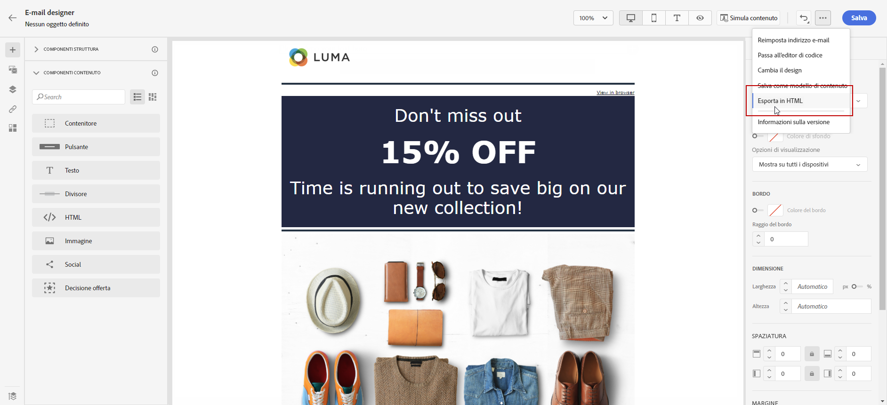

# Introduzione alla progettazione delle e-mail {#get-started-content-design}

Puoi importare un contenuto esistente in [!DNL Journey Optimizer] oppure sfruttare le funzionalità di progettazione dei contenuti:

* Utilizza le **funzionalità di progettazione delle e-mail** di [!DNL Journey Optimizer] per creare o importare e-mail dinamiche. [Ulteriori informazioni](content-from-scratch.md)

* Sfrutta **Adobe Experience Manager Assets Essentials** per arricchire le e-mail e creare e gestire un tuo database di risorse. [Ulteriori informazioni](../content-management/assets-essentials.md)

* Trova **foto Adobe Stock** per creare i contenuti e migliorare la progettazione delle e-mail. [Ulteriori informazioni](../content-management/stock.md)

* Migliora l’esperienza dei clienti creando messaggi personalizzati e dinamici in base ai loro attributi di profilo. Ulteriori informazioni su [personalizzazione](../personalization/personalize.md) e [contenuti dinamici](../personalization/get-started-dynamic-content.md).

➡️ [Scopri questa funzione nel video](#video)

## Best practice per la progettazione e-mail {#best-practices}

Quando si inviano le e-mail, è importante tenere presente che i destinatari possono inoltrarle e, a volte, questo può causare problemi con il rendering dell’e-mail. Ciò è particolarmente vero quando si utilizzano classi CSS che potrebbero non essere supportate dal provider di posta elettronica utilizzato per l’inoltro, ad esempio, se si utilizza la classe CSS “is-desktop-hidden” per nascondere un’immagine su dispositivi mobili.

Per ridurre al minimo questi problemi di rendering, ti consigliamo di mantenere la struttura della progettazione e-mail il più semplice possibile. Prova a utilizzare una singola progettazione che funzioni bene sia per il desktop che per i dispositivi mobili ed evita di utilizzare classi CSS complesse o altri elementi di progettazione che potrebbero non essere completamente supportati da tutti i client e-mail. Seguendo queste best practice, puoi assicurarti che il rendering delle e-mail sia sempre corretto, indipendentemente da come vengono visualizzate o inoltrate dai destinatari.

## Passaggi chiave per la creazione di contenuti e-mail {#key-steps}

Una volta che [è stata aggiunta un’e-mail](create-email.md) a un percorso o a una campagna, puoi iniziare a creare il contenuto dell’e-mail.

1. Dalla schermata di configurazione del percorso o della campagna, passa alla schermata **[!UICONTROL Modifica contenuto]** per accedere a E-mail Designer. [Ulteriori informazioni](create-email.md#define-email-content)

   

1. Nella pagina home di E-mail Designer, scegli come desideri progettare l’e-mail tra le seguenti opzioni:

   * **Progettazione dell’e-mail da zero** tramite l’interfaccia di e-mail designer e sfrutta le immagini da [Adobe Experience Manager Assets Essentials](../content-management/assets-essentials.md). Scopri come progettare il contenuto delle e-mail in [questa sezione](content-from-scratch.md).

   * **Codifica o incolla HTML non elaborato** direttamente nella finestra di e-mail designer. Scopri come codificare il tuo contenuto in [questa sezione](code-content.md).

     >[!NOTE]
     >
     >In una campagna, puoi anche selezionare il pulsante **[!UICONTROL Editor di codice]** dalla schermata **[!UICONTROL Modifica contenuto]**. [Ulteriori informazioni](create-email.md#define-email-content)

   * **Importa contenuto HTML esistente** da un file o da una cartella .zip. Scopri come importare un contenuto e-mail in [questa sezione](existing-content.md).

   * **Seleziona un contenuto esistente** da un elenco di modelli integrati o personalizzati. Scopri come utilizzare i modelli e-mail in [questa sezione](email-templates.md).

   

1. Una volta definito e personalizzato il contenuto dell’e-mail, puoi esportarlo per la convalida o per un utilizzo successivo. Fai clic su **[!UICONTROL Esporta HTML]** per salvare sul computer un file zip che includerà il tuo HTML e le tue risorse.

   

## Video sulle procedure {#video}

Scopri come creare contenuti e-mail con l’editor dei messaggi.

>[!VIDEO](https://video.tv.adobe.com/v/334150?quality=12)

Scopri come configurare gli esperimenti sui contenuti per test A/B ed esplora al meglio i contenuti e-mail per raggiungere gli obiettivi aziendali.

>[!VIDEO](https://video.tv.adobe.com/v/3419893)
