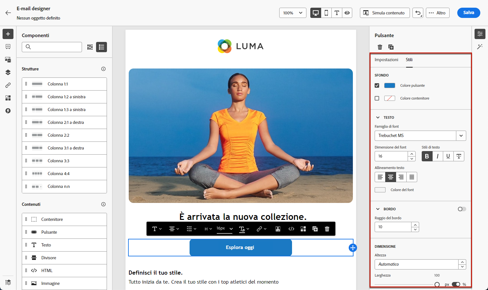

# Introduzione allo stile delle e-mail {#get-started-email-style}

Una volta iniziato a creare il contenuto delle e-mail in [!DNL Journey Optimizer], è possibile modificare una serie di parametri e attributi di stile dal riquadro **[!UICONTROL Stili]** di E-mail Designer.

Puoi applicare le modifiche al corpo dell’e-mail, a un componente struttura o a un componente contenuto.

Segui i collegamenti riportati di seguito per scoprire come regolare alcune delle impostazioni di stile delle e-mail.

* Scopri come [personalizzare lo sfondo delle e-mail](backgrounds.md)
* Scopri come [gestire l’allineamento verticale e la spaziatura](alignment-and-padding.md)
* Scopri come [personalizzare gli attributi di stile in linea](inline-styling.md)
* Scopri come [aggiungere CSS personalizzato al contenuto dell&#39;e-mail](custom-css.md)
* Scopri come [gestire i contenuti in modalità scura](dark-mode.md)

>[!NOTE]
>
>Il [European Accessibility Act](https://eur-lex.europa.eu/legal-content/EN/TXT/?uri=CELEX%3A32019L0882){target="_blank"} stabilisce che tutte le comunicazioni digitali devono essere accessibili. Segui le linee guida di stile specifiche elencate in [questa pagina](../email/accessible-content.md) durante la progettazione del contenuto in [!DNL Journey Optimizer], ad esempio la regolazione di colori, etichette e icone per garantire chiarezza e l&#39;ottimizzazione della progettazione per i layout mobili e reattivi.