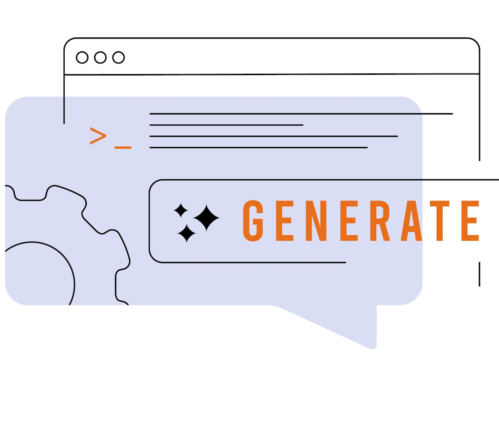

# Introduzione all’e-mail {#get-started-email}

>[!CONTEXTUALHELP]
>id="ajo_homepage_card4"
>title="Progettare le e-mail"
>abstract="Utilizza **Adobe Journey Optimizer** per inviare messaggi e-mail ai clienti. È possibile creare, personalizzare e visualizzare in anteprima i messaggi in E-mail Designer."

Utilizza [!DNL Journey Optimizer] per inviare messaggi e-mail ai clienti. È possibile creare, personalizzare e visualizzare in anteprima i messaggi in E-mail Designer.

È possibile creare le consegne e-mail:

* In un **percorso**: dopo aver aggiunto un’attività **[!UICONTROL E-mail]** al percorso e definito le impostazioni di base, utilizza il riquadro **[!UICONTROL Azioni: e-mail]** a destra per creare il contenuto del messaggio. [Scopri come creare un percorso](../building-journeys/journey-gs.md)

* In una **campagna**: dopo aver creato una campagna, seleziona l’azione **[!UICONTROL E-mail]** e definisci le impostazioni di base. Scopri come creare [una campagna di azione](../campaigns/campaign-action.md#action-campaign-action) | [una campagna attivata da API](../campaigns/api-triggered-campaigns.md) | [una campagna orchestrata](../orchestrated/create-orchestrated-campaign.md#create)

>[!IMPORTANT]
>
>Se è la prima volta che crei un’e-mail, assicurati che il canale e-mail sia stato configurato. [Ulteriori informazioni](email-settings.md)

<table style="table-layout:fixed"><tr style="border: 0;">
<td>

<a href="create-email.md"><strong>Creare un messaggio e-mail</strong>

</td>
<td>

<a href="get-started-email-design.md"><strong>Progettazione di un’e-mail</strong></a>

</td>
<td>

<a href="email-opt-out.md"><strong>Gestione della rinuncia alle e-mail</strong></a>

</td>
<td>

<a href="email-settings.md"><strong>Configurare il canale e-mail</strong></a>

</td>
</tr></table>

<table style="table-layout:fixed"><tr style="border: 0;">
<td>

<a href="../content-management/generative-email.md"><strong>Assistente IA per la generazione di contenuti</strong>

</td>
<td>

<a href="../content-management/fragments.md"><strong>Utilizzare i frammenti di contenuto e-mail</strong></a>

</td>
<td>

<a href="../personalization/personalize.md"><strong>Personalizzare il contenuto e-mail</strong></a>

</td>
<td>

<a href="../integrations/assets.md"><strong>Combinare app e soluzioni Adobe</strong></a>

</td>
</tr></table>

## Risorse aggiuntive

* **[Creare un’e-mail](create-email.md)**: scopri come creare messaggi e-mail nelle campagne e nei percorsi con istruzioni dettagliate.
* **[Progettare contenuti e-mail](get-started-email-design.md)**: scopri i diversi modi in cui progettare i contenuti delle e-mail, da zero o utilizzando i modelli.
* **[Configurazione e-mail](get-started-email-config.md)**: scopri come configurare le impostazioni e-mail, inclusi superfici e-mail, sottodomini e pool IP.
* **[Personalizzazione e stile delle e-mail](get-started-email-style.md)**: padroneggia le tecniche di stile tra cui CSS personalizzato, allineamento, spaziatura e supporto della modalità scura.
* **[Tracciare e monitorare le e-mail](message-tracking.md)**: scopri come tenere traccia di aperture di messaggi, clic e gestire il tracciamento URL per l’analisi delle prestazioni.
* **[Tutorial sul canale e-mail](https://experienceleague.adobe.com/it/docs/journey-optimizer-learn/tutorials/channels/email-channel){target="_blank"}**: esplora i tutorial video dettagliati sulle funzioni e sulle best practice delle e-mail.
