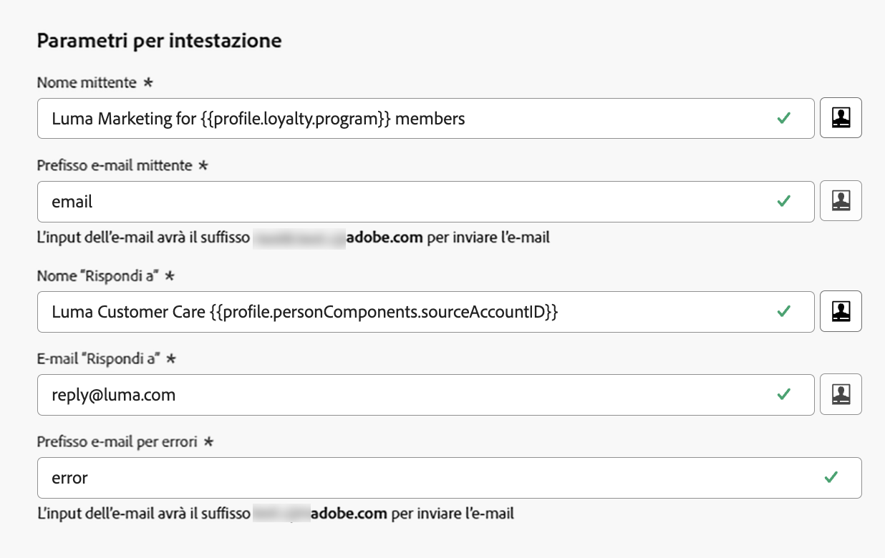

# Parametri per intestazione {#email-header}

Durante la configurazione di una nuova [configurazione del canale e-mail](email-settings.md), nella sezione **[!UICONTROL Parametri intestazione]**, immetti i nomi del mittente e gli indirizzi e-mail associati al tipo di e-mail inviate utilizzando tale configurazione.

>[!NOTE]
>
>Per un maggiore controllo sulle impostazioni e-mail, puoi personalizzare i parametri dell’intestazione. [Ulteriori informazioni](../email/surface-personalization.md#personalize-header)
>
>Quando [si modifica una configurazione e-mail](../configuration/channel-surfaces.md#edit-channel-surface), non è possibile aggiungere nuovi [attributi di profilo](../personalization/personalization-build-expressions.md#sources) ai parametri di intestazione. Devi creare una nuova configurazione di canale.

* **[!UICONTROL Dal nome]**: il nome del mittente, ad esempio il nome del tuo brand.

* **[!UICONTROL Dal prefisso e-mail]**: l’indirizzo e-mail che desideri utilizzare per le comunicazioni.

* **[!UICONTROL Rispondi a nome]**: il nome che verrà utilizzato quando il destinatario farà clic sul pulsante **Rispondi** nel software di client e-mail.

* **[!UICONTROL Rispondi a e-mail]**: l’indirizzo e-mail che verrà utilizzato quando il destinatario farà clic sul pulsante **Rispondi** nel software di client e-mail. [Ulteriori informazioni](#reply-to-email)

* **[!UICONTROL Prefisso e-mail di errore]**: tutti gli errori generati dagli ISP dopo alcuni giorni dalla consegna della mail (mancati recapiti asincroni) vengono ricevuti su questo indirizzo. Su questo indirizzo vengono inoltre ricevute le notifiche fuori sede e le risposte alle richieste di verifica.

  Se desideri ricevere le notifiche fuori sede e le risposte di richiesta di verifica su un indirizzo e-mail specifico non delegato ad Adobe, è necessario impostare un [processo di inoltro](#forward-email). In tal caso, assicurati di disporre di una soluzione manuale o automatizzata pronta per elaborare le e-mail che verranno inviate a questa casella in entrata.

>[!NOTE]
>
>Gli indirizzi **[!UICONTROL Da prefisso e-mail]** e **[!UICONTROL Prefisso e-mail di errore]** utilizzano il [sottodominio delegato](../configuration/about-subdomain-delegation.md) corrente selezionato per inviare l’e-mail. Ad esempio, se il sottodominio delegato è *marketing.luma.com*:
>
>* Immetti *contatto* come **[!UICONTROL Da prefisso e-mail]**: l’e-mail del mittente è *contatto@marketing.luma.com*.
>* Immetti *errore* come **[!UICONTROL Prefisso e-mail di errore]**: l’indirizzo di errore è *errore@marketing.luma.com*.

{width="80%"}

>[!NOTE]
>
>Per **[!UICONTROL Da prefisso e-mail]** e **[!UICONTROL Prefisso e-mail errore]**, i valori devono iniziare con una lettera (A-Z) e possono contenere solo caratteri alfanumerici. È inoltre possibile utilizzare il carattere di sottolineatura `_`, il punto `.` e il trattino `-`.

## Intestazioni mittente {#sender-header}

>[!CONTEXTUALHELP]
>id="ajo_admin_preset_sender_header"
>title="Intestazioni mittente"
>abstract="Utilizza questi campi facoltativi quando l’entità trasmittente (mittente) è diversa da quella di authoring e (da); ad esempio la sede principale di un’azienda che invia messaggi per un brand secondario o un’agenzia che invia messaggi per più clienti. I client e-mail che supportano questa opzione in genere la mostrano come “Inviato per conto di” o “Tramite”."

Alcuni casi d&#39;uso richiedono che la cassetta postale che trasmette il messaggio sia diversa da quella dell&#39;autore **From**, ad esempio un&#39;organizzazione principale che invia per conto di un&#39;affiliata, un team di marketing condiviso per diversi marchi o un&#39;agenzia che invia per più clienti.

In altre parole, **From** è l&#39;autore del messaggio (da cui proviene l&#39;e-mail) e **Sender** è l&#39;agente responsabile della trasmissione del messaggio (che lo ha effettivamente inviato). Il campo **Sender** deve essere utilizzato quando l&#39;entità di trasmissione è diversa dall&#39;autore.

In questo caso, puoi impostare un nome e un indirizzo e-mail **Sender** diversi da aggiungere all&#39;intestazione e-mail utilizzando i campi seguenti nella sezione **Intestazioni mittente**:

* **[!UICONTROL Nome mittente]**: il nome dell&#39;autore responsabile della trasmissione del messaggio quando è diverso da **Da**.

* **[!UICONTROL E-mail mittente]**: l&#39;indirizzo e-mail della parte che trasmette.

{width="80%"}

>[!NOTE]
>
>Questi campi sono facoltativi. Puoi [personalizzarli](surface-personalization.md#personalize-header) come gli altri campi di intestazione.

Quando **[!UICONTROL Sender name]** e **[!UICONTROL Sender email]** sono impostati, [!DNL Journey Optimizer] aggiunge un&#39;intestazione SMTP **Sender** all&#39;e-mail<!--as defined in [RFC 5322](https://datatracker.ietf.org/doc/html/rfc5322#section-3.6.2){target="_blank"}-->. I client di posta elettronica che supportano questo elemento potrebbero mostrare termini come **Sender per conto di From** o un indicatore **via**.

>[!NOTE]
>
>Se lasci **[!UICONTROL Nome mittente]** e **[!UICONTROL E-mail mittente]** vuote o se il **Mittente** risolto è identico a **Da**, non verrà aggiunta alcuna intestazione **Mittente**.

Note:

* L&#39;indirizzo **Sender** non è utilizzato per l&#39;allineamento di SPF, DKIM o DMARC; viene eseguita solo la convalida **format**. SPF, DKIM e DMARC continuano a basarsi sui campi **From**. Il sottodominio [delegato](../configuration/about-subdomain-delegation.md) selezionato per la configurazione rimane il dominio di invio utilizzato per tali controlli.

* Se **Sender** è configurato e la personalizzazione non viene risolta in un valore per un destinatario, il messaggio non viene recapitato a tale destinatario.

## Rispondi all’e-mail {#reply-to-email}

Quando definisci l’indirizzo per **[!UICONTROL Rispondi all’e-mail]**, puoi specificare qualsiasi indirizzo e-mail a condizione che sia valido, nel formato corretto e senza errori di battitura.

La casella in entrata utilizzata per le risposte riceverà tutte le e-mail di risposta, ad eccezione delle notifiche fuori sede e delle risposte di richiesta di verifica, ricevute all’indirizzo **E-mail di errore**.

Per garantire una corretta gestione delle risposte, segui i consigli seguenti:

* Assicurati che la casella in entrata dedicata disponga di una capacità di ricezione sufficiente per ricevere tutte le e-mail di risposta inviate utilizzando la configurazione e-mail. Se la casella in entrata restituisce mancati recapiti, alcune risposte da parte della clientela potrebbero non essere ricevute.

* Le risposte devono essere elaborate tenendo presenti gli obblighi di privacy e conformità, in quanto possono contenere informazioni di identificazione personale (PII).

* Non contrassegnare i messaggi come spam nella casella in entrata delle risposte, in quanto ciò influirà su tutte le altre risposte inviate a questo indirizzo.

Inoltre, quando definisci l’indirizzo per **[!UICONTROL Rispondi all’e-mail]**, assicurati di utilizzare un sottodominio con una configurazione di record MX valida, altrimenti l’elaborazione della configurazione e-mail non andrà a buon fine.

Se ricevi un errore durante l’invio della configurazione e-mail, significa che il record MX non è configurato per il sottodominio dell’indirizzo inserito. Contatta l’amministratore per configurare il record MX corrispondente o utilizza un altro indirizzo con una configurazione di record MX valida.

>[!NOTE]
>
>Se il sottodominio dell&#39;indirizzo immesso è un dominio [completamente delegato](../configuration/delegate-subdomain.md#set-up-subdomain) ad Adobe, contatta il rappresentante Adobe.

## Inoltra l’e-mail {#forward-email}

Per inoltrare a un indirizzo e-mail specifico tutte le e-mail ricevute da [!DNL Journey Optimizer] per il sottodominio delegato, contatta l’Assistenza clienti di Adobe.

>[!NOTE]
>
>Se il sottodominio utilizzato per l’indirizzo **[!UICONTROL Rispondi all’e-mail]** non è delegato ad Adobe, l’inoltro per tale indirizzo non può funzionare.

Dovrai fornire:

* L’indirizzo e-mail di inoltro desiderato. Il dominio dell’indirizzo e-mail di inoltro non può corrispondere ad alcun sottodominio delegato ad Adobe.
* Nome della tua sandbox.
* Il nome della configurazione o il sottodominio per cui verrà utilizzato l’indirizzo e-mail di inoltro.
  <!--* The current **[!UICONTROL Reply to (email)]** address or **[!UICONTROL Error email]** address set at the channel configuration level.-->

>[!NOTE]
>
>* Può essere presente un solo indirizzo e-mail di inoltro per sottodominio; se più configurazioni utilizzano lo stesso sottodominio, è necessario utilizzare lo stesso indirizzo e-mail di inoltro per tutte le configurazioni.
>* Se l&#39;inoltro non è abilitato, le e-mail inviate direttamente all&#39;indirizzo **Da e-mail** vengono ignorate per impostazione predefinita.

L’indirizzo e-mail di inoltro è configurato da Adobe. Questa operazione può richiedere da 3 a 4 giorni.

Al termine, tutti i messaggi ricevuti agli indirizzi **[!UICONTROL Rispondi all’e-mail]** e **E-mail di errore**, così come tutte le e-mail inviate agli indirizzi **Da e-mail**, vengono inoltrati all’indirizzo e-mail specifico fornito.

