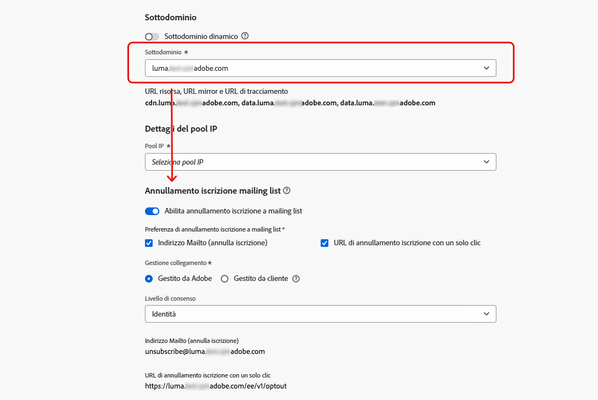
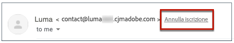
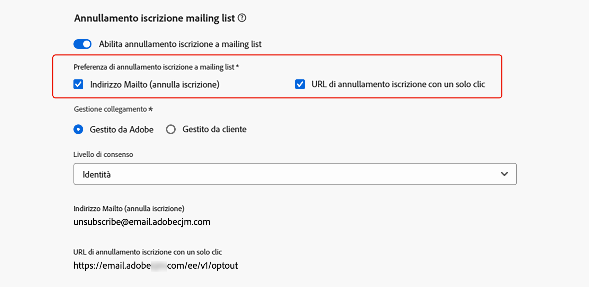
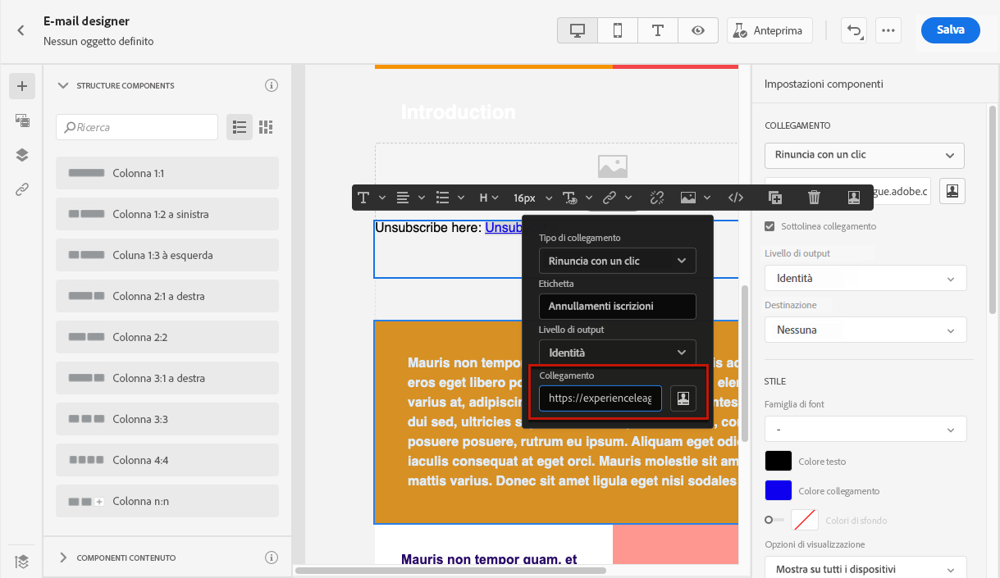

# Annullamento iscrizione a mailing list{#list-unsubscribe}

<!--Do not modify - Legal Review Done -->

Durante una nuova configurazione dei canali e-mail in [!DNL Adobe Journey Optimizer], [selezionando un sottodominio](email-settings.md#ip-pools) dall’elenco, viene visualizzata l’opzione **[!UICONTROL Abilita annullamento iscrizione a mailing list]**. Questa opzione è abilitata per impostazione predefinita.



L’URL di annullamento dell’iscrizione alla mailing list con un solo clic è un collegamento o un pulsante per l’annullamento dell’iscrizione visualizzato accanto alle informazioni sul mittente dell’e-mail e che consente ai destinatari di rinunciare istantaneamente all’iscrizione alle mailing list con un solo clic.

Ad esempio, l’URL di annullamento dell’iscrizione con un solo clic mostra un collegamento come indicato di seguito in Gmail:



>[!IMPORTANT]
>
>Per visualizzare l’URL di annullamento dell’iscrizione nell’intestazione dell’e-mail, il client e-mail dei destinatari deve supportare questa funzione.

A seconda del client e-mail e delle impostazioni della configurazione dell’e-mail di annullamento dell’iscrizione, facendo clic sul collegamento di annullamento iscrizione nell’intestazione e-mail si possono verificare i seguenti effetti:

* Quando la funzione **Mailto (annulla iscrizione)** è abilitata, la richiesta di annullamento dell’iscrizione viene inviata all’indirizzo predefinito per tale annullamento e in base al sottodominio configurato.
* Quando la funzione **URL di annullamento iscrizione con un solo clic** è abilitata, oppure se tale URL è inserito nel contenuto del corpo dell’e-mail, il destinatario che fa clic su di esso viene direttamente escluso a livello di canale o di ID (a seconda di come è configurato il consenso e in base al sottodominio configurato).

>[!NOTE]
>
>Scopri come gestire le impostazioni di annullamento dell’iscrizione in [questa sezione](#enable-list-unsubscribe) di seguito.

In entrambi i casi, quando un destinatario fa clic sul collegamento di rinuncia, la richiesta di annullamento dell’iscrizione viene elaborata di conseguenza. Il profilo corrispondente viene immediatamente escluso e questa scelta viene aggiornata in [Experience Platform](https://experienceleague.adobe.com/docs/experience-platform/profile/ui/user-guide.html?lang=it){target="_blank"}. Scopri di più sull’elaborazione del consenso nella [documentazione di Experience Platform](https://experienceleague.adobe.com/docs/experience-platform/landing/governance-privacy-security/consent/adobe/overview.html?lang=it){target="_blank"}.

>[!NOTE]
>
>Talvolta, gli eventi per l’annullamento dell’iscrizione potrebbero richiedere più tempo per essere riflessi a livello di profilo, a causa dell’elaborazione dei dati a valle. È necessario attendere affinché il sistema si aggiorni.

## Abilitare l’annullamento di iscrizione a mailing list {#enable-list-unsubscribe}

>[!CONTEXTUALHELP]
>id="ajo_admin_preset_unsubscribe"
>title="Aggiungi un URL per l’annullamento dell’iscrizione alle e-mail"
>abstract="Abilita questa opzione per aggiungere automaticamente un URL di annullamento iscrizione nell’intestazione dell’e-mail. Puoi anche impostare un URL per l’annullamento dell’iscrizione in un messaggio, inserendo un collegamento per la rinuncia con un clic nel contenuto dell’e-mail."
>additional-url="https://experienceleague.adobe.com/it/docs/journey-optimizer/using/channels/email/email-opt-out#one-click-opt-out" text="Impostare la rinuncia con un clic dal contenuto dell’e-mail"

Quando l’opzione **[!UICONTROL Abilita annullamento iscrizione a mailing list]** è abilitata, se supportata dal client e-mail dei destinatari, l’intestazione dell’e-mail include per impostazione predefinita un mailto e/o un URL che i destinatari possono utilizzare per annullare l’iscrizione alla mailing list.

>[!NOTE]
>
>Se disabiliti questa opzione, nell’intestazione dell’e-mail non viene visualizzato alcun URL di annullamento iscrizione con un solo clic.

L’intestazione per l’annullamento dell’iscrizione a mailing list offre due opzioni che sono abilitate per impostazione predefinita, a meno che non vengano deselezionate:

{width="80%"}

* Un indirizzo **[!UICONTROL Mailto (annulla iscrizione)]**, che è quello di destinazione a cui vengono indirizzate le richieste di annullamento iscrizione per l’elaborazione automatica. In [!DNL Journey Optimizer], l’indirizzo e-mail per l’annullamento dell’iscrizione è l’indirizzo **[!UICONTROL Mailto (annulla iscrizione)]** predefinito visualizzato nella configurazione dei canali, in base al [sottodominio selezionato](email-settings.md#subdomains). <!--With this method, clicking the Unsubscribe link sends a pre-filled email to the unsubscribe address specified in the email header.-->

* L’**[!UICONTROL URL di annullamento dell’iscrizione con un solo clic]**, che per impostazione predefinita è l’URL di rinuncia con un solo clic generato nell’intestazione per l’annullamento iscrizione alla mailing list, in base al [sottodominio selezionato](email-settings.md#subdomains). <!--With this method, clicking the Unsubscribe link directly unsubscribes the user, requiring only a single action to unsubscribe.-->

Puoi selezionare il **[!UICONTROL Livello di consenso]** dall’elenco a discesa corrispondente. Può essere specifico per il canale o per l’identità del profilo. In base a questa impostazione, quando un utente annulla l’iscrizione utilizzando l’URL di annullamento iscrizione alla mailing list nell’intestazione di un’e-mail, il consenso viene aggiornato in [!DNL Adobe Journey Optimizer] a livello di canale o di ID.

## Guardrail e consigli {#list-unsubscribe-guardrails}

La funzione URL di l’annullamento iscrizione a mailing list con un solo clic consente ai destinatari di rinunciare facilmente alle comunicazioni. Tuttavia, poiché non tutti i client e-mail supportano questo collegamento nell’intestazione dell’e-mail, Adobe consiglia di aggiungere anche un [collegamento di rinuncia con un solo clic](email-opt-out.md#one-click-opt-out) o un [collegamento di annullamento iscrizione](email-opt-out.md#add-unsubscribe-link) nel corpo dell’e-mail.

Le funzioni **[!UICONTROL Indirizzo Mailto (annulla iscrizione)]** e **[!UICONTROL URL di annullamento iscrizione con un solo clic]** sono facoltative.

* Se hai attivato l’opzione **[!UICONTROL Abilita annullamento dell’iscrizione alla mailing list]** nelle [impostazioni di configurazione e-mail](email-settings.md), ti consigliamo di abilitare entrambi i metodi: **Mailto (annulla iscrizione)** e **URL di annullamento iscrizione con un solo clic**. Non tutti i client e-mail supportano il metodo HTTP. Grazie alla funzione Mailto di annullamento dell’iscrizione alla mailing list, che consente di selezionare un’alternativa, la reputazione del mittente può essere maggiormente protetta e a tutti i destinatari può essere concesso l’accesso alla funzionalità di annullamento dell’iscrizione.

* Se non desideri utilizzare l’URL di annullamento iscrizione con un solo clic predefinito generato, puoi deselezionare la funzione.

   * Nello scenario in cui l’opzione **[!UICONTROL Abilita annullamento di iscrizione a mailing list]** sia attivata e la funzione **[!UICONTROL URL di annullamento iscrizione con un solo clic]** sia deselezionata, se viene aggiunto un [collegamento di rinuncia con un solo clic](../email/email-opt-out.md#one-click-opt-out) a un messaggio creato utilizzando questa configurazione, l’intestazione Annullamento iscrizione alla mailing list rileva tale collegamento, inserito nel corpo dell’e-mail, e lo utilizza come valore dell’URL di annullamento iscrizione con un solo clic.

     

   * Se non aggiungi un collegamento di rinuncia con un solo clic nel contenuto del messaggio e l’**[!UICONTROL URL di annullamento iscrizione con un solo clic]** predefinito è deselezionato nelle impostazioni di configurazione dei canali, nessun URL verrà trasferito nell’intestazione dell’e-mail come parte dell’intestazione per l’annullamento dell’iscrizione alla mailing list.

  >[!NOTE]
  >
  >Ulteriori informazioni sulla gestione delle funzionalità di annullamento dell’iscrizione nei messaggi sono disponibili in [questa sezione](../email/email-opt-out.md#unsubscribe-header).

In [!DNL Journey Optimizer], il consenso è gestito dallo [Schema di consenso](https://experienceleague.adobe.com/docs/experience-platform/xdm/field-groups/profile/consents.html?lang=it){target="_blank"} di Experience Platform. Per impostazione predefinita, il valore del campo di consenso è vuoto e viene trattato come consenso alla ricezione delle comunicazioni. Puoi modificare questo valore predefinito durante l’onboarding in uno dei possibili valori elencati [qui](https://experienceleague.adobe.com/docs/experience-platform/xdm/data-types/consents.html?lang=it#choice-values){target="_blank"} oppure utilizzare i [criteri di consenso](../action/consent.md) per ignorare la logica predefinita.

Attualmente, [!DNL Journey Optimizer] non aggiunge un tag specifico agli eventi di annullamento dell’iscrizione attivati dalla funzione di annullamento iscrizione a mailing list. Se devi distinguere i clic per annullare l’iscrizione alla mailing list da altre azioni di annullamento iscrizione, devi implementare un’assegnazione tag personalizzata esternamente o sfruttare una pagina di destinazione esterna per il tracciamento.

## Gestire esternamente i dati di annullamento iscrizione {#custom-managed}

>[!CONTEXTUALHELP]
>id="ajo_email_config_unsubscribe_custom"
>title="Definire la modalità di gestione dei dati di annullamento iscrizione"
>abstract="**Gestito da Adobe**: i dati sul consenso vengono gestiti da te all’interno del sistema Adobe.<br>**Gestito da cliente**: i dati sul consenso vengono gestiti da te in un sistema esterno e la sincronizzazione dei dati sul consenso non viene aggiornata nel sistema Adobe, a meno che questa non venga avviata da te."

>[!CONTEXTUALHELP]
>id="ajo_email_config_unsubscribe_custom_url"
>title="Inserire un URL di annullamento iscrizione con un solo clic"
>abstract="L’**URL di annullamento iscrizione con un solo clic** deve utilizzare il metodo di richiesta POST."

Se gestisci il consenso al di fuori di Adobe, seleziona l’opzione **[!UICONTROL Gestito da cliente]** per immettere un indirizzo e-mail personalizzato per l’annullamento dell’iscrizione e l’URL personalizzato di annullamento con un clic.

{width="80%"}

L’**[!UICONTROL URL di annullamento iscrizione con un solo clic]** deve essere un URL POST.

>[!WARNING]
>
>Se utilizzi l’opzione **[!UICONTROL Gestito da cliente]**, Adobe non archivia i dati sul consenso o di annullamento dell’iscrizione. Con l’opzione **[!UICONTROL Gestito da cliente]**, le organizzazioni scelgono di utilizzare un sistema esterno e saranno responsabili della gestione dei dati sul consenso in tale sistema esterno. Non esiste alcuna sincronizzazione automatica dei dati sul consenso tra il sistema esterno e [!DNL Journey Optimizer]. Qualsiasi sincronizzazione dei dati sul consenso, originata dal sistema esterno per aggiornare i dati sul consenso dell’utente in [!DNL Journey Optimizer], deve essere avviata dall’organizzazione come trasferimento di dati per inviare nuovamente i dati sul consenso in [!DNL Journey Optimizer].

### Aggiungere attributi personalizzati agli endpoint {#custom-attributes}

Con l’opzione **[!UICONTROL Gestito da cliente]** selezionata, se immetti endpoint personalizzati e li utilizzi in una campagna o in un percorso, [!DNL Journey Optimizer] aggiunge alcuni parametri predefiniti specifici del profilo all’evento di aggiornamento del consenso <!--sent to the custom endpoint --> quando i destinatari fanno clic sul collegamento Annulla iscrizione.

Per personalizzare ulteriormente gli endpoint <!-- (**[!UICONTROL Mailto (unsubscribe)]** and **[!UICONTROL One-click Unsubscribe URL]**)--> ora è possibile definire gli attributi personalizzati che verranno aggiunti all’evento di consenso.

>[!AVAILABILITY]
>
>Questa funzionalità è in disponibilità limitata. Per ottenere l’accesso, contatta il tuo rappresentante Adobe.
>
>Per l&#39;opzione **[!UICONTROL Invia a (annulla sottoscrizione)]**, è necessario utilizzare i nuovi parametri di query descritti in **Invia a (annulla sottoscrizione) con attributi personalizzati (disponibilità limitata)** sezione [sotto](#configure-decrypt-api).

Per definire attributi personalizzati per gli endpoint, consulta la sezione **[!UICONTROL Parametri di tracciamento URL]**. Tutti i parametri di tracciamento URL definiti nella sezione corrispondente verranno aggiunti alla fine degli endpoint personalizzati, oltre ai parametri predefiniti. [Scopri come impostare il tracciamento URL personalizzato](url-tracking.md)

### Configurare l’API di decrittografia {#configure-decrypt-api}

Quando i destinatari fanno clic su un collegamento di annullamento dell’iscrizione personalizzato, i parametri aggiunti all’evento di aggiornamento del consenso vengono inviati all’endpoint in modo crittografato. Pertanto, il sistema di consenso esterno deve implementare un’API specifica tramite [Adobe Developer](https://developer.adobe.com){target="_blank"} per decrittografare i parametri inviati da Adobe.

La chiamata GET per recuperare questi parametri dipende dall’opzione Annullamento iscrizione a mailing list in uso: **[!UICONTROL URL per annullamento iscrizione con un solo clic]** o **[!UICONTROL Indirizzo Mailto (annulla iscrizione)]**.

<!--To configure the API to send back the information to [!DNL Adobe Journey Optimizer] when a recipient has unsubscribed using the List unsubscribe option with custom endpoints, follow the steps below.-->

+++ URL di annullamento iscrizione con un solo clic

Con l’opzione **[!UICONTROL URL per annullamento iscrizione con un solo clic]**, facendo clic sul collegamento Annulla iscrizione l’utente viene subito rimosso.

La chiamata GET è la seguente:

Endpoint: https://platform.adobe.io/journey/imp/consent/decrypt

Parametri query:

* **parametri**: contiene il payload crittografato
* **pid**: ID profilo crittografato

Questi due parametri verranno inclusi nell’evento di aggiornamento del consenso inviato agli endpoint personalizzati.

Requisiti dell’intestazione:

* x-api-key
* x-gw-ims-org-id
* autorizzazione (token utente dal tuo account tecnico)

Di seguito sono riportati parametri di esempio e la risposta di consenso:

| Parametri query | Payload di esempio |
|---------|----------|
| pid | {<br>&quot;pid&quot;  : &quot;5142733041546020095851529937068211571&quot;,<br>&quot;pns&quot;  : &quot;CRMID&quot;,<br>&quot;e&quot;    : &quot;john@google.com&quot;,<br>&quot;ens&quot;  : &quot;Email&quot;,<br>} |
| params | {<br>&quot;m&quot;  : &quot;messageExecutionId&quot;,<br>&quot;ci&quot;  : &quot;campaignId&quot;,<br>&quot;jv&quot; : &quot;journeyVersionId&quot;,<br>&quot;ja&quot; : &quot;journeyActionId&quot;,<br>&quot;s&quot;  : &quot;sandboxId&quot;,<br>&quot;us&quot; : &quot;unsubscribeScope&quot;<br>} |

Risposta di consenso:

```
{
    "profileNameSpace": " CRMID ",
    "profileId": "5142733041546020095851529937068211571",
    "emailAddress": "john@google.com",
    "emailNameSpace": "Email",
    "sandboxId": "sandboxId",
    "optOutLevel": "channel",
    "channelType": "email",
    "timestamp": "2024-11-26T14:25:09.316930Z"
    "utm": [
         {
            "utm_source": "AJO",
            "utm_medium": "Email"
        }
    ]
}
```

+++

+++ Indirizzo Mailto (annulla iscrizione)

Con l’opzione **[!UICONTROL Indirizzo Mailto (annulla iscrizione)]**, quando si fa clic sul collegamento Annulla iscrizione viene inviata un’e-mail precompilata all’indirizzo di annullamento dell’iscrizione specificato.

La chiamata GET è la seguente:

Endpoint: https://platform.adobe.io/journey/imp/consent/decrypt

Parametri query:

* **emailParams**: stringa contenente i parametri **params** (payload crittografato) e **pid** (ID profilo crittografato).

I parametri **params** e **pid** verranno inclusi nell’evento di aggiornamento del consenso inviato agli endpoint personalizzati.

Requisiti dell’intestazione:

* x-api-key
* x-gw-ims-org-id
* autorizzazione (token utente dal tuo account tecnico)

Di seguito sono riportati parametri di esempio e la risposta di consenso:

| Parametri query | Payload di esempio |
|---------|----------|
| emailParams | {<br>&quot;p&quot;  : &quot;profileId&quot;,<br>&quot;pn&quot;  : &quot;profileNamespace&quot;,<br>&quot;en&quot;  : &quot;emailNamespace&quot;,<br>&quot;ci&quot;  : &quot;campaignId&quot;,<br>&quot;jv&quot; : &quot;journeyVersionId&quot;,<br>&quot;ja&quot; : &quot;journeyActionId&quot;,<br>&quot;si&quot;  : &quot;sandboxId&quot;,<br>&quot;us&quot;: &quot;unsubscribeScope&quot;<br>} |

Risposta di consenso:

```
{
    "profileNameSpace": " CRMID ",
    "profileId": "5142733041546020095851529937068211571",
    "emailAddress": "john@google.com",
    "emailNameSpace": "Email",
    "sandboxId": "sandboxId",
    "optOutLevel": "channel",
    "channelType": "email",
    "timestamp": "2024-11-26T14:25:09.316930Z"
}
```

+++

+++ Mailto (annulla iscrizione) con attributi personalizzati (disponibilità limitata)

Con l’opzione **[!UICONTROL Mailto (annulla iscrizione)]**, quando fai clic sul collegamento Annulla iscrizione viene inviata un’e-mail precompilata all’indirizzo di annullamento dell’iscrizione specificato.

A partire da ottobre 2025, se utilizzi l’opzione **[!UICONTROL Gestito da cliente]** per l’endpoint **[!UICONTROL Mailto (annulla inscizione)]**, puoi definire attributi personalizzati che verranno aggiunti all’evento di consenso. In questo caso, è necessario utilizzare i parametri di query descritti di seguito.

>[!AVAILABILITY]
>
>Questa funzionalità è in disponibilità limitata. Per ottenere l’accesso, contatta il tuo rappresentante Adobe.

La chiamata GET è la seguente:

Endpoint: https://platform.adobe.io/journey/imp/consent/decrypt

Parametri query:

* **emailParamsSub**: stringa estratta dall’oggetto dell’e-mail ricevuta all’indirizzo Mailto.

   * Esempio: *unsubscribev1.abc*

   * Valore analizzato: *v1.abc*

* **emailParamsBody**: stringa estratta dal corpo dell’e-mail (se presente) nel formato *unsubscribev1.xyz*.

   * Valore analizzato: *v1.xyz*

Esempio di API: https://platform.adobe.io/journey/imp/consent/decrypt?emailParamsSub=v1.abc&emailParamsBody=v1.xyz

>[!CAUTION]
>
>Se utilizzi l’implementazione precedente (ad esempio: https://platform.adobe.io/journey/imp/consent/decrypt?emailParams=&lt;v1.xxx>), è necessario utilizzare i nuovi parametri **emailParamsSub** e **emailParamsBody** invece di **emailParams**. Per ulteriori informazioni, contatta il rappresentante Adobe.

I parametri **emailParamsSub** e **emailParamsBody** verranno inclusi nell’evento di aggiornamento del consenso inviato agli endpoint personalizzati.

Requisiti dell’intestazione:

* x-api-key
* x-gw-ims-org-id
* autorizzazione (token utente dal tuo account tecnico)

Risposta di consenso:

```
{
    "profileNameSpace": " CRMID ",
    "profileId": "5142733041546020095851529937068211571",
    "emailAddress": "john@google.com",
    "emailNameSpace": "Email",
    "sandboxId": "sandboxId",
    "optOutLevel": "channel",
    "channelType": "email",
    "timestamp": "2024-11-26T14:25:09.316930Z"
    "utm": [
        {
            "utm_source": "AJO",
            "utm_medium": "Email"
        }
    ]
}
```

+++
