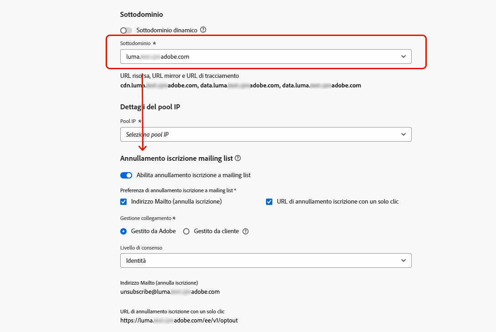
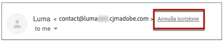
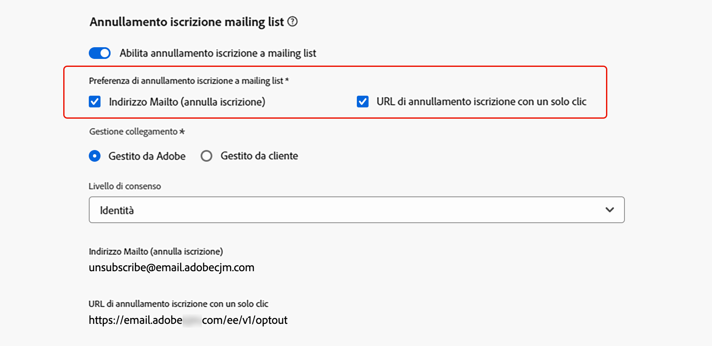
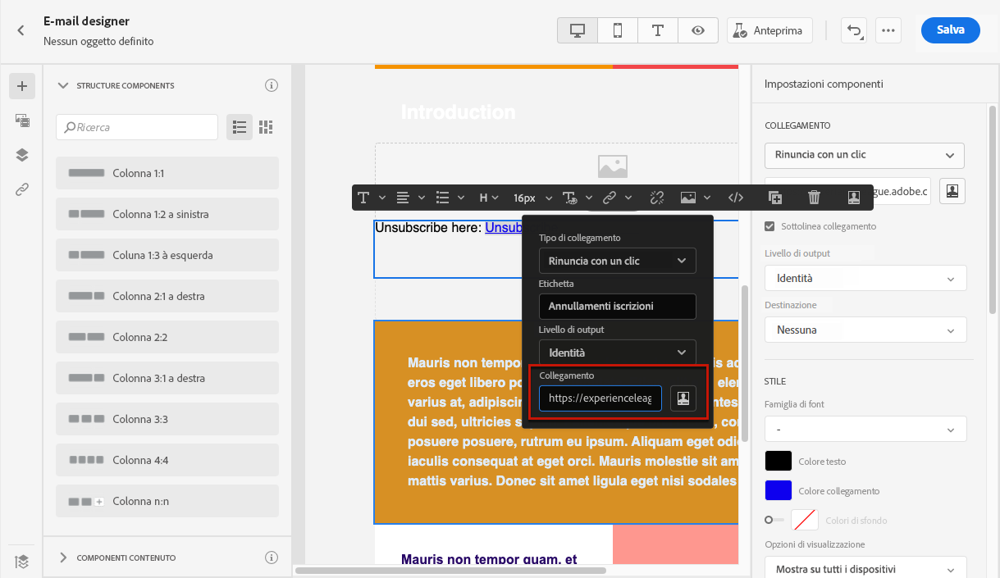
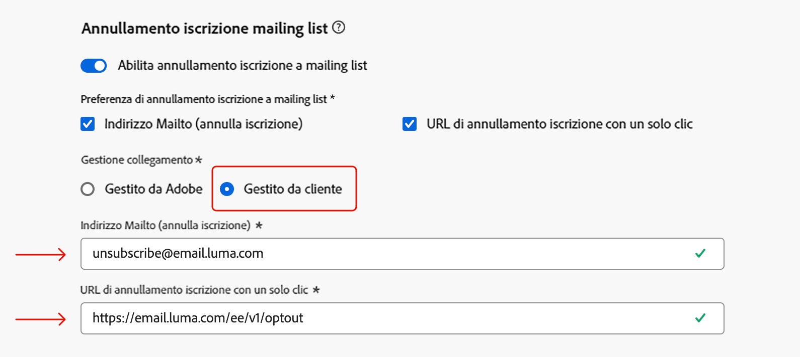

# Annullamento iscrizione elenco{#list-unsubscribe}

<!--Do not modify - Legal Review Done -->

In [!DNL Adobe Journey Optimizer], durante la configurazione di una nuova configurazione del canale e-mail, quando [selezioni un sottodominio](email-settings.md#ip-pools) dall&#39;elenco, viene visualizzata l&#39;opzione **[!UICONTROL Abilita annullamento sottoscrizione a elenco]**. È attivata per impostazione predefinita.



L’URL per l’annullamento dell’iscrizione all’elenco con un solo clic è un collegamento o un pulsante per l’annullamento dell’iscrizione visualizzato accanto alle informazioni sul mittente dell’e-mail e che consente ai destinatari di annullare immediatamente l’iscrizione alle mailing list con un solo clic.

Ad esempio, l’URL per l’annullamento dell’iscrizione con un solo clic mostra un collegamento come indicato di seguito in Gmail:



>[!IMPORTANT]
>
>Per visualizzare l’URL con un solo clic per l’annullamento dell’iscrizione nell’intestazione dell’e-mail, il client e-mail dei destinatari deve supportare questa funzione.

A seconda del client e-mail e delle impostazioni di annullamento dell’abbonamento alla configurazione e-mail, facendo clic sul collegamento di annullamento dell’abbonamento nell’intestazione e-mail si possono verificare i seguenti effetti:

* Quando la funzionalità **Invia a (annulla sottoscrizione)** è abilitata, la richiesta di annullamento dell&#39;iscrizione viene inviata all&#39;indirizzo predefinito dell&#39;annullamento dell&#39;iscrizione in base al sottodominio configurato.
* Quando la funzione **URL per l&#39;annullamento dell&#39;iscrizione con un solo clic** è abilitata o se hai inserito un URL per l&#39;annullamento dell&#39;iscrizione nel contenuto del corpo dell&#39;e-mail, il destinatario viene direttamente escluso, a livello di canale o a livello di ID (a seconda di come è configurato il consenso), quando fa clic sull&#39;URL per l&#39;annullamento dell&#39;iscrizione con un solo clic (in base al sottodominio configurato).

>[!NOTE]
>
>Scopri come gestire le impostazioni di annullamento dell&#39;abbonamento in [questa sezione](#enable-list-unsubscribe) di seguito.

In entrambi i casi, quando un destinatario fa clic sul collegamento di rinuncia, la richiesta di annullamento dell’abbonamento viene elaborata di conseguenza. Il profilo corrispondente viene immediatamente escluso e questa scelta viene aggiornata in [Experience Platform](https://experienceleague.adobe.com/docs/experience-platform/profile/ui/user-guide.html){target="_blank"}. Ulteriori informazioni sull&#39;elaborazione del consenso nella [documentazione di Experience Platform](https://experienceleague.adobe.com/docs/experience-platform/landing/governance-privacy-security/consent/adobe/overview.html){target="_blank"}.

>[!NOTE]
>
>A volte, gli eventi che causano l’annullamento dell’abbonamento potrebbero richiedere più tempo per essere riflessi a livello di profilo a causa dell’elaborazione dei dati a valle. Attendere qualche minuto per l&#39;aggiornamento del sistema.

## Abilita annullamento iscrizione elenco {#enable-list-unsubscribe}

>[!CONTEXTUALHELP]
>id="ajo_admin_preset_unsubscribe"
>title="Aggiungi un URL per l’annullamento dell’iscrizione alle e-mail"
>abstract="Abilita questa opzione per aggiungere automaticamente un URL per l’annullamento dell’iscrizione all’intestazione dell’e-mail. Puoi anche impostare un URL per l’annullamento dell’iscrizione in un messaggio inserendo un collegamento di rinuncia con un solo clic nel contenuto dell’e-mail."
>additional-url="https://experienceleague.adobe.com/en/docs/journey-optimizer/using/channels/email/email-opt-out#one-click-opt-out" text="Impostare la rinuncia con un clic dal contenuto dell’e-mail"

Quando l&#39;opzione **[!UICONTROL Abilita annullamento iscrizione a mailing list]** è abilitata, se supportata dal client di posta elettronica dei destinatari, l&#39;intestazione dell&#39;e-mail include sia un mailto che un URL per impostazione predefinita che i destinatari possono utilizzare per annullare l&#39;iscrizione alla mailing list.

>[!NOTE]
>
>Se disattivi questa opzione, nell’intestazione dell’e-mail non viene visualizzato alcun URL con un solo clic per annullare l’iscrizione.

L’intestazione Annulla iscrizione elenco offre due opzioni, che sono abilitate per impostazione predefinita a meno che non si deselezioni una o entrambe:

{width="80%"}

* Un indirizzo **[!UICONTROL Invia a (annulla iscrizione)]**, che è l&#39;indirizzo di destinazione a cui vengono indirizzate le richieste di annullamento iscrizione per l&#39;elaborazione automatica. In [!DNL Journey Optimizer], l&#39;indirizzo e-mail per l&#39;annullamento dell&#39;iscrizione è l&#39;indirizzo predefinito **[!UICONTROL Invia a (annulla iscrizione)]** visualizzato nella configurazione del canale, in base al [sottodominio selezionato](email-settings.md#subdomains). <!--With this method, clicking the Unsubscribe link sends a pre-filled email to the unsubscribe address specified in the email header.-->

* **[!UICONTROL URL per l&#39;annullamento dell&#39;iscrizione con un solo clic]**, che per impostazione predefinita è l&#39;intestazione per l&#39;annullamento dell&#39;iscrizione di un elenco generato dall&#39;URL di rinuncia con un solo clic, in base al [sottodominio selezionato](email-settings.md#subdomains). <!--With this method, clicking the Unsubscribe link directly unsubscribes the user, requiring only a single action to unsubscribe.-->

Puoi selezionare il **[!UICONTROL Livello di consenso]** dall&#39;elenco a discesa corrispondente. Può essere specifico per il canale o per l’identità del profilo. In base a questa impostazione, quando un utente annulla l&#39;iscrizione utilizzando l&#39;URL per l&#39;annullamento dell&#39;iscrizione all&#39;elenco nell&#39;intestazione di un&#39;e-mail, il consenso viene aggiornato in [!DNL Adobe Journey Optimizer], a livello di canale o di ID.

## Guardrail e raccomandazioni {#list-unsubscribe-guardrails}

La funzione URL per l’annullamento dell’iscrizione all’elenco con un solo clic consente ai destinatari di rinunciare facilmente alle comunicazioni. Tuttavia, poiché non tutti i client e-mail supportano questo collegamento nell&#39;intestazione dell&#39;e-mail, Adobe consiglia di aggiungere anche un [collegamento di rinuncia con un solo clic](email-opt-out.md#one-click-opt-out) o un [collegamento per annullare l&#39;abbonamento](email-opt-out.md#add-unsubscribe-link) nel corpo dell&#39;e-mail.

La funzionalità **[!UICONTROL Invia a (annulla iscrizione)]** e la funzionalità **[!UICONTROL URL per annullamento iscrizione con un solo clic]** sono facoltative.

* Se hai attivato l&#39;opzione **[!UICONTROL Abilita annullamento sottoscrizione elenco]** nelle [impostazioni di configurazione e-mail](email-settings.md), ti consigliamo di abilitare entrambi i metodi: **Invia a (annulla iscrizione)** e **URL annullamento iscrizione con un solo clic**. Non tutti i client e-mail supportano il metodo HTTP. Grazie alla funzione di annullamento dell’iscrizione all’elenco Invia a, che consente di selezionare un’alternativa, la reputazione del mittente può essere protetta meglio e tutti i destinatari possono accedere a utilizzare la funzionalità di annullamento dell’iscrizione.

* Se non desideri utilizzare l’URL predefinito generato con un solo clic per annullare l’abbonamento, puoi deselezionare la funzione.

   * Nel caso in cui l&#39;opzione **[!UICONTROL Abilita annullamento sottoscrizione a mailing list]** sia attivata e la funzionalità **[!UICONTROL URL annullamento sottoscrizione con un solo clic]** sia deselezionata, se si aggiunge un [collegamento di rinuncia con un solo clic](../email/email-opt-out.md#one-click-opt-out) a un messaggio creato utilizzando questa configurazione, l&#39;intestazione Annullamento iscrizione mailing list seleziona il collegamento di rinuncia con un solo clic inserito nel corpo dell&#39;e-mail e lo utilizza come valore URL di annullamento iscrizione con un solo clic.

     

   * Se non aggiungi un collegamento di rinuncia con un solo clic nel contenuto del messaggio e l&#39;URL predefinito per l&#39;annullamento dell&#39;iscrizione con un solo clic **non è selezionato nelle impostazioni di configurazione del canale, nell&#39;intestazione per l&#39;annullamento dell&#39;iscrizione all&#39;elenco non verrà passato alcun URL.**

  >[!NOTE]
  >
  >Ulteriori informazioni sulla gestione delle funzionalità di annullamento dell&#39;iscrizione nei messaggi sono disponibili in [questa sezione](../email/email-opt-out.md#unsubscribe-header).

In [!DNL Journey Optimizer], il consenso è gestito dallo [Schema di consenso](https://experienceleague.adobe.com/docs/experience-platform/xdm/field-groups/profile/consents.html){target="_blank"} di Experience Platform. Per impostazione predefinita, il valore del campo di consenso è vuoto e viene trattato come consenso alla ricezione delle comunicazioni. Puoi modificare questo valore predefinito durante l&#39;onboarding in uno dei possibili valori elencati [qui](https://experienceleague.adobe.com/docs/experience-platform/xdm/data-types/consents.html#choice-values){target="_blank"} oppure utilizzare [criteri di consenso](../action/consent.md) per ignorare la logica predefinita.

Attualmente, [!DNL Journey Optimizer] non aggiunge un tag specifico agli eventi di annullamento dell&#39;abbonamento attivati dalla funzione di annullamento dell&#39;abbonamento all&#39;elenco. Se devi distinguere i clic per annullare l’iscrizione all’elenco da altre azioni di annullamento dell’iscrizione, devi implementare un’assegnazione tag personalizzata esternamente o sfruttare una pagina di destinazione esterna per il tracciamento.

## Gestire esternamente i dati di annullamento dell’abbonamento {#custom-managed}

>[!CONTEXTUALHELP]
>id="ajo_email_config_unsubscribe_custom"
>title="Definire la modalità di gestione dei dati di annullamento dell’abbonamento"
>abstract="**Adobe managed**: i dati di consenso sono gestiti dall&#39;utente all&#39;interno del sistema Adobe.<br>**Gestione clienti**: i dati di consenso vengono gestiti dall&#39;utente in un sistema esterno e la sincronizzazione dei dati di consenso non viene aggiornata nel sistema Adobe a meno che non sia stata avviata dall&#39;utente."

>[!CONTEXTUALHELP]
>id="ajo_email_config_unsubscribe_custom_url"
>title="Inserisci il tuo URL per annullare l’iscrizione con un solo clic"
>abstract="L&#39;**URL per annullamento sottoscrizione con un solo clic** deve utilizzare il metodo di richiesta POST."

Se gestisci il consenso all&#39;esterno di Adobe, seleziona l&#39;opzione **[!UICONTROL Gestione clienti]** per immettere un indirizzo e-mail personalizzato per l&#39;annullamento dell&#39;iscrizione e il tuo URL personalizzato con un solo clic.

{width="80%"}

L&#39;**[!UICONTROL URL per annullare l&#39;iscrizione con un solo clic]** deve essere un URL POST.

>[!WARNING]
>
>Se utilizzi l&#39;opzione **[!UICONTROL Gestione clienti]**, Adobe non archivia i dati relativi agli annullamenti dell&#39;abbonamento o al consenso. Con l&#39;opzione **[!UICONTROL Gestione clienti]**, le organizzazioni scelgono di utilizzare un sistema esterno e saranno responsabili della gestione dei propri dati di consenso in tale sistema esterno. Non esiste alcuna sincronizzazione automatica dei dati sul consenso tra il sistema esterno e [!DNL Journey Optimizer]. Qualsiasi sincronizzazione dei dati sul consenso, originata dal sistema esterno per aggiornare i dati sul consenso dell&#39;utente in [!DNL Journey Optimizer], deve essere avviata dall&#39;organizzazione come trasferimento di dati per inviare nuovamente i dati sul consenso in [!DNL Journey Optimizer].

### Aggiungere attributi personalizzati agli endpoint {#custom-attributes}

Con l&#39;opzione **[!UICONTROL Gestione clienti]** selezionata, se immetti endpoint personalizzati e li utilizzi in una campagna o in un percorso, [!DNL Journey Optimizer] aggiunge alcuni parametri predefiniti specifici del profilo all&#39;evento di aggiornamento del consenso <!--sent to the custom endpoint --> quando i destinatari fanno clic sul collegamento per annullare l&#39;abbonamento.

Per personalizzare ulteriormente gli endpoint<!-- (**[!UICONTROL Mailto (unsubscribe)]** and **[!UICONTROL One-click Unsubscribe URL]**)-->, puoi definire attributi personalizzati che verranno aggiunti anche all&#39;evento di consenso.

>[!AVAILABILITY]
>
>Questa funzionalità è disponibile in Disponibilità limitata. Per ottenere l’accesso, contatta il rappresentante Adobe.
>
>Per l&#39;opzione **[!UICONTROL Invia a (annulla sottoscrizione)]**, è necessario utilizzare i nuovi parametri di query descritti in **Invia a (annulla sottoscrizione) con attributi personalizzati (disponibilità limitata)** sezione [sotto](#configure-decrypt-api).

Per definire attributi personalizzati per gli endpoint, utilizza la sezione **[!UICONTROL Parametri di tracciamento URL]**. Tutti i parametri di tracciamento URL definiti nella sezione corrispondente verranno aggiunti alla fine degli endpoint personalizzati, oltre ai parametri predefiniti. [Scopri come impostare il tracciamento URL personalizzato](url-tracking.md)

>[!NOTE]
>
>L&#39;ordine dei parametri UTM aggiunti all&#39;URL è casuale e non può essere controllato. Se il sistema richiede parametri in un ordine specifico, sarà necessario analizzarli e riordinarli sul proprio lato.

### Configurare l’API di decrittografia {#configure-decrypt-api}

Quando i destinatari fanno clic su un collegamento di annullamento dell’abbonamento personalizzato, i parametri aggiunti all’evento di aggiornamento del consenso vengono inviati all’endpoint in modo crittografato. Pertanto, il sistema di consenso esterno deve implementare un&#39;API specifica tramite [Adobe Developer](https://developer.adobe.com){target="_blank"} per decrittografare i parametri inviati da Adobe.

La chiamata di GET per recuperare questi parametri dipende dall&#39;opzione Elenco annullamenti sottoscrizione in uso: **[!UICONTROL URL annullamento sottoscrizione con un solo clic]** o **[!UICONTROL Invia a (annullamento sottoscrizione)]**.

<!--To configure the API to send back the information to [!DNL Adobe Journey Optimizer] when a recipient has unsubscribed using the List unsubscribe option with custom endpoints, follow the steps below.-->

+++ URL per annullamento iscrizione con un clic

Con l&#39;opzione **[!UICONTROL URL per l&#39;annullamento dell&#39;iscrizione]** con un solo clic, facendo clic sul collegamento per annullare l&#39;iscrizione l&#39;utente verrà annullato direttamente.

La chiamata GET è la seguente:

Endpoint: https://platform.adobe.io/journey/imp/consent/decrypt

Parametri query:

* **parametri**: contiene il payload crittografato
* **pid**: ID profilo crittografato

Questi due parametri verranno inclusi nell’evento di aggiornamento del consenso inviato agli endpoint personalizzati.

Requisiti intestazione:

* x-api-key
* x-gw-ims-org-id
* autorizzazione (token utente dal tuo account tecnico)

Di seguito sono riportati parametri di esempio e la risposta di consenso:

| Parametro query | Payload di esempio |
|---------|----------|
| pid | {<br>&quot;pid&quot;: &quot;5142733041546020095851529937068211571&quot;,<br>&quot;pns&quot;: &quot;CRMID&quot;,<br>&quot;e&quot;: &quot;john@google.com&quot;,<br>&quot;ens&quot;: &quot;E-mail&quot;,<br>} |
| parametri | {<br>&quot;m&quot; : &quot;messageExecutionId&quot;,<br>&quot;ci&quot; : &quot;campaignId&quot;,<br>&quot;jv&quot; : &quot;journeyVersionId&quot;,<br>&quot;ja&quot; : &quot;journeyActionId&quot;,<br>&quot;s&quot; : &quot;sandboxId&quot;,<br>&quot;us&quot; : &quot;unsubscribeScope&quot;<br>} |

Risposta al consenso:

```
{
    "profileNameSpace": " CRMID ",
    "profileId": "5142733041546020095851529937068211571",
    "emailAddress": "john@google.com",
    "emailNameSpace": "Email",
    "sandboxId": "sandboxId",
    "optOutLevel": "channel",
    "channelType": "email",
    "timestamp": "2024-11-26T14:25:09.316930Z"
    "utm": [
         {
            "utm_source": "AJO",
            "utm_medium": "Email"
        }
    ]
}
```

+++

+++ Invia a (annulla iscrizione)

Con l&#39;opzione **[!UICONTROL Invia a (annulla iscrizione)]**, facendo clic sul collegamento Annulla iscrizione, viene inviata un&#39;e-mail precompilata all&#39;indirizzo di annullamento dell&#39;iscrizione specificato.

La chiamata GET è la seguente.

Endpoint: https://platform.adobe.io/journey/imp/consent/decrypt

Parametri query:

* **emailParams**: stringa contenente i parametri **params** (payload crittografato) e **pid** (ID profilo crittografato).

I parametri **params** e **pid** verranno inclusi nell&#39;evento di aggiornamento del consenso inviato agli endpoint personalizzati.

Requisiti intestazione:

* x-api-key
* x-gw-ims-org-id
* autorizzazione (token utente dal tuo account tecnico)

Di seguito sono riportati parametri di esempio e la risposta di consenso:

| Parametro query | Payload di esempio |
|---------|----------|
| emailParams | {<br>&quot;p&quot; : &quot;profileId&quot;,<br>&quot;pn&quot; : &quot;profileNamespace&quot;,<br>&quot;en&quot; : &quot;emailNamespace&quot;,<br>&quot;ci&quot; : &quot;campaignId&quot;,<br>&quot;jv&quot; : &quot;journeyVersionId&quot;,<br>&quot;ja&quot; : &quot;journeyActionId&quot;,<br>&quot;si&quot; : &quot;sandboxId&quot;,<br>&quot;us&quot;: &quot;unsubscribeScope&quot;<br>} |

Risposta al consenso:

```
{
    "profileNameSpace": " CRMID ",
    "profileId": "5142733041546020095851529937068211571",
    "emailAddress": "john@google.com",
    "emailNameSpace": "Email",
    "sandboxId": "sandboxId",
    "optOutLevel": "channel",
    "channelType": "email",
    "timestamp": "2024-11-26T14:25:09.316930Z"
}
```

+++

+++ Invia a (annulla iscrizione) con attributi personalizzati (disponibilità limitata)

Con l&#39;opzione **[!UICONTROL Invia a (annulla iscrizione)]**, facendo clic sul collegamento Annulla iscrizione, viene inviata un&#39;e-mail precompilata all&#39;indirizzo di annullamento dell&#39;iscrizione specificato.

A partire da ottobre 2025, se utilizzi l&#39;opzione **[!UICONTROL Customer managed]** per l&#39;endpoint **[!UICONTROL Mailto (unsubscribe)]**, puoi definire attributi personalizzati che verranno aggiunti all&#39;evento di consenso. In questo caso, è necessario utilizzare i parametri di query descritti di seguito.

>[!AVAILABILITY]
>
>Questa funzionalità è disponibile in Disponibilità limitata. Per ottenere l’accesso, contatta il rappresentante Adobe.

La chiamata GET è la seguente.

Endpoint: https://platform.adobe.io/journey/imp/consent/decrypt

Parametri query:

* **emailParamsSub**: stringa estratta dall&#39;oggetto dell&#39;e-mail ricevuta all&#39;indirizzo di posta.

   * Esempio: *unsubscribev1.abc*

   * Valore analizzato: *v1.abc*

* **emailParamsBody**: stringa estratta dal corpo dell&#39;e-mail (se presente) nel formato *unsubscribev1.xyz*.

   * Valore analizzato: *v1.xyz*

Esempio di API: https://platform.adobe.io/journey/imp/consent/decrypt?emailParamsSub=v1.abc&emailParamsBody=v1.xyz

>[!CAUTION]
>
>Se utilizzi l&#39;implementazione precedente (ad esempio: https://platform.adobe.io/journey/imp/consent/decrypt?emailParams=&lt;v1.xxx>), devi utilizzare i nuovi parametri **emailParamsSub** e **emailParamsBody** invece di **emailParams**. Per ulteriori informazioni, contatta il rappresentante Adobe.

I parametri **emailParamsSub** e **emailParamsBody** verranno inclusi nell&#39;evento di aggiornamento del consenso inviato agli endpoint personalizzati.

Requisiti intestazione:

* x-api-key
* x-gw-ims-org-id
* autorizzazione (token utente dal tuo account tecnico)

Risposta al consenso:

```
{
    "profileNameSpace": " CRMID ",
    "profileId": "5142733041546020095851529937068211571",
    "emailAddress": "john@google.com",
    "emailNameSpace": "Email",
    "sandboxId": "sandboxId",
    "optOutLevel": "channel",
    "channelType": "email",
    "timestamp": "2024-11-26T14:25:09.316930Z"
    "utm": [
        {
            "utm_source": "AJO",
            "utm_medium": "Email"
        }
    ]
}
```

+++
