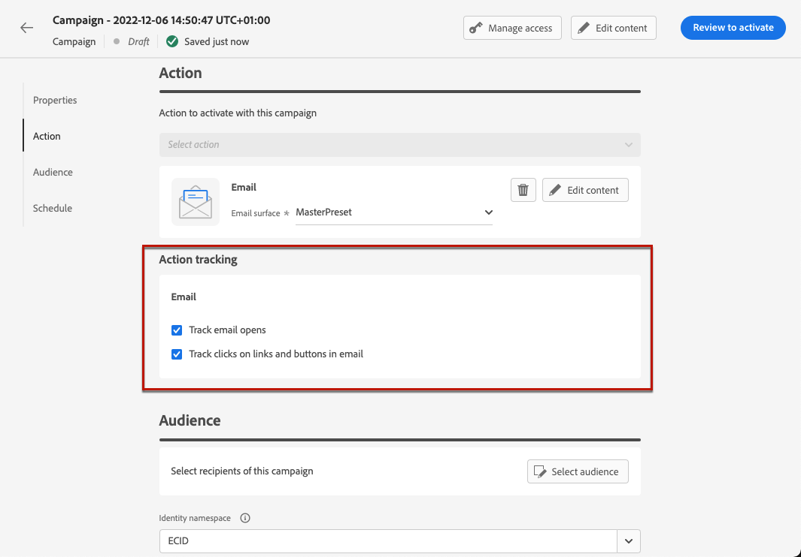

# Aggiungere collegamenti e tracciare i messaggi {#tracking}

Utilizza [!DNL Journey Optimizer] per aggiungere collegamenti al contenuto e tenere traccia dei messaggi inviati per monitorare il comportamento dei destinatari.

>[!NOTE]
>
>I collegamenti inclusi nel contenuto scadono **25 mesi** dopo l&#39;invio del messaggio, ad eccezione dei collegamenti a una pagina mirror che scadono dopo **90 giorni**. Trascorso tale ritardo, i collegamenti non saranno più disponibili.

## Abilita tracciamento {#enable-tracking}

Puoi abilitare il tracciamento a livello di messaggio e-mail controllando **[!UICONTROL Aperture e-mail]** e/o **[!UICONTROL Fai clic sulle opzioni e-mail]** durante la creazione del messaggio all&#39;interno di un percorso o di una campagna, come mostrato nelle schede seguenti:

>[!BEGINTABS]

>[!TAB Attiva il tracciamento in un percorso]

>[!TAB Abilitare il tracciamento in una campagna]

>[!ENDTABS]

>[!NOTE]
>
>Entrambe le opzioni sono abilitate per impostazione predefinita.

Quando sono abilitate, queste opzioni tengono traccia del comportamento dei destinatari dei messaggi:

* La metrica **[!UICONTROL Aperture e-mail]** controlla quanti messaggi sono stati aperti.
* La metrica **[!UICONTROL Clic su e-mail]** calcola il numero di clic sui collegamenti in un messaggio e-mail.

## Inserire i collegamenti {#insert-links}

Quando è abilitato il [tracciamento](#enable-tracking), vengono tracciati tutti i collegamenti inclusi nel contenuto del messaggio.

>[!NOTE]
>
>Vengono tracciati anche i collegamenti dai frammenti utilizzati in un messaggio e-mail. [Ulteriori informazioni sui frammenti](../content-management/fragments.md)

Per inserire collegamenti nel contenuto delle e-mail, segui la procedura seguente:

1. Selezionare un elemento (testo o immagine) e fare clic su **[!UICONTROL Inserisci collegamento]** nella barra degli strumenti contestuale.

   

1. Scegli il tipo di collegamento da creare:

   * Seleziona **[!UICONTROL Collegamento esterno]** per inserire un collegamento a un URL esterno.

   * Seleziona **[!UICONTROL Pagina di destinazione]** per inserire un collegamento a una pagina di destinazione. [Ulteriori informazioni](../landing-pages/get-started-lp.md)

   * Seleziona **[!UICONTROL Rinuncia con un clic]** per inserire un collegamento che consenta agli utenti di annullare rapidamente l&#39;iscrizione alle comunicazioni senza dover confermare la rinuncia. [Ulteriori informazioni](email-opt-out.md#one-click-opt-out).

   * Seleziona **[!UICONTROL Consenso/Iscrizione esterno]** per inserire un collegamento per accettare la ricezione di comunicazioni dal tuo marchio.

   * Seleziona **[!UICONTROL Rinuncia/Annullamento iscrizione esterno]** per inserire un collegamento che consenta di annullare l&#39;iscrizione alla ricezione di comunicazioni dal tuo marchio. Ulteriori informazioni sulla gestione delle rinunce in [questa sezione](email-opt-out.md#email-opt-out).

   * Seleziona **[!UICONTROL Pagina mirror]** per aggiungere un collegamento alla pagina mirror della posta elettronica. [Ulteriori informazioni](#mirror-page)

1. Inserisci l’URL desiderato nel campo corrispondente, oppure seleziona una pagina di destinazione e definisci le impostazioni e gli stili del collegamento. [Ulteriori informazioni](#adjust-links)

   >[!NOTE]
   >
   >Per l&#39;interpretazione degli URL, [!DNL Journey Optimizer] è conforme alla sintassi URI ([RFC 3986 standard](https://datatracker.ietf.org/doc/html/rfc3986){target="_blank"}), che disabilita alcuni caratteri internazionali speciali negli URL. Quando tenti di inviare la bozza o l’e-mail, se ti viene restituito un errore relativo a un URL aggiunto al contenuto, puoi codificare l’URL della stringa come soluzione alternativa.

1. Puoi personalizzare i tuoi collegamenti. [Ulteriori informazioni](../personalization/personalization-build-expressions.md)

1. Salva le modifiche.

1. Una volta creato il collegamento, puoi comunque modificarlo dai riquadri **[!UICONTROL Impostazioni]** e **[!UICONTROL Stili]** a destra.

   

>[!NOTE]
>
>I messaggi e-mail di tipo Marketing devono includere un [collegamento di rinuncia](../privacy/opt-out.md#opt-out-decision-management), che non è necessario per i messaggi transazionali. La categoria del messaggio (**[!UICONTROL Marketing]** o **[!UICONTROL Transazionale]**) è definita nella [configurazione canale](email-settings.md#email-type) durante la creazione del messaggio.

Una volta inviato il messaggio, il periodo di conservazione per un collegamento è di **25 mesi**. Dopo questo ritardo, il collegamento non è più disponibile.

>[!CAUTION]
>
>Quando sia l&#39;**etichetta** che l&#39;**URL** di un pulsante sono resi modificabili in un [frammento personalizzabile](../content-management/customizable-fragments.md), nei report di tracciamento viene visualizzato l&#39;URL anziché l&#39;etichetta del pulsante.

## Collegare a una pagina mirror {#mirror-page}

La pagina speculare è una versione online dell’e-mail. L’aggiunta di un collegamento alla pagina speculare rappresenta una buona pratica di e-mail marketing. Gli utenti possono passare alla pagina mirror di un’e-mail, ad esempio se riscontrano problemi di rendering o immagini interrotte quando tentano di visualizzarla nella casella in entrata. Si consiglia inoltre di fornire una versione online per motivi di accessibilità o di incoraggiare la condivisione social.

La pagina speculare generata da Adobe Journey Optimizer contiene tutti i dati di personalizzazione.

Per aggiungere un collegamento a una pagina mirror nell&#39;e-mail, [inserisci un collegamento](#insert-links) e seleziona **[!UICONTROL Pagina mirror]** come tipo di collegamento.

La pagina speculare viene creata automaticamente. Una volta inviata l’e-mail, quando i destinatari fanno clic sul collegamento della pagina mirror, il contenuto dell’e-mail viene visualizzato nel browser web predefinito.

Il periodo di conservazione per una pagina mirror è di **90 giorni**. Trascorso tale periodo, la pagina mirror non è più disponibile.

>[!CAUTION]
>
>* I collegamenti alle pagine mirror vengono generati automaticamente e non possono essere modificati. Contengono tutti i dati personalizzati crittografati necessari per eseguire il rendering dell’e-mail originale. Di conseguenza, l’utilizzo di attributi personalizzati con valori elevati può generare URL di pagine mirror lunghi, che possono impedire il funzionamento del collegamento in browser web che hanno una lunghezza massima per gli URL.
>
>* Durante la creazione di e-mail che si basano fortemente sulla personalizzazione in fase di esecuzione (ad esempio, `#each` loop, oggetti nidificati, dati di payload di grandi dimensioni), gli URL delle pagine mirror possono diventare eccessivamente grandi, in particolare nelle campagne attivate dall’API che utilizzano dati contestuali estesi provenienti da payload. Questo può causare errori HTTP (404, 422, 502) nei browser o nei client di posta. Adobe consiglia di limitare l’ampiezza e la profondità dei campi dinamici, riducendo l’affidamento su frammenti complessi e appiattendo le strutture di personalizzazione per evitare errori di collegamento.
>
>* Nella [bozza](../content-management/proofs.md) inviata ai profili di test, il collegamento alla pagina mirror non è attivo. È attivo solo nei messaggi finali.

## Personalizzare l’aspetto e la destinazione del collegamento {#adjust-links}

È possibile apportare modifiche ai collegamenti, ad esempio sottolinearli, modificarne il colore o selezionare la destinazione.  Queste modifiche sono impostate nei riquadri **[!UICONTROL Impostazioni]** e **[!UICONTROL Stili]** nella sezione destra dell&#39;editor di contenuti.

### Target {#link-target}

L&#39;attributo **target** viene utilizzato per controllare la posizione di apertura di una pagina collegata. L’aggiunta di un attributo target in un tag di ancoraggio può specificare se il collegamento deve essere aperto in una nuova scheda, nella stessa scheda o in una cornice diversa.

Per definire la destinazione di un collegamento, effettua le seguenti operazioni:

1. In un componente **[!UICONTROL Testo]** in cui è stato inserito un collegamento, seleziona il collegamento.

1. Dalla scheda **[!UICONTROL Impostazioni]**, seleziona la posizione in cui si apre il collegamento nel menu a discesa **[!UICONTROL Target]**. I valori possibili sono elencati di seguito:

   * **[!UICONTROL Nessuno]**: il collegamento viene aperto nello stesso frame in cui è stato fatto clic (impostazione predefinita).
   * **[!UICONTROL Vuoto]**: il collegamento viene aperto in una nuova finestra o scheda.
   * **[!UICONTROL Stesso]**: il collegamento viene aperto nello stesso frame in cui è stato fatto clic.
   * **[!UICONTROL Principale]**: il collegamento viene aperto nel frame principale.
   * **[!UICONTROL Superiore]**: il collegamento viene aperto nel corpo completo della finestra.

   

1. Salva le modifiche.

### Sottolinea collegamento {#link-underline}

Seleziona l&#39;opzione **[!UICONTROL Sottolinea collegamento]** per sottolineare l&#39;etichetta del collegamento.

### Colore collegamento {#link-color}

Per cambiare il colore del collegamento, fai clic su **[!UICONTROL Colore collegamento]** dalla scheda **[!UICONTROL Stili]**.

## Gestire il tracciamento {#manage-tracking}

[E-mail Designer](content-from-scratch.md) consente di gestire gli URL tracciati, ad esempio modificando il tipo di tracciamento per ogni collegamento.

1. Fai clic sull&#39;icona **[!UICONTROL Collegamenti]** nel riquadro a sinistra per visualizzare l&#39;elenco di tutti gli URL del contenuto che verranno tracciati.

   Questo elenco consente di avere una visualizzazione centralizzata e di individuare ogni URL nel contenuto dell’e-mail.

1. Per modificare un collegamento, fai clic sull’icona a forma di matita corrispondente.

1. Se necessario, puoi modificare il **[!UICONTROL Tipo di tracciamento]**:

   

   Per ogni URL tracciato, puoi impostare la modalità di tracciamento su uno dei seguenti valori:

   * **[!UICONTROL Tracciato]**: attiva il tracciamento su questo URL.
   * **[!UICONTROL Rinuncia]**: considera questo URL come un URL di rinuncia o di annullamento dell’iscrizione.
   * **[!UICONTROL Pagina mirror]**: considera questo URL come un URL della pagina mirror.
   * **[!UICONTROL Mai]**: non attiva mai il tracciamento di questo URL.

Il reporting sulle aperture e sui clic è disponibile nel [rapporto live](../reports/live-report.md) e nel [rapporto Customer Journey Analytics](../reports/report-gs-cja.md).

## Personalizzare il tracciamento URL {#url-tracking}

[Il tracciamento URL](email-settings.md#url-tracking) è gestito a livello di configurazione e si applica a tutti gli URL inclusi nel contenuto del messaggio.

Puoi anche personalizzare singoli URL in E-mail Designer. Per aggiungere parametri di tracciamento URL personalizzati a un singolo collegamento nel contenuto, segui i passaggi seguenti.

1. Selezionare un collegamento e fare clic su **[!UICONTROL Inserisci collegamento]** nella barra degli strumenti contestuale.

1. Seleziona l’icona di personalizzazione. È disponibile solo per i seguenti tipi di collegamenti: **Collegamento esterno**, **Collegamento di annullamento sottoscrizione** e **Rinuncia**.

   

1. Aggiungi il parametro di tracciamento URL e seleziona l&#39;attributo di profilo desiderato dall&#39;[editor di personalizzazione](../personalization/personalization-build-expressions.md).

   

1. Salva le modifiche.

1. Ripeti i passaggi precedenti per ogni collegamento a cui desideri aggiungere questo parametro di tracciamento.

Ora, quando l’e-mail viene inviata, questo parametro viene aggiunto automaticamente alla fine dell’URL. Puoi quindi acquisire questo parametro negli strumenti di analisi web o nei rapporti sulle prestazioni.

>[!NOTE]
>
>Per verificare l&#39;URL finale, puoi [inviare una bozza](../content-management/proofs.md) e fare clic sul collegamento nel contenuto dell&#39;e-mail una volta ricevuta la bozza. L’URL deve visualizzare il parametro di tracciamento. Nell&#39;esempio precedente, l&#39;URL finale sarà: <https://luma.enablementadobe.com/content/luma/us/en.html?utm_contact=profile.userAccount.contactDetails.homePhone.number>
