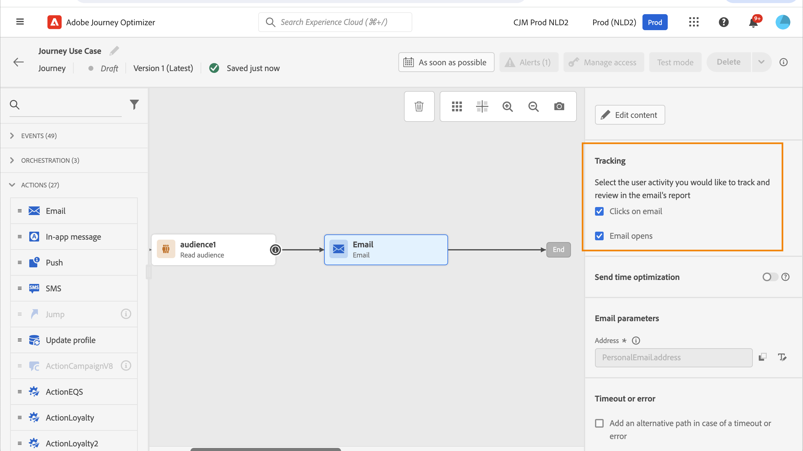
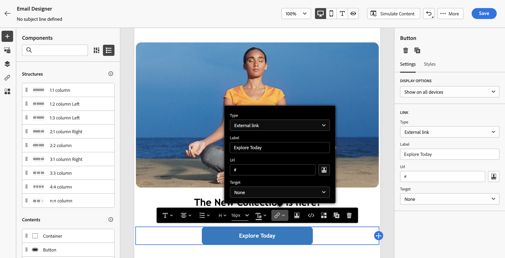

# Aggiungere collegamenti e tracciare i messaggi {#tracking}

Utilizza [!DNL Journey Optimizer] per aggiungere collegamenti al contenuto e tenere traccia dei messaggi inviati per monitorare il comportamento dei destinatari.

## Abilita tracciamento {#enable-tracking}

Puoi abilitare il tracciamento a livello di messaggio e-mail controllando **[!UICONTROL Aperture e-mail]** e/o **[!UICONTROL Fai clic sulle opzioni e-mail]** durante la creazione del messaggio all&#39;interno di un percorso o di una campagna.

>[!BEGINTABS]

>[!TAB Attiva il tracciamento in un percorso]

>[!TAB Abilitare il tracciamento in una campagna]

>[!ENDTABS]

>[!NOTE]
>
>Entrambe le opzioni sono abilitate per impostazione predefinita.

In questo modo potrai tenere traccia del comportamento dei destinatari attraverso:

* **[!UICONTROL Apertura e-mail]**: messaggi aperti.
* **[!UICONTROL Fai clic su e-mail]**: fa clic sui collegamenti in un messaggio e-mail.

## Inserire i collegamenti {#insert-links}

Durante la progettazione di un messaggio, puoi aggiungere collegamenti al contenuto.

>[!NOTE]
>
>Quando è abilitato il [tracciamento](#enable-tracking), vengono tracciati tutti i collegamenti inclusi nel contenuto del messaggio.

Per inserire collegamenti nel contenuto delle e-mail, segui la procedura seguente:

1. Seleziona un elemento e fai clic su **[!UICONTROL Inserisci collegamento]** nella barra degli strumenti contestuale.

   

1. Scegli il tipo di collegamento da creare:

   * **[!UICONTROL Collegamento esterno]**: inserire un collegamento a un URL esterno.

   * **[!UICONTROL Pagina di destinazione]**: inserisci un collegamento a una pagina di destinazione. [Ulteriori informazioni](../landing-pages/get-started-lp.md)

   * **[!UICONTROL Rinuncia con un clic]**: inserisci un collegamento per consentire agli utenti di annullare rapidamente l&#39;iscrizione alle comunicazioni senza dover confermare la rinuncia. [Ulteriori informazioni](email-opt-out.md#one-click-opt-out).

   * **[!UICONTROL Consenso/Iscrizione esterno]**: inserisci un collegamento per accettare la ricezione di comunicazioni dal tuo marchio.

   * **[!UICONTROL Rinuncia/Annullamento iscrizione esterno]**: inserisci un collegamento per annullare l&#39;iscrizione alla ricezione di comunicazioni dal tuo marchio. Ulteriori informazioni sulla gestione delle rinunce sono disponibili in [questa sezione](email-opt-out.md#opt-out-management).

   * **[!UICONTROL Pagina mirror]**: aggiungi un collegamento per visualizzare il contenuto dell&#39;e-mail in un browser Web. [Ulteriori informazioni](#mirror-page)

1. Inserisci l’URL desiderato nel campo corrispondente, oppure seleziona una pagina di destinazione e definisci le impostazioni e gli stili del collegamento. [Ulteriori informazioni](#adjust-links)

   >[!NOTE]
   >
   >Per l&#39;interpretazione degli URL, [!DNL Journey Optimizer] è conforme alla sintassi URI ([RFC 3986 standard](https://datatracker.ietf.org/doc/html/rfc3986){target="_blank"}), che disabilita alcuni caratteri internazionali speciali negli URL. Quando tenti di inviare la bozza o l’e-mail, se ti viene restituito un errore relativo a un URL aggiunto al contenuto, puoi codificare l’URL della stringa come soluzione alternativa.

1. Puoi personalizzare i tuoi collegamenti. [Ulteriori informazioni](../personalization/personalization-syntax.md#perso-urls)

1. Salva le modifiche.

1. Una volta creato il collegamento, puoi comunque modificarlo dai riquadri **[!UICONTROL Impostazioni]** e **[!UICONTROL Stili]** a destra.

   

>[!NOTE]
>
>I messaggi e-mail di tipo Marketing devono includere un [collegamento di rinuncia](../privacy/opt-out.md#opt-out-management), che non è necessario per i messaggi transazionali. La categoria del messaggio (**[!UICONTROL Marketing]** o **[!UICONTROL Transazionale]**) è definita nella [superficie di canale](../configuration/channel-surfaces.md#email-type) durante la creazione del messaggio.

## Regolare i collegamenti {#adjust-links}

Puoi apportare modifiche ai tuoi collegamenti utilizzando i riquadri **[!UICONTROL Impostazioni]** e **[!UICONTROL Stili]** a destra. Puoi sottolineare un collegamento, modificarne il colore e selezionarne la destinazione.

1. In un componente **[!UICONTROL Testo]** in cui è stato inserito un collegamento, seleziona il collegamento.

1. Dalla scheda **[!UICONTROL Impostazioni]**, scegli come verrà reindirizzato il pubblico con il menu a discesa **[!UICONTROL Target]**:

   * **[!UICONTROL Nessuno]**: il collegamento viene aperto nello stesso frame in cui è stato fatto clic (impostazione predefinita).
   * **[!UICONTROL Vuoto]**: il collegamento viene aperto in una nuova finestra o scheda.
   * **[!UICONTROL Stesso]**: il collegamento viene aperto nello stesso frame in cui è stato fatto clic.
   * **[!UICONTROL Principale]**: il collegamento viene aperto nel frame principale.
   * **[!UICONTROL Superiore]**: il collegamento viene aperto nel corpo completo della finestra.

   

1. Seleziona **[!UICONTROL Sottolinea collegamento]** per sottolineare il testo dell&#39;etichetta del collegamento.

   

1. Per cambiare il colore del collegamento, fai clic su **[!UICONTROL Colore collegamento]** dalla scheda **[!UICONTROL Stili]**.

   

1. Salva le modifiche.

## Collegare a una pagina mirror {#mirror-page}

La pagina mirror è una pagina HTML accessibile online tramite un browser web. Il contenuto è identico a quello dell’e-mail.

Per aggiungere un collegamento a una pagina mirror nell&#39;e-mail, [inserisci un collegamento](#insert-links) e seleziona **[!UICONTROL Pagina mirror]** come tipo di collegamento.

La pagina mirror viene creata automaticamente.

>[!IMPORTANT]
>
>I collegamenti alle pagine mirror vengono generati automaticamente e non possono essere modificati. Contengono tutti i dati personalizzati crittografati necessari per eseguire il rendering dell’e-mail originale. Di conseguenza, l’utilizzo di attributi personalizzati con valori di grandi dimensioni può generare URL molto lunghi per le pagine mirror, che potrebbero non funzionare nei browser web in cui la lunghezza dell’URL è soggetta a un limite massimo.

Una volta inviata l’e-mail, quando i destinatari fanno clic sul collegamento della pagina mirror, il contenuto dell’e-mail viene visualizzato nel browser web predefinito.

>[!NOTE]
>
>Nella [bozza](../content-management/proofs.md) inviata ai profili di test, il collegamento alla pagina mirror non è attivo. Viene attivato solo nei messaggi finali.

Il periodo di conservazione di una pagina mirror è di 60 giorni. Dopo questo ritardo, la pagina speculare non sarà più disponibile.

## Gestire il tracciamento {#manage-tracking}

[E-mail Designer](content-from-scratch.md) consente di gestire gli URL tracciati, ad esempio modificando il tipo di tracciamento per ogni collegamento.

1. Fai clic sull&#39;icona **[!UICONTROL Collegamenti]** nel riquadro a sinistra per visualizzare l&#39;elenco di tutti gli URL del contenuto che verranno tracciati.

   Questo elenco consente di avere una visualizzazione centralizzata e di individuare ogni URL nel contenuto dell’e-mail.

1. Per modificare un collegamento, fai clic sull’icona a forma di matita corrispondente.

1. Se necessario, puoi modificare il **[!UICONTROL Tipo di tracciamento]**:

   

   Per ogni URL tracciato, puoi impostare la modalità di tracciamento su uno dei seguenti valori:

   * **[!UICONTROL Tracciato]**: attiva il tracciamento su questo URL.
   * **[!UICONTROL Rinuncia]**: considera questo URL come un URL di rinuncia o di annullamento dell’iscrizione.
   * **[!UICONTROL Pagina mirror]**: considera questo URL come un URL della pagina mirror.
   * **[!UICONTROL Mai]**: non attiva mai il tracciamento di questo URL.

Il reporting sulle aperture e sui clic è disponibile nel [Live report](../reports/live-report.md) e nel [Global report](../reports/global-report.md).

## Personalizzare il tracciamento URL {#url-tracking}

In genere il [tracciamento URL](email-settings.md#url-tracking) viene gestito a livello di superficie, ma gli attributi di profilo non sono supportati. Attualmente l&#39;unico modo per eseguire questa operazione è [personalizzare gli URL](../personalization/personalization-syntax.md#perso-urls) nella finestra di progettazione e-mail.

Per aggiungere parametri di tracciamento URL personalizzati ai collegamenti, segui i passaggi indicati di seguito.

1. Selezionare un collegamento e fare clic su **[!UICONTROL Inserisci collegamento]** nella barra degli strumenti contestuale.

1. Seleziona l’icona di personalizzazione. È disponibile solo per i seguenti tipi di collegamenti: **Collegamento esterno**, **Collegamento di annullamento sottoscrizione** e **Rinuncia**.

   

1. Aggiungi il parametro di tracciamento URL e seleziona l’attributo di profilo desiderato dall’editor di personalizzazione.

   

1. Salva le modifiche.

1. Ripeti i passaggi precedenti per ogni collegamento a cui desideri aggiungere questo parametro di tracciamento.

Ora, quando l’e-mail viene inviata, questo parametro viene aggiunto automaticamente alla fine dell’URL. Puoi quindi acquisire questo parametro negli strumenti di analisi web o nei rapporti sulle prestazioni.

>[!NOTE]
>
>Per verificare l&#39;URL finale, puoi [inviare una bozza](../content-management/preview-test.md#send-proofs) e fare clic sul collegamento nel contenuto dell&#39;e-mail una volta ricevuta la bozza. L’URL deve visualizzare il parametro di tracciamento. Nell&#39;esempio precedente, l&#39;URL finale sarà: <https://luma.enablementadobe.com/content/luma/us/en.html?utm_contact=profile.userAccount.contactDetails.homePhone.number>
