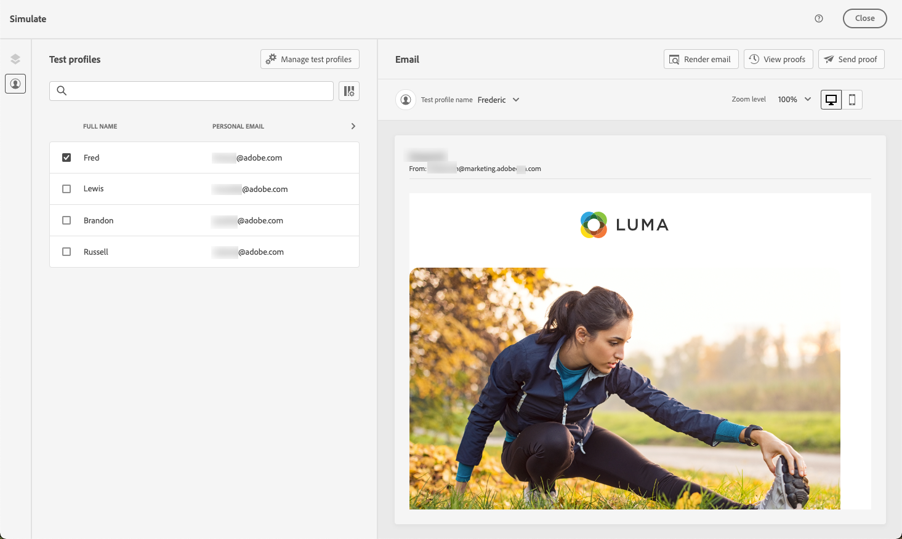

# Anteprima e verifica dell’e-mail {#preview-and-proof}

>[!CONTEXTUALHELP]
>id="ac_preview_testprofiles"
>title="Anteprima e test dei messaggi"
>abstract="Una volta definito il contenuto del messaggio, puoi utilizzare i profili di test per visualizzarlo in anteprima e testarlo."

Una volta definito il contenuto dell’e-mail, puoi utilizzare i profili di test per visualizzarlo in anteprima e testarlo. Se è stato inserito [contenuti personalizzati](../personalization/personalize.md), puoi verificare come viene visualizzato questo contenuto nel messaggio, utilizzando i dati del profilo di test.

Per rilevare eventuali errori nel contenuto delle e-mail o nelle impostazioni di personalizzazione, invia delle bozze ai profili di test. Per convalidare il contenuto più recente, è necessario inviare una bozza ogni volta che viene apportata una modifica.

>[!CAUTION]
>
>Per poter visualizzare in anteprima i messaggi e inviare le bozze, è necessario disporre di profili di test.
>
>Scopri come creare profili di test in [questa pagina](../audience/creating-test-profiles.md).

Per verificare il contenuto delle e-mail, è necessario:

* [Selezionare i profili di test](#select-test-profiles)
* [Controlla l’anteprima del messaggio](#preview-your-messages)

Potrai quindi [inviare bozze](#send-proofs) ai profili di test.

Inoltre, utilizza in [!DNL Journey Optimizer] le informazioni del tuo account **Litmus** per visualizzare all’istantante l’anteprima del **rendering di e-mail** nei client e-mail più diffusi. Puoi quindi verificare che il contenuto dell’e-mail si presenti e funzioni correttamente in ogni casella in entrata. Scopri come sbloccare le anteprime e-mail di Litmus in [questa sezione](#email-rendering).

>[!CAUTION]
>
>Quando visualizzi l’anteprima di un messaggio o invii delle bozze, vengono visualizzati solo i dati di personalizzazione del profilo. La personalizzazione basata su dati contestuali, come le informazioni sull’evento, può essere testata solo nel contesto di un percorso. Scopri come testare la personalizzazione in [questo caso d’uso](../personalization/personalization-use-case.md).

➡️ [Scopri come visualizzare in anteprima e verificare le e-mail in questo video](#video-preview)

## Selezionare i profili di test {#select-test-profiles}

Utilizzare [Profili di test](../audience/creating-test-profiles.md) per eseguire il targeting di destinatari aggiuntivi che non corrispondono ai criteri di targeting definiti.

Per selezionare i profili di test, effettua le seguenti operazioni:

1. In [Modifica contenuto](create-email.md#define-email-content) o in E-mail Designer, fai clic sul pulsante **[!UICONTROL Simula contenuto]** per accedere alla selezione del profilo di test.

   

1. Seleziona **[!UICONTROL Gestire i profili di test]**.

   

1. Seleziona lo spazio dei nomi da utilizzare per identificare i profili di test facendo clic sul pulsante **[!UICONTROL Spazio dei nomi dell’identità]** icona di selezione.

   

   Ulteriori informazioni sugli spazi dei nomi delle identità di Adobe Experience Platform [in questa sezione](../audience/get-started-identity.md).

   Nell’esempio seguente utilizzeremo **E-mail** spazio dei nomi.

1. Utilizza il campo di ricerca per trovare lo spazio dei nomi, selezionalo e fai clic su **[!UICONTROL Seleziona]**

   

1. In **[!UICONTROL Valore identità]** , immetti il valore (qui l’indirizzo e-mail) per identificare il profilo di test e fai clic su **[!UICONTROL Aggiungi profilo]**.

   <!---->

1. Se hai aggiunto la personalizzazione al messaggio, aggiungi altri profili in modo da poter testare diverse varianti del messaggio a seconda dei dati del profilo. Una volta aggiunti, i profili vengono elencati nei campi selezionati.

   

   In base agli elementi di personalizzazione del messaggio, questo elenco visualizza i dati per ciascun profilo di test nelle colonne correlate.

### Anteprima e-mail {#preview-email}

Una volta [profili di test](#select-test-profiles) , puoi visualizzare in anteprima il contenuto dell’e-mail. Effettua le seguenti operazioni:

1. Nella schermata [Modifica contenuto](create-email.md#define-email-content) o in E-mail Designer, fai clic sul pulsante **[!UICONTROL Simula contenuto]**.

1. Seleziona un profilo di test. Puoi controllare i valori disponibili nelle colonne. Utilizza le frecce destra/sinistra per sfogliare i dati.

   

   >[!NOTE]
   >
   >Per aggiungere altri profili di test, seleziona **[!UICONTROL Gestire i profili di test]**. [Ulteriori informazioni](#select-test-profiles)

1. Fai clic su **[!UICONTROL Seleziona dati]** sopra l&#39;elenco per aggiungere o rimuovere colonne.

   

   Puoi visualizzare i campi di personalizzazione specifici del messaggio corrente alla fine dell’elenco. In questo esempio, la città del profilo, il nome e il cognome. Seleziona questi campi e assicurati che questi valori siano popolati nei profili di test.

1. Nell’anteprima del messaggio, gli elementi personalizzati vengono sostituiti dai dati del profilo di test selezionati.

   Ad esempio, per questo messaggio, sia il contenuto che l’oggetto dell’e-mail sono personalizzati:

   

1. Seleziona altri profili di test per visualizzare in anteprima il rendering delle e-mail per ogni variante del messaggio.

## Invia bozze {#send-proofs}

Una bozza è un messaggio specifico che ti consente di testare un messaggio prima di inviarlo al pubblico principale. I destinatari della bozza hanno il compito di approvare il messaggio: rendering, contenuto, impostazioni di personalizzazione, configurazione.

Una volta [profili di test](#select-test-profiles) , è possibile inviare bozze.

1. In **[!UICONTROL Simula]** , fare clic su **[!UICONTROL Invia bozza]** pulsante.

   

1. Dalla sezione **[!UICONTROL Invia bozza]** , digita l’e-mail del destinatario e fai clic su **[!UICONTROL Aggiungi]** per inviare la bozza a te stesso o a membri delle tue organizzazioni.

   Puoi aggiungere fino a dieci destinatari per la consegna della bozza.

   

1. Quindi, seleziona la **Profili di test** che verrà utilizzato per personalizzare il contenuto del messaggio.

   Ogni destinatario della bozza riceverà un numero di messaggi pari al numero di profili di test selezionati. Ad esempio, se hai aggiunto cinque e-mail dei destinatari e hai selezionato dieci profili di test, invierai cinquanta messaggi di bozza e ogni destinatario ne riceverà dieci.

1. Se necessario, puoi aggiungere un prefisso alla riga dell’oggetto della bozza. Solo caratteri alfanumerici e caratteri speciali come . - _ ( ) [ ] sono consentiti come prefisso della riga dell’oggetto.

1. Clic **[!UICONTROL Invia bozza]**.

   

1. Torna in  **[!UICONTROL Simula]** , fare clic su  **[!UICONTROL Visualizza bozze]** per controllare lo stato.

   

Si consiglia di inviare le bozze dopo ogni modifica al contenuto del messaggio.

>[!NOTE]
>
>Nella bozza inviata, il collegamento alla pagina speculare non è attivo. Viene attivato solo nei messaggi finali.

## Utilizzare il rendering di e-mail {#email-rendering}

Puoi sfruttare **Litmus** account in [!DNL Journey Optimizer] per visualizzare immediatamente l&#39;anteprima **rendering di e-mail** nei client e-mail più diffusi.

Per accedere alle funzionalità di rendering di e-mail, devi:

* Avere un account Litmus
* [Selezionare i profili di test](#select-test-profiles)

Quindi, segui i passaggi indicati di seguito:

1. Nella schermata [Modifica contenuto](create-email.md#define-email-content) o in E-mail Designer, fai clic sul pulsante **[!UICONTROL Simula contenuto]**.

1. Seleziona il pulsante **[!UICONTROL Rendering dell’e-mail]**.

   

1. Clic **Connetti il tuo account Litmus** nella sezione superiore destra.

   

1. Immetti le credenziali e accedi.

   

1. Fai clic su **Esegui test** per generare anteprime e-mail.

1. Verifica il contenuto delle e-mail nei client desktop, mobili e basati su web più diffusi.

   

>[!CAUTION]
>
>Quando si collega **Litmus** account con [!DNL Journey Optimizer], accetti che i messaggi di prova vengano inviati a Litmus: una volta inviati, questi messaggi non vengono più gestiti da Adobe. Di conseguenza, i criteri di conservazione dei dati Litmus si applicano a queste e-mail, inclusi i dati di personalizzazione che possono essere inclusi in questi messaggi di test.

## Video introduttivo {#video-preview}

Scopri come verificare il rendering delle e-mail nelle caselle in entrata, visualizzare in anteprima le e-mail personalizzate rispetto ai profili di test e inviare bozze.

>[!VIDEO](https://video.tv.adobe.com/v/334239?quality=12)
