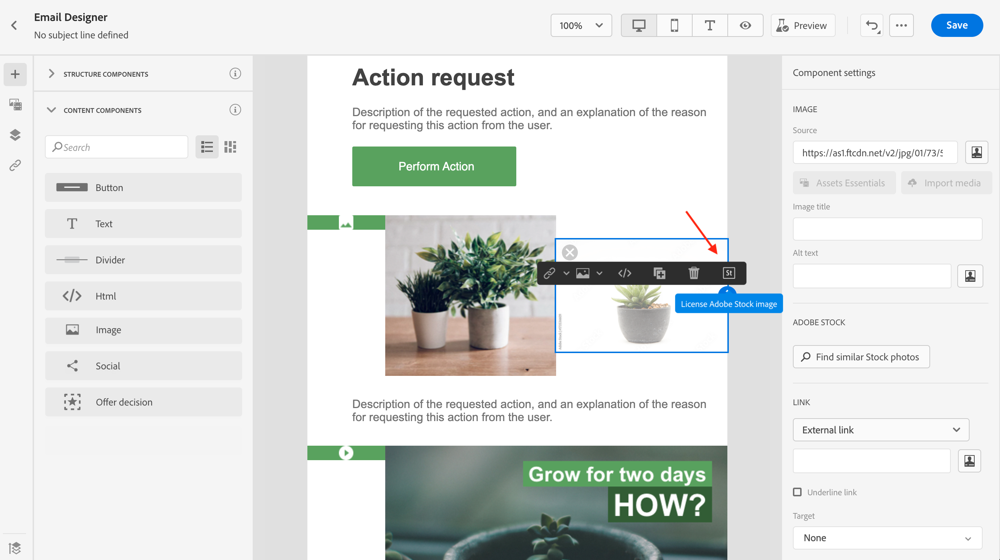
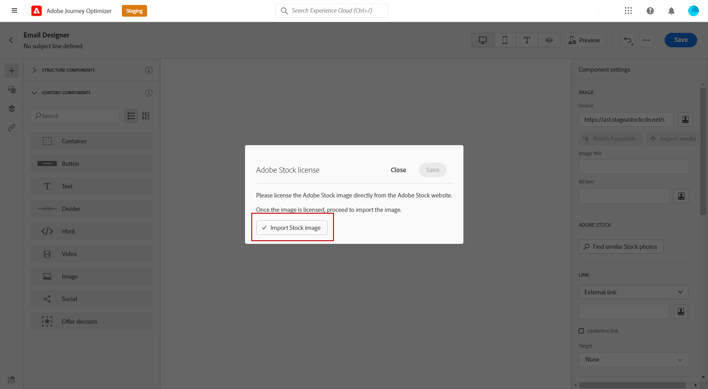

# Utilizzare [!DNL Adobe Stock] immagini {#stock}

## Introduzione a [!DNL Adobe Stock] {#get-started-stock}

Il plug-in per l’integrazione di E-mail designer di [!DNL Adobe Stock] e [!DNL Adobe Journey Optimizer] offre ai clienti un modo semplice per cercare le immagini da utilizzare nella creazione dei messaggi, acquistarne la licenza e salvarle.

[Adobe Stock](https://helpx.adobe.com/stock/get-started.html){target="_blank"} consente di accedere a milioni di foto, video, illustrazioni e immagini vettoriali di alta qualità, curate e prive di royalty. È possibile scegliere di acquistare un pacchetto di crediti per la licenza delle risorse o acquistare solo una licenza Standard o Extended per la risorsa necessaria. Adobe Stock fornisce anche una raccolta gratuita di risorse.

Con [!DNL Adobe Journey Optimizer], puoi caricare le immagini nelle e-mail direttamente da [!DNL Adobe Stock] e aggiungerle alla cartella **[!UICONTROL Risorse]** utilizzando l’opzione **[!UICONTROL Trova le foto di Adobe Stock]**. Inoltre, l’opzione **[!UICONTROL Trova foto Stock simili]** consente di trovare immagini che corrispondono al contenuto, al colore e alla composizione della risorsa utilizzata nella consegna.

## Autorizzazioni{#stock-permissions}

La **[!UICONTROL Trova foto Adobe Stock]** e **[!UICONTROL Trova immagine simile]** sono disponibili per gli utenti con accesso a un profilo di prodotto AEM Assets Essentials.

Per ulteriori informazioni, consulta [Documentazione essenziale delle risorse](https://experienceleague.adobe.com/docs/experience-manager-assets-essentials/help/get-started-admins/deploy-administer.html#add-users-to-essentials){target="_blank"}.

## Inserire un&#39;immagine da [!DNL Adobe Stock] {#add-stock-image}

Per aggiungere immagini da [!DNL Adobe Stock] per i contenuti, segui i passaggi seguenti:

1. Da **[!UICONTROL Componenti contenuto]** e-mail Designer, trascina e rilascia una **Immagine**.

1. Fai clic sul pulsante **[!UICONTROL Trova foto Adobe Stock]** sul lato sinistro di E-mail Designer.

   

1. Sfoglia la libreria o immetti un termine nel campo di ricerca.

   

1. Seleziona l’immagine selezionata e fai clic su **[!UICONTROL Salva]**.

   Se l&#39;immagine selezionata non è dotata di licenza, è necessario [ottenere la licenza](#license-stock-image).

## Trova foto simili {#similar-stock-image}

Puoi sostituire qualsiasi immagine esistente nel contenuto dell’e-mail con una foto da [!DNL Adobe Stock]. Questa opzione è disponibile per tutte le immagini: immagini e immagini Stock con licenza/senza licenza dalla cartella Assets.

Per sfogliare foto simili, segui la procedura seguente:

1. Selezionare l&#39;immagine da sostituire.
1. Fai clic sul pulsante **[!UICONTROL Trova foto simili]** pulsante per visualizzare le risorse in [!DNL Adobe Stock] che corrispondono al contenuto, al colore e alla composizione dell’immagine.

   

1. Seleziona l’immagine selezionata e fai clic su **[!UICONTROL Salva]**.

   

   Se l&#39;immagine selezionata non è dotata di licenza, è necessario [ottenere la licenza](#license-stock-image).

1. Se necessario, personalizza l’immagine con **[!UICONTROL Impostazioni]** e **[!UICONTROL Stili]** schede. [Ulteriori informazioni sulle impostazioni dei componenti](content-components.md).

## Ottieni la licenza da [!DNL Adobe Stock] {#license-stock-image}

Se l&#39;immagine è già in possesso di una licenza, viene rappresentata dal  icona. In caso contrario, è necessario ottenerne la licenza.

Per concedere la licenza e scaricare l&#39;immagine, segui i passaggi seguenti:

1. Selezionalo e fai clic sul pulsante **[!UICONTROL Licenza immagine Adobe Stock]** icona.

   

   Viene quindi reindirizzato al [!DNL Adobe Stock] sito web per acquistare la licenza.

   

1. Da [!DNL Adobe Stock] sito web, devi acquistare la risorsa per poter scaricare l’immagine e rimuovere la filigrana.

   Questo acquisto dipende dal tuo piano o abbonamento Adobe Stock. Se disponi di più account Adobe Stock, verrai reindirizzato all’ultimo ID Stock utilizzato. In questo caso, accertati di aver effettuato l’accesso all’account corretto prima di concedere in licenza la risorsa.

   Per ulteriori informazioni sui piani e i prezzi di Adobe Stock in [Documentazione di Adobe Stock](https://stock.adobe.com/plans){target="_blank"}.

   >[!WARNING]
   > Se viene inviata un&#39;e-mail con un&#39;immagine senza licenza, l&#39;immagine mantiene il proprio modulo senza licenza con la filigrana.

1. Una volta completato l&#39;acquisto, puoi tornare all&#39;e-mail in [!DNL Adobe Journey Optimizer] e seleziona **[!UICONTROL Importa immagine stock]** per importare l’immagine con licenza nelle risorse.

   

1. Seleziona la cartella in cui memorizzare la risorsa. Per ulteriori informazioni su [!DNL Assets Essentials], fai riferimento a [page](assets-essentials.md#get-started-assets-essentials).

## Argomenti correlati{#stock-related-topics}

* [Progettazione di e-mail in Journey Optimizer](get-started-email-design.md)
* [Impostazioni dei componenti per la progettazione delle e-mail](content-components.md)
* [Guida introduttiva di Adobe Stock](https://helpx.adobe.com/stock/get-started.html){target="_blank"}.

