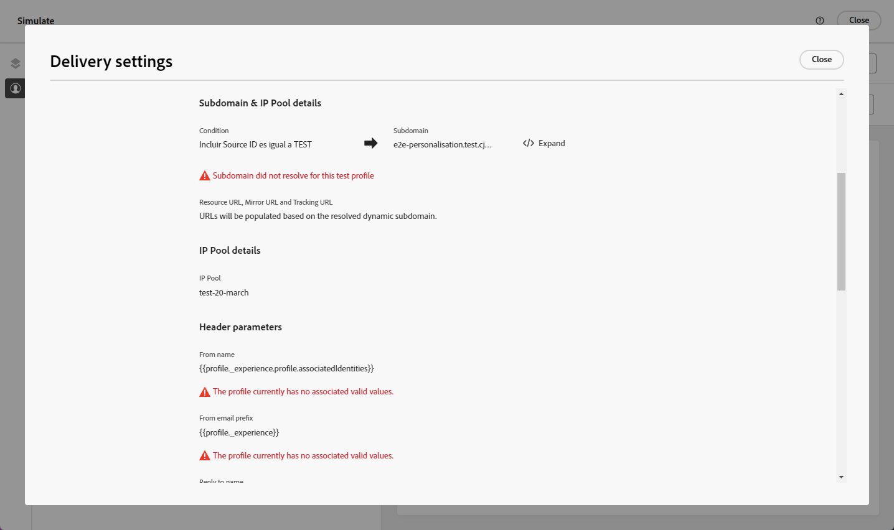

# Personalizzare le impostazioni di configurazione e-mail {#surface-personalization}

Per una maggiore flessibilità e un maggiore controllo sulle impostazioni e-mail, [!DNL Journey Optimizer] ti consente di definire valori personalizzati per sottodomini, intestazioni e parametri di tracciamento URL durante la creazione di configurazioni e-mail.

## Aggiungere sottodomini dinamici {#dynamic-subdomains}

>[!CONTEXTUALHELP]
>id="ajo_surface_perso_not_available"
>title="Personalizzazione non disponibile"
>abstract="Questa configurazione è stata creata senza alcun attributo di personalizzazione. Fai riferimento alla documentazione per i passaggi da risolvere se è necessaria la personalizzazione."

>[!CONTEXTUALHELP]
>id="ajo_surface_dynamic_subdomain"
>title="Abilita i sottodomini dinamici"
>abstract="Quando crei una configurazione e-mail, puoi impostare sottodomini dinamici in base alle condizioni da te definite utilizzando l’editor di personalizzazione. Puoi aggiungere fino a 50 sottodomini dinamici."

Durante la creazione di una configurazione e-mail, puoi impostare sottodomini dinamici in base a condizioni specifiche.

Ad esempio, se disponi di vincoli legali per l’invio di messaggi da un indirizzo e-mail dedicato per paese, puoi utilizzare i sottodomini dinamici. Questo consente di creare una singola configurazione con più sottodomini di invio corrispondenti a paesi diversi, anziché creare più configurazioni per ciascun paese. Puoi quindi eseguire il targeting dei clienti in vari paesi consolidati in una sola campagna.

Per definire i sottodomini dinamici in una configurazione del canale e-mail, segui i passaggi indicati di seguito.

1. Prima di creare una configurazione, imposta i sottodomini da utilizzare per l’invio delle e-mail in base al caso d’uso. [Scopri come](../configuration/about-subdomain-delegation.md)

   Ad esempio, supponiamo che tu voglia utilizzare sottodomini diversi per paesi diversi: imposta un sottodominio specifico per gli Stati Uniti, uno specifico per il Regno Unito, ecc.

1. Crea una configurazione di canale. [Scopri come](../configuration/channel-surfaces.md)

1. Seleziona il canale **[!UICONTROL E-mail]**.

1. Nella sezione **Sottodominio**, abilita l&#39;opzione **[!UICONTROL Sottodominio dinamico]**.

   

1. Selezionare l&#39;icona Modifica accanto al primo campo **[!UICONTROL Condizione]**.

1. Verrà aperto l&#39;[editor di personalizzazione](../personalization/personalization-build-expressions.md). In questo esempio, impostare una condizione come `Country` è uguale a `US`.

   

1. Seleziona il sottodominio da associare a questa condizione. [Ulteriori informazioni sui sottodomini](../configuration/about-subdomain-delegation.md)

   >[!NOTE]
   >
   >Alcuni sottodomini non sono attualmente disponibili per la selezione a causa della registrazione del [ciclo di feedback](../reports/deliverability.md#feedback-loops) in sospeso. Questo processo può richiedere fino a 10 giorni lavorativi. Una volta completati, puoi scegliere tra tutti i sottodomini disponibili. <!--where FL registration happens? is it when delegating a subdomain and you are awaiting from subdomain validation? or is it on ISP side only?-->

   

   Tutti i destinatari con sede negli Stati Uniti riceveranno messaggi utilizzando il sottodominio selezionato per quel paese, il che significa che tutti gli URL coinvolti (ad esempio pagina mirror, URL di tracciamento o collegamento per annullare l’abbonamento) saranno compilati in base a quel sottodominio.

1. Imposta altri sottodomini dinamici come desiderato. Puoi aggiungere fino a 50 elementi.

   

   <!--Select the [IP pool](../configuration/ip-pools.md) to associate with the configuration. [Learn more](email-settings.md#ip-pools)-->

1. Definisci tutte le altre [impostazioni e-mail](email-settings.md) e [invia](../configuration/channel-surfaces.md#create-channel-surface) la tua configurazione.

Dopo aver aggiunto uno o più sottodomini dinamici a una configurazione, gli elementi seguenti verranno compilati in base al sottodominio dinamico risolto per questa configurazione:

* Tutti gli URL (URL della risorsa, URL della pagina mirror e URL di tracciamento)

* L&#39;[URL per annullare l&#39;abbonamento](email-settings.md#list-unsubscribe)

* I suffissi **Da e-mail** e **E-mail di errore**

>[!NOTE]
>
>Se imposti sottodomini dinamici e poi disabiliti l&#39;opzione **[!UICONTROL Sottodominio dinamico]**, tutti i valori dinamici vengono rimossi. Seleziona un sottodominio e invia la configurazione per rendere effettive le modifiche.

## Personalizzare l’intestazione {#personalize-header}

Puoi anche utilizzare la personalizzazione per tutti i parametri di intestazione definiti in una configurazione.

Ad esempio, se disponi di più marchi, puoi creare una singola configurazione e utilizzare valori personalizzati per le intestazioni e-mail. Questo ti consente di verificare che tutte le e-mail inviate dai tuoi marchi diversi siano indirizzate a ciascuno dei tuoi clienti con i nomi e le e-mail **From** corretti. Allo stesso modo, quando i destinatari hanno premuto il pulsante **Rispondi** nel software client di posta elettronica, si desidera che i nomi e le e-mail di **Rispondi a** corrispondano al marchio corretto per l&#39;utente corretto.

Per utilizzare variabili personalizzate per i parametri di intestazione della configurazione, segui i passaggi seguenti.

>[!NOTE]
>
>Puoi personalizzare tutti i campi **[!UICONTROL Parametri intestazione]**, ad eccezione del campo **[!UICONTROL Prefisso e-mail errore]**.

1. Definisci i parametri di intestazione come faresti normalmente. [Scopri come](email-settings.md#email-header)

1. Per ogni campo, seleziona l’icona Modifica.

   

1. Verrà aperto l&#39;[editor di personalizzazione](../personalization/personalization-build-expressions.md). Definisci la condizione come desiderato e salva le modifiche.

   <!--For example, set a condition such as each recipient receives an email from their own brand representative.-->

   >[!NOTE]
   >
   >È possibile selezionare solo **[!UICONTROL Attributi profilo]** e **[!UICONTROL Funzioni helper]**.

   Ad esempio, desideri gestire dinamicamente le e-mail inviate per conto di un relationship manager, i cui dettagli vengono memorizzati nel profilo del cliente, in modo che ogni cliente sia collegato a un relationship manager. In un [percorso](../building-journeys/journey-gs.md), l&#39;intestazione dell&#39;e-mail (nome del mittente, e-mail del mittente, indirizzo di risposta) può essere personalizzata con i parametri di Relationship Manager, ricavati dagli attributi del profilo.

   <!--The examples below use event parameters, which are currently not available.
    
    Let's say you want to handle dynamically emails sent on behalf of a sales assistant, where the sales assistant is retrieved from an event or campaign contextual parameters. For example: In a [journey](../building-journeys/journey-gs.md), when a purchase event is linked to the sales assistant of a specific shop, the email header (sender name, sender email, reply to address) can be personalized with the sales assistant parameters, taken from the event attributes. In an [API-triggered campaign](../campaigns/api-triggered-campaigns.md), initiated externally by a sales assistant, the triggered email can be sent on behalf of the sales assistant and the header personalization values taken from campaign contextual parameters.-->

1. Ripeti i passaggi precedenti per ogni parametro a cui desideri aggiungere la personalizzazione.

>[!NOTE]
>
>Se hai aggiunto uno o più sottodomini dinamici alla configurazione, i suffissi **Da e-mail** e **E-mail di errore** verranno compilati in base al [sottodominio dinamico](#dynamic-subdomains) risolto.

## Utilizzare il tracciamento URL personalizzato {#personalize-url-tracking}

Per utilizzare parametri di tracciamento URL personalizzati, segui i passaggi indicati di seguito.

1. Vai alla sezione **[!UICONTROL URL tracking parameters]** della configurazione del canale e-mail. [Ulteriori informazioni](url-tracking.md)

1. Fai clic sull’icona Modifica accanto a ciascun campo. Oltre agli attributi contestuali, puoi selezionare gli attributi del profilo.

1. Seleziona l&#39;attributo di profilo desiderato dall&#39;[editor di personalizzazione](../personalization/personalization-build-expressions.md).

1. Ripeti i passaggi precedenti per ogni parametro di tracciamento che desideri personalizzare.

Ora, quando l’e-mail viene inviata, il parametro personalizzato viene aggiunto automaticamente alla fine dell’URL. Puoi quindi acquisire questo parametro negli strumenti di analisi web o nei rapporti sulle prestazioni.

## Visualizza dettagli configurazione {#view-surface-details}

Quando utilizzi una configurazione con impostazioni personalizzate in una campagna o in un percorso, puoi visualizzare i dettagli della configurazione direttamente all’interno della campagna o del percorso. Segui i passaggi seguenti.

1. Crea una [campagna](../campaigns/create-campaign.md) o [percorso](../building-journeys/journey-gs.md) per e-mail.

1. Selezionare il pulsante **[!UICONTROL Modifica contenuto]**.

1. Fare clic sul pulsante **[!UICONTROL Visualizza dettagli configurazione]**.

   

1. Viene visualizzata la finestra **[!UICONTROL Impostazioni consegna]**. Puoi visualizzare tutte le impostazioni di configurazione, inclusi i sottodomini dinamici e i parametri di intestazione personalizzati.

   >[!NOTE]
   >
   >Tutte le informazioni visualizzate in questa schermata sono di sola lettura.

1. Seleziona **[!UICONTROL Espandi]** per visualizzare i dettagli dei sottodomini dinamici.

   

## Verifica la configurazione {#check-configuration}

Quando utilizzi una configurazione personalizzata in una campagna o in un percorso, puoi visualizzare in anteprima il contenuto delle e-mail utilizzando i profili di test per verificare la presenza di potenziali errori con le impostazioni dinamiche definite. Segui i passaggi seguenti.

>[!NOTE]
>
>Oltre ai profili di test, [!DNL Journey optimizer] consente anche di testare diverse varianti del contenuto visualizzandolo in anteprima e inviando bozze utilizzando dati di input di esempio caricati da un file CSV / JSON o aggiunti manualmente. [Scopri come simulare varianti di contenuto](../test-approve/simulate-sample-input.md)

Per visualizzare in anteprima i contenuti utilizzando i profili di test, effettua le seguenti operazioni:

1. Dalla schermata Modifica contenuto del messaggio o nel Designer e-mail, fai clic sul pulsante **[!UICONTROL Simula contenuto]**. [Ulteriori informazioni](../content-management/preview.md)

1. Seleziona un [profilo di test](../content-management/test-profiles.md).

1. Se viene visualizzato un errore, fare clic sul pulsante **[!UICONTROL Visualizza dettagli configurazione]**.

   

1. Controllare la schermata **[!UICONTROL Impostazioni consegna]** per i dettagli dell&#39;errore.

   

I possibili errori sono i seguenti:

* Il **sottodominio** non è stato risolto per il profilo di test selezionato. Ad esempio, la configurazione utilizza diversi sottodomini di invio corrispondenti a paesi diversi, ma per il profilo selezionato non è definito alcun valore per l&#39;attributo `Country` oppure l&#39;attributo è impostato su `France` ma questo valore non è associato ad alcun sottodominio in quella configurazione.

* Al profilo selezionato non sono associati valori per uno o più **parametri di intestazione**.

Se si verifica uno di questi errori, l’e-mail non viene inviata al profilo di test selezionato.

Per evitare questo tipo di errore, assicurati che i parametri di intestazione definiti utilizzino attributi personalizzati con valori per la maggior parte dei profili. I valori mancanti possono influire sul recapito messaggi e-mail.

>[!NOTE]
>
>Ulteriori informazioni sul recapito messaggi in [questa sezione](../reports/deliverability.md)
