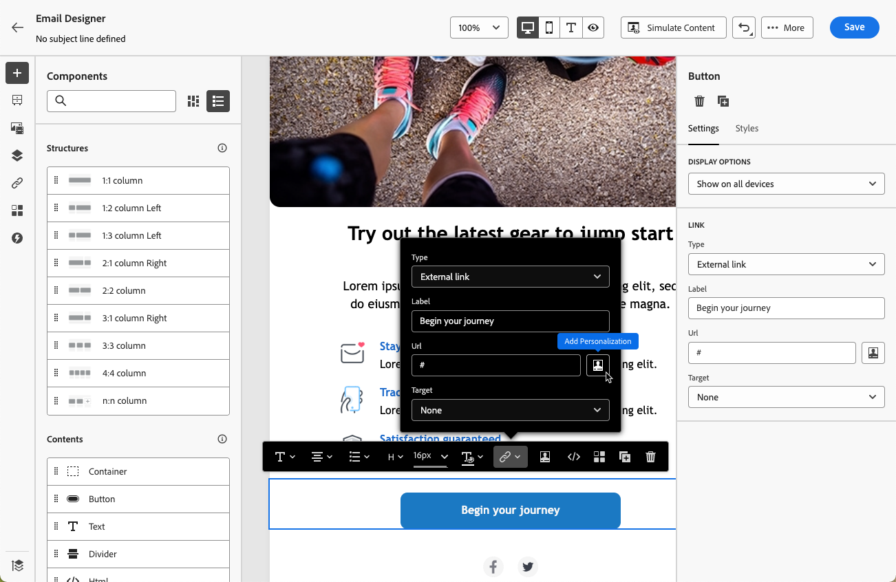

# Personalizzazione degli URL nelle e-mail {#url-personalization}

>[!BEGINSHADEBOX]

**In questa pagina:** scopri come personalizzare gli URL delle e-mail con attributi di profilo, inclusi URL completi o di base e parametri di tracciamento per collegamento, mantenendo al contempo i collegamenti validi e tracciabili.

>[!ENDSHADEBOX]

Gli URL personalizzati consentono di fornire esperienze contestuali attraverso i messaggi e-mail di [!DNL Journey Optimizer], ad esempio la generazione di collegamenti specifici per i destinatari o l&#39;aggiunta di parametri dinamici.

Portano i destinatari su pagine specifiche di un sito web o su un microsito personalizzato, a seconda degli attributi del profilo.

## Personalizzare un URL {#personalize-url}

Per personalizzare un URL, segui i passaggi indicati di seguito.

1. In E-mail Designer, seleziona un elemento nel contenuto e [inserisci un collegamento](message-tracking.md#insert-links) utilizzando la barra degli strumenti contestuale.

   >[!IMPORTANT]
   >
   >Personalization è disponibile solo per **[!UICONTROL Collegamento esterno]**, **[!UICONTROL Collegamento di annullamento sottoscrizione]** e **[!DNL Opt-Out]**. Assicurati di selezionare un tipo di collegamento appropriato.

1. Seleziona l’icona di personalizzazione.

   

1. Utilizza l’editor di personalizzazione per aggiungere gli attributi di profilo con cui desideri personalizzare l’URL.

1. Salva le modifiche.

Di seguito sono riportati alcuni esempi di URL personalizzati:

* `https://www.adobe.com/users/{{profile.person.name.lastName}}`
* `https://www.adobe.com/users?uid={{profile.person.name.firstName}}`
* `https://www.adobe.com/usera?uid={{context.journey.technicalProperties.journeyUID}}`
* `https://www.adobe.com/users?uid={{profile.person.crmid}}&token={{context.token}}`

>[!NOTE]
>
>Quando modifichi un URL personalizzato nell’editor di personalizzazione, le funzioni di assistenza e l’iscrizione a un pubblico vengono disabilitate per motivi di sicurezza.
>
>Gli spazi non sono supportati nei token di personalizzazione utilizzati negli URL.

Per un rendering e un tracciamento affidabili, segui le [best practice e guardrail](#best-practices) di seguito.

## Personalizzare un URL completo/di base {#personalize-complete-base-url}

Journey Optimizer supporta anche la personalizzazione dell&#39;**intero** URL o del **dominio base** di un URL, ad esempio:

```html
<a href="{{profile.social.link}}" />
<a href="{{profile.social.baseUrl}}/profile" />
<a href="https://{{profile.social.baseUrl}}/profile" />
```

>[!CAUTION]
>
>* Per abilitare la personalizzazione URL completa o di base, contatta Adobe e fornisci l’elenco dei domini accettati. Questo è necessario per evitare reindirizzamenti non sicuri.
>
>* Gli URL generati dinamicamente, in cui l&#39;intero URL o dominio di base viene risolto da un attributo di profilo al momento dell&#39;invio, presentano una limitazione di tracciamento nota: Journey Optimizer non è in grado di tenere traccia in modo affidabile dei clic per questi collegamenti e i dati dei clic **potrebbero non essere visualizzati nei report di percorso o campagna**. Ciò si verifica perché il reindirizzamento di tracciamento viene applicato in fase di progettazione, prima che sia noto l’URL finale. Quando il valore risolto differisce per destinatario, la catena di reindirizzamento si interrompe e i clic non vengono registrati. Inoltre, l&#39;URL risolto deve iniziare con `http` o `https` per ogni destinatario; in caso contrario, il tracciamento viene automaticamente ignorato per quel collegamento. Per mantenere un tracciamento dei clic affidabile, utilizza uno dei seguenti approcci:
>
>   * Utilizzare un URL di base fisso e aggiungere solo parametri personalizzati (ad esempio, `https://www.example.com/page?uid={{profile.person.crmid}}`).
>   
>   * Pregenera un URL personalizzato per destinatario, memorizzalo come attributo di profilo e fai riferimento a esso nel contenuto dell’e-mail.

## Personalizzare i parametri di tracciamento URL {#personalize-url-tracking-parameters}

[Il tracciamento URL](url-tracking.md) è gestito a livello di configurazione del canale e si applica a tutti gli URL inclusi nel contenuto del messaggio. Puoi anche personalizzare i parametri di tracciamento URL per un singolo collegamento nel Designer e-mail. Questo ti consente di aggiungere un parametro specifico per il destinatario a un singolo collegamento (ad esempio, per passare un identificatore agli strumenti di analisi web).

A tale scopo, [inserisci un collegamento](message-tracking.md#insert-links), seleziona l&#39;icona di personalizzazione, aggiungi il parametro di tracciamento URL e seleziona l&#39;attributo di profilo desiderato dall&#39;[editor di personalizzazione](../personalization/personalization-build-expressions.md).


Ripeti i passaggi precedenti per ogni collegamento a cui desideri aggiungere questo parametro di tracciamento.

Ora, quando l’e-mail viene inviata, questo parametro viene aggiunto automaticamente alla fine dell’URL. Puoi quindi acquisire questo parametro negli strumenti di analisi web o nei rapporti sulle prestazioni.

>[!NOTE]
>
>Per verificare l&#39;URL finale, puoi [inviare una bozza](../content-management/proofs.md) e fare clic sul collegamento nel contenuto dell&#39;e-mail una volta ricevuta la bozza. L’URL deve visualizzare il parametro di tracciamento. Ad esempio: <https://luma.enablementadobe.com/content/luma/us/en.html?utm_contact=profile.userAccount.contactDetails.homePhone.number>

<!--
## Best practices and guardrails {#best-practices}

To keep links valid, clickable, and trackable, follow the best practices and guardrails below.

### Braces for dynamic URLs {#use-braces}

When inserting a URL that contains personalization, use three curly braces (`{{{ ... }}}`) for the dynamic portion of the URL. This prevents escaping from altering special characters (for example `/` and `+`) and helps avoid broken URLs, incorrect redirects, or tracking issues.

Here is an example:

```html
<a href="https://example.com/path/{{{profile.person.customSlug}}}?ref={{{context.system.source.id}}}">View details</a>
```

>[!IMPORTANT]
>
>Using raw output (`{{{ ... }}}`) means the value is inserted as-is. Only use it with values you trust and that are intended to be URL-safe (for example, values you generate or validate upstream).

### Correct URL tracking {#enable-url-tracking}

* When using personalization to generate the URL, ensure the resolved value starts with `http`/`https` for every recipient. Otherwise, tracking may not be applied and the link may not behave as expected.

* Do not use dynamic logic such as `let`, `each`, or `if` statements directly in the personalization editor's URL field. These are disabled for security reasons.

* If your scenario involves complex logic to generate personalized URLs, avoid placing that logic directly in the personalization editor's URL field. Instead:
    * Add the necessary logic and statements in the HTML content above or near the URL field.
    * Generate and store personalized attributes separately, then reference them in your email content.

### URL encoding and length {#encoding}

* URI syntax rules ([RFC 3986 standard](https://datatracker.ietf.org/doc/html/rfc3986){target="_blank"}) apply to all URLs in your email content. However, personalized URLs are more likely to surface encoding issues because recipient-specific values can introduce reserved characters (for example in query parameters). Therefore, ensure your dynamic values are URL-encoded (especially spaces, `&`, `#`, `%`, and `+`) and avoid using `+` for query values.

* Very long URLs can be truncated or rejected by browsers, mail clients, or downstream systems. For example, mirror page URLs can grow significantly when runtime personalization is heavy. Keep personalized payloads small and avoid embedding large objects into URLs.

### Recommended validation steps {#validation}

Before activating a journey or campaign, follow the recommendations below:

* Send a [proof](../content-management/proofs.md) and click links to confirm the resolved URL starts with `http`/`https` and keeps the expected structure.
* If tracking parameters are appended, confirm the final URL includes them (either via configuration-level URL tracking or per-link tracking parameters).
-->
