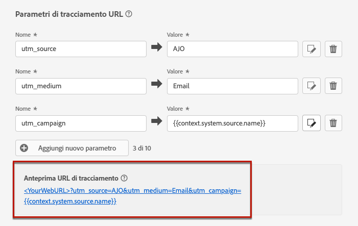

# Tracciamento URL {#url-tracking}

>[!CONTEXTUALHELP]
>id="ajo_admin_preset_utm"
>title="Definire i parametri di tracciamento degli URL"
>abstract="Usa questa sezione per aggiungere automaticamente i parametri di tracciamento agli URL presenti nel contenuto dell’e-mail. Questa funzione è facoltativa."

>[!CONTEXTUALHELP]
>id="ajo_admin_preset_url_preview"
>title="Anteprima dei parametri di tracciamento degli URL"
>abstract="Verifica il modo in cui i parametri di tracciamento verranno aggiunti agli URL presenti nel contenuto dell’e-mail."

Durante la configurazione di una nuova [configurazione del canale e-mail](email-settings.md), puoi definire **[!UICONTROL parametri di tracciamento URL]** per misurare l&#39;efficacia delle tue attività di marketing su tutti i canali. L’attivazione di questa funzione è facoltativa.

I parametri definiti nella sezione corrispondente verranno aggiunti alla fine degli URL inclusi nel contenuto del messaggio e-mail. Puoi quindi acquisire questi parametri negli strumenti di analisi web come Adobe Analytics o Google Analytics e creare vari rapporti sulle prestazioni.

Puoi aggiungere fino a 10 parametri di tracciamento utilizzando il pulsante **[!UICONTROL Aggiungi nuovo parametro]**.

{width="80%"}

Per configurare un parametro di tracciamento URL, puoi immettere direttamente i valori desiderati nei campi **[!UICONTROL Nome]** e **[!UICONTROL Valore]**.

Puoi anche modificare ogni campo **[!UICONTROL Valore]** utilizzando l’[editor di personalizzazione](../personalization/personalization-build-expressions.md). Fai clic sull’icona di modifica per aprire l’editor. Da qui, puoi selezionare gli attributi contestuali disponibili e/o modificare direttamente il testo.

I seguenti valori predefiniti sono disponibili tramite l’editor di personalizzazione:

* **ID profilo messaggio**: attributo orientato al messaggio che identifica in modo univoco ogni messaggio inviato a ogni profilo di destinazione in una consegna.

* **ID offerta**: ID dell’offerta utilizzato nell’e-mail.

* **ID azione di origine**: ID dell’azione e-mail aggiunta al percorso o alla campagna.

* **Nome azione di origine**: nome dell’azione e-mail aggiunta al percorso o alla campagna.

* **ID di origine**: ID del percorso o della campagna con cui è stata inviata l’e-mail.

* **Nome di origine**: nome del percorso o della campagna con cui è stata inviata l’e-mail.

* **ID versione di origine**: ID della versione del percorso o della campagna con cui è stata inviata l’e-mail.

>[!NOTE]
>
>Puoi combinare la digitazione di valori di testo e l’utilizzo di attributi contestuali dall’editor di personalizzazione. Ogni campo **[!UICONTROL Valore]** può contenere un numero di caratteri fino al limite di 5 KB.

<!--You can drag and drop the parameters to reorder them.-->

Di seguito sono riportati alcuni esempi di URL compatibili con Adobe Analytics e Google Analytics.

* URL compatibile con Adobe Analytics: `www.YourLandingURL.com?cid=email_AJO_{{context.system.source.id}}_image_{{context.system.source.name}}`

* URL compatibile con Google Analytics: `www.YourLandingURL.com?utm_medium=email&utm_source=AJO&utm_campaign={{context.system.source.id}}&utm_content=image`

Puoi visualizzare in anteprima in modo dinamico l’URL di tracciamento risultante. Ogni volta che aggiungi, modifichi o rimuovi un parametro, l’anteprima viene aggiornata automaticamente.

>[!NOTE]
>
>Puoi anche aggiungere parametri di tracciamento dinamici e personalizzati ai collegamenti presenti nel contenuto dell’e-mail. [Ulteriori informazioni](surface-personalization.md#personalize-url-tracking)
