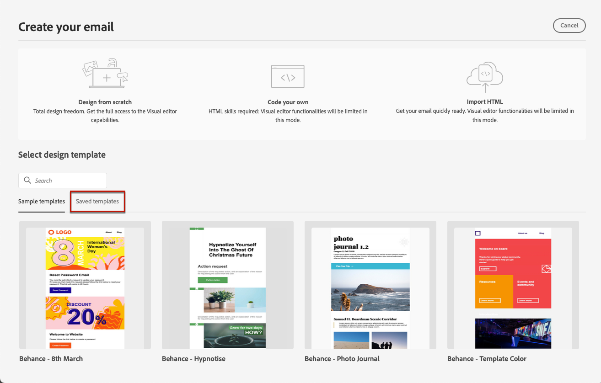

# Utilizzare modelli di e-mail {#email-templates}

>[!CONTEXTUALHELP]
>id="ajo_use_template"
>title="Creare il contenuto da un modello"
>abstract="Per iniziare a creare il contenuto dell’e-mail, seleziona un modello predefinito o un modello esistente personalizzato, creato da zero o salvato come modello da un’e-mail precedente."

Dalla schermata **[!UICONTROL Crea e-mail]**, utilizza la sezione **[!UICONTROL Seleziona modello struttura]** per iniziare a creare il contenuto da un modello.

Puoi scegliere tra:

* **Modelli di esempio**. L&#39;interfaccia [!DNL Journey Optimizer] offre 20 modelli di posta elettronica preconfigurati tra cui è possibile scegliere.

* **Modelli salvati**. Puoi anche utilizzare un modello personalizzato che:

   * Creato da zero utilizzando il menu **[!UICONTROL Modelli di contenuto]**. [Ulteriori informazioni](../content-management/content-templates.md#content-templates)

   * Salvato da un&#39;e-mail in un percorso o in una campagna utilizzando l&#39;opzione **[!UICONTROL Salva come modello di contenuto]**. [Ulteriori informazioni](../content-management/content-templates.md#video-templates)

Per iniziare a creare i contenuti con uno dei modelli di esempio o salvati, segui questi passaggi.

1. [Accedi a E-mail Designer](get-started-email-design.md) dalla schermata **[!UICONTROL Modifica contenuto]**.

1. Nella schermata **[!UICONTROL Crea l’e-mail]**, la scheda **[!UICONTROL Modelli di esempio]** è selezionata per impostazione predefinita.

1. Per utilizzare un modello personalizzato, vai alla scheda **[!UICONTROL Modelli salvati]**.

   

1. Viene visualizzato l&#39;elenco di tutti i [modelli di contenuto](../content-management/content-templates.md#content-templates) creati nella sandbox corrente. Puoi ordinarli **[!UICONTROL Per nome]**, **[!UICONTROL Ultima modifica]** e **[!UICONTROL Ultima creazione]**.

   

1. Seleziona il modello desiderato dall’elenco.

1. Una volta selezionati, puoi spostarti tra tutti i modelli di una categoria (campione o salvato a seconda della selezione) utilizzando le frecce a destra e a sinistra.

   

1. Fai clic su **[!UICONTROL Utilizza questo modello]** in alto a destra della schermata.

1. Modifica il contenuto come desiderato utilizzando E-mail Designer.
