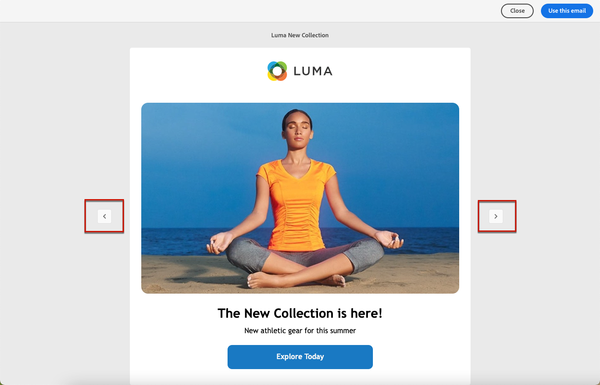

# Utilizzare modelli di e-mail {#email-templates}

>[!CONTEXTUALHELP]
>id="ajo_use_template"
>title="Creare il contenuto da un modello"
>abstract="Per iniziare a creare il contenuto dell’e-mail, seleziona un modello predefinito o un modello esistente personalizzato, creato da zero o salvato come modello da un’e-mail precedente."

From the **[!UICONTROL Create your email]** screen, use the **[!UICONTROL Select design template]** section to start building your content from a template.

Puoi scegliere tra:

* **Modelli di esempio**. The [!DNL Journey Optimizer] interface offers 20 out-of-the-box email templates that you can choose from.

* **Modelli salvati**. You can also use a custom template that you either:

   * Created from scratch using the **[!UICONTROL Content templates]** menu. [Ulteriori informazioni](../content-management/content-templates.md#content-templates)

   * Saved from an email in a journey or a campaign using the **[!UICONTROL Save as content template]** option. [Ulteriori informazioni](../content-management/content-templates.md#video-templates)

Per iniziare a creare i contenuti con uno dei modelli di esempio o salvati, segui questi passaggi.

1. [Access the Email Designer](get-started-email-design.md) from the email **[!UICONTROL Edit content]** screen.

1. Nella schermata **[!UICONTROL Crea l’e-mail]**, la scheda **[!UICONTROL Modelli di esempio]** è selezionata per impostazione predefinita.

1. To use a custom template, go to the **[!UICONTROL Saved templates]** tab.

   

1. The list of all [content templates](../content-management/content-templates.md#content-templates) created on the current sandbox displays. Puoi ordinarli **[!UICONTROL Per nome]**, **[!UICONTROL Ultima modifica]** e **[!UICONTROL Ultima creazione]**.

   

1. Seleziona il modello desiderato dall’elenco.

1. Once selected, you can navigate between all the templates of one category (sample or saved depending on your selection) using the right and left arrrows.

   

1. Fai clic su **[!UICONTROL Utilizza questo modello]** in alto a destra della schermata.

1. Edit your content as desired using the Email Designer.
