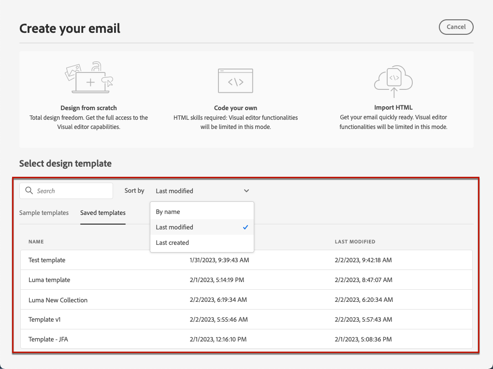

# Utilizzare modelli di e-mail {#email-templates}

>[!CONTEXTUALHELP]
>id="ajo_use_template"
>title="Creare contenuti da un modello"
>abstract="Per iniziare a creare il contenuto dell’e-mail, seleziona un modello preconfigurato o un modello personalizzato esistente, creato da zero o salvato come modello da un’e-mail precedente."
>additional-url="https://experienceleague.adobe.com/en/docs/journey-optimizer/using/content-management/content-templates#create-content-templates" text="Creare modelli di contenuto"

Dalla sezione **[!UICONTROL Creare l’e-mail]** schermata, utilizza **[!UICONTROL Seleziona modello struttura]** per iniziare a creare il contenuto da un modello.

Puoi scegliere tra:

* **Modelli di esempio**. Il [!DNL Journey Optimizer] L’interfaccia offre 20 modelli e-mail preconfigurati tra cui puoi scegliere.

* **Modelli salvati**. Puoi anche utilizzare un modello personalizzato che:

   * Creato da zero utilizzando **[!UICONTROL Modelli di contenuto]** menu. [Ulteriori informazioni](../content-management/content-templates.md#create-template-from-scratch)

   * Salvato da un’e-mail in un percorso o in una campagna utilizzando **[!UICONTROL Salva come modello di contenuto]** opzione. [Ulteriori informazioni](../content-management/content-templates.md#save-as-template)

Per iniziare a creare i contenuti con uno dei modelli di esempio o salvati, segui i passaggi indicati di seguito.

1. [Accedere a E-mail Designer](get-started-email-design.md) dall’e-mail **[!UICONTROL Modifica contenuto]** schermo.

1. Il giorno **[!UICONTROL Creare l’e-mail]** schermo, la **[!UICONTROL Modelli di esempio]** è selezionata per impostazione predefinita.

1. Per utilizzare un modello personalizzato, vai al **[!UICONTROL Modelli salvati]** scheda.

   

1. L’elenco di tutti [modelli di contenuto](../content-management/content-templates.md#create-content-templates) creato nella sandbox corrente. Puoi ordinarli **[!UICONTROL Per nome]**, **[!UICONTROL Ultima modifica]** e **[!UICONTROL Ultima creazione]**.

   

1. Seleziona dall’elenco il modello desiderato.

1. Una volta selezionati, puoi spostarti tra tutti i modelli di una categoria (campione o salvato a seconda della selezione) utilizzando le frecce a destra e a sinistra.

   

1. Clic **[!UICONTROL Usa questo modello]** in alto a destra.

1. Modifica il contenuto come desiderato utilizzando E-mail designer.
