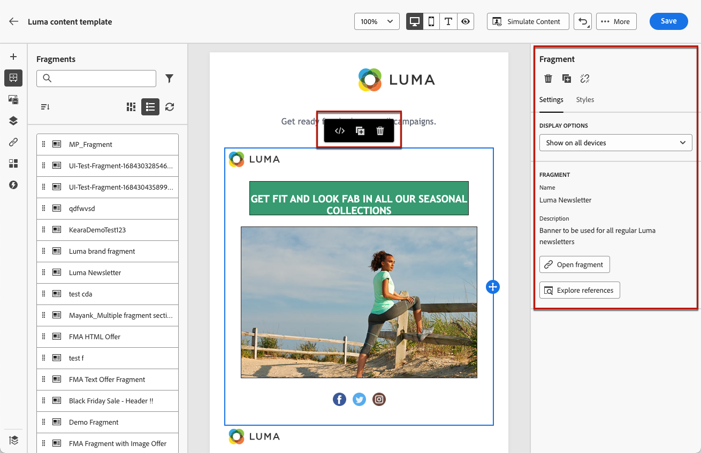

# Aggiungi frammenti visivi alle e-mail {#use-visual-fragments}

Un frammento è un componente riutilizzabile a cui è possibile fare riferimento in una o più e-mail tra campagne Journey Optimizer, percorsi o modelli di contenuto. Questa funzionalità consente di precreare più blocchi di contenuto personalizzati che possono essere utilizzati dagli utenti di marketing per assemblare rapidamente i contenuti delle e-mail in un processo di progettazione migliorato. [Scopri come creare e gestire i frammenti](../content-management/fragments.md).

➡️ [Scopri come gestire, creare e utilizzare i frammenti in questo video](../content-management/fragments.md#video-fragments)

## Utilizzare un frammento {#use-fragment}

Per utilizzare un frammento in un’e-mail, segui i passaggi seguenti.

>[!NOTE]
>
>Puoi aggiungere fino a 30 frammenti in una determinata consegna. I frammenti possono essere nidificati solo fino a un livello.

1. Apri qualsiasi contenuto e-mail o modello utilizzando [E-mail Designer](get-started-email-design.md).

1. Seleziona la **[!UICONTROL Frammenti]** dalla barra a sinistra.

   

1. Viene visualizzato l’elenco di tutti i frammenti visivi creati nella sandbox corrente. Sono ordinati per data di creazione: i frammenti visivi aggiunti di recente vengono visualizzati per primi nell’elenco. Puoi eseguire le seguenti operazioni:

   * Cerca un frammento specifico iniziando a digitarne l’etichetta.
   * Ordina i frammenti in ordine crescente o decrescente.
   * Modifica la modalità di visualizzazione dei frammenti (scheda o elenco).
   * Aggiorna l’elenco.

   >[!NOTE]
   >
   >Se alcuni frammenti sono stati modificati o aggiunti durante la modifica del contenuto, l’elenco verrà aggiornato con le modifiche più recenti.

1. Trascina un frammento dall’elenco nell’area in cui desideri inserirlo.

   

   >[!CAUTION]
   >
   >Puoi aggiungere qualsiasi **Bozza** o **Live** frammento nel contenuto. Tuttavia, non potrai attivare il percorso o la campagna se al suo interno viene utilizzato un frammento con lo stato Bozza. Durante la pubblicazione di un percorso o di una campagna, i frammenti bozza mostreranno un errore e dovrai approvarli per poterli pubblicare.
   >
   > Si prega di notare che gli stati dei frammenti vengono gradualmente implementati nel corso di diversi giorni dopo la versione di giugno di Journey Optimizer. Alcuni utenti avranno accesso immediato, altri potrebbero notare un ritardo prima che questo diventi disponibile nei loro ambienti. Se questo miglioramento non è ancora disponibile nel tuo ambiente, tieni presente che il frammento non deve essere **Live** da utilizzare nei percorsi e nelle campagne.

1. Come qualsiasi altro componente, puoi spostare il frammento all’interno del contenuto.

1. Seleziona il frammento per visualizzare il riquadro corrispondente a destra. Da lì puoi eliminare il frammento dal contenuto o duplicarlo. Puoi anche eseguire queste azioni direttamente dal menu contestuale visualizzato sopra il frammento.

   

1. Dalla sezione **[!UICONTROL Impostazioni]** , è possibile:

   * Scegli i dispositivi su cui vuoi visualizzare il frammento.
   * Apri il frammento in una nuova scheda per modificarlo, se necessario. [Ulteriori informazioni](../content-management/fragments.md#edit-fragments)
   * Esplora i riferimenti. [Ulteriori informazioni](../content-management/fragments.md#explore-references)

1. Puoi personalizzare ulteriormente il frammento utilizzando **[!UICONTROL Stili]** scheda.

1. Se necessario, puoi interrompere l’ereditarietà con il frammento originale. [Ulteriori informazioni](#break-inheritance)

1. Aggiungi tutti i frammenti desiderati e **[!UICONTROL Salva]** le tue modifiche.

## Interrompi ereditarietà {#break-inheritance}

Quando modifichi un frammento visivo, le modifiche vengono sincronizzate. Vengono propagati automaticamente a tutti i percorsi/campagne in bozza o live e ai modelli di contenuto contenenti tale frammento.

I frammenti aggiunti a un messaggio e-mail o a un modello di contenuto vengono sincronizzati per impostazione predefinita. Tuttavia, puoi interrompere l’ereditarietà dal frammento originale. In tal caso, il contenuto del frammento viene copiato nella progettazione corrente e le modifiche non vengono più sincronizzate.

Per interrompere l’ereditarietà, effettua le seguenti operazioni:

1. Seleziona il frammento.

1. Fai clic sull’icona Sblocca nella barra degli strumenti contestuale.

   

1. Il frammento diventa un elemento autonomo non più collegato al frammento originale. Modificalo come qualsiasi altro componente del contenuto. [Ulteriori informazioni](content-components.md)
