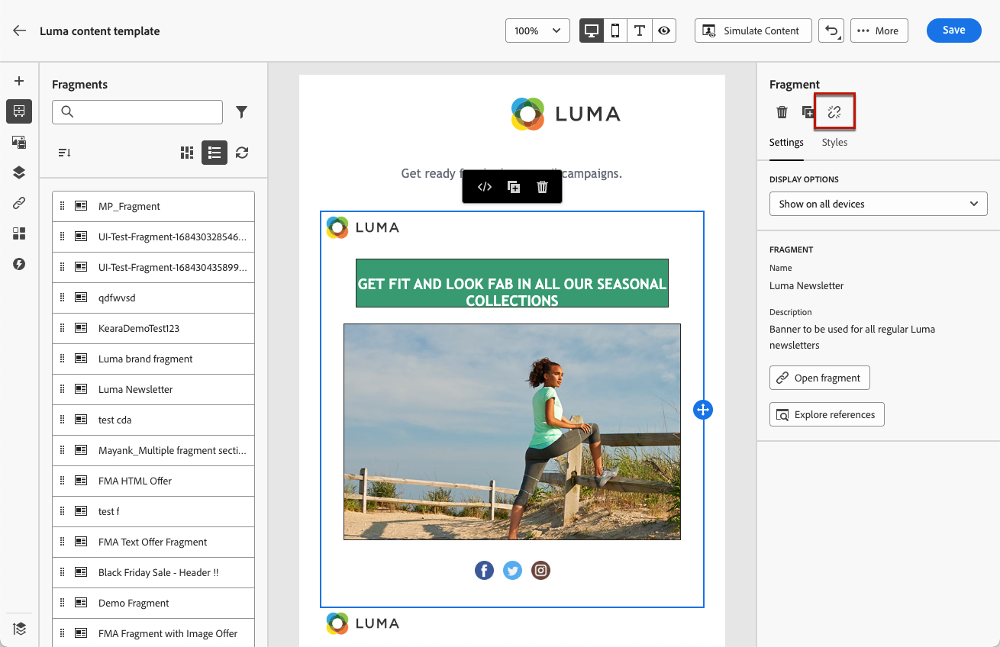

# Aggiungere frammenti visivi alle e-mail {#use-visual-fragments}

>[!BEGINSHADEBOX]

**In questa pagina:** scopri come inserire frammenti visivi riutilizzabili nelle e-mail, personalizzarne i campi modificabili e interrompere o mantenere la loro ereditarietà con il frammento originale.

>[!ENDSHADEBOX]

Un frammento è un componente riutilizzabile a cui è possibile fare riferimento in una o più e-mail tra campagne Journey Optimizer, percorsi o modelli di contenuto. Questa funzionalità consente di precreare più blocchi di contenuto personalizzati che possono essere utilizzati dagli utenti di marketing per assemblare rapidamente i contenuti delle e-mail in un processo di progettazione migliorato. [Scopri come creare e gestire i frammenti](../content-management/fragments.md).

➡️ [Scopri come gestire, creare e utilizzare i frammenti in questo video](../content-management/fragments.md#video-fragments)

## Utilizzare un frammento {#use-fragment}

Per utilizzare un frammento in un’e-mail, segui i passaggi seguenti.

>[!NOTE]
>
>Puoi aggiungere fino a 30 frammenti in una determinata consegna. I frammenti possono essere nidificati solo fino a un livello.

1. Apri qualsiasi contenuto e-mail o modello utilizzando [E-mail Designer](get-started-email-design.md).

1. Seleziona l&#39;icona **[!UICONTROL Frammenti]** dalla barra a sinistra.

   

1. Viene visualizzato l’elenco di tutti i frammenti visivi creati nella sandbox corrente. Sono ordinati per data di creazione: i frammenti visivi aggiunti di recente vengono visualizzati per primi nell’elenco. Puoi eseguire le seguenti operazioni:

   * Cerca un frammento specifico iniziando a digitarne l’etichetta.
   * Ordina i frammenti in ordine crescente o decrescente.
   * Modifica la modalità di visualizzazione dei frammenti (scheda o elenco).
   * Aggiorna l’elenco.

   >[!NOTE]
   >
   >Se alcuni frammenti sono stati modificati o aggiunti durante la modifica del contenuto, l’elenco verrà aggiornato con le modifiche più recenti.

1. Trascina un frammento dall’elenco nell’area in cui desideri inserirlo.

   

   >[!CAUTION]
   >
   >Puoi aggiungere al contenuto qualsiasi frammento **Bozza** o **Live**. Tuttavia, non potrai attivare il percorso o la campagna se al suo interno viene utilizzato un frammento con lo stato Bozza. Durante la pubblicazione di un percorso o di una campagna, i frammenti bozza mostreranno un errore e dovrai approvarli per poterli pubblicare.

1. Come qualsiasi altro componente, puoi spostare il frammento all’interno del contenuto.

1. Seleziona il frammento per visualizzare il riquadro corrispondente a destra. Da lì puoi eliminare il frammento dal contenuto o duplicarlo. Puoi anche eseguire queste azioni direttamente dal menu contestuale visualizzato sopra il frammento.

   

1. Dalla scheda **[!UICONTROL Impostazioni]** puoi effettuare le seguenti operazioni:

   * Scegli i dispositivi su cui vuoi visualizzare il frammento.
   * Apri il frammento in una nuova scheda e modificalo, se necessario. [Ulteriori informazioni](../content-management/manage-fragments.md#edit-fragments)
   * Esplora i riferimenti. [Ulteriori informazioni](../content-management/fragments.md#visual-expression)

1. Se necessario, puoi interrompere l’ereditarietà con il frammento originale. [Ulteriori informazioni](#break-inheritance)

   Una volta sbloccato, puoi personalizzare ulteriormente il frammento come qualsiasi altro componente e utilizzare la scheda **[!UICONTROL Stili]**.

1. Aggiungi tutti i frammenti desiderati e **[!UICONTROL Salva]** le modifiche.

## Gestire il contenuto condizionale nei frammenti {#fragment-dynamic-content}

Quando lavori con frammenti visivi che contengono contenuto condizionale, segui queste linee guida. [Ulteriori informazioni sui contenuti dinamici](../personalization/dynamic-content.md#emails)

>[!CAUTION]
>
>**La nidificazione di frammenti con contenuto condizionale non è supportata.** Non è possibile inserire un frammento contenente contenuto condizionale all’interno di un frammento non bloccato contenente anche contenuto condizionale. Questa configurazione non supportata può causare:
>
>* Perdita delle mappature delle varianti di contenuto condizionale
>* Avvisi sulla modalità di compatibilità in E-mail Designer
>* Rendering e-mail incoerente

**Struttura correttamente l&#39;e-mail:** Quando utilizzi più frammenti con contenuto condizionale, aggiungi ciascun frammento direttamente nel proprio blocco di struttura a livello di e-mail. Evita di nidificare frammenti con contenuto condizionale all’interno di altri frammenti sbloccati che contengono anche contenuto condizionale.

**Pianifica in anticipo:** Prima di aggiungere frammenti all&#39;e-mail, identifica quelli contenenti contenuto condizionale e pianifica il layout di conseguenza. In questo modo è possibile evitare problemi di configurazione e garantire una struttura pulita fin dall’inizio.

**Progetta con attenzione i frammenti riutilizzabili:** Quando crei frammenti che includeranno contenuto condizionale, considera come verranno utilizzati. Se un frammento deve essere nidificato all’interno di altri frammenti, evita di aggiungere contenuto condizionale ai frammenti padre e figlio.

**Risoluzione dei problemi:** Se si verificano perdite nelle mappature delle varianti di contenuto condizionale o negli avvisi relativi alla modalità di compatibilità, eseguire la procedura seguente.

* Controlla la struttura delle e-mail per individuare frammenti nidificati contenenti contenuto condizionale
* Ristruttura spostando ogni frammento con contenuto condizionale nel proprio blocco di struttura a livello di e-mail
* Salva e verifica che le varianti di contenuto condizionale siano ripristinate correttamente

## Usa variabili implicite {#implicit-variables-in-fragments}

Le variabili implicite migliorano la funzionalità dei frammenti esistenti per migliorare l’efficienza in termini di riutilizzabilità dei contenuti e casi di utilizzo di script. I frammenti possono utilizzare variabili di input e creare variabili di output utilizzabili nel contenuto di campagne e percorsi.

Scopri come utilizzare le variabili implicite in [questa sezione](../personalization/use-expression-fragments.md#implicit-variables).

## Personalizza campi modificabili {#customize-fields}

Se alcune parti del frammento selezionato sono state rese modificabili, è possibile sovrascrivere il valore predefinito dopo aver aggiunto il frammento nel contenuto. [Scopri come rendere personalizzabile un frammento](../content-management/customizable-fragments.md)

Per personalizzare i campi modificabili in un frammento utilizzato in un messaggio e-mail, segui la procedura riportata di seguito.

1. Aggiungi un frammento personalizzabile al contenuto dell&#39;e-mail e selezionalo per aprire il riquadro **[!UICONTROL Frammento]** a destra.

1. Tutti i campi modificabili nel frammento vengono visualizzati nella scheda **[!UICONTROL Impostazioni]**, sotto le proprietà del frammento.

   Nell’esempio seguente, è possibile modificare l’origine dell’immagine e il testo alt, nonché i campi &quot;Titolo&quot;/&quot;Sottotitolo&quot; e l’URL del pulsante &quot;Ulteriori informazioni&quot;.

   

1. Passa il cursore del mouse su un campo modificabile nell’area di lavoro centrale. Il campo viene evidenziato in verde e quando si fa clic sul testo contenuto viene visualizzata un&#39;icona a forma di matita.

   {width="80%" align="center"}

1. Modifica il testo del campo in linea direttamente nell’area di lavoro centrale di E-mail Designer.

   >[!NOTE]
   >
   >Per individuare facilmente i campi modificabili nel contenuto, è anche possibile selezionarli dal riquadro di destra, ma è possibile modificare questi campi solo nell’area di lavoro centrale.

1. Per i componenti **[!UICONTROL Testo]**, **[!UICONTROL Pulsante]** e **[!UICONTROL Html]**, la barra degli strumenti di E-mail Designer consente inoltre di accedere alle opzioni di formattazione RTF, ovvero grassetto, corsivo, collegamenti ipertestuali e altro ancora.

   

   >[!TIP]
   >
   >Per impostazione predefinita, i campi modificabili dei frammenti creati prima dell’introduzione della funzionalità di modifica di testo RTF sono impostati sulla modalità di solo testo. Per abilitare le opzioni di formattazione completa, passa all&#39;editor frammenti utilizzando il pulsante **[!UICONTROL Apri frammento]**, fai clic su **[!UICONTROL Abilita]** per sbloccare la modalità Rich Text e **[!UICONTROL Salva]** il frammento. [Ulteriori informazioni](../content-management/customizable-fragments.md#rich-text-visual)

   {width="50%" align="left" zoomable="yes"}

1. Puoi fare clic su **[!UICONTROL Simula contenuto]** per visualizzare il rendering del contenuto modificabile e dello stile. [Ulteriori informazioni sull&#39;anteprima del contenuto](../content-management/preview-test.md)

>[!CAUTION]
>
>Quando sia l&#39;**etichetta** che l&#39;**URL** di un componente Pulsante sono rese modificabili in un frammento, nei report di tracciamento viene visualizzato l&#39;URL anziché l&#39;etichetta del pulsante. [Ulteriori informazioni sul tracciamento](message-tracking.md)

## Interrompi ereditarietà {#break-inheritance}

Quando modifichi un frammento visivo, le modifiche vengono sincronizzate. Vengono propagati automaticamente a tutti i percorsi/campagne in bozza o live e ai modelli di contenuto contenenti tale frammento.

I frammenti aggiunti a un messaggio e-mail o a un modello di contenuto vengono sincronizzati per impostazione predefinita. Tuttavia, puoi interrompere l’ereditarietà dal frammento originale. In tal caso, il contenuto del frammento viene copiato nella progettazione corrente e le modifiche non vengono più sincronizzate.

Per interrompere l’ereditarietà, effettua le seguenti operazioni:

1. Seleziona il frammento.

1. Fai clic sull’icona Sblocca nella barra degli strumenti contestuale.

   

1. Il frammento diventa un elemento autonomo non più collegato al frammento originale. Modificalo come qualsiasi altro componente del contenuto. [Ulteriori informazioni](content-components.md)

### Frammenti bloccati {#locked-fragments}

Se il frammento è stato bloccato dal relativo autore, l’icona di sblocco è disattivata e non può essere utilizzata per interrompere l’ereditarietà.

I frammenti bloccati rimangono sincronizzati ovunque vengano visualizzati, impedendo modifiche locali che potrebbero violare gli standard del marchio o i requisiti di conformità.

Scopri come bloccare un frammento in [questa sezione](../content-management/create-fragments.md#lock-visual-fragment).

>[!NOTE]
>
>L&#39;autore del frammento può modificare l&#39;impostazione in un secondo momento per utilizzi futuri reimpostando il comportamento su **[!UICONTROL Consenti interruzione dell&#39;ereditarietà]** nelle impostazioni del frammento.

