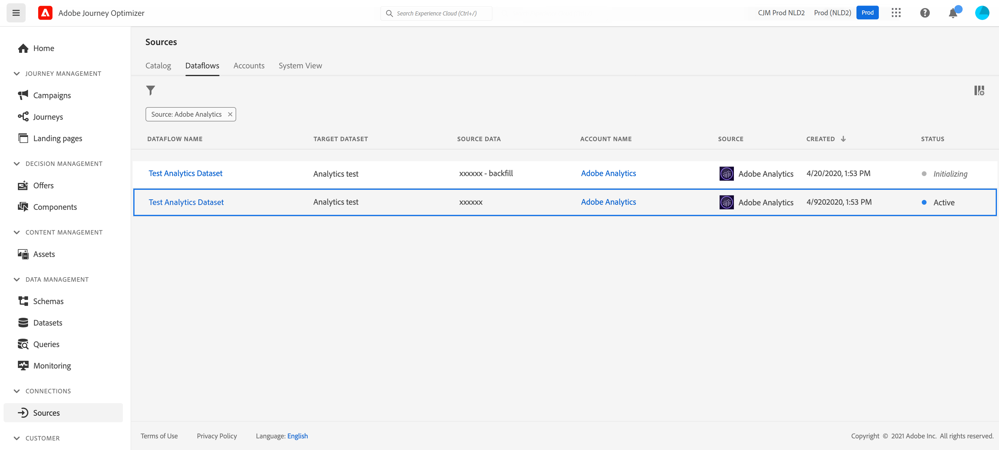

# Utilizzo dei dati di Adobe Analytics{#analytics-data}

Puoi sfruttare tutti i dati dell’evento comportamentale di Adobe Analytics che già acquisisci e trasferisci in Adobe Experience Platform per attivare percorsi e automatizzare le esperienze per i tuoi clienti.

>[!NOTE]
>
>Questa sezione si applica solo agli eventi basati su regole e ai clienti che devono utilizzare i dati di Adobe Analytics.

Affinché ciò funzioni, devi attivare in Adobe Experience Platform la suite di rapporti che desideri utilizzare. Per farlo, segui la procedura indicata di seguito:

1. Collegati a Adobe Experience Platform e cerca **[!UICONTROL Origini]**.
1. Nella sezione Adobe Analytics, seleziona **[!UICONTROL Aggiungi dati]**: viene visualizzato l’elenco delle suite di rapporti Adobe Analytics disponibili.

1. Seleziona la suite di rapporti da abilitare, fai clic su **[!UICONTROL Successivo]** e **[!UICONTROL Fine]**.

1. Condividi l&#39;ID dati sorgente con il tuo punto di contatto del programma Beta.

Questo abilita il connettore di origine Analytics per la suite di rapporti. Ogni volta che i dati entrano, vengono trasformati in un evento Experience e inviati ad Adobe Experience Platform.

Ulteriori informazioni sul connettore sorgente Adobe Analytics in  [Documentazione di Adobe Experience Platform](https://experienceleague.adobe.com/docs/experience-platform/sources/connectors/adobe-applications/analytics.html?lang=it){target=&quot;_blank&quot;} e [tutorial](https://experienceleague.adobe.com/docs/experience-platform/sources/ui-tutorials/create/adobe-applications/analytics.html?lang=it){target=&quot;_blank&quot;}.
