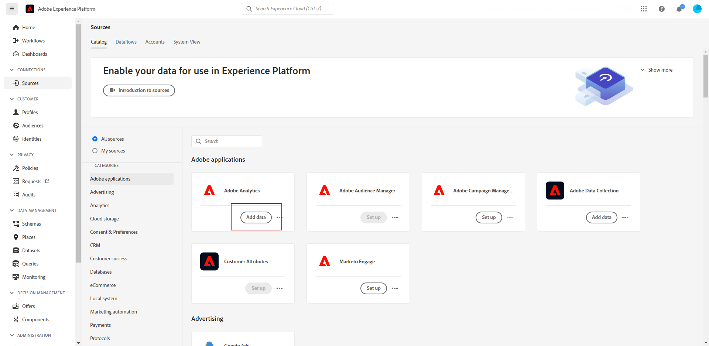
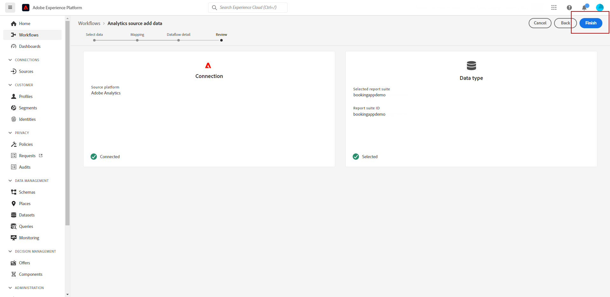
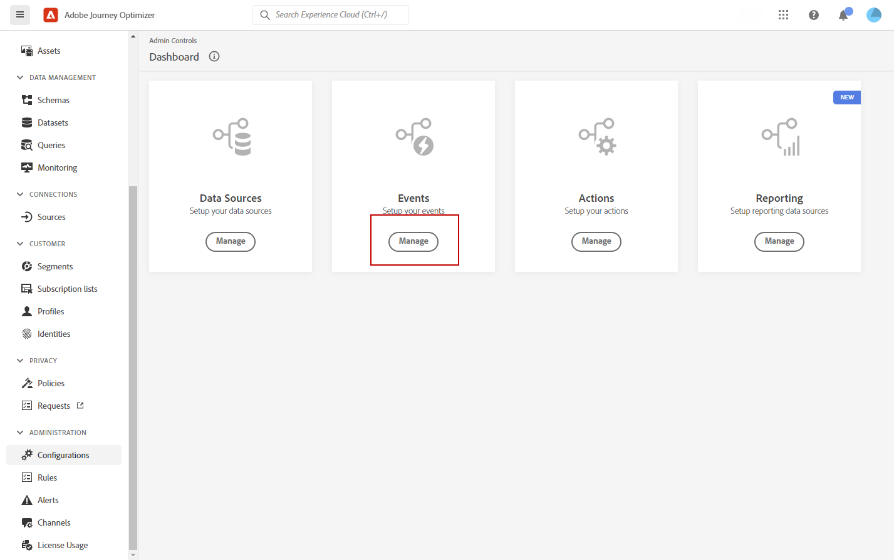
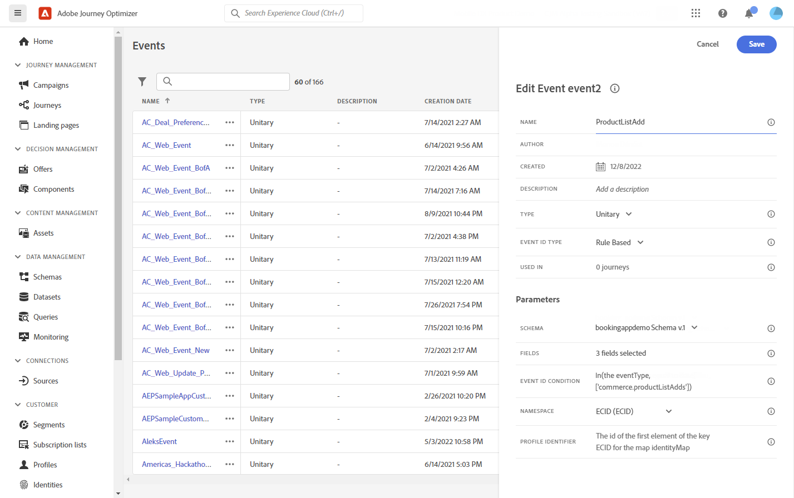
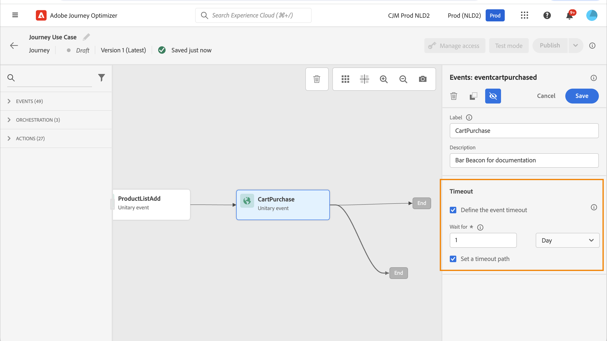
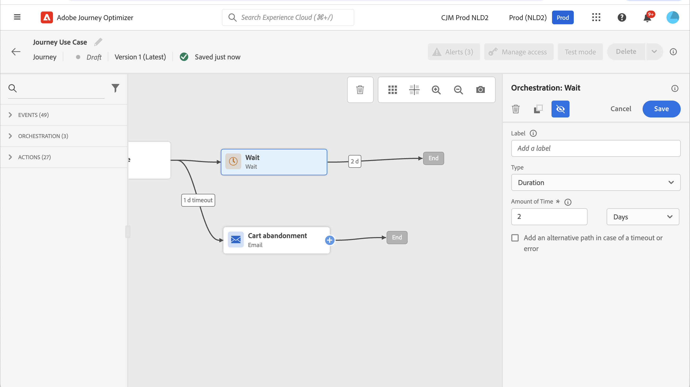

# Utilizzare i dati di Adobe Analytics {#analytics-data}

Puoi sfruttare tutti i dati dell’evento comportamentale web che già acquisisci tramite Adobe Analytics o Web SDK e inviare in streaming a Adobe Experience Platform, per attivare percorsi e automatizzare le esperienze per i clienti.

Affinché questo funzioni con Adobe Analytics, devi:

1. Attiva la suite di rapporti che desideri utilizzare. [Ulteriori informazioni](#leverage-analytics-data)
1. Abilita Journey Optimizer per utilizzare la tua origine dati Adobe Analytics. [Ulteriori informazioni](#activate-analytics-data)
1. Aggiungi un evento specifico nel percorso. [Ulteriori informazioni](#event-analytic)

>[!NOTE]
>
>Questa sezione si applica solo per gli eventi basati su regole e i clienti che devono utilizzare dati di Adobe Analytics o Web SDK.
> 
>Se utilizzi Adobe Customer Journey Analytics, fai riferimento a [questa pagina](../reports/cja-ajo.md).
>

## Configurare i dati di Adobe Analytics o Web SDK {#leverage-analytics-data}

Per poter essere utilizzati nei percorsi, i dati provenienti da Adobe Analytics o Adobe Experience Platform Web SDK devono essere abilitati.

Per farlo, segui la procedura indicata di seguito:

1. Passare al menu **[!UICONTROL Origini]**.

1. Nella sezione Adobe Analytics, seleziona **[!UICONTROL Aggiungi dati]**

   

1. Dall&#39;elenco delle suite di rapporti di Adobe Analytics disponibili, seleziona la **[!UICONTROL suite di rapporti]** da abilitare. Quindi fare clic su **[!UICONTROL Avanti]**.

   

1. Scegli se desideri utilizzare uno schema predefinito o personalizzato.

1. Dalla schermata **[!UICONTROL Dettagli flusso di dati]**, scegli un **[!UICONTROL Nome flusso di dati]**.

1. Una volta completata la configurazione, fai clic su **[!UICONTROL Fine]**.

   

In questo modo viene attivato il connettore di origine di Analytics per quella suite di rapporti. Ogni volta che i dati vengono inseriti, vengono trasformati in un evento Experience e inviati in Adobe Experience Platform.

Per ulteriori informazioni sul connettore di origine di Adobe Analytics, consulta la [documentazione di Adobe Experience Platform](https://experienceleague.adobe.com/docs/experience-platform/sources/connectors/adobe-applications/analytics.html){target="_blank"} e la [esercitazione](https://experienceleague.adobe.com/docs/experience-platform/sources/ui-tutorials/create/adobe-applications/analytics.html){target="_blank"}.

## Attiva questa configurazione {#activate-analytics-data}

Al termine della configurazione, contatta Adobe per abilitare l’ambiente Journey Optimizer all’utilizzo di questa origine dati. Questo passaggio è necessario solo per le origini dati di Adobe Analytics. Per eseguire questa operazione:

1. Ottieni l’ID dell’origine dati. Queste informazioni sono disponibili nell&#39;interfaccia utente: passare all&#39;origine dati creata dalla scheda **Flussi dati** del menu **Origini**. Il modo più semplice per trovarlo è filtrare in base alle origini di Adobe Analytics.
1. Contatta l’Assistenza clienti Adobe con i seguenti dettagli:

   * Oggetto: Abilitare gli eventi Adobe Analytics per i percorsi

   * Contenuto: abilita il mio ambiente per utilizzare gli eventi AA.

      * ID organizzazione: &quot;XXX@AdobeOrg&quot;

      * ID sorgente dati: &quot;ID: xxxxx&quot;

1. Una volta confermata la preparazione dell’ambiente, puoi utilizzare i dati di Adobe Analytics nei tuoi percorsi.

## Creazione di un percorso con un evento utilizzando i dati di Adobe Analytics o Web SDK {#event-analytics}

Ora puoi creare un evento basato sui dati di Adobe Analytics o Adobe Experience Platform Web SDK da utilizzare in un percorso.

Nell’esempio seguente, scopri come eseguire il targeting degli utenti che hanno aggiunto un prodotto ai loro carrelli:

* Se l’ordine è completato, due giorni dopo gli utenti ricevono un’e-mail di follow-up per richiedere un feedback.
* Se l’ordine non è completato, gli utenti ricevono un’e-mail per ricordarsi di completarlo.

1. Da Adobe Journey Optimizer, accedere al menu **[!UICONTROL Configurazione]**.

1. Quindi, seleziona **[!UICONTROL Gestisci]** dalla scheda **[!UICONTROL Eventi]**.

   

1. Fai clic su **[!UICONTROL Crea evento]**. Il riquadro di configurazione dell’evento si apre sul lato destro dello schermo.

1. Compila i parametri **[!UICONTROL Event]**:

   * **[!UICONTROL Nome]**: personalizza il nome del tuo **[!UICONTROL Evento]**.
   * **[!UICONTROL Tipo]**: scegli il tipo **[!UICONTROL Unitario]**. [Ulteriori informazioni](../event/about-events.md)
   * **[!UICONTROL Tipo ID evento]**: scegli il tipo di ID evento **[!UICONTROL Basato su regola]**. [Ulteriori informazioni](../event/about-events.md#event-id-type)
   * **[!UICONTROL Schema]**: seleziona lo schema Analytics o WebSDK [creato prima](#leverage-analytics-data).
   * **[!UICONTROL Campi]**: seleziona i campi Payload. [Ulteriori informazioni](../event/about-creating.md#define-the-payload-fields)
   * **[!UICONTROL Condizione ID evento]**: definisci la condizione per identificare gli eventi che attiveranno il percorso.

     In questo caso, l’evento viene attivato quando i clienti aggiungono un articolo ai loro carrelli.
   * **[!UICONTROL Identificatore profilo]**: scegli un campo dai campi del payload o definisci una formula per identificare la persona associata all&#39;evento.

   

1. Una volta configurata, selezionare **[!UICONTROL Salva]**.

Ora che l’evento è pronto, crea un percorso per utilizzarlo.

1. Aprire o creare un percorso dal menu **[!UICONTROL Percorsi]**. Per ulteriori informazioni al riguardo, consulta [questa sezione](../building-journeys/journey-gs.md).

1. Aggiungi al percorso l’evento Analytics configurato in precedenza.

   

1. Aggiungi un evento che verrà attivato se un ordine è completato.

1. Dal **[!UICONTROL menu Evento]**, seleziona le opzioni **[!UICONTROL Definisci timeout evento]** e **[!UICONTROL Imposta un percorso di timeout]**.

   

1. Aggiungi un&#39;azione **[!UICONTROL E-mail]** dal percorso di timeout. Questo percorso verrà utilizzato per inviare un’e-mail ai clienti che non hanno completato un ordine per ricordare loro che i loro carrelli sono ancora disponibili.

1. Aggiungi un&#39;attività **[!UICONTROL Wait]** dopo il percorso principale e impostala sulla durata necessaria.

   

1. Quindi, aggiungi **[!UICONTROL Azione e-mail]**. In questa e-mail, ai clienti verrà richiesto di fornire feedback sull’ordine effettuato.

Ora puoi testare e pubblicare il percorso. [Ulteriori informazioni](../building-journeys/publish-journey.md)

