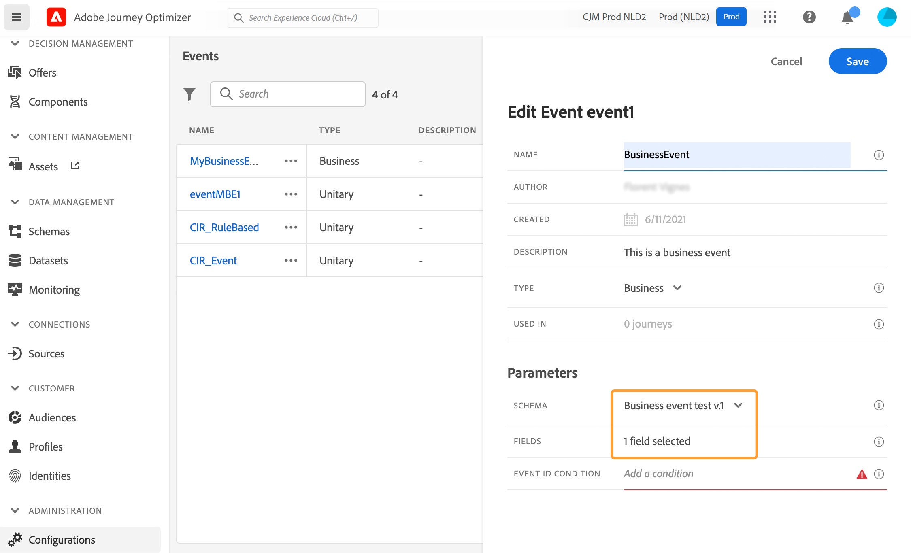

# Configurare un evento di business {#configure-a-business-event}

>[!CONTEXTUALHELP]
>id="ajo_journey_event_business"
>title="Eventi di business"
>abstract="La configurazione dell’evento consente di definire le informazioni che Journey Optimizer riceverà sotto forma di eventi. All’interno dei vari passaggi di un percorso puoi utilizzare più eventi, e uno stesso evento può essere utilizzato in più percorsi. A differenza degli eventi unitari, gli eventi di business non sono collegati a un profilo specifico. Il tipo di ID evento è sempre basato su regole."

A differenza degli eventi unitari, gli eventi di business non sono collegati a un profilo specifico. Il tipo di ID evento è sempre basato su regole. Ulteriori informazioni sugli eventi di business in [questa sezione](../event/about-events.md).

I percorsi basati sul pubblico di lettura possono essere attivati in un’unica soluzione, da un modulo di pianificazione su base regolare o da un evento di business, quando si verifica l’evento.

Gli eventi aziendali possono essere &quot;un prodotto è di nuovo disponibile&quot;, &quot;il prezzo delle azioni di un&#39;azienda raggiunge un certo valore&quot;, ecc.

>[!NOTE]
>
>Puoi anche guardare il caso di utilizzo dell’evento di business [esercitazione](https://experienceleague.adobe.com/docs/journey-optimizer-learn/tutorials/create-journeys/use-case-business-event.html). Non è necessario abilitare lo schema per il profilo.

## Note importanti {#important-notes}

* Sono disponibili solo schemi di serie temporali. Gli schemi Eventi esperienza, Eventi decisione ed Eventi passaggio Percorso non sono disponibili.
* Lo schema evento deve contenere un&#39;identità primaria non basata su persone. Durante la definizione dell’evento è necessario selezionare i campi seguenti: `_id` e `timestamp`
* Gli eventi di business possono essere eliminati solo come primo passaggio di un percorso.
* Quando si rilascia un evento business come primo passaggio di un percorso, il tipo di scheduler del percorso sarà &quot;evento business&quot;.
* Dopo un evento di business è possibile eliminare solo un’attività di lettura del pubblico. Viene aggiunto automaticamente come passaggio successivo.
* Per consentire più esecuzioni di eventi business, attiva l’opzione corrispondente nella **[!UICONTROL Esecuzione]** della sezione delle proprietà del percorso.
* Dopo l’attivazione di un evento di business, si verifica un ritardo nell’esportazione del pubblico da 15 minuti a un’ora.
* Durante il test di un evento di business, è necessario trasmettere i parametri dell’evento e l’identificatore del profilo di test che entrerà nel percorso in test. Inoltre, quando esegui il test di un percorso basato su un evento business, puoi attivare solo l’ingresso di un singolo profilo. Consulta [questa sezione](../building-journeys/testing-the-journey.md#test-business). In modalità di test non è disponibile la modalità &quot;Visualizzazione codice&quot;.
* Cosa succederà alle persone che si trovano attualmente nel percorso se arriva un nuovo evento di business? Si comporta come quando gli individui sono ancora in un percorso ricorrente quando si verifica una nuova ricorrenza. Il loro percorso è terminato. Di conseguenza, gli esperti di marketing devono prestare attenzione ad evitare di creare percorsi troppo lunghi, qualora si aspettino eventi di business frequenti.
* Gli eventi di business non possono essere utilizzati in combinazione con eventi unitari o attività di qualificazione del pubblico.

## Più eventi di business {#multiple-business-events}

Di seguito sono riportate alcune note importanti che vengono applicate quando si ricevono più eventi di business di seguito.

**Qual è il comportamento quando si riceve un evento di business durante l’elaborazione del percorso?**

Gli eventi di business seguono le regole di rientro nello stesso modo degli eventi unitari. Se un percorso consente il rientro, l’evento di business successivo viene elaborato.

**Quali sono le protezioni per evitare il sovraccarico dei tipi di pubblico materializzati?**

Nel caso di eventi di business on-shot, per un determinato percorso, i dati inviati dal primo processo evento vengono riutilizzati durante un intervallo di tempo di 1 ora. Per i percorsi programmati, non c&#39;è guardrail. Ulteriori informazioni sui tipi di pubblico in [Documentazione del servizio di segmentazione di Adobe Experience Platform](https://experienceleague.adobe.com/docs/experience-platform/segmentation/home.html?lang=it).

## Introduzione agli eventi di business {#gs-business-events}

Di seguito sono riportati i primi passaggi per configurare un evento di business:

1. Nella sezione del menu ADMINISTRATION, selezionare **[!UICONTROL Configurazioni]**. In  **[!UICONTROL Eventi]** , fare clic su **[!UICONTROL Gestisci]**. Viene visualizzato l’elenco degli eventi.

   

1. Clic **[!UICONTROL Crea evento]** per creare un nuovo evento. Il riquadro di configurazione dell’evento si apre sul lato destro dello schermo.

   

1. Inserisci il nome dell’evento. Puoi anche aggiungere una descrizione.

   

   >[!NOTE]
   >
   >Non utilizzare spazi o caratteri speciali. Non usare più di 30 caratteri.

1. In **[!UICONTROL Tipo]** campo, scegli **Aziende**.

   

1. Il numero di percorsi che utilizzano questo evento viene visualizzato nel **[!UICONTROL Utilizzato in]** campo. Puoi fare clic su **[!UICONTROL Visualizza percorsi]** per visualizzare l’elenco dei percorsi che utilizzano questo evento.

1. Definisci i campi dello schema e del payload: in questo punto è possibile selezionare le informazioni sull’evento (o payload) che i percorsi prevedono di ricevere. Queste informazioni verranno utilizzate successivamente nel percorso. Consulta [questa sezione](../event/about-creating-business.md#define-the-payload-fields).

   

   Sono disponibili solo schemi di serie temporali. `Experience Events`, `Decision Events` e `Journey Step Events` schemi non disponibili. Lo schema evento deve contenere un&#39;identità primaria non basata su persone. Durante la definizione dell’evento è necessario selezionare i campi seguenti: `_id` e `timestamp`

   

1. Fai clic all’interno del **[!UICONTROL Condizione ID evento]** campo. Utilizza l’editor di espressioni semplici per definire la condizione utilizzata dal sistema per identificare gli eventi che attivano il percorso.

   

   Nel nostro esempio, abbiamo scritto una condizione basata sull’ID del prodotto. Ciò significa che ogni volta che il sistema riceve un evento che corrisponde a questa condizione, lo trasmette ai percorsi.

   >[!NOTE]
   >
   >Nell’editor delle espressioni semplici non tutti gli operatori sono disponibili, ma dipendono dal tipo di dati. Ad esempio, per un tipo di stringa di campo, puoi utilizzare &quot;contains&quot; o &quot;equal to&quot;.

1. Fai clic su **[!UICONTROL Salva]**.

   

   L’evento è ora configurato e pronto per essere rilasciato in un percorso. Per poter ricevere gli eventi sono necessari ulteriori passaggi di configurazione. Per ulteriori informazioni, consulta [questa pagina](../event/additional-steps-to-send-events-to-journey.md).

## Definire i campi payload {#define-the-payload-fields}

La definizione del payload consente di scegliere le informazioni che il sistema si aspetta di ricevere dall’evento nel percorso e la chiave per identificare quale persona è associata all’evento. Il payload si basa sulla definizione del campo XDM di Experience Cloud. Per ulteriori informazioni su XDM, consulta [Documentazione di Adobe Experience Platform](https://experienceleague.adobe.com/docs/experience-platform/xdm/home.html?lang=it){target="_blank"}.

1. Seleziona uno schema XDM dall’elenco e fai clic sul pulsante **[!UICONTROL Campi]** campo o sul **[!UICONTROL Modifica]** icona.

   

   Vengono visualizzati tutti i campi definiti nello schema. L’elenco dei campi varia da uno schema all’altro. Puoi cercare un campo specifico o utilizzare i filtri per visualizzare tutti i nodi e i campi o solo i campi selezionati. In base alla definizione dello schema, alcuni campi possono essere obbligatori e preselezionati. Non è possibile deselezionarli. Per impostazione predefinita, vengono selezionati tutti i campi obbligatori per consentire la corretta ricezione dell’evento da parte dei percorsi.

   

   >[!NOTE]
   >
   > Accertati che siano selezionati i seguenti campi: `_id` e `timestamp`

1. Seleziona i campi che prevedi di ricevere dall’evento. Questi sono i campi che l’utente aziendale sfrutterà nel percorso.

1. Dopo aver selezionato i campi necessari, fai clic su **[!UICONTROL Salva]** o premere **[!UICONTROL Invio]**.

   Il numero di campi selezionati viene visualizzato in **[!UICONTROL Campi]**.

   

## Anteprima del payload {#preview-the-payload}

Utilizza l’anteprima del payload per convalidare la definizione del payload.

1. Fai clic su **[!UICONTROL Visualizza payload]** per visualizzare in anteprima il payload previsto dal sistema.

   

   È possibile notare che vengono visualizzati i campi selezionati.

   

1. Controlla l’anteprima per convalidare la definizione del payload.

1. Quindi, puoi condividere l’anteprima del payload con alla persona responsabile dell’invio dell’evento. Questo payload può aiutarli a progettare la configurazione di un evento che invia a [!DNL Journey Optimizer]. Consulta [questa pagina](../event/additional-steps-to-send-events-to-journey.md).
