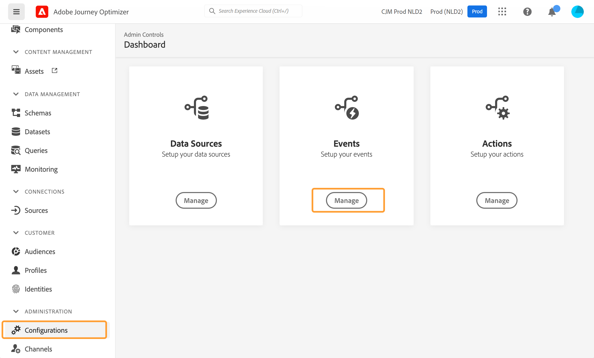
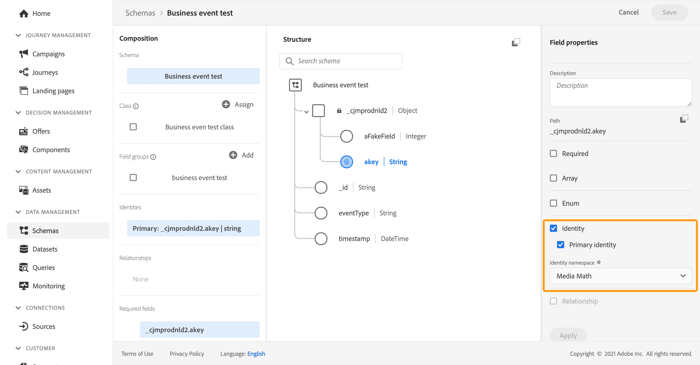

# Configurare un evento di business {#configure-a-business-event}

>[!CONTEXTUALHELP]
>id="ajo_journey_event_business"
>title="Eventi aziendali"
>abstract="La configurazione dell’evento ti consente di definire le informazioni che Journey Optimizer riceverà sotto forma di eventi. È possibile utilizzare più eventi (in diversi passaggi di un percorso) e diversi percorsi possono utilizzare lo stesso evento. A differenza degli eventi unitari, gli eventi aziendali non sono collegati a un profilo specifico. Il tipo di ID evento è sempre basato su regole."

A differenza degli eventi unitari, gli eventi aziendali non sono collegati a un profilo specifico. Il tipo di ID evento è sempre basato su regole. Ulteriori informazioni sugli eventi aziendali in [questa sezione](../event/about-events.md).

I percorsi basati su segmenti di lettura possono essere attivati in una sola volta, da un programmatore regolarmente o da un evento aziendale, quando si verifica l’evento.

Gli eventi di business possono essere &quot;un prodotto è di nuovo in magazzino&quot;, &quot;il prezzo delle azioni di un&#39;azienda raggiunge un certo valore&quot;, ecc.

>[!NOTE]
>
>È inoltre possibile osservare il caso d’uso dell’evento aziendale [tutorial](https://experienceleague.adobe.com/docs/journey-optimizer-learn/tutorials/create-journeys/use-case-business-event.html). Non è necessario abilitare lo schema per il profilo.

## Note importanti {#important-notes}

* Sono disponibili solo gli schemi di serie temporali. Gli schemi Eventi esperienza, Eventi decisionali e Eventi di Percorso non sono disponibili.
* Lo schema dell&#39;evento deve contenere un&#39;identità primaria non basata su persone. Quando definisci l’evento, è necessario selezionare i campi seguenti: `_id` e `timestamp`
* Gli eventi aziendali possono essere eliminati solo come primo passo di un percorso.
* Quando si rilascia un evento business come primo passaggio di un percorso, il tipo di pianificazione del percorso sarà &quot;evento business&quot;.
* Solo un’attività di segmento di lettura può essere rilasciata dopo un evento aziendale. Viene aggiunto automaticamente come passaggio successivo.
* Per consentire l&#39;esecuzione di più eventi di business, attiva l&#39;opzione corrispondente nel **[!UICONTROL Execution]** sezione delle proprietà del percorso.
* Dopo l’attivazione di un evento aziendale, si verifica un ritardo nell’esportazione del segmento da 15 minuti a un’ora.
* Quando si esegue il test di un evento aziendale, è necessario trasmettere i parametri dell&#39;evento e l&#39;identificatore del profilo di test che immetterà il percorso nel test. Inoltre, quando esegui il test di un percorso basato su eventi aziendali, puoi attivare solo l’ingresso a un singolo profilo. Vedi [questa sezione](../building-journeys/testing-the-journey.md#test-business). In modalità di test non è disponibile la modalità &quot;Vista codice&quot;.
* Cosa succede agli individui che si trovano attualmente nel percorso se arriva un nuovo evento di business? Si comporta come quando gli individui si trovano ancora in un percorso ricorrente quando si verifica una nuova ricorrenza. Il loro percorso è finito. Di conseguenza, gli esperti di marketing devono prestare attenzione a evitare di generare percorsi troppo lunghi se si aspettano eventi di business frequenti.
* Gli eventi aziendali non possono essere utilizzati in combinazione con eventi unitari o attività di qualificazione dei segmenti.

## Eventi aziendali multipli {#multiple-business-events}

Di seguito sono riportate alcune note importanti che si applicano quando più eventi di business vengono ricevuti in una riga.

**Qual è il comportamento durante la ricezione di un evento aziendale durante l&#39;elaborazione da parte del percorso?**

Gli eventi commerciali seguono le regole di rientro come per gli eventi unitari. Se un percorso consente il rientro, verrà elaborato l&#39;evento business successivo.

**Quali sono le protezioni per evitare il sovraccarico dei segmenti materializzati?**

Nel caso di eventi aziendali on-shot, per un dato percorso, i dati inviati dal primo lavoro evento vengono riutilizzati durante un intervallo di tempo di 1 ora. Per i percorsi programmati, non c&#39;è un guardrail. Ulteriori informazioni sui segmenti nel [Documentazione del servizio di segmentazione Adobe Experience Platform](https://experienceleague.adobe.com/docs/experience-platform/segmentation/home.html).

## Guida introduttiva agli eventi aziendali {#gs-business-events}

Di seguito sono riportati i primi passaggi per configurare un evento aziendale:

1. Nella sezione del menu AMMINISTRAZIONE, seleziona **[!UICONTROL Configurations]**. In  **[!UICONTROL Events]** sezione, fai clic su **[!UICONTROL Manage]**. Viene visualizzato l’elenco degli eventi.

   

1. Per creare un nuovo evento, fai clic su **[!UICONTROL Create Event]**. Il riquadro di configurazione dell’evento si apre sul lato destro dello schermo.

   

1. Inserisci il nome dell’evento. Puoi anche aggiungere una descrizione.

   

   >[!NOTE]
   >
   >Non utilizzare spazi o caratteri speciali. Non usare più di 30 caratteri.

1. In **[!UICONTROL Type]** campo, scegli **Business**.

   

1. Il numero di percorsi che utilizzano questo evento viene visualizzato nel campo **[!UICONTROL Used in]**. Puoi fare clic sull’icona **[!UICONTROL View journeys]** per visualizzare l’elenco dei percorsi che utilizzano questo evento.

1. Definisci i campi dello schema e del payload: in questo punto è possibile selezionare le informazioni sull’evento (o payload) che i percorsi prevedono di ricevere. Utilizzerai queste informazioni più avanti nel tuo percorso. Vedi [questa sezione](../event/about-creating-business.md#define-the-payload-fields).

   

   Sono disponibili solo gli schemi di serie temporali. `Experience Events`, `Decision Events` e `Journey Step Events` Gli schemi non sono disponibili. Lo schema dell&#39;evento deve contenere un&#39;identità primaria non basata su persone. Quando definisci l’evento, è necessario selezionare i campi seguenti: `_id` e `timestamp`

   

1. Fai clic all’interno del **[!UICONTROL Event ID condition]** campo . Utilizza l’editor di espressioni semplici per definire la condizione utilizzata dal sistema per identificare gli eventi che attivano il percorso.

   

   Nel nostro esempio, abbiamo scritto una condizione basata sull’ID del prodotto. Ciò significa che ogni volta che il sistema riceve un evento che corrisponde a questa condizione, lo trasmette ai percorsi.

   >[!NOTE]
   >
   >Nell’editor di espressioni semplici, non tutti gli operatori sono disponibili, dipendono dal tipo di dati. Ad esempio, per un tipo di stringa di campo, è possibile utilizzare &quot;contiene&quot; o &quot;uguale a&quot;.

1. Fai clic su **[!UICONTROL Save]**.

   

   L’evento è ora configurato e pronto per essere rilasciato in un percorso. Per poter ricevere gli eventi sono necessari ulteriori passaggi di configurazione. Per ulteriori informazioni, consulta [questa pagina](../event/additional-steps-to-send-events-to-journey.md).

## Definire i campi payload {#define-the-payload-fields}

La definizione del payload ti consente di scegliere le informazioni che il sistema prevede di ricevere dall’evento nel tuo percorso e la chiave per identificare quale persona è associata all’evento. Il payload si basa sulla definizione del campo XDM di Experience Cloud. Per ulteriori informazioni su XDM, consulta [Documentazione di Adobe Experience Platform](https://experienceleague.adobe.com/docs/experience-platform/xdm/home.html){target=&quot;_blank&quot;}.

1. Seleziona uno schema XDM dall’elenco e fai clic sul pulsante **[!UICONTROL Fields]** o sul campo **[!UICONTROL Edit]** icona.

   

   Vengono visualizzati tutti i campi definiti nello schema. L’elenco dei campi varia da uno schema all’altro. È possibile cercare un campo specifico o utilizzare i filtri per visualizzare tutti i nodi e i campi o solo i campi selezionati. In base alla definizione dello schema, alcuni campi possono essere obbligatori e preselezionati. Non è possibile deselezionarli. Per impostazione predefinita, tutti i campi obbligatori affinché l’evento possa essere ricevuto correttamente dai percorsi sono selezionati.

   

   >[!NOTE]
   >
   > Assicurati che siano selezionati i campi seguenti: `_id` e `timestamp`

1. Selezionare i campi che si prevede di ricevere dall’evento. Questi sono i campi che l&#39;utente aziendale sfrutterà nel percorso.

1. Dopo aver selezionato i campi necessari, fai clic su **[!UICONTROL Save]** o premere **[!UICONTROL Enter]**.

   Il numero di campi selezionati viene visualizzato in **[!UICONTROL Fields]**.

   

## Anteprima del payload {#preview-the-payload}

Utilizza l’anteprima del payload per convalidare la definizione del payload.

1. Fai clic sul pulsante **[!UICONTROL View Payload]** per visualizzare in anteprima il payload previsto dal sistema.

   

   I campi selezionati vengono visualizzati.

   

1. Seleziona l’anteprima per convalidare la definizione del payload.

1. Quindi, puoi condividere l’anteprima del payload con la persona responsabile dell’invio dell’evento. Questo payload può aiutarli a progettare la configurazione di un evento che invia a [!DNL Journey Optimizer]. Consulta [questa pagina](../event/additional-steps-to-send-events-to-journey.md).
