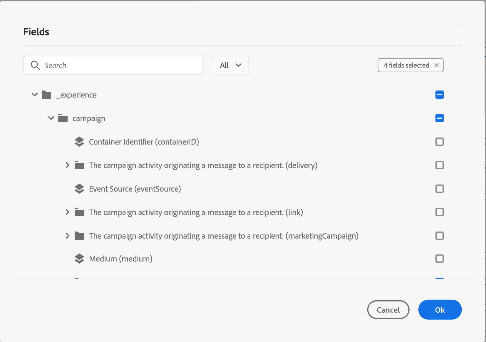

# Configurare un evento unitario {#configure-an-event}

>[!CONTEXTUALHELP]
>id="ajo_journey_event_unitary"
>title="Eventi unitari"
>abstract="La configurazione dell’evento consente di definire le informazioni che Journey Optimizer riceverà sotto forma di eventi. All’interno dei vari passaggi di un percorso puoi utilizzare più eventi, e uno stesso evento può essere utilizzato in più percorsi. Gli eventi unitari sono collegati a un profilo specifico. Possono essere basati su regole o generati dal sistema."

>[!CONTEXTUALHELP]
>id="ajo_journey_event_parameters"
>title="Parametri"
>abstract="Definisci i parametri dell’evento, ad esempio i campi dello schema e del payload. Per gli eventi basati su regole, utilizza il campo **[!UICONTROL Condizione ID evento]** per definire la condizione che verrà utilizzata dal sistema per identificare gli eventi che attiveranno il percorso. Aggiungi un tipo di identità e un identificatore di profilo da utilizzare per l’evento."

Gli eventi unitari sono collegati a un profilo specifico. Possono essere basate su regole o generate dal sistema.  Ulteriori informazioni sull&#39;evento unitario [questa sezione](../event/about-events.md).

Di seguito sono riportati i primi passaggi per configurare un nuovo evento:

1. Nella sezione del menu AMMINISTRAZIONE, passa a **[!UICONTROL Configurazioni]** e nella sezione **[!UICONTROL Eventi]** fai clic su **[!UICONTROL Gestisci]**. Viene visualizzato l’elenco degli eventi.

   

1. Fai clic su **[!UICONTROL Crea evento]** per creare un nuovo evento. Il riquadro di configurazione dell’evento si apre sul lato destro dello schermo.

   

1. Inserisci il nome dell’evento. Puoi anche aggiungere una descrizione.

   

   >[!NOTE]
   >
   >Sono consentiti solo caratteri alfanumerici e trattini bassi. La lunghezza massima è di 30 caratteri.

1. Nel campo **[!UICONTROL Tipo]** scegliere **Unitario**.

   

1. Nel campo **[!UICONTROL Tipo ID evento]**, selezionare il tipo di ID evento che si desidera utilizzare: **Basato su regole** o **Generato dal sistema**. Ulteriori informazioni sui tipi di ID evento in [questa sezione](../event/about-events.md#event-id-type).

   

1. Il numero di percorsi che utilizzano questo evento viene visualizzato nel campo **[!UICONTROL Usato in]**. È possibile fare clic sull&#39;icona **[!UICONTROL Visualizza percorsi]** per visualizzare l&#39;elenco dei percorsi che utilizzano questo evento.

1. Definisci i campi dello schema e del payload: in questo punto è possibile selezionare le informazioni sull’evento, solitamente denominato payload, che i percorsi prevedono di ricevere. Potrai quindi utilizzare queste informazioni nel tuo percorso. Consulta [questa sezione](../event/about-creating.md#define-the-payload-fields).

   

   >[!NOTE]
   >
   >Quando selezioni il tipo **[!UICONTROL Generato dal sistema]**, sono disponibili solo gli schemi che hanno il campo del tipo eventID. Quando selezioni il tipo **[!UICONTROL Basato su regole]**, sono disponibili tutti gli schemi Experience Event.

1. Per gli eventi basati su regole, fai clic nel campo **[!UICONTROL Event ID condition]**. Utilizzando l’editor di espressioni semplice o avanzato, definisci la condizione che verrà utilizzata dal sistema per identificare gli eventi che attiveranno il percorso.

   

   Nel nostro esempio, abbiamo scritto una condizione basata sulla città del profilo. Ciò significa che ogni volta che il sistema riceve un evento che corrisponde a questa condizione (campo **[!UICONTROL Città]** e valore **[!UICONTROL Parigi]**), lo trasmetterà ai percorsi.

   >[!NOTE]
   >
   >Nell’editor delle espressioni semplici non tutti gli operatori sono disponibili, ma dipendono dal tipo di dati. Ad esempio, per un tipo di stringa di campo, puoi utilizzare &quot;contains&quot; o &quot;equal to&quot;.
   >
   >Se modifichi lo schema con nuovi valori di enumerazione dopo aver creato l’evento, segui questi passaggi per applicare le modifiche all’evento esistente: deseleziona il campo di enumerazione dai campi dell’evento, conferma la selezione, quindi seleziona nuovamente il campo di enumerazione. Viene ora visualizzato il nuovo valore di enumerazione.

1. Aggiungi un tipo di identità. Questo passaggio è facoltativo ma consigliato, in quanto l’aggiunta di un tipo di identità ti consente di sfruttare le informazioni memorizzate nel servizio Profilo cliente in tempo reale. definendo il tipo di chiave di cui dispone l’evento. Ulteriori informazioni in [questa sezione](../event/about-creating.md#select-the-namespace).

1. Definire l’identificatore del profilo: scegli un campo dai campi del payload o definisci una formula per identificare la persona associata all’evento. Se selezioni un tipo di identità, questa chiave viene impostata automaticamente, ma può essere comunque modificata. In effetti, i percorsi selezionano la chiave che deve corrispondere al tipo di identità (ad esempio, se selezioni un tipo di identità e-mail, verrà selezionata la chiave e-mail). Ulteriori informazioni in [questa sezione](../event/about-creating.md#define-the-event-key).

   

1. Fai clic su **[!UICONTROL Salva]**.

   L’evento è ora configurato e pronto per essere rilasciato in un percorso. Per poter ricevere gli eventi sono necessari ulteriori passaggi di configurazione. Consulta [questa pagina](../event/additional-steps-to-send-events-to-journey.md).

## Definire i campi payload {#define-the-payload-fields}

La definizione del payload consente di scegliere le informazioni che il sistema si aspetta di ricevere dall’evento nel percorso e la chiave per identificare quale persona è associata all’evento. Il payload si basa sulla definizione del campo XDM di Experience Cloud. Per ulteriori informazioni su XDM, consulta la [documentazione di Adobe Experience Platform](https://experienceleague.adobe.com/docs/experience-platform/xdm/home.html?lang=it){target="_blank"}.

1. Seleziona uno schema XDM dall&#39;elenco e fai clic sul campo **[!UICONTROL Campi]** o sull&#39;icona **[!UICONTROL Modifica]**.

   

   Vengono visualizzati tutti i campi definiti nello schema. L’elenco dei campi varia da uno schema all’altro. Puoi cercare un campo specifico o utilizzare i filtri per visualizzare tutti i nodi e i campi o solo i campi selezionati. In base alla definizione dello schema, alcuni campi possono essere obbligatori e preselezionati. Non è possibile deselezionarli. Per impostazione predefinita, vengono selezionati tutti i campi obbligatori per consentire la corretta ricezione dell’evento da parte dei percorsi.

   >[!NOTE]
   >
   >Per gli eventi generati dal sistema, accertati di aver aggiunto il gruppo di campi &quot;orchestrazione&quot; allo schema XDM. In questo modo lo schema conterrà tutte le informazioni necessarie per l&#39;utilizzo di [!DNL Journey Optimizer].

   

1. Seleziona i campi che prevedi di ricevere dall’evento. Questi sono i campi che l’utente aziendale sfrutterà nel percorso. Devono inoltre includere la chiave che verrà utilizzata per identificare la persona associata all&#39;evento (vedere [questa sezione](../event/about-creating.md#define-the-event-key)).

   >[!NOTE]
   >
   >Per gli eventi generati dal sistema, il campo **[!UICONTROL eventID]** viene aggiunto automaticamente nell&#39;elenco dei campi selezionati in modo che [!DNL Journey Optimizer] possa identificare l&#39;evento. Il sistema che trasmette l’evento non deve generare un ID, deve utilizzare quello disponibile nell’anteprima del payload. Consulta [questa sezione](../event/about-creating.md#preview-the-payload).

1. Dopo aver selezionato i campi necessari, fare clic su **[!UICONTROL Ok]** o premere **[!UICONTROL Invio]**.

   Il numero di campi selezionati viene visualizzato nel campo **[!UICONTROL Campi]**.

   

## Seleziona il tipo di identità {#select-the-namespace}

>[!CONTEXTUALHELP]
>id="ajo_journey_namespace"
>title="Tipo di identità"
>abstract="Seleziona la chiave per identificare il profilo cliente associato all’evento."

Il tipo di identità (precedentemente noto come &quot;namespace&quot;) ti consente di definire il tipo di chiave utilizzato per identificare la persona associata all’evento. La sua configurazione è facoltativa. È necessario se desideri recuperare nei tuoi percorsi informazioni aggiuntive provenienti dal [Profilo cliente in tempo reale](https://experienceleague.adobe.com/docs/experience-platform/profile/home.html?lang=it){target="_blank"}. La definizione del tipo di identità non è necessaria se si utilizzano solo dati provenienti da un sistema di terze parti tramite un’origine dati personalizzata.

Puoi creare un tipo di identità esistente o crearne uno nuovo utilizzando il servizio Adobe Experience Platform Identity. Ulteriori informazioni sono disponibili nella [documentazione di Adobe Experience Platform](https://experienceleague.adobe.com/docs/experience-platform/identity/home.html?lang=it){target="_blank"}.

Se si seleziona uno schema con un&#39;identità primaria, i campi **[!UICONTROL Identificatore profiler]** e **[!UICONTROL Tipo identità]** sono precompilati. Se non è stata definita alcuna identità, verrà selezionata _identityMap > id_ come chiave primaria. Quindi devi selezionare un tipo di identità e la chiave verrà precompilata (sotto il campo **[!UICONTROL Tipo di identità]**) utilizzando _identityMap > id_.

Quando selezioni i campi, vengono taggati i campi di identità primari.

Seleziona un tipo di identità dall’elenco a discesa.

È consentito un solo tipo di identità per percorso. Se utilizzi più eventi nello stesso percorso, devono utilizzare lo stesso tipo di identità. Consulta [questa pagina](../building-journeys/journey.md).

>[!NOTE]
>
>Puoi selezionare solo un tipo di identità basato su persone. Se è stato definito un tipo di identità per una tabella di ricerca (ad esempio, il tipo di identità ProductID per una ricerca di prodotti), non sarà disponibile nell&#39;elenco a discesa **Tipo di identità**.

## Definire l’identificatore del profilo {#define-the-event-key}

La chiave è il campo, o la combinazione di campi, che fa parte dei dati di payload dell’evento e che consente al sistema di identificare la persona associata all’evento. La chiave può essere, ad esempio, l’Experience Cloud ID, un ID del sistema di gestione delle relazioni con i clienti o un indirizzo e-mail.

Per utilizzare i dati archiviati nel database del profilo cliente in tempo reale di Adobe, la chiave evento deve essere costituita dalle informazioni definite come identità di un profilo nel [Servizio profilo cliente in tempo reale](https://experienceleague.adobe.com/docs/experience-platform/profile/home.html?lang=it){target="_blank"}.

L’identificatore di profilo consente al sistema di eseguire la riconciliazione tra l’evento e il profilo dell’individuo. Se si seleziona uno schema con un&#39;identità primaria, i campi **[!UICONTROL Identificatore profilo]** e **[!UICONTROL Tipo identità]** sono precompilati. Se non è stata definita alcuna identità, _identityMap > id_ è la chiave primaria. Quindi devi selezionare un tipo di identità e la chiave viene automaticamente precompilata utilizzando _identityMap > id_.

Quando selezioni i campi, vengono taggati i campi di identità primari.

Se devi utilizzare una chiave diversa, ad esempio un ID CRM o un indirizzo e-mail, devi aggiungerla manualmente, come spiegato di seguito:

1. Fai clic nel campo **[!UICONTROL Identificatore profilo]** o sull&#39;icona della matita.

   

1. Seleziona il campo scelto come chiave nell’elenco dei campi del payload.

Quando l’evento viene ricevuto, il valore della chiave consente al sistema di identificare la persona associata all’evento. Associata a un tipo di identità , la chiave può essere utilizzata per eseguire query in Adobe Experience Platform. Vedi [questa pagina](../building-journeys/about-journey-activities.md#orchestration-activities).
La chiave viene utilizzata anche per verificare che una persona appartenga a un percorso. Infatti, una persona non può trovarsi in due luoghi diversi nello stesso percorso. Di conseguenza, il sistema non consente che la stessa chiave, ad esempio la chiave CRMID=3224, si trovi in luoghi diversi nello stesso percorso.

## Editor di espressioni avanzate {#adv-exp-editor}

Quando definisci la condizione ID evento o l’identificatore Profilo, puoi passare all’editor di espressioni avanzate per creare chiavi più complesse (ad esempio, una concatenazione di due campi degli eventi).

Puoi accedere alle funzioni di espressione avanzata dal pulsante **[!UICONTROL Modalità avanzata]** se desideri eseguire ulteriori manipolazioni. Queste funzioni ti consentono di manipolare i valori utilizzati per eseguire query specifiche, ad esempio per modificare i formati e eseguire concatenazioni di campi, tenendo conto solo di una parte di un campo (ad esempio i primi 10 caratteri). Consulta questa [pagina](../building-journeys/expression/expressionadvanced.md).

## Anteprima del payload {#preview-the-payload}

L’anteprima del payload consente di convalidare la definizione del payload.

>[!NOTE]
>
>Per gli eventi generati dal sistema, quando crei un evento, prima di visualizzare l’anteprima del payload, salva l’evento e riaprilo. Questo passaggio è necessario per generare un ID evento nel payload.

1. Fai clic sull&#39;icona **[!UICONTROL Visualizza payload]** per visualizzare in anteprima il payload previsto dal sistema.

   

   È possibile notare che vengono visualizzati i campi selezionati.

   

1. Controlla l’anteprima per convalidare la definizione del payload.

1. Quindi, puoi condividere l’anteprima del payload con alla persona responsabile dell’invio dell’evento. Questo payload può essere utile per progettare la configurazione di un evento che viene inviato a [!DNL Journey Optimizer]. Consulta [questa pagina](../event/additional-steps-to-send-events-to-journey.md).
