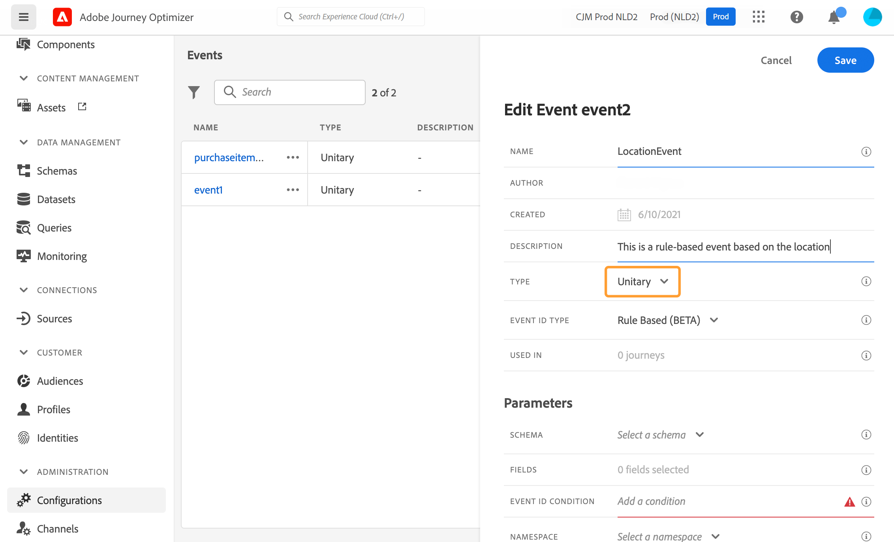
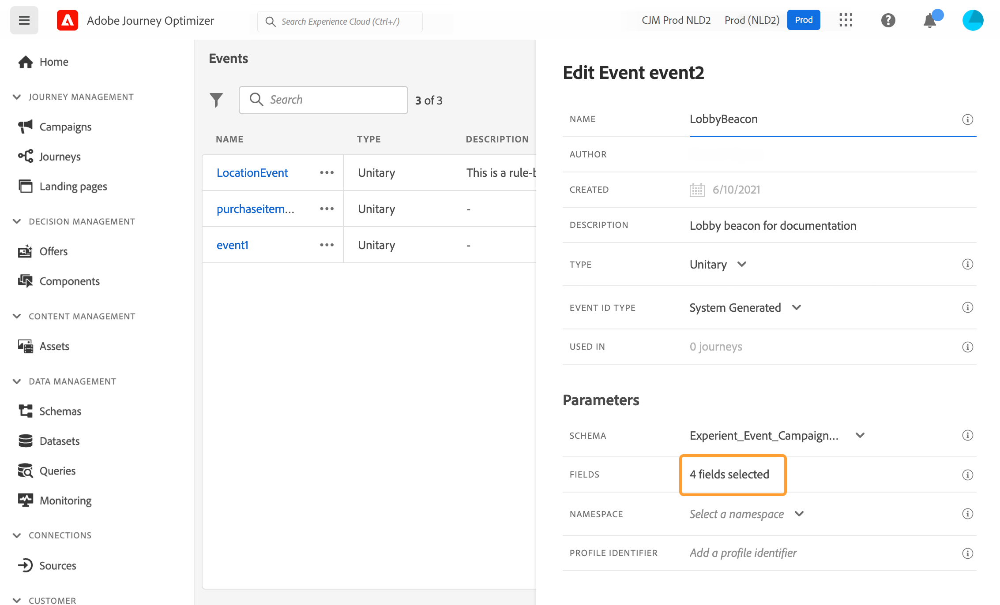

# Configurare un evento unitario {#configure-an-event}

Gli eventi unitari sono collegati a un profilo specifico. Possono essere basati su regole o generati dal sistema.  Ulteriori informazioni sull&#39;evento unitario [questa sezione](../event/about-events.md).

Di seguito sono riportati i primi passaggi per configurare un nuovo evento:

1. Nella sezione del menu AMMINISTRAZIONE, seleziona **[!UICONTROL Configurations]**. In  **[!UICONTROL Events]** sezione, fai clic su **[!UICONTROL Manage]**. Viene visualizzato l’elenco degli eventi.

   

1. Per creare un nuovo evento, fai clic su **[!UICONTROL Create Event]**. Il riquadro di configurazione dell’evento si apre sul lato destro dello schermo.

   

1. Inserisci il nome dell’evento. Puoi anche aggiungere una descrizione.

   

   >[!NOTE]
   >
   >Non utilizzare spazi o caratteri speciali. Non usare più di 30 caratteri.

1. In **[!UICONTROL Type]** campo, scegli **Unitario**.

   

1. In **[!UICONTROL Event ID type]** seleziona il tipo di ID evento da utilizzare: **Basato su regole** o **Sistema generato**. Ulteriori informazioni sui tipi di ID evento in [questa sezione](../event/about-events.md#event-id-type).

   

1. Il numero di percorsi che utilizzano questo evento viene visualizzato nel campo **[!UICONTROL Used in]**. Puoi fare clic sull’icona **[!UICONTROL View journeys]** per visualizzare l’elenco dei percorsi che utilizzano questo evento.

1. Definisci i campi dello schema e del payload: in questo punto è possibile selezionare le informazioni sull’evento (solitamente denominato payload) che i percorsi prevedono di ricevere. Potrai quindi utilizzare queste informazioni nel tuo percorso. Vedi [questa sezione](../event/about-creating.md#define-the-payload-fields).

   

   >[!NOTE]
   >
   >Quando selezioni la **[!UICONTROL System Generated]** sono disponibili solo gli schemi con il campo del tipo eventID. Quando selezioni la **[!UICONTROL Rule Based]** , tutti gli schemi Experience Event sono disponibili.

1. Per gli eventi basati su regole, fai clic all’interno del **[!UICONTROL Event ID condition]** campo . Utilizzando l’editor di espressioni semplici, definisci la condizione che verrà utilizzata dal sistema per identificare gli eventi che attiveranno il percorso.
   

   Nel nostro esempio, abbiamo scritto una condizione basata sulla città del profilo. Ciò significa che ogni volta che il sistema riceve un evento che corrisponde a questa condizione (**[!UICONTROL City]** campo e **[!UICONTROL Paris]** (Valore), lo trasmetterà ai percorsi.

   >[!NOTE]
   >
   >L’editor di espressioni avanzate non è disponibile quando si definisce il **[!UICONTROL Event ID condition]**. Nell’editor di espressioni semplici, non tutti gli operatori sono disponibili, dipendono dal tipo di dati. Ad esempio, per un tipo di stringa di campo, è possibile utilizzare &quot;contiene&quot; o &quot;uguale a&quot;.

1. Aggiungi uno spazio dei nomi. Questo passaggio è facoltativo ma consigliato, poiché l’aggiunta di uno spazio dei nomi consente di sfruttare le informazioni memorizzate nel servizio Profilo cliente in tempo reale, definendo il tipo di chiave di cui dispone l’evento. Vedi [questa sezione](../event/about-creating.md#select-the-namespace).
1. Definisci l’identificatore del profilo: scegli un campo dai campi payload o definisci una formula per identificare la persona associata all’evento. Se selezioni uno spazio dei nomi, questa chiave viene impostata automaticamente, ma può essere comunque modificata. In effetti, percorsi seleziona la chiave che deve corrispondere allo spazio dei nomi (ad esempio, se selezioni uno spazio dei nomi e-mail, verrà selezionata la chiave e-mail). Vedi [questa sezione](../event/about-creating.md#define-the-event-key).

   

1. Fai clic su **[!UICONTROL Save]**.

   L’evento è ora configurato e pronto per essere rilasciato in un percorso. Per poter ricevere gli eventi sono necessari ulteriori passaggi di configurazione. Consulta [questa pagina](../event/additional-steps-to-send-events-to-journey-orchestration.md).

## Definire i campi payload {#define-the-payload-fields}

La definizione del payload ti consente di scegliere le informazioni che il sistema prevede di ricevere dall’evento nel tuo percorso e la chiave per identificare quale persona è associata all’evento. Il payload si basa sulla definizione del campo XDM di Experience Cloud. Per ulteriori informazioni su XDM, consulta [Documentazione di Adobe Experience Platform](https://experienceleague.adobe.com/docs/experience-platform/xdm/home.html?lang=it){target=&quot;_blank&quot;}.

1. Seleziona uno schema XDM dall’elenco e fai clic sul pulsante **[!UICONTROL Fields]** o sul campo **[!UICONTROL Edit]** icona.

   

   Vengono visualizzati tutti i campi definiti nello schema. L’elenco dei campi varia da uno schema all’altro. È possibile cercare un campo specifico o utilizzare i filtri per visualizzare tutti i nodi e i campi o solo i campi selezionati. In base alla definizione dello schema, alcuni campi possono essere obbligatori e preselezionati. Non è possibile deselezionarli. Per impostazione predefinita, tutti i campi obbligatori affinché l’evento possa essere ricevuto correttamente dai percorsi sono selezionati.

   >[!NOTE]
   >
   >Per gli eventi generati dal sistema, assicurati di aver aggiunto il gruppo di campi &quot;orchestrazione&quot; allo schema XDM. Questo assicurerà che lo schema contenga tutte le informazioni necessarie con cui lavorare [!DNL Journey Optimizer].

   

1. Seleziona i campi che si prevede di ricevere dall’evento. Questi sono i campi che l&#39;utente aziendale sfrutterà nel percorso. Devono inoltre includere la chiave che verrà utilizzata per identificare la persona associata all’evento (vedi [questa sezione](../event/about-creating.md#define-the-event-key)).

   >[!NOTE]
   >
   >Per gli eventi generati dal sistema, la variabile **[!UICONTROL eventID]** viene aggiunto automaticamente nell’elenco dei campi selezionati in modo che [!DNL Journey Optimizer] può identificare l’evento. Il sistema che preme l’evento non deve generare un ID, ma deve utilizzare quello disponibile nell’anteprima del payload. Vedi [questa sezione](../event/about-creating.md#preview-the-payload).

1. Dopo aver selezionato i campi necessari, fai clic su **[!UICONTROL Ok]** o premere **[!UICONTROL Enter]**.

   Il numero di campi selezionati viene visualizzato nella sezione **[!UICONTROL Fields]** campo .

   

## Selezionare lo spazio dei nomi {#select-the-namespace}

Lo spazio dei nomi ti consente di definire il tipo di chiave utilizzata per identificare la persona associata all’evento. La configurazione è facoltativa. È necessario se desideri recuperare, nei tuoi percorsi, informazioni aggiuntive provenienti dalla [Profilo cliente in tempo reale](https://experienceleague.adobe.com/docs/experience-platform/profile/home.html?lang=it){target=&quot;_blank&quot;}. La definizione dello spazio dei nomi non è necessaria se utilizzi solo dati provenienti da un sistema di terze parti tramite un’origine dati personalizzata.

È possibile utilizzare uno dei predefiniti oppure crearne uno nuovo utilizzando il servizio Namespace Identity. Fai riferimento a [Documentazione di Adobe Experience Platform](https://experienceleague.adobe.com/docs/experience-platform/identity/home.html?lang=it){target=&quot;_blank&quot;}.

Se selezioni uno schema con un&#39;identità principale, la **[!UICONTROL Profiler identifier]** e **[!UICONTROL Namespace]** i campi sono precompilati. Se non è definita alcuna identità, selezioniamo _identityMap > id_ come chiave primaria. Quindi devi selezionare uno spazio dei nomi e la chiave verrà precompilata (sotto la **[!UICONTROL Namespace]** campo) utilizzando _identityMap > id_.

Durante la selezione dei campi, i campi di identità principali vengono contrassegnati con tag.

Seleziona uno spazio dei nomi dall’elenco a discesa.

È consentito un solo spazio dei nomi al percorso. Se utilizzi più eventi nello stesso percorso, devi utilizzare lo stesso namespace. Consulta [questa pagina](../building-journeys/journey.md).

## Definire l’identificatore del profilo {#define-the-event-key}

La chiave è il campo o la combinazione di campi che fa parte dei dati di payload dell’evento e che consentirà al sistema di identificare la persona associata all’evento. La chiave può essere, ad esempio, l&#39;ID Experience Cloud, un ID CRM o un indirizzo e-mail.

Se prevedi di sfruttare i dati memorizzati nel database Profilo cliente in tempo reale, devi selezionare, come chiave evento, le informazioni definite come identità di profilo nella [Servizio Profilo cliente in tempo reale](https://experienceleague.adobe.com/docs/experience-platform/profile/home.html){target=&quot;_blank&quot;}.

Consentirà al sistema di eseguire la riconciliazione tra l’evento e il profilo del singolo utente. Se selezioni uno schema con un&#39;identità principale, la **[!UICONTROL Profile identifier]** e **[!UICONTROL Namespace]** i campi sono precompilati. Se non è definita alcuna identità, selezioniamo _identityMap > id_ come chiave primaria. Quindi devi selezionare uno spazio dei nomi e la chiave verrà precompilata (sotto la **[!UICONTROL Namespace]** campo) utilizzando _identityMap > id_.

Durante la selezione dei campi, i campi di identità principali vengono contrassegnati con tag.

Se devi utilizzare una chiave diversa, ad esempio un ID CRM o un indirizzo e-mail, devi aggiungerla manualmente:

1. Fai clic all’interno del **[!UICONTROL Profile identifier]** o sull&#39;icona della matita.

   

1. Seleziona il campo scelto come chiave nell’elenco dei campi payload. Puoi anche passare all’editor di espressioni avanzate per creare chiavi più complesse (ad esempio, una concatenazione di due campi degli eventi). Vedi sotto, in questa sezione.

   

Quando l’evento viene ricevuto, il valore della chiave consentirà al sistema di identificare la persona associata all’evento. Associato a uno spazio dei nomi (consulta [questa sezione](../event/about-creating.md#select-the-namespace)), può essere utilizzata per eseguire query su Adobe Experience Platform. Consulta [questa pagina](../building-journeys/about-journey-activities.md#orchestration-activities).
La chiave viene utilizzata anche per verificare che una persona si trovi in un percorso. Infatti, una persona non può trovarsi in due luoghi diversi nello stesso percorso. Di conseguenza, il sistema non consente che la stessa chiave, ad esempio la chiave CRMID=3224, si trovi in luoghi diversi nello stesso percorso.

Puoi anche accedere alle funzioni di espressione avanzate (**[!UICONTROL Advanced mode]**) se desideri eseguire ulteriori manipolazioni. Queste funzioni consentono di manipolare i valori utilizzati per eseguire query specifiche, ad esempio la modifica dei formati, l’esecuzione di concatenazioni di campi, tenendo conto solo di una parte di un campo (ad esempio i 10 primi caratteri). Vedi [Documentazione del Journey Orchestration](../building-journeys/expression/expressionadvanced.md).

## Anteprima del payload {#preview-the-payload}

L’anteprima del payload ti consente di convalidare la definizione del payload.

>[!NOTE]
>
>Per gli eventi generati dal sistema, quando crei un evento, prima di visualizzare l’anteprima del payload, salva l’evento e riaprilo. Questo passaggio è necessario per generare un ID evento nel payload.

1. Fai clic sul pulsante **[!UICONTROL View Payload]** per visualizzare in anteprima il payload previsto dal sistema.

   

   I campi selezionati vengono visualizzati.

   

1. Seleziona l’anteprima per convalidare la definizione del payload.

1. Quindi, puoi condividere l’anteprima del payload con la persona responsabile dell’invio dell’evento. Questo payload può aiutarli a progettare la configurazione di un evento che invia a [!DNL Journey Optimizer]. Consulta [questa pagina](../event/additional-steps-to-send-events-to-journey-orchestration.md).
