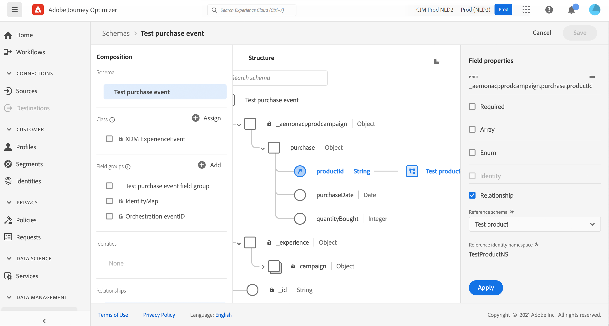
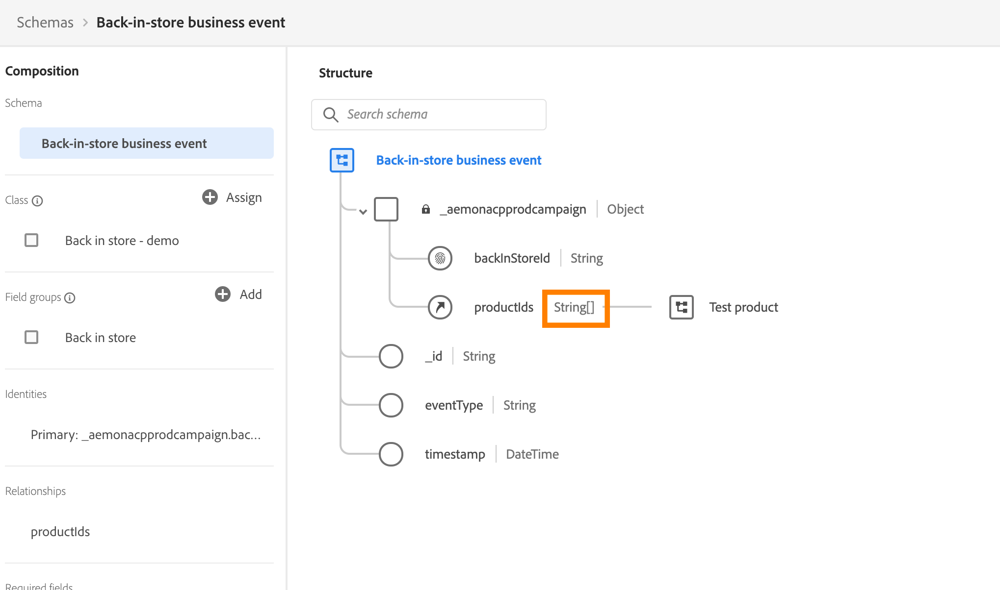

# Informazioni sugli schemi ExperienceEvent per [!DNL Journey Optimizer] eventi {#about-experienceevent-schemas}

[!DNL Journey Optimizer] eventi sono eventi esperienza XDM inviati a Adobe Experience Platform tramite Streaming Ingestion.

Un prerequisito importante per la configurazione degli eventi per [!DNL Journey Optimizer] è la conoscenza di Experience Data Model (o XDM) di Adobe Experience Platform, delle modalità di composizione degli schemi Experience Event XDM e del flusso di dati in formato XDM verso Adobe Experience Platform.

>[!CAUTION]
>
>Le ricerche di eventi di esperienza nelle condizioni di percorso non sono più supportate. Cerca best practice alternative qui. Se hai un caso di utilizzo di percorso attivato da un evento che necessita ancora della ricerca degli eventi esperienza e non può essere supportato tramite nessuna delle alternative elencate, contatta il tuo rappresentante Adobe e ti aiuteremo a raggiungere il tuo obiettivo.
>
>L’accesso al contesto dall’evento iniziale di un percorso non è interessato.

## Requisiti dello schema per [!DNL Journey Optimizer] eventi  {#schema-requirements}

Il primo passaggio nella configurazione di un evento per [!DNL Journey Optimizer] consiste nel verificare di disporre di uno schema XDM definito per rappresentare l&#39;evento e di un set di dati creato per registrare le istanze dell&#39;evento su Adobe Experience Platform. Disporre di un set di dati per gli eventi non è strettamente necessario, ma l’invio di eventi a un set di dati specifico ti consentirà di mantenere la cronologia degli eventi degli utenti per riferimenti e analisi futuri, quindi è sempre una buona idea. Se non disponi già di uno schema e di un set di dati appropriati per l’evento, entrambe queste attività possono essere eseguite nell’interfaccia web di Adobe Experience Platform.

Qualsiasi schema XDM che verrà utilizzato per gli eventi [!DNL Journey Optimizer] deve soddisfare i seguenti requisiti:

* Lo schema deve essere della classe ExperienceEvent XDM.

  

* Per gli eventi generati dal sistema, lo schema deve includere il gruppo di campi ID evento di orchestrazione. [!DNL Journey Optimizer] utilizza questo campo per identificare gli eventi utilizzati nei percorsi.

  

* Dichiara un campo di identità per identificare i singoli profili nell’evento. Se non viene specificata alcuna identità, è possibile utilizzare una mappa di identità. Queste operazioni non sono consigliate.

  

* Se desideri che questi dati siano disponibili per il profilo, contrassegna lo schema e il set di dati per il profilo. [Ulteriori informazioni](../data/lookup-aep-data.md)

  

  

* Puoi includere campi dati per acquisire altri dati contestuali che desideri includere con l’evento, ad esempio informazioni sull’utente, sul dispositivo da cui è stato generato l’evento, sulla posizione o su qualsiasi altra circostanza significativa correlata all’evento.

  

  

<!--
## Leverage schema relationships{#leverage_schema_relationships}

Adobe Experience Platform allows you to define relationships between schemas in order to use one dataset as a lookup table for another. 

Let's say your brand data model has a schema capturing purchases. You also have a schema for the product catalog. You can capture the product ID in the purchase schema and use a relationship to look up more complete product details from the product catalog. This allows you to create an audience for all customers who bought a laptop, for example, without having to explicitly list out all laptop IDs or capture every single product details in transactional systems.

To define a relationship, you need to have a dedicated field in the source schema, in this case the product ID field in the purchase schema. This field needs to reference the product ID field in the destination schema. The source and destination tables must be enabled for profiles and the destination schema must have that common field defined as its primary identity. 

Here is the product catalog schema enabled for profile with the product ID defined as the primary identity. 

Here is the purchase schema with the relationship defined on the product ID field.

>[!NOTE]
>
>Learn more about schema relationships in the [Experience Platform documentation](https://experienceleague.adobe.com/docs/platform-learn/tutorials/schemas/configure-relationships-between-schemas.html).

In Journey Optimizer, you can then leverage all the fields from the linked tables:

* when configuring a business or unitary event, [Read more](../event/experience-event-schema.md#unitary_event_configuration) 
* when using conditions in a journey, [Read more](../event/experience-event-schema.md#journey_conditions_using_event_context) 
* in message personalization, [Read more](../event/experience-event-schema.md#message_personalization) 
* in custom action personalization, [Read more](../event/experience-event-schema.md#custom_action_personalization_with_journey_event_context) 

### Arrays{#relationships_limitations}

You can define a schema relationship on an array of strings, for example, a list of product IDs.

You can also define a schema relationship with an attribute inside of an array of objects, for example a list of purchase information (product ID, product name, price, discount). The lookup values will be available in journeys (conditions, custom actions, etc.) and message personalization. 

### Event configuration{#unitary_event_configuration}

The linked schema fields are available in unitary and business event configuration:

* when browsing through the event schema fields in the event configuration screen.
* when defining a condition for system-generated events.

The linked fields are not available:

* in the event key formula
* in event id condition (rule-based events)

To learn how to configure a unitary event, refer to this [page](../event/about-creating.md).

### Journey conditions using event context{#journey_conditions_using_event_context}

You can use data from a lookup table linked to an event used in a journey for condition building (expression editor).

Add a condition in a journey, edit the expression and unfold the event node in the expression editor. 

To learn how to define journey conditions, refer to this [page](../building-journeys/condition-activity.md).

### Message personalization{#message_personalization}

The linked fields are available when personalizing a message. The related fields are displayed in the context passed from the journey to the message.

To learn how to personalize a message with contextual journey information, refer to this [page](../personalization/personalization-use-case.md).

### Custom action personalization with journey event context{#custom_action_personalization_with_journey_event_context}

The linked fields are available when configuring the action parameters of a journey custom action activity. 

To learn how to use custom actions, refer to this [page](../building-journeys/using-custom-actions.md).
-->
