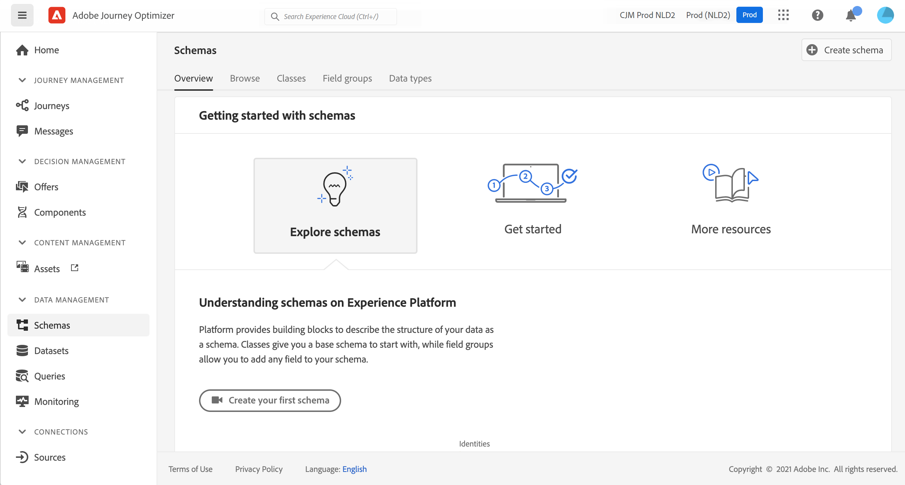
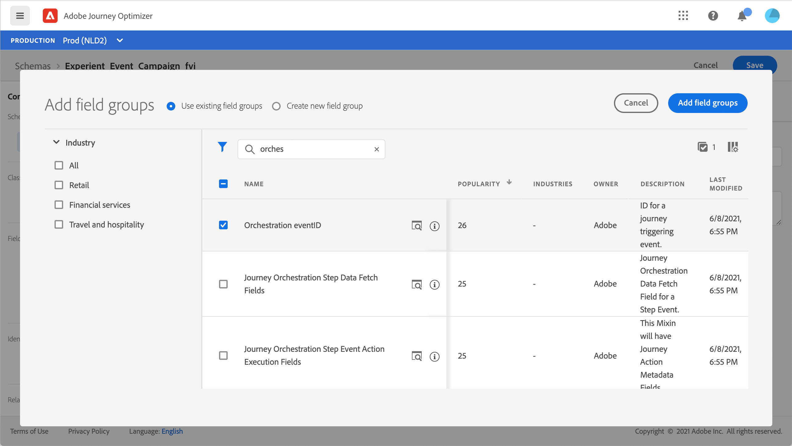
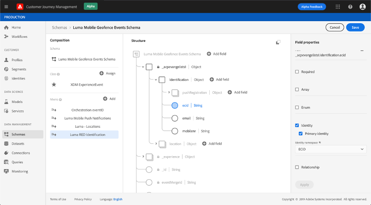
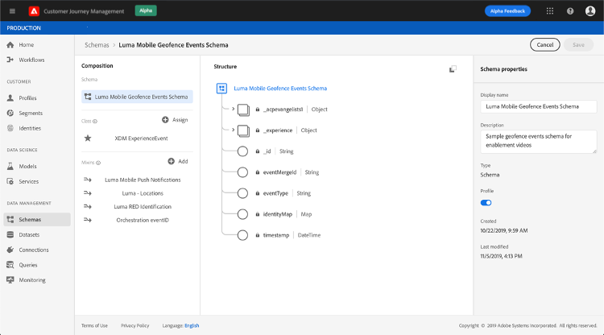
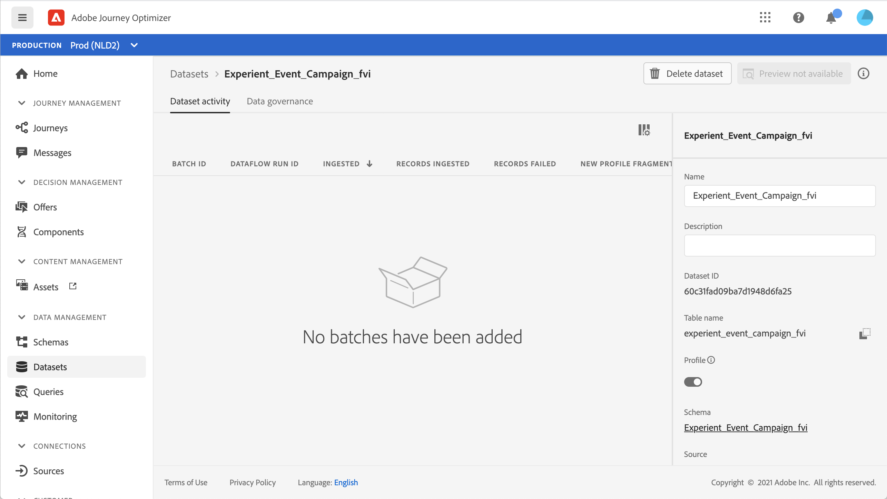
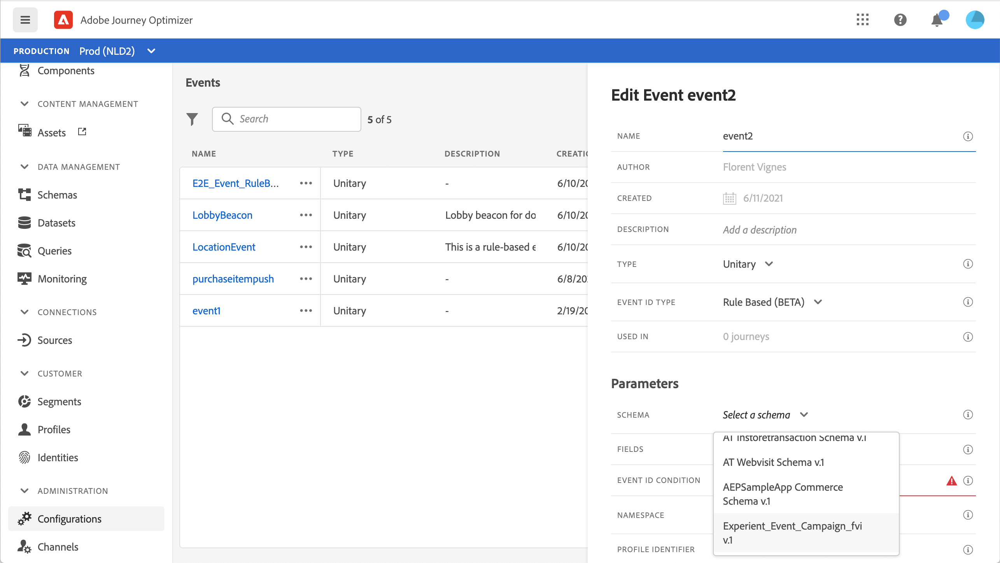

# Informazioni sugli schemi ExperienceEvent per gli eventi [!DNL Journey Optimizer]

[!DNL Journey Optimizer] Gli eventi sono eventi esperienza XDM che vengono inviati a Adobe Experience Platform tramite Streaming Ingestion.

Di conseguenza, un prerequisito importante per la configurazione degli eventi per [!DNL Journey Optimizer] è che tu abbia familiarità con Experience Data Model (o XDM) di Adobe Experience Platform e con la composizione degli schemi XDM Experience Event, nonché con la modalità di streaming dei dati in formato XDM in Adobe Experience Platform.

## Requisiti dello schema per gli eventi [!DNL Journey Optimizer]

Il primo passaggio nella configurazione di un evento per [!DNL Journey Optimizer] consiste nell&#39;assicurarsi di disporre di uno schema XDM definito per rappresentare l&#39;evento e di un set di dati creato per registrare le istanze dell&#39;evento in Adobe Experience Platform. Disporre di un set di dati per i tuoi eventi non è strettamente necessario, ma l’invio degli eventi a un set di dati specifico ti consentirà di mantenere la cronologia degli eventi degli utenti per riferimenti e analisi futuri, quindi è sempre una buona idea. Se non disponi già di uno schema e di un set di dati appropriati per l’evento, entrambe le attività possono essere eseguite nell’interfaccia Web di Adobe Experience Platform.

Qualsiasi schema XDM che verrà utilizzato per eventi [!DNL Journey Optimizer] deve soddisfare i seguenti requisiti:

* Lo schema deve essere della classe ExperienceEvent XDM.

   

* Per gli eventi generati dal sistema, lo schema deve includere il mixin eventID di Orchestration. [!DNL Journey Optimizer] utilizza questo campo per identificare gli eventi utilizzati nei percorsi.

   

* Dichiara un campo di identità per identificare l’oggetto dell’evento. Se non viene specificata alcuna identità, è possibile utilizzare una mappa di identità. Queste operazioni non sono consigliate.

   

* Se desideri che questi dati siano disponibili per la ricerca in un secondo momento in un Percorso, contrassegna lo schema e il set di dati per il profilo.

   

   

* Puoi includere campi di dati per acquisire altri dati contestuali da includere con l’evento, ad esempio informazioni sull’utente, il dispositivo da cui è stato generato l’evento, la posizione o qualsiasi altra circostanza significativa correlata all’evento.

   

   
