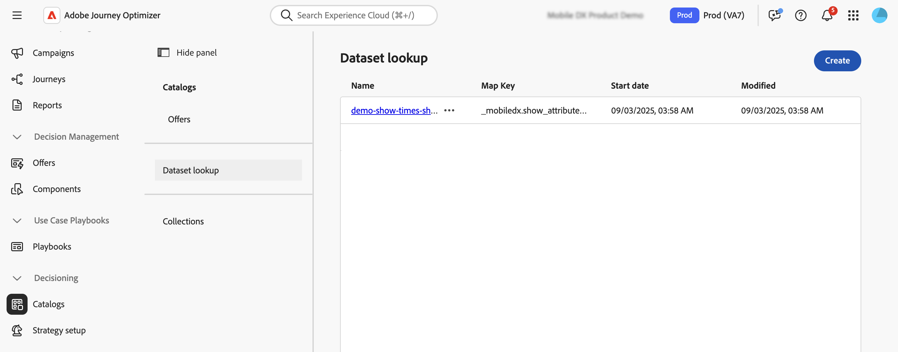

# Utilizzare i dati di Adobe Experience Platform per la funzione Decisioni {#aep-data}

>[!CONTEXTUALHELP]
>id="ajo_exd_catalogs_dataset"
>title="Ricerca nei set di dati"
>abstract="Per utilizzare gli attributi di Adobe Experience Platform per il decisioning, devi creare una mappatura per definire il modo in cui il set di dati di Adobe Experience Platform si unisce ai dati in [!DNL Journey Optimizer]."

>[!CONTEXTUALHELP]
>id="ajo_exd_catalogs_dataset_create"
>title="Ricerca nei set di dati"
>abstract="Seleziona il set di dati con gli attributi necessari tra tutti i set di dati Adobe Experience Platform abilitati per la ricerca, quindi seleziona una chiave di mappatura (ad esempio, numero di volo o ID cliente) presente sia negli attributi dell’elemento decisione sia nel set di dati."

>[!CONTEXTUALHELP]
>id="ajo_exd_rules_dataset_lookup"
>title="Ricerca nei set di dati"
>abstract="Seleziona il set di dati Adobe Experience Platform con gli attributi necessari. Se il set di dati non viene visualizzato nell’elenco, assicurati di averlo abilitato per la ricerca e di aver creato una mappatura di ricerca del set di dati."

>[!CONTEXTUALHELP]
>id="ajo_exd_formula_dataset_lookup"
>title="Ricerca nei set di dati"
>abstract="Utilizza gli attributi del set di dati [!DNL Adobe Experience Platform] per regolare dinamicamente la logica di classificazione per riflettere le condizioni reali. Fai clic su **[!UICONTROL Aggiungi set di dati]** per selezionare il set di dati Adobe Experience Platform con gli attributi necessari. Se il set di dati non viene visualizzato nell’elenco, assicurati di averlo abilitato per la ricerca e di aver creato una mappatura di ricerca del set di dati."

>[!CONTEXTUALHELP]
>id="ajo_exd_item_capping_dataset"
>title="Aggiungere set di dati"
>abstract="Utilizza gli attributi dei set di dati [!DNL Adobe Experience Platform] per definire i criteri di limitazione in base agli attributi dinamici esterni. Fai clic su **[!UICONTROL Aggiungi set di dati]** per selezionare il set di dati Adobe Experience Platform con gli attributi necessari. Se il set di dati non viene visualizzato nell’elenco, assicurati di averlo abilitato per la ricerca e di aver creato una mappatura di ricerca del set di dati."

[!DNL Journey Optimizer] consente di sfruttare i dati di [!DNL Adobe Experience Platform] per Decisioning. Questo consente di estendere la definizione degli attributi di decisione ai dati aggiuntivi nei set di dati per aggiornamenti in blocco che vengono modificati periodicamente senza dover aggiornare manualmente gli attributi uno alla volta. Ad esempio disponibilità, tempi di attesa e così via.

>[!AVAILABILITY]
>
>Questa funzione è attualmente disponibile per tutti i clienti come versione a disponibilità limitata.

## Guardrail e limitazioni {#guardrails}

* **Canali supportati** - La ricerca del set di dati con decisioni funziona attualmente per le azioni personalizzate E-mail e Percorso. <!--Support for code-based experience channels is coming soon.-->
* **Utilizzo attributo** - La funzionalità di ricerca del set di dati per il decisioning estende le definizioni degli elementi decisionali con attributi aggiuntivi, non estende gli attributi ai profili
* Limiti di ricerca: [!DNL Journey Optimizer] supporta fino a 1.000 ricerche per singolo criterio di decisione.

## Prerequisiti

### Abilita set di dati per la ricerca

Prima di iniziare, i set di dati necessari per le decisioni devono essere abilitati per la ricerca. Segui i passaggi descritti in questa sezione: [Usa dati Adobe Experience Platform](../data/lookup-aep-data.md).

### Creare mappature

Per utilizzare gli attributi di Adobe Experience Platform per il decisioning, è necessario creare una mappatura per definire il modo in cui il set di dati di Adobe Experience Platform si unisce ai dati in [!DNL Journey Optimizer]. Per farlo, segui questi passaggi:

1. Passa a **[!UICONTROL Cataloghi]** / **[!UICONTROL Ricerca set di dati]**, quindi fai clic su **[!UICONTROL Crea]**.

   

1. Configura la mappatura:

   1. Fare clic su **[!UICONTROL Seleziona set di dati]** per visualizzare tutti i set di dati Adobe Experience Platform abilitati per la ricerca. Seleziona il set di dati con gli attributi necessari.

   1. Fai clic su **[!UICONTROL Seleziona chiave]** per scegliere una chiave di unione (ad esempio, numero di volo o ID cliente) presente sia negli attributi dell&#39;elemento decisione che nel set di dati.

   

1. Fai clic su **[!UICONTROL Salva]**.

## Sfruttare i dati Adobe Experience Platform {#leverage-aep-data}

Una volta abilitato un set di dati per la ricerca e creati i mapping, puoi utilizzare i dati per arricchire la logica decisionale con dati esterni. Questa funzione è particolarmente utile per gli attributi che cambiano frequentemente, ad esempio la disponibilità del prodotto o il prezzo in tempo reale.

Gli attributi dei set di dati di Adobe Experience Platform possono essere utilizzati in due parti della logica decisionale:

* **Regole di decisione**: definire se un elemento di decisione è idoneo per la visualizzazione.
* **Classificazione delle formule**: assegnazione di priorità agli elementi decisionali in base a dati esterni.
* **Regole di limitazione**: utilizzare dati esterni per calcolare la soglia per le regole di limitazione.

Nelle sezioni successive viene illustrato come utilizzare i dati di Adobe Experience Platform in questi contesti.

### Regole di decisione {#rules}

L’utilizzo dei dati di Adobe Experience Platform nelle regole di decisione consente di definire criteri di idoneità in base ad attributi esterni dinamici, garantendo che gli elementi decisionali vengano visualizzati solo se pertinenti.

Supponiamo ad esempio che un retailer online desideri promuovere i prodotti consigliati in base all’inventario del negozio locale. Un prodotto può essere consigliato solo se è in stock nel luogo più vicino. In Adobe Experience Platform viene caricato un set di dati contenente gli aggiornamenti giornalieri dell’inventario. La logica della regola controlla se `inventory_count` per un determinato prodotto è maggiore di 0 per l&#39;archivio preferito del cliente. In tal caso, l’elemento decisionale è idoneo.

Per utilizzare i dati di Adobe Experience Platform nelle regole di decisione, effettua le seguenti operazioni:

1. Vai al menu **[!UICONTROL Imposta strategia]** / **[!UICONTROL Regole di decisione]** e seleziona **[!UICONTROL Crea regola con set di dati]**.

   

1. Fai clic su **[!UICONTROL Aggiungi set di dati]**, quindi seleziona il set di dati con gli attributi necessari.

   

1. Fai clic su **[!UICONTROL Continua]**. È ora possibile accedere agli attributi del set di dati nel menu **[!UICONTROL Ricerca set di dati]** e utilizzarli nelle condizioni della regola. [Scopri come creare una regola di decisione](../experience-decisioning/rules.md#create)

   

### Formule di classificazione {#ranking-formulas}

Le formule di classificazione definiscono la priorità degli elementi decisionali. Utilizzando gli attributi del set di dati [!DNL Adobe Experience Platform], puoi regolare dinamicamente la logica di classificazione per riflettere le condizioni del mondo reale.

Ad esempio, supponiamo che una compagnia aerea utilizzi una formula di classificazione per dare priorità alle offerte di aggiornamento. Se un cliente ha un livello di fedeltà elevato e la disponibilità corrente dei posti è bassa (in base a un set di dati aggiornato ogni ora), gli viene assegnata una priorità maggiore. Il set di dati include campi come `flight_number`, `available_seats` e `loyalty_score`.

Per utilizzare i dati di Adobe Experience Platform nelle formule di classificazione, effettua le seguenti operazioni:

1. Crea o modifica una formula di classificazione.

1. Nella sezione **[!UICONTROL Ricerca set di dati]** fare clic su **[!UICONTROL Aggiungi set di dati]**.

1. Seleziona il set di dati appropriato.

   

   >[!NOTE]
   >
   >Se il set di dati che stai cercando non viene visualizzato nell’elenco, assicurati di averlo abilitato per la ricerca e di aver creato una mappatura di ricerca per il set di dati. Per ulteriori dettagli, consulta la sezione [Prerequisiti](#prerequisites).

1. Utilizza i campi del set di dati per creare la formula di classificazione come di consueto. [Scopri come creare una formula di classificazione](ranking/ranking-formulas.md#create-ranking-formula)

   

### Regole di limitazione {#capping-rules}

Le regole di limite vengono utilizzate come vincoli per definire il numero massimo di volte in cui un elemento decisionale può essere presentato. L’utilizzo dei dati di Adobe Experience Platform nelle regole di limitazione consente di definire criteri di limitazione in base ad attributi dinamici esterni. A tale scopo, utilizza un’espressione nella regola di limitazione di utilizzo per calcolare la soglia di limitazione desiderata.

Ad esempio, un retailer potrebbe voler limitare un’offerta in base all’inventario dei prodotti in tempo reale. Invece di impostare una soglia fissa di 500, utilizzano un&#39;espressione che fa riferimento al campo `inventory_count` da un set di dati di Adobe Experience Platform. Se il set di dati mostra che restano in magazzino 275 articoli, l’offerta verrà consegnata solo fino a quel numero.

>[!NOTE]
>
>Le **espressioni** della regola di limitazione di utilizzo sono attualmente disponibili come funzionalità di disponibilità limitata per tutti gli utenti e sono supportate solo per il tipo di limite **[!UICONTROL In totale]**.

Per utilizzare i dati di Adobe Experience Platform nelle espressioni delle regole di limitazione di utilizzo, effettua le seguenti operazioni:

1. Crea o modifica un elemento di decisione.

1. Quando definisci l&#39;idoneità dell&#39;elemento, fai clic su **[!UICONTROL Aggiungi set di dati]** e seleziona il set di dati appropriato.

   

   >[!NOTE]
   >
   >Se il set di dati che stai cercando non viene visualizzato nell’elenco, assicurati di averlo abilitato per la ricerca e di aver creato una mappatura di ricerca per il set di dati. Per ulteriori dettagli, consulta la sezione [Prerequisiti](#prerequisites).

1. Seleziona il tipo di limite **[!UICONTROL In total]**, quindi abilita l&#39;opzione **[!UICONTROL Expression]**.

   

   >[!NOTE]
   >
   >Se il set di dati che stai cercando non viene visualizzato nell’elenco, assicurati di averlo abilitato per la ricerca e di aver creato una mappatura di ricerca per il set di dati. Per ulteriori dettagli, consulta la sezione [Prerequisiti](#prerequisites).

1. Modifica l’espressione e utilizza i campi del set di dati per generare l’espressione.

   

1. Completa la configurazione del limite e dell’elemento di decisione della regola come di consueto. [Scopri come impostare le regole di limitazione](../experience-decisioning/items.md#capping)
