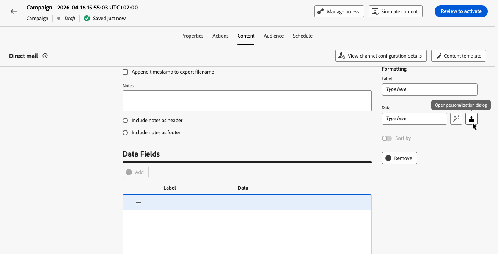
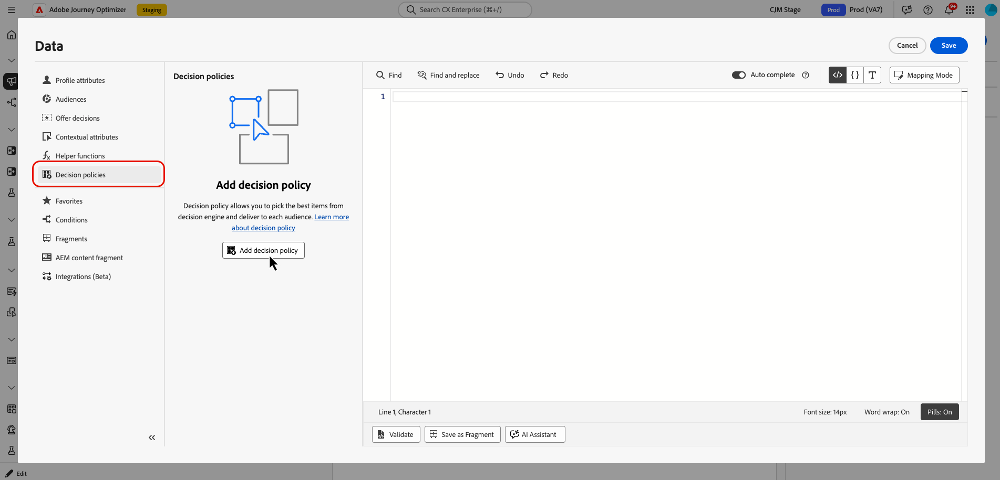

# Decisioning in batch nella direct mailing {#batch-decisioning-direct-mail}

Con le decisioni in batch, Decisioning seleziona l’elemento o gli elementi decisionali migliori per ciascun profilo e include tali risultati nel file di estrazione della direct mailing. È possibile restituire più elementi per profilo impostando **[!UICONTROL Numero di elementi]** durante la configurazione dei criteri di decisione. Il file esportato può essere utilizzato per la personalizzazione della direct mailing o per casi di utilizzo in batch in cui si esportano profili e attributi decisionali in un altro sistema.

Le decisioni in blocco nella direct mailing supportano due casi d’uso principali:

* **Direct mail con decisioning** - Personalizzazione della posta fisica per destinatario. Ad esempio, scegli l’immagine o l’offerta migliore per ciascun profilo utilizzando le regole di idoneità e la classificazione (priorità o formule). Il file di estrazione include i dati del profilo e gli attributi dell’elemento o degli elementi di decisione selezionati (ad esempio, l’URL dell’immagine dell’offerta) per il provider di direct mailing.
* **Esportazione in batch per i sistemi a valle** - Esporta i profili e i relativi risultati decisionali (ad esempio, ID offerta e attributi) da utilizzare in un altro sistema. Esegui le decisioni batch ed esporta il file sul server; gli strumenti a valle (ad esempio, un provider di servizi e-mail di terze parti) utilizzano tali dati per le proprie campagne o i propri processi.

>[!NOTE]
>
>Questa pagina si concentra sugli aspetti specifici di Decisioning dell’utilizzo delle decisioni in batch con la direct mailing. Per informazioni dettagliate sulla configurazione e l&#39;utilizzo del canale di direct mailing, inclusi l&#39;indirizzamento dei file, la configurazione del canale e la configurazione del file di estrazione, fare riferimento a [Introduzione alla direct mailing](../direct-mail/get-started-direct-mail.md) e [Creazione di un messaggio di direct mailing](../direct-mail/create-direct-mail.md).

## Panoramica del flusso di lavoro {#workflow}

1. **Creazione di una campagna o di un percorso di direct mailing**: creazione di un percorso o di una campagna, selezione dell&#39;azione **[!UICONTROL Direct mailing]**, scelta di una configurazione di direct mailing e definizione del pubblico.

   ➡️ [Scopri come creare un messaggio di direct mailing](../direct-mail/create-direct-mail.md)

1. **Aggiungi un criterio di decisione**:

   1. Fai clic su **[!UICONTROL Modifica contenuto]** per configurare il file di estrazione.
   1. Aggiungi una colonna al file di estrazione e apri l’editor di personalizzazione utilizzando l’icona .

      

   1. Passa al menu **[!UICONTROL Decisioning]** per creare un criterio di decisione. Nella configurazione dei criteri, imposta **[!UICONTROL Numero di elementi]** se hai bisogno di più di un elemento decisione per profilo, quindi configura la strategia di selezione e il fallback facoltativo.

      

   ➡️ [Scopri come aggiungere e configurare un criterio di decisione nella direct mailing](create-decision-policy.md#add)

1. **Personalizza il file di direct mailing con gli attributi di decisione**: per le colonne che devono contenere il risultato della decisione, apri l&#39;editor di Personalization, passa a **[!UICONTROL Criteri di decisione]** e seleziona **[!UICONTROL Inserisci criterio]** per aggiungere il codice per il criterio di decisione.

   Utilizza gli attributi restituiti dell’elemento di decisione in modo che le informazioni sull’offerta selezionata vengano incluse nel file di estrazione per ciascun profilo. Quando vengono restituiti più elementi, mappare gli attributi di ciascun elemento nelle colonne utilizzando il ciclo `#each` dei criteri.

   ➡️ [Scopri come utilizzare i criteri di decisione nei messaggi - Scheda direct mailing](use-decision-policy.md)

1. Utilizza **[!UICONTROL Simula contenuto]** con un profilo di test per visualizzare in anteprima la riga esportata (incluso il valore di decisioning).

   

   ➡️ [Scopri come visualizzare in anteprima e testare il tuo contenuto](../content-management/preview-test.md)

1. Attiva la campagna o pubblica il percorso per generare ed esportare il file (CSV o delimitato da testo) nel server configurato.

   ➡️ [Scopri come rivedere e attivare una campagna](../campaigns/review-activate-campaign.md) | [Scopri come pubblicare un percorso](../building-journeys/publish-journey.md)

## Esempio di direct mailing e decisioni {#example-direct-mail}

Esempio: un retailer fitness invia una cartolina personalizzata a ogni cliente con una delle dieci possibili immagini. Utilizzano Decisioning per scegliere l’immagine migliore per profilo.

1. Crea 10 elementi decisionali (uno per immagine), ciascuno con regole di idoneità (ad esempio, età, genere).
2. Aggiungili a una raccolta e crea una strategia di selezione con un metodo di classificazione (ad esempio, priorità manuale o formula).
3. In una campagna o in un percorso di direct mailing, abilita il processo decisionale e aggiungi un criterio di decisione che utilizza questa strategia di selezione.
4. Nel file di estrazione, aggiungi una colonna i cui dati siano l’attributo dell’elemento di decisione che contiene l’immagine scelta (ad esempio, URL dell’immagine dell’offerta). Altre colonne possono essere nome completo, indirizzo, stato, CAP e così via.
5. Durante l’esecuzione della campagna, a ciascun profilo viene assegnata una riga nell’esportazione con l’immagine selezionata per quel profilo. Il provider di direct mailing utilizza questo file per produrre la posta fisica.

È possibile utilizzare **[!UICONTROL Simulare contenuto]** con un profilo di test per visualizzare il risultato del decisioning (ad esempio, l&#39;immagine) che verrebbe esportato per tale profilo.

## Caso di utilizzo: esportazione in batch (middleware) {#example-batch-export}

Alcuni clienti utilizzano il decisioning in batch per esportare i profili e i relativi risultati decisionali da utilizzare in altri sistemi (ad esempio, un CRM o un provider di servizi e-mail). Il flusso è:

1. Configura la direct mailing (indirizzamento dei file e configurazione del canale) come indicato sopra.
2. Crea una campagna o un percorso di direct mailing e aggiungi un criterio di decisione.
3. Aggiungi colonne per i campi del profilo e per gli attributi dell’elemento decisione necessari nell’esportazione.
4. Attiva la campagna. Il file viene esportato sul server (ad esempio, Amazon S3 o SFTP).
5. Il sistema a valle recupera il file e utilizza i dati di profilo e decisioning per le proprie campagne o i propri processi.

Questo supporta i casi di utilizzo delle decisioni in batch tramite il canale direct mailing con Experience Decisioning.

## Documentazione correlata {#related}

* [Crea un messaggio di direct mailing](../direct-mail/create-direct-mail.md) - Configura il file di estrazione e abilita le decisioni
* [Crea criteri di decisione](create-decision-policy.md#add) - Aggiungi un criterio di decisione nella scheda Direct Mail
* [Configurazione direct mail](../direct-mail/direct-mail-configuration.md) - Indirizzamento dei file e configurazione dei canali
* [Introduzione a Decisioning](gs-experience-decisioning.md) - Concetti e guardrail
