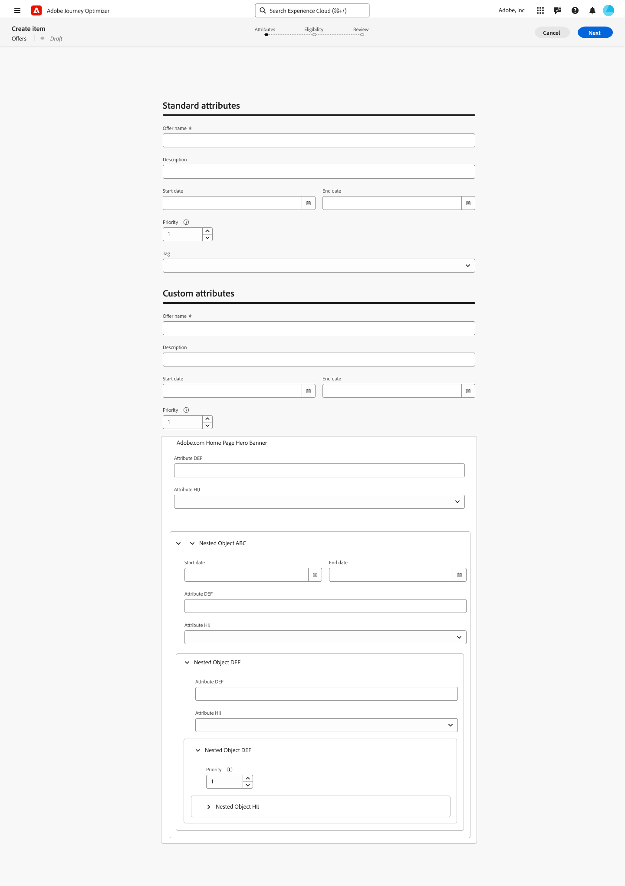

# Configurare il catalogo degli elementi {#catalog}

>[!CONTEXTUALHELP]
>id="ajo_exd_item_custom_attributes"
>title="Definire gli attributi personalizzati"
>abstract="Gli attributi personalizzati sono attributi specifici personalizzati in base alle proprie esigenze, che si possono assegnare a un elemento decisionale. Vengono create nello schema di catalogo degli elementi decisionali."

In Decisioning, i cataloghi fungono da contenitori centrali per l’organizzazione degli elementi decisionali. Ogni catalogo è collegato a uno schema Adobe Experience Platform, che include tutti gli attributi assegnabili a un elemento decisionale.

Per il momento, tutti gli elementi decisionali creati sono consolidati in un unico catalogo &quot;Offerte&quot;, accessibile tramite il menu **[!UICONTROL Cataloghi]**.

## Guardrail e limitazioni

Per garantire prestazioni e coerenza ottimali, Decisioning applica i seguenti guardrail e limitazioni:

* **Tipi di dati supportati**

  Per il momento, Decisioning supporta esclusivamente i seguenti tipi di dati: String, Integer, Boolean, Date, DateTime, Decisioning Asset e Object. Eventuali campi che non rientrano in questi tipi di dati non saranno disponibili per l’utilizzo durante la creazione di un elemento decisionale o di un catalogo.

* **Limite attributo personalizzato**

  Ogni elemento decisionale può includere fino a 100 attributi personalizzati.

* **Limitazioni di nidificazione**

  È supportato un massimo di quattro livelli di nidificazione. Le immagini non sono supportate all&#39;ultimo livello.

## Accedere e modificare lo schema del catalogo {#access-catalog-schema}

Per accedere allo schema del catalogo in cui sono memorizzati gli attributi degli elementi decisionali, effettua le seguenti operazioni:

1. Nell&#39;elenco degli elementi fare clic sul pulsante **[!UICONTROL Modifica schema]** accanto al pulsante **[!UICONTROL Crea elemento]**.

1. Lo schema del catalogo viene aperto in una nuova scheda, seguendo la struttura riportata di seguito:

   * Il nodo **`_experience`** include attributi di elementi decisionali standard quali nome, data di inizio e di fine e descrizione.
   * Il nodo **`_<imsOrg>`** ospita gli attributi degli elementi decisionali personalizzati, dove `<imsOrg>` viene sostituito dal nome dell’organizzazione (ad esempio, `_luma` per la società Luma). Per impostazione predefinita, non sono configurati attributi personalizzati, ma puoi aggiungerne quanti ne servono in base alle tue esigenze. Al termine, gli attributi personalizzati vengono visualizzati nella schermata di creazione dell’elemento decisionale insieme agli attributi standard.

   

1. Per aggiungere un attributo personalizzato allo schema, espandi il nodo dell&#39;organizzazione (ad esempio, **`_luma`**) e fai clic sul pulsante &quot;+&quot; nella posizione desiderata nella struttura.

   

1. Compila i campi necessari per l&#39;attributo aggiunto e fai clic su **[!UICONTROL Applica]**.

   Il valore immesso in un attributo con l’attributo di risorsa decisioning è un URL pubblico. Nella maggior parte dei casi, questo richiama un’immagine.

   Informazioni dettagliate su come utilizzare gli schemi di Adobe Experience Platform sono disponibili nella [documentazione del sistema XDM](https://experienceleague.adobe.com/docs/experience-platform/xdm/ui/overview.html?lang=it).

1. Una volta aggiunti gli attributi personalizzati desiderati, salva lo schema. Il nuovo campo è ora disponibile nella schermata di creazione dell&#39;elemento di decisione, nella sezione **[!UICONTROL Attributi personalizzati]**.

   L’esempio seguente mostra una schermata di creazione dell’elemento con attributi personalizzati, come oggetti definiti nello schema.

   

