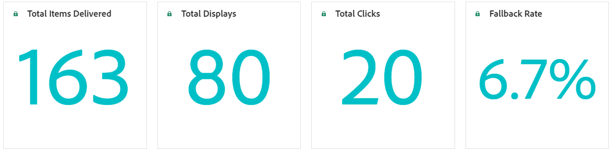
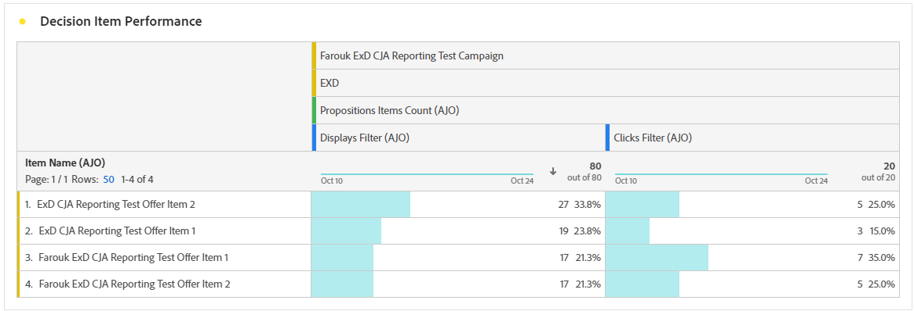

# Rapporto sulla funzione Decisioni {#decisioning-report}

## Reporting sulle decisioni {#campaigns}

Una volta che le esperienze basate su codice o le e-mail con strategie di selezione sono live, puoi accedere a rapporti dedicati per monitorare gli indicatori prestazioni chiave (KPI, Key Performance Indicators) di Decisioning.

<!--Once code-based experiences are live, you can access dedicated reports to monitor Key Performance Indicators (KPIs) as an all-encompassing dashboard, delivering an analysis of essential metrics associated with your campaign.

This encompasses details related to the decision items performances and how users interacted with them. [Learn how to work with Code-based experience reports](../reports/campaign-global-report-cja-code.md)-->

Puoi anche accedere ai dettagli relativi alle prestazioni degli elementi decisionali e al modo in cui gli utenti hanno interagito con loro, fornendo un’analisi delle metriche essenziali associate alla campagna.

Scopri come utilizzare i rapporti di esperienza basati su codice su Decisioning in [questa sezione](../reports/campaign-global-report-cja-code.md#decisioning-reporting).

## Generazione di rapporti in Customer Journey Analytics {#cja}

Se utilizzi Customer Journey Analytics, puoi creare dashboard di reporting personalizzati per le campagne basate su codice utilizzando Decisioning.

I passaggi principali sono elencati di seguito. Informazioni dettagliate su come lavorare con Customer Journey Analytics sono disponibili nella [documentazione di Customer Journey Analytics](https://experienceleague.adobe.com/it/docs/analytics-platform/using/cja-landing){target="_blank"}.

1. Crea e configura una **connessione** in Customer Journey Analytics. Questo ti consente di connettersi al set di dati per il quale desideri creare rapporti. [Scopri come creare una connessione](https://experienceleague.adobe.com/it/docs/analytics-platform/using/cja-connections/create-connection){target="_blank"}

1. Crea una **visualizzazione dati** e associala alla connessione creata in precedenza. Nella scheda **[!UICONTROL Componenti]**, scegli i campi dello schema che desideri visualizzare nel reporting. Per Decisioning, assicurati di includere i campi **propositioninteract** e **propositiondisplay**. [Scopri come creare e configurare le visualizzazioni dati](https://experienceleague.adobe.com/it/docs/analytics-platform/using/cja-dataviews/create-dataview){target="_blank"}

1. Combina componenti dati, tabelle e visualizzazioni in **progetti Workspace** per creare e condividere report per la campagna basata su codice. [Scopri come creare progetti Workspace](https://experienceleague.adobe.com/it/docs/analytics-platform/using/cja-workspace/build-workspace-project/create-projects){target="_blank"}
