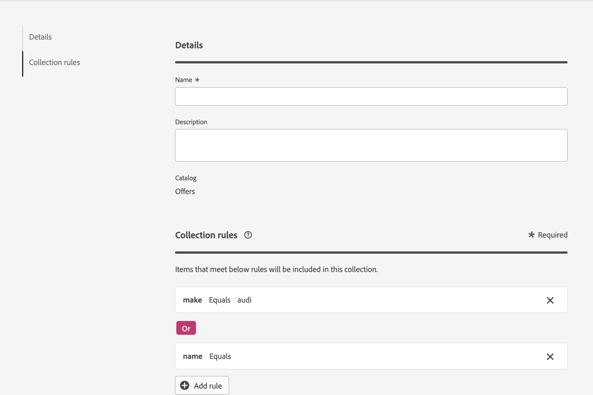

# Raccolte {#collections}

>[!CONTEXTUALHELP]
>id="ajo_exd_item_collections"
>title="Creare le raccolte"
>abstract="Le raccolte consentono di categorizzare e raggruppare gli elementi decisionali in base alle preferenze. Queste categorie vengono create creando regole che sfruttano gli attributi degli elementi decisionali."

>[!CONTEXTUALHELP]
>id="ajo_exd_item_collection_rules"
>title="Definire le regole per la raccolta"
>abstract="Aggiungi una o più regole per determinare gli elementi da includere nella raccolta. Scegli un attributo di elemento da utilizzare come criterio. Seleziona l’operatore desiderato e inserisci il valore da usare come filtro. Aggiungi tutte le regole necessarie."

>[!CONTEXTUALHELP]
>id="ajo_exd_strategy_collection"
>title="Scegli una raccolta"
>abstract="Seleziona la raccolta contenente le offerte da considerare. Questo passaggio è obbligatorio durante la creazione di una strategia di selezione. Le raccolte consentono di categorizzare e raggruppare gli elementi decisionali in base alle preferenze. Ad esempio, puoi creare una raccolta che includa tutti gli elementi decisionali con il valore “Yoga” nell’attributo personalizzato “Categoria”."

Le raccolte consentono di categorizzare e raggruppare gli elementi decisionali in base alle preferenze. Queste categorie vengono create creando regole che sfruttano gli attributi degli elementi decisionali.

Ad esempio, supponiamo che tu abbia aggiunto un attributo personalizzato &quot;Categoria&quot; allo schema del catalogo degli elementi decisionali. Questo consente di creare una raccolta che include tutti gli elementi decisionali con il valore &quot;Yoga&quot; nell’attributo &quot;Category&quot;.

L&#39;elenco delle raccolte è accessibile dal menu **[!UICONTROL Cataloghi]**.

Per creare una raccolta, effettua le seguenti operazioni:

1. Passa a **[!UICONTROL Cataloghi]** > **[!UICONTROL Raccolte]** e fai clic su **[!UICONTROL Crea raccolta]**.
1. Fornisci un nome e una descrizione per la raccolta.
1. Aggiungi una o più regole per determinare gli elementi da includere nella raccolta. Per eseguire questa operazione:

   1. Scegli un attributo di elemento da utilizzare come criterio. L’elenco degli attributi include tutti gli attributi standard e personalizzati definiti nello schema del catalogo. [Ulteriori informazioni sul catalogo degli elementi](catalogs.md)
   1. Seleziona l’operatore desiderato e inserisci il valore su cui filtrare.filtra esplicitamente il nome di ogni offerta, oppure crea e assegna un tag &quot;luma-summer&quot; a ogni offerta.

      >[!NOTE]
      >
      >L&#39;operatore **CONTAINS** non supporta corrispondenze parziali o con caratteri jolly. Funziona come un operatore **IN**, il che significa che devi fornire una matrice di valori esatti per l&#39;attributo.
      >
      >Ad esempio, supponiamo che tu abbia più offerte estive da includere in una raccolta: *&quot;luma-summer-yoga&quot;*, *&quot;luma-summer-fitness&quot;* e *&quot;luma-summer-running&quot;*. Per includere questi elementi, devi definire una regola come &quot;Nome offerta&quot; CONTIENE &quot;luma-estate-yoga&quot;, &quot;luma-estate-fitness&quot;, &quot;luma-estate-running&quot;. Questa regola restituisce solo le offerte che corrispondono esattamente a uno dei nomi nell’elenco.
      >
      >Se hai bisogno di una corrispondenza parziale (ad esempio, tutte le offerte contenenti *&quot;luma-summer&quot;*), questa non è attualmente supportata. È necessario specificare esplicitamente ogni nome di offerta oppure assegnare un tag *&quot;luma-summer&quot;* a ogni offerta e utilizzare tale tag nella regola.

   1. Ripeti questi passaggi per aggiungere tutte le regole necessarie. Quando si aggiungono più regole, è possibile scegliere tra gli operatori **And** e **Or** per combinarli. A questo scopo, fai clic sul badge dell’operatore per passare da una scelta all’altra.
   1. Fare clic sul pulsante **[!UICONTROL Anteprima raccolta]** per visualizzare gli elementi che soddisfano le regole definite.

   

1. Una volta definite le regole di raccolta, fare clic su **[!UICONTROL Crea]**. La raccolta viene ora visualizzata nell’elenco.

>[!NOTE]
>
>Ogni raccolta di elementi può contenere fino a 500 elementi di offerta. [Ulteriori informazioni su guardrail e limitazioni di Decisioning](gs-experience-decisioning.md#guardrails)
