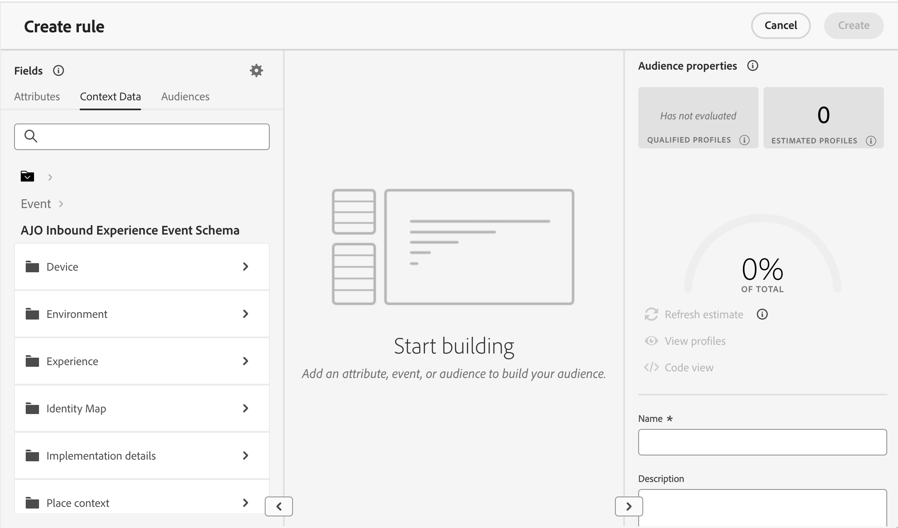
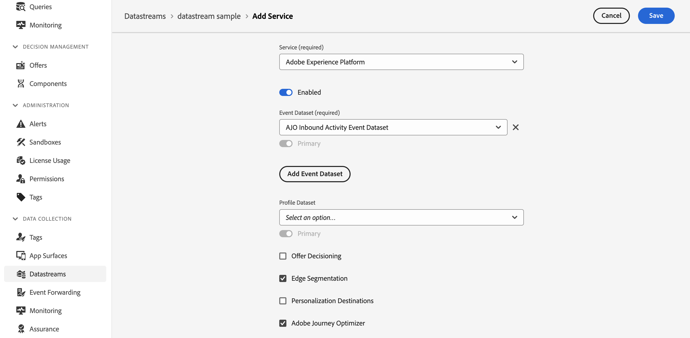

# Sfruttare i dati contestuali nelle decisioni {#context}

Decisioning consente di sfruttare qualsiasi informazione disponibile in Adobe Experience Platform per eseguire varie azioni, ad esempio la creazione di [regole di decisione](rules.md) o di [formule di classificazione](ranking/ranking.md).

Ad esempio, puoi progettare una regola di decisione che richiede che il tempo corrente sia di ≥80 gradi al momento della richiesta di decisione.

>[!NOTE]
>
>I dati contestuali sono definiti in Adobe Experience Platform e vengono inviati al momento di una richiesta di decisione. Non include dati storici.

Per utilizzare i dati contestuali, devi innanzitutto definire i dati che desideri rendere disponibili in Decisioning. Al termine, questi dati si integrano perfettamente in Decisioning nella scheda **[!UICONTROL Dati contestuali]** disponibile durante la creazione di una regola di decisione. Puoi anche sfruttare i dati quando modifichi una formula di classificazione.

I passaggi per alimentare Decisioning con i dati di Adobe Experience Platform sono i seguenti:

1. Crea uno **schema evento esperienza** in Adobe Experience Platform e il relativo **set di dati** associato. [Scopri come creare schemi](https://experienceleague.adobe.com/en/docs/experience-platform/xdm/ui/resources/schemas){target="_blank"}

1. Crea un nuovo flusso di dati Adobe Experience Platform:

   1. Passa al menu **[!UICONTROL Datastreams]** e seleziona **[!UICONTROL New Datastream]**.

   1. Nell&#39;elenco a discesa **[!UICONTROL Schema evento]**, seleziona lo schema evento esperienza creato in precedenza e fai clic su **[!UICONTROL Salva]**.

      

   1. Fare clic su **[!UICONTROL Aggiungi servizio]** e selezionare &quot;Adobe Experience Platform&quot; come servizio. Nell&#39;elenco a discesa **[!UICONTROL Set di dati evento]** selezionare il set di dati evento creato in precedenza e abilitare l&#39;opzione **[!UICONTROL Adobe Journey Optimizer]**.

      

Una volta salvato lo stream di dati, le informazioni del set di dati selezionato vengono recuperate automaticamente e integrate in Decisioning, diventando in genere disponibili entro circa 24 ore.

Per ulteriori informazioni su come lavorare con Adobe Experience Platform, consulta le risorse seguenti:

* [Schemi Experience Data Model (XDM)](https://experienceleague.adobe.com/en/docs/experience-platform/xdm/schema/composition){target="_blank"}
* [Set di dati](https://experienceleague.adobe.com/en/docs/experience-platform/catalog/datasets/overview){target="_blank"}
* [Stream di dati](https://experienceleague.adobe.com/en/docs/experience-platform/datastreams/overview){target="_blank"}
