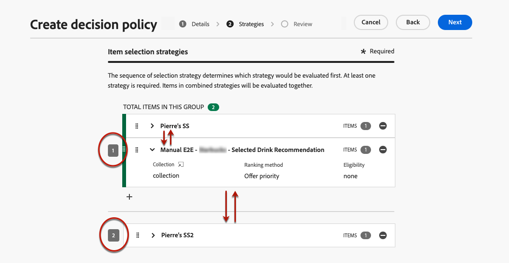
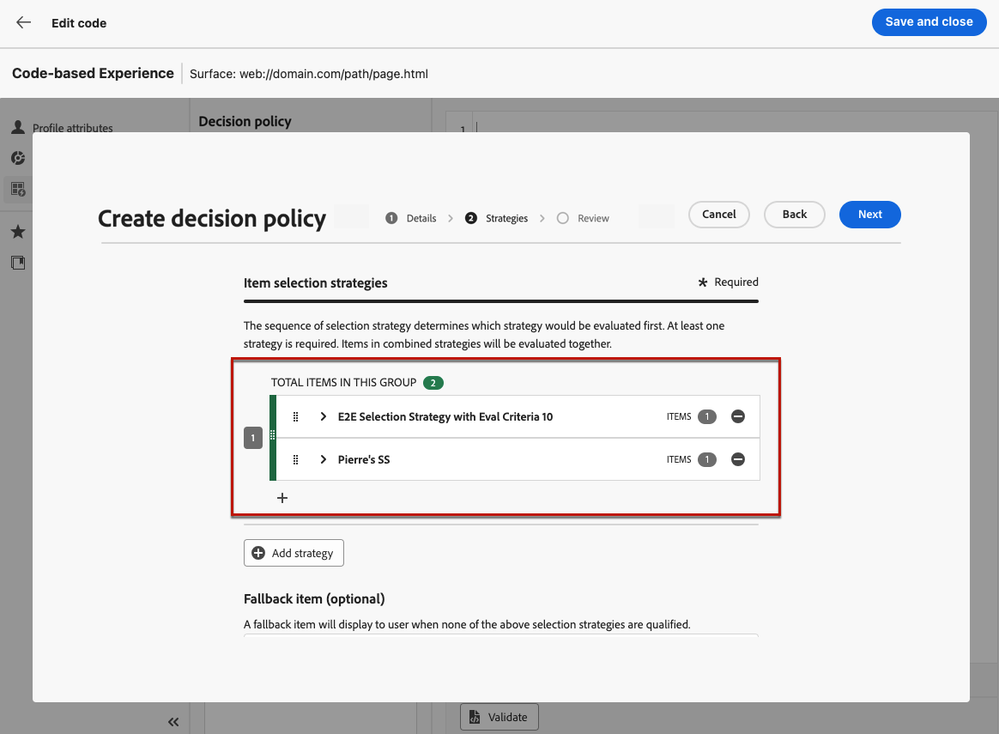

# Creare criteri di decisione {#create-decision}

>[!CONTEXTUALHELP]
>id="ajo_code_based_item_number"
>title="Definire il numero di elementi da restituire"
>abstract="Seleziona il numero di elementi decisionali che desideri restituire. Ad esempio, se selezioni 2, verranno presentate le 2 offerte idonee migliori per la configurazione corrente."

>[!CONTEXTUALHELP]
>id="ajo_code_based_fallback"
>title="Selezionare un fallback"
>abstract="L’utente visualizza un elemento di fallback quando nessuna delle strategie di selezione definite per tale criterio decisionale è qualificata."

>[!CONTEXTUALHELP]
>id="ajo_code_based_strategy"
>title="Che cos’è una strategia?"
>abstract="La sequenza della strategia di selezione determina quale strategia verrà valutata per prima. È necessaria almeno una strategia. Gli elementi decisionali nelle strategie combinate saranno valutati insieme."
>additional-url="https://experienceleague.adobe.com/it/docs/journey-optimizer/using/decisioning/offer-decisioning/get-started-decision/starting-offer-decisioning" text="Creare strategie"

Per presentare ai clienti l’offerta e l’esperienza dinamica migliore, aggiungi un criterio di decisione al contenuto di una campagna o di un percorso, quindi configura gli elementi da restituire e la strategia di selezione da utilizzare. A questo scopo, segui i passaggi riportati qui sotto:

1. [Aggiungi un criterio di decisione](#add) - Dall&#39;editor di Personalization o dal Designer di posta elettronica.
1. [Configura il criterio di decisione](#configurre). Aggiungere un nome e specificare il numero di elementi da restituire.
1. [Imposta una sequenza strategica](#strategy) - Seleziona gli elementi da restituire con il criterio di decisione.
1. [Seleziona offerte di fallback](#fallback) (facoltativo): seleziona gli elementi da visualizzare se non sono stati qualificati elementi o strategie di selezione.
1. [Rivedi e salva](#review) la strategia di selezione

>[!AVAILABILITY]
>
>Per il momento, i criteri decisionali sono disponibili per tutti i clienti per il canale **Esperienza basata su codice**. Sono disponibili per il canale **E-mail** come disponibilità limitata. Per ottenere l’accesso, contatta il rappresentante Adobe.

## Aggiungere un criterio di decisione {#add}

1. Apri un percorso o una campagna, seleziona un&#39;[azione canale](../building-journeys/journeys-message.md) e modifica il contenuto del messaggio.

1. Per le e-mail, attiva l&#39;opzione **[!UICONTROL Abilita decisioning]**.

   

   >[!IMPORTANT]
   >
   >L’abilitazione del decisioning cancella il contenuto delle e-mail esistenti. Se hai già progettato l’e-mail, assicurati di salvare preventivamente il contenuto come modello.
   >
   >Eventuali criteri di decisione configurati all’interno dell’e-mail non verranno salvati nel modello. Se applichi il modello a un’altra e-mail, devi riconfigurare il criterio.

1. Apri l&#39;**editor di personalizzazione** per creare il criterio di decisione. Per le e-mail, puoi anche utilizzare un menu dedicato nella **Finestra di progettazione e-mail** per creare un criterio di decisione. Espandi le sezioni seguenti per esplorare i due metodi.

   +++Creare un criterio di decisione dall’editor di Personalization

   1. Apri l&#39;editor di personalizzazione e seleziona **[!UICONTROL Criteri di decisione]**.
   1. Fare clic sul pulsante **[!UICONTROL Aggiungi criterio di decisione]** per creare un nuovo criterio.

      

   +++

   +++Creare un criterio di decisione da E-mail Designer

   Seleziona un componente nel contenuto dell&#39;e-mail, fai clic sull&#39;icona **[!UICONTROL Decisioning]** nella barra degli strumenti o nel riquadro delle proprietà, quindi seleziona **[!UICONTROL Aggiungi nuovo criterio]**.

   L&#39;**[!UICONTROL Output decisione di riutilizzo]** consente di riutilizzare un criterio di decisione già creato in questa e-mail.

   

   +++

## Configurare il criterio di decisione {#configure}

Dopo aver aggiunto un nuovo criterio di decisione al contenuto, viene visualizzata la schermata di configurazione del criterio di decisione.

1. Specifica un nome per il criterio di decisione e seleziona un catalogo (attualmente limitato al catalogo predefinito **[!UICONTROL Offerte]**).

1. Seleziona il numero di elementi da restituire. Ad esempio, se selezioni 2, verranno presentate le 2 offerte idonee migliori per la configurazione corrente.

   

   Per il canale e-mail, il campo **[!UICONTROL Numero di elementi]** è impostato su 1 per impostazione predefinita e non può essere modificato a meno che il criterio di decisione non venga aggiunto da un componente **[!UICONTROL Ripeti griglia]**. Per ulteriori informazioni, espandi la sezione seguente:

   +++Restituire più elementi decisionali nelle e-mail utilizzando un componente **[!UICONTROL Ripeti griglia]**

   1. Trascina un componente **[!UICONTROL Ripeti griglia]** nell&#39;e-mail e configuralo come desiderato utilizzando il riquadro **[!UICONTROL Impostazioni]**.

      

   1. Fai clic sull&#39;icona **[!UICONTROL Decisioning]** nella barra degli strumenti dell&#39;area di lavoro oppure apri il riquadro **[!UICONTROL Decisioning]** e seleziona **[!UICONTROL Aggiungi criterio di decisione]**.

   1. Specifica il numero di elementi da restituire nel campo **[!UICONTROL Numero di elementi]**, quindi configura il criterio di decisione come documentato di seguito. Il numero massimo di elementi selezionabili è limitato dal numero di riquadri definito nel componente **[!UICONTROL Ripeti griglia]**.

   

   +++

1. Fai clic su **[!UICONTROL Avanti]**.

## Impostare una sequenza strategica {#strategy}

La sezione **[!UICONTROL Sequenza strategica]** consente di selezionare gli elementi decisionali e impostare strategie di selezione da presentare con il criterio decisionale.

1. Fare clic su **[!UICONTROL Aggiungi]** e scegliere il tipo di oggetto da includere nel criterio:

   

   * **[!UICONTROL Strategia di selezione]** - Le strategie decisionali sfruttano le raccolte associate ai vincoli di idoneità e ai metodi di classificazione per determinare gli elementi da visualizzare. Puoi selezionare una o più strategie di selezione esistenti o crearne una nuova utilizzando il pulsante **[!UICONTROL Crea strategia di selezione]**. [Scopri come creare strategie di selezione](selection-strategies.md)

   * **[!UICONTROL Elemento decisione]** - Selezionare singoli elementi decisione senza dover eseguire una strategia di selezione. È possibile selezionare un solo elemento di decisione alla volta. Eventuali vincoli di idoneità impostati per l’articolo verranno applicati.

   >[!NOTE]
   >
   >Una politica decisionale supporta fino a 10 strategie di selezione e elementi decisionali combinati. [Ulteriori informazioni su guardrail e limitazioni di Decisioning](gs-experience-decisioning.md#guardrails)

1. Quando si aggiungono più elementi e/o strategie di decisione, queste vengono valutate in un ordine specifico. Il primo oggetto aggiunto alla sequenza verrà valutato per primo e così via. Per modificare la sequenza predefinita, trascinare e rilasciare gli oggetti e/o i gruppi per riordinarli in base alle esigenze. Espandi la sezione seguente per ulteriori dettagli.

   +++Gestire l’ordine di valutazione in un criterio decisionale

   Dopo aver aggiunto al criterio elementi decisionali e strategie di selezione, è possibile disporne l&#39;ordine per determinarne l&#39;ordine di valutazione e combinare le strategie di selezione per valutarli insieme.

   L&#39;**ordine sequenziale** in cui verranno valutati gli elementi e le strategie è indicato con numeri alla sinistra di ogni oggetto o gruppo di oggetti. Per spostare la posizione di una strategia di selezione (o di un gruppo di strategie) all&#39;interno della sequenza, trascinarla e rilasciarla in un&#39;altra posizione.

   

   >[!NOTE]
   >
   >Solo le strategie di selezione possono essere trascinate e rilasciate all&#39;interno di una sequenza. Per modificare la posizione di un elemento di decisione, è necessario rimuoverlo e aggiungerlo nuovamente utilizzando il pulsante **[!UICONTROL Aggiungi]** dopo aver aggiunto gli altri elementi che si desidera valutare in precedenza.

   È inoltre possibile **combinare** più strategie di selezione in gruppi in modo che vengano valutate insieme e non separatamente. A tale scopo, fare clic sul pulsante **`+`** in una strategia di selezione per combinarla con un&#39;altra. Puoi anche trascinare e rilasciare una strategia di selezione su un’altra per raggruppare le due strategie in un gruppo.

   >[!NOTE]
   >
   >Gli elementi decisionali non possono essere raggruppati con altri elementi o strategie di selezione.

   Le strategie multiple e il loro raggruppamento determinano la priorità delle strategie e la classificazione delle offerte idonee. La prima strategia ha la massima priorità e le strategie combinate all&#39;interno dello stesso gruppo hanno la stessa priorità.

   Ad esempio, sono disponibili due raccolte, una nella strategia A e una nella strategia B. La richiesta prevede il rinvio di due elementi decisionali. Supponiamo che vi siano due offerte ammissibili dalla strategia A e tre offerte ammissibili dalla strategia B.

   * Se le due strategie sono **non combinate** o in ordine sequenziale (1 e 2), le prime due offerte idonee della prima strategia verranno restituite nella prima riga. Se non ci sono due offerte idonee per la prima strategia, il motore decisionale passerà alla strategia successiva in sequenza per trovare quante offerte sono ancora necessarie e alla fine restituirà un fallback, se necessario.

     

   * Se le due raccolte sono **valutate contemporaneamente**, poiché esistono due offerte idonee dalla strategia A e tre offerte idonee dalla strategia B, le cinque offerte saranno tutte raggruppate in base al valore determinato dai rispettivi metodi di classificazione. Sono richieste due offerte, pertanto verranno restituite le prime due offerte idonee di queste cinque.

     

   **Esempio con più strategie**

   Prendiamo ora in considerazione un esempio in cui si dispone di più strategie suddivise in gruppi diversi. Hai definito tre strategie. La strategia 1 e la strategia 2 sono combinate nel gruppo 1 e la strategia 3 è indipendente (gruppo 2). Le offerte ammissibili per ciascuna strategia e la loro priorità (utilizzata nella valutazione della funzione di classificazione) sono le seguenti:

   * Gruppo 1:
      * Strategia 1 - (offerta 1, offerta 2, offerta 3) - Priorità 1
      * Strategia 2 - (offerta 3, offerta 4, offerta 5) - Priorità 1

   * Gruppo 2:
      * Strategia 3 - (Offerta 5, Offerta 6) - Priorità 0

   Le offerte di strategia con priorità più alta vengono valutate per prime e aggiunte all’elenco delle offerte classificate.

   * **Iterazione 1:**

     Le offerte di Strategia 1 e Strategia 2 vengono valutate insieme (Offerta 1, Offerta 2, Offerta 3, Offerta 4, Offerta 5). Supponiamo che il risultato sia:

     Offerta 1 - 10
Offerta 2 - 20
Offerta 3-30 dalla Strategia 1, 45 dalla Strategia 2. Il più alto di entrambi sarà considerato, quindi 45 è preso in considerazione.
Offerta 4 - 40
Offerta 5 - 50

     Le offerte classificate sono ora le seguenti: Offerta 5, Offerta 3, Offerta 4, Offerta 2, Offerta 1.

   * **Iterazione 2:**

     Vengono valutate le offerte della Strategia 3 (Offerta 5, Offerta 6). Supponiamo che il risultato sia:

      * Offerta 5: non verrà valutata perché esiste già nel risultato precedente.
      * Offerta 6 - 60

     Le offerte classificate sono ora le seguenti: Offerta 5 , Offerta 3, Offerta 4, Offerta 2, Offerta 1, Offerta 6.

   +++

1. Quando la strategia di selezione è pronta, fai clic su **[!UICONTROL Avanti]**.

## Aggiungere offerte di fallback {#fallback}

Dopo aver selezionato gli elementi decisionali e/o le strategie di selezione, puoi aggiungere offerte di fallback da visualizzare se nessuno degli elementi o delle strategie di selezione di cui sopra è qualificato.

È possibile selezionare qualsiasi elemento dall’elenco, in cui vengono visualizzati tutti gli elementi decisionali creati nella sandbox corrente. Se non viene definita alcuna strategia di selezione, il fallback viene visualizzato all&#39;utente indipendentemente dalle date e dal vincolo di idoneità applicato all&#39;elemento selezionato<!--nor frequency capping when available - TO CLARIFY-->.

>[!NOTE]
> I fallback sono facoltativi. È possibile selezionare fino al numero di elementi richiesti. Se nessuna è idonea e non è impostato alcun fallback, non viene visualizzato nulla.

## Verifica e salva la policy di decisione {#review}

Dopo aver configurato una strategia di selezione e aggiunto le offerte di fallback, fai clic su **[!UICONTROL Avanti]** per rivedere e salvare i criteri di decisione, quindi fai clic su **[!UICONTROL Crea]** per confermare la creazione dei criteri.

Puoi modificare o eliminare un criterio di decisione in qualsiasi momento utilizzando il pulsante con i puntini di sospensione nell&#39;editor di personalizzazione o nel menu **[!UICONTROL Decisioning]** all&#39;interno del riquadro delle proprietà del componente.

>[!BEGINTABS]

>[!TAB Modifica o elimina un criterio dall&#39;editor di personalizzazione]

>[!TAB Modifica o elimina un criterio dalle proprietà del componente]

>[!ENDTABS]

## Assegnare un posizionamento (e-mail) {#placement}

Per le e-mail, devi definire un posizionamento per il componente associato al criterio decisionale. A tale scopo, fare clic sul pulsante **[!UICONTROL Decisioning]** nel riquadro delle proprietà del componente e selezionare **[!UICONTROL Assegna posizionamento]**. [Scopri come utilizzare i posizionamenti](../experience-decisioning/placements.md)

## Passaggi successivi {#next-steps}

Ora che sai come creare un criterio di decisione, puoi utilizzarlo in [!DNL Journey Optimizer] canali per distribuire le offerte.

➡️ [Scopri come utilizzare i criteri di decisione nei messaggi](../experience-decisioning/use-decision-policy.md)

