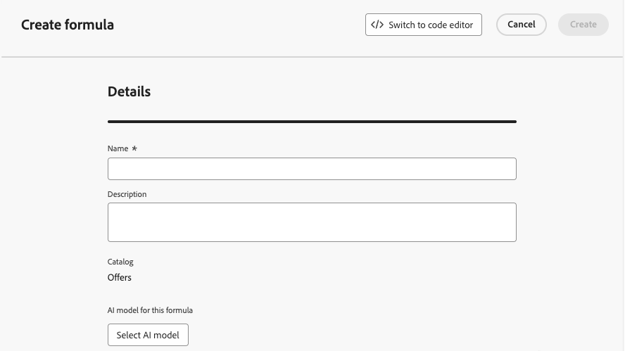
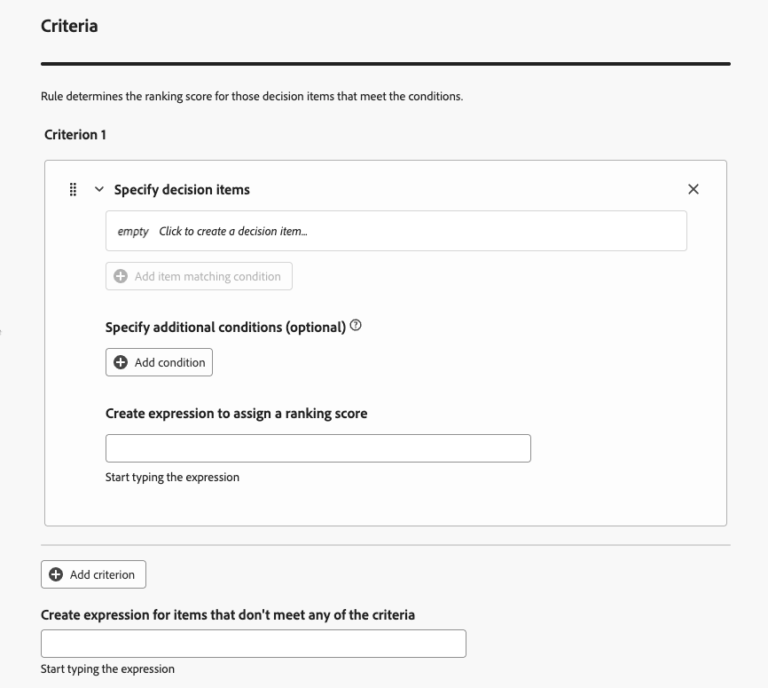
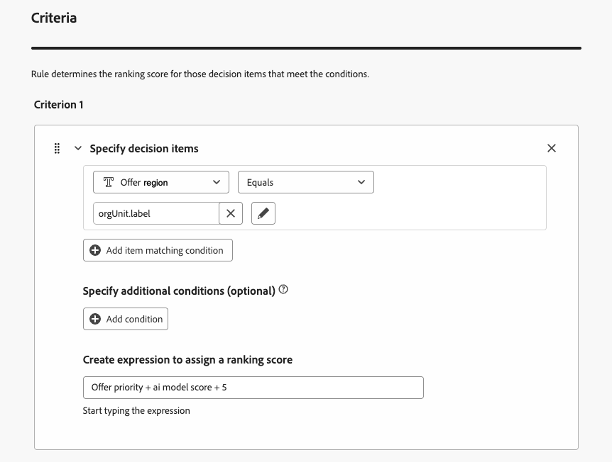

# Utilizzare il generatore di formule di IA {#create-ranking-formulas}

**Le formule di classificazione** ti consentono di definire regole che determineranno quale offerta deve essere presentata per prima, anziché tenere conto dei punteggi di priorità.

<!--In today's world, relevance demands more than static priorities.The new formula builder in **[!UICONTROL Adobe Journey Optimizer]** empowers marketers to dynamically rank offers by blending AI-driven model scores with business priorities, offer attributes, and contextual signals — no coding required.-->

Per creare queste regole, il generatore di formule di IA in **[!UICONTROL Adobe Journey Optimizer]** offre maggiore flessibilità e controllo nella classificazione delle offerte. Invece di affidarti solo a una priorità di offerta statica, ora puoi definire formule di classificazione personalizzate che combinano punteggi di modelli AI, priorità di offerta, attributi di profilo, attributi di offerta e segnali contestuali tramite un’interfaccia guidata.

Questo approccio consente di regolare dinamicamente la classificazione delle offerte in base a qualsiasi combinazione di propensione basata sull’intelligenza artificiale, valore aziendale e contesto in tempo reale, semplificando l’allineamento delle decisioni con gli obiettivi di marketing e le esigenze dei clienti. Il generatore di formule di IA supporta formule semplici o avanzate a seconda del livello di controllo che si desidera applicare.

Una volta creata una formula di classificazione, puoi assegnarla a una [strategia di selezione](selection-strategies.md). Se più offerte sono idonee per essere presentate quando si utilizza questa strategia di selezione, il motore decisionale utilizzerà la formula selezionata per calcolare quale offerta consegnare per prima.

## Creare una formula di classificazione {#create-ranking-formula}

>[!CONTEXTUALHELP]
>id="ajo_exd_config_formulas"
>title="Creare formule di classificazione"
>abstract="Le formule ti consentono di definire regole che determinano quale elemento decisionale deve essere presentato per primo, anziché tenere conto dei punteggi di priorità degli elementi. Una volta creata una formula di classificazione, puoi assegnarla a una strategia di selezione."

Per creare una formula di classificazione, segui i passaggi seguenti.

1. Accedi al menu **[!UICONTROL Imposta strategia]**, quindi seleziona la scheda **[!UICONTROL Classifica formule]**. Viene visualizzato l&#39;elenco delle formule create in precedenza.

   

1. Fare clic su **[!UICONTROL Crea formula]**.

1. Specificare il nome della formula e aggiungere una descrizione, se necessario.

   {width="80%"}

1. Facoltativamente, fai clic su **[!UICONTROL Seleziona modello di IA]** per impostare il modello che verrà utilizzato come riferimento per creare la formula di classificazione. Ogni volta che si fa riferimento a un punteggio di modello durante la definizione della formula seguente, verrà utilizzato il modello di IA selezionato.

   >[!CAUTION]
   >
   >Quando si utilizza un modello di IA incorporato in una formula di classificazione, i dati non vengono rispecchiati nel rapporto [Tasso di conversione per il traffico basato su modello e il blocco](../reports/campaign-global-report-cja-code.md#conversion-rate).

1. Definisci le condizioni che determineranno il punteggio di classificazione per gli elementi decisionali corrispondenti. È possibile:

   * compila la sezione **[!UICONTROL Criteri]** dall&#39;[interfaccia utente](#ranking-select-criteria),
   * o passa all&#39;[editor di codice](#ranking-code-editor).

<!--## Select an ELS dataset {#els-dataset}

To leverage data from an AEP dataset, you can select it in the **[!UICONTROL ELS settings]** section.

1. Select an ELS dataset from the list.

1. Select a decision attribute. This action is mandatory.

{width="80%"}

-->

## Definire i criteri utilizzando il generatore di formule {#ranking-select-criteria}

Con un’interfaccia intuitiva, puoi ottimizzare il processo decisionale regolando i punteggi di IA (propensione), il valore dell’offerta (priorità), le leve contestuali e le propensione al profilo esterno, singolarmente o in combinazione tra loro, per ottimizzare ogni interazione. <!--Whether you're maximizing revenue, promoting strategic offers, or balancing business goals with real-time context, the formula builder gives you total control in defining ranking strategies.-->

Per definire i criteri direttamente dall’interfaccia, segui i passaggi indicati di seguito.

<!--{width="80%"}-->

1. Nella sezione **[!UICONTROL Criterio 1]**, specificare gli elementi decisionali a cui si desidera applicare un punteggio di classificazione eseguendo le operazioni seguenti:
   * seleziona un [attributo elemento decisione](items.md#attributes),
   * selezionare un operatore logico,
   * aggiungi una condizione corrispondente. puoi digitare un valore oppure selezionare un attributo di profilo o [dati contestuali](context-data.md).

   {width="70%"}

   <!--You can refer to [offer attributes](items.md#attributes), profile attributes, or [context data](context-data.md).-->

1. Facoltativamente, puoi specificare elementi aggiuntivi per perfezionare le condizioni di corrispondenza affinché i criteri siano veri.

   {width="80%"}

   Ad esempio, hai definito il criterio 1 come l&#39;attributo personalizzato *Meteo* *Equivale* alla condizione *caldo*. Inoltre, è possibile aggiungere un&#39;altra condizione, ad esempio se la prima condizione è soddisfatta e se la temperatura supera i 75 gradi al momento della richiesta, allora il criterio 1 è vero.<!--Add a screenshot with the example-->

1. Crea un’espressione che assegnerà un punteggio di classificazione agli elementi decisionali che soddisfano la condizione definita sopra. È possibile fare riferimento a uno dei seguenti elementi:

   * il punteggio ottenuto dal modello di intelligenza artificiale che hai selezionato facoltativamente nella sezione **[!UICONTROL Details]** [ABOVE](#create-ranking-formula);
   * la priorità dell&#39;elemento di decisione, che è un valore assegnato manualmente durante la [creazione di un elemento di decisione](items.md#attributes); <!--If a profile qualifies for multiple decision items, a higher priority grants the item precedence over others.-->
   * qualsiasi attributo che potrebbe risiedere nel profilo, ad esempio qualsiasi punteggio di propensione derivato esternamente;
   * un valore statico che puoi assegnare in un formato libero;
   * qualsiasi combinazione di quanto sopra.

   {width="70%"}

   >[!NOTE]
   >
   >Fai clic sull’icona accanto al campo per aggiungere variabili predefinite.

1. Fai clic su **[!UICONTROL Aggiungi criterio]** per aggiungere uno o più criteri il numero di volte necessario. La logica è la seguente:
   * Se il primo criterio è vero per un determinato elemento di decisione, ha la precedenza su quelli successivi.
   * Se non è vero, il motore decisionale passa al secondo criterio e così via.

1. Nell’ultimo campo puoi creare un’espressione che verrà assegnata a tutti gli elementi decisionali che non soddisfano i criteri di cui sopra.

   {width="70%"}

1. Fai clic su **[!UICONTROL Crea]** per completare la formula di classificazione. Ora puoi selezionarlo dall’elenco per visualizzarne i dettagli e modificarlo o eliminarlo. È pronto per essere utilizzato in una [strategia di selezione](selection-strategies.md) per classificare gli elementi decisionali idonei.

### Esempio di formula di classificazione

Considera l&#39;esempio seguente:<!--To be checked by PM-->

{width="80%"}

Se l’area geografica dell’elemento decisione (attributo personalizzato) è uguale all’etichetta geografica del profilo (attributo profilo), il punteggio di classificazione espresso qui (che è una combinazione della priorità dell’elemento decisione, del punteggio del modello di IA e di un valore statico) verrà applicato a tutti gli elementi decisione che soddisfano tale condizione.

## Utilizzare l’editor di codice {#ranking-code-editor}

Per esprimere le formule di classificazione in **sintassi PQL**, passa all&#39;editor di codice utilizzando il pulsante dedicato in alto a destra dello schermo. Per ulteriori informazioni su come utilizzare la sintassi PQL, consulta la [documentazione dedicata](https://experienceleague.adobe.com/docs/experience-platform/segmentation/pql/overview.html?lang=it).

>[!CAUTION]
>
>Questa azione ti impedirà di tornare alla vista predefinita del generatore per questa formula.

Puoi quindi sfruttare gli attributi del profilo, [dati contestuali](context-data.md) e [attributi degli elementi di decisione](items.md#attributes).

Ad esempio, se il tempo è caldo, vuoi aumentare la priorità di tutte le offerte con l’attributo &quot;caldo&quot;. A questo scopo, **contextData.weather=hot** è stato passato alla chiamata di decisioning. <!--[Learn how to work with context data](context-data.md)-->

{width="80%"}

>[!IMPORTANT]
>
>Durante la creazione di una formula di classificazione, non è supportato guardare indietro a un periodo di tempo precedente, ad esempio l’aggiunta di un evento esperienza che si è verificato nell’ultimo mese come componente della formula. Qualsiasi tentativo di includere un periodo di lookback durante la creazione della formula attiverà un errore durante il salvataggio.

### Esempi di PQL delle formule di classificazione {#ranking-formula-examples}

Puoi creare diverse formule di classificazione in base alle tue esigenze. Di seguito sono riportati alcuni esempi.

+++Incrementa le offerte con un determinato attributo di offerta basato sull’attributo del profilo

Se il profilo risiede nella città corrispondente all’offerta, allora raddoppia la priorità per tutte le offerte in quella città.

**Formula di classificazione:**

```
if( offer.characteristics.get("city") = homeAddress.city, offer.rank.priority * 2, offer.rank.priority)
```

+++

+++Incrementa le offerte con una data di fine inferiore a 24 ore

**Formula di classificazione:**

```
if( offer.selectionConstraint.endDate occurs <= 24 hours after now, offer.rank.priority * 3, offer.rank.priority)
```

+++

+++Incrementa le offerte in base alla propensione dei clienti ad acquistare il prodotto che viene offerto

Puoi aumentare il punteggio di un’offerta in base al punteggio di tendenza del cliente.

In questo esempio, il tenant dell&#39;istanza è *_salesvelocity* e lo schema del profilo contiene un intervallo di punteggi archiviati in un array:


Considerato questo, per un profilo come:

```
{"_salesvelocity": {"individualScoring": [
                    {"core": {
                            "category":"insurance",
                            "propensityScore": 96.9
                        }},
                    {"core": {
                            "category":"personalLoan",
                            "propensityScore": 45.3
                        }},
                    {"core": {
                            "category":"creditCard",
                            "propensityScore": 78.1
                        }}
                    ]}
}
```

+++

+++Incrementa le offerte in base ai dati contestuali {#context-data}

[!DNL Journey Optimizer] consente di aumentare alcune offerte in base ai dati contestuali trasmessi nella chiamata. Ad esempio, se `contextData.weather=hot` viene passato, la priorità di tutte le offerte con `attribute=hot` deve essere aumentata. Informazioni dettagliate su come trasmettere i dati contestuali utilizzando le API **Edge Decisioning** e **Decisioning**, consulta [questa sezione](context-data.md)

Tieni presente che quando utilizzi l&#39;API **Decisioning**, i dati contestuali vengono aggiunti all&#39;elemento profilo nel corpo della richiesta, come nell&#39;esempio seguente.

```
"xdm:profiles": [
{
    "xdm:identityMap": {
        "crmid": [
            {
            "xdm:id": "CRMID1"
            }
        ]
    },
    "xdm:contextData": [
        {
            "@type":"_xdm.context.additionalParameters;version=1",
            "xdm:data":{
                "xdm:weather":"hot"
            }
        }
    ]
    
}],
```

+++

