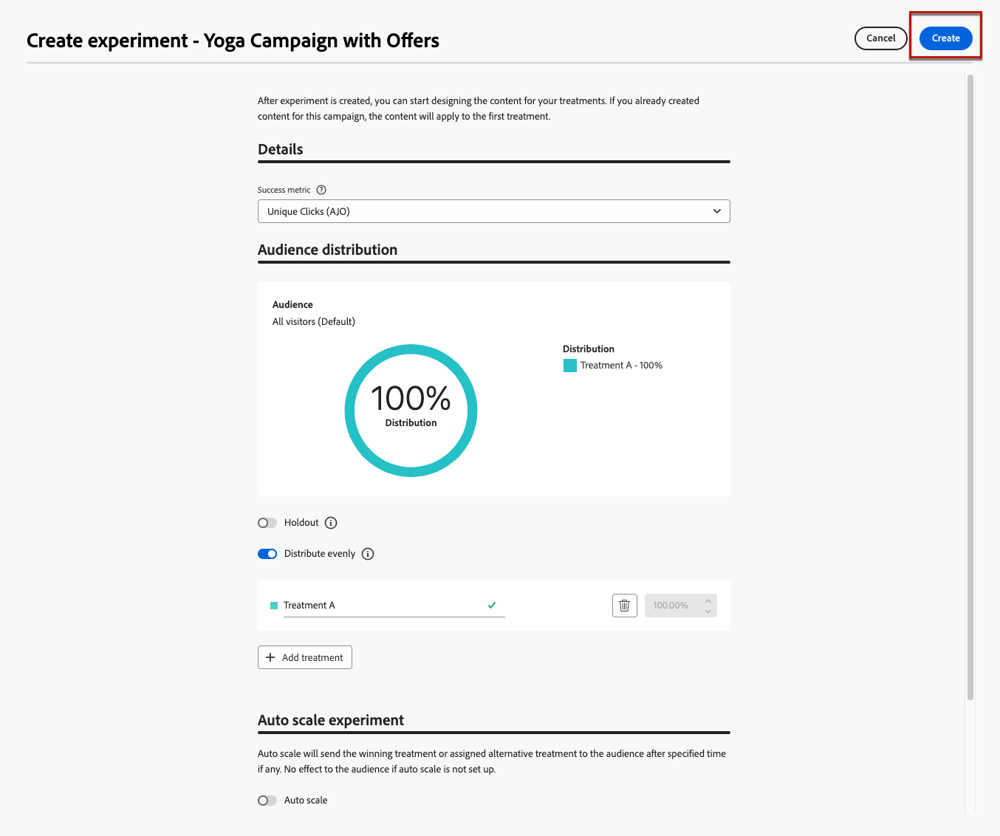
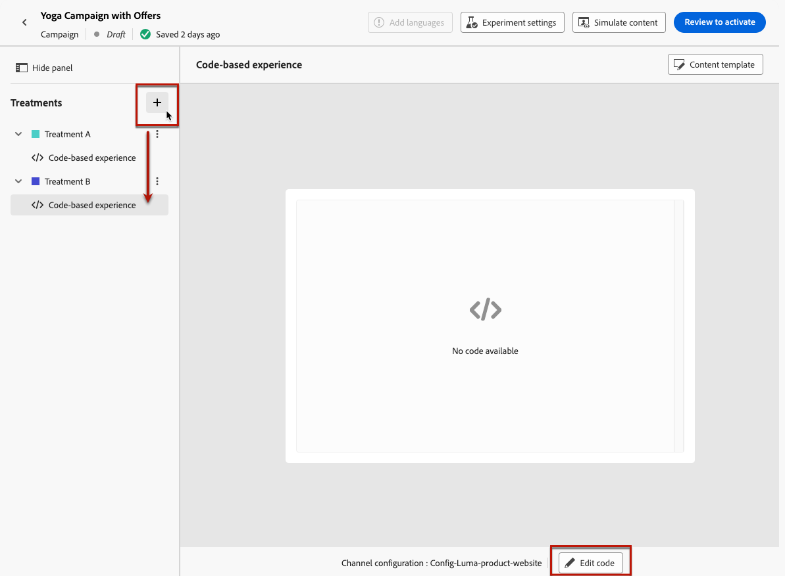

# Caso d’uso della funzione Decisioni {#experience-decisioning-uc}

Questo caso d&#39;uso presenta tutti i passaggi necessari per utilizzare Decisioning con il canale basato su codice [!DNL Journey Optimizer].

In questo esempio, non sei sicuro se una formula di classificazione specifica funzionerà meglio delle priorità di offerta preassegnate.

Per misurare quale sia il migliore per il pubblico di destinazione, crea una campagna utilizzando [Esperimento contenuti](../content-management/content-experiment.md) in cui puoi definire due trattamenti di consegna:

* Il primo trattamento utilizza la priorità come metodo di classificazione.
* Il secondo trattamento utilizza una formula che rappresenta il metodo di classificazione.

## Creare strategie di selezione

Innanzitutto, devi creare due strategie di selezione: una con priorità come metodo di classificazione e un’altra con una formula come metodo di classificazione.

### Creare la prima strategia di selezione

Per creare la prima strategia di selezione con priorità come metodo di classificazione, segui i passaggi riportati di seguito.

1. Crea un elemento di decisione. [Scopri come](items.md)

1. Imposta la **[!UICONTROL Priorità]** dell&#39;elemento di decisione rispetto ad altri. Se un profilo è idoneo per più elementi, una priorità più alta concede la precedenza degli elementi rispetto agli altri.

   

   >[!NOTE]
   >
   >La priorità è un tipo di dati intero. Tutti gli attributi che sono tipi di dati integer devono contenere valori interi (senza decimali).

1. Impostare l&#39;idoneità dell&#39;elemento di decisione:

   * Definisci tipi di pubblico o regole per limitare l’elemento solo a profili specifici. [Ulteriori informazioni](items.md#eligibility)

   * Imposta le regole di limite per definire il numero massimo di volte in cui un’offerta può essere presentata. [Ulteriori informazioni](items.md#capping)

1. Se necessario, ripeti i passaggi precedenti per creare elementi decisionali aggiuntivi.

1. Crea una **raccolta** in cui verranno inclusi gli elementi decisionali. [Ulteriori informazioni](collections.md)

1. Crea una [strategia di selezione](selection-strategies.md#create-selection-strategy) e seleziona la [raccolta](collections.md) che contiene le offerte da considerare.

1. [Scegli il metodo di classificazione](#select-ranking-method) da utilizzare per selezionare l&#39;offerta migliore per ciascun profilo. In questo caso, seleziona **[!UICONTROL Priorità offerta]**: se più offerte sono idonee per questa strategia, il motore di gestione delle decisioni utilizza il valore impostato come **[!UICONTROL Priorità]** nelle offerte. [Ulteriori informazioni](selection-strategies.md#offer-priority)

   

### Creare la seconda strategia di selezione

Per creare la seconda strategia di selezione con la selezione di una formula come metodo di classificazione, attieniti alla procedura seguente.

1. Crea un elemento di decisione. [Scopri come](items.md)

   <!--1. Set the same **[!UICONTROL Priority]** as for the first decision item. TBC?-->

1. Impostare l&#39;idoneità dell&#39;elemento di decisione:

   * Definisci tipi di pubblico o regole per limitare l’elemento solo a profili specifici. [Ulteriori informazioni](items.md#eligibility)

   * Imposta le regole di limite per definire il numero massimo di volte in cui un’offerta può essere presentata. [Ulteriori informazioni](items.md#capping)

1. Se necessario, ripeti i passaggi precedenti per creare elementi decisionali aggiuntivi.

1. Crea una **raccolta** in cui verranno inclusi gli elementi decisionali. [Ulteriori informazioni](collections.md)

1. Crea una [strategia di selezione](selection-strategies.md#create-selection-strategy) e seleziona la [raccolta](collections.md) che contiene le offerte da considerare.

1. [Scegliere il metodo di classificazione](#select-ranking-method) da utilizzare per selezionare l&#39;offerta migliore per ogni profilo. In questo caso, selezionare **[!UICONTROL Formula]** per utilizzare un punteggio calcolato specifico per determinare quale offerta idonea distribuire. [Ulteriori informazioni](selection-strategies.md#ranking-formula)

   

## Creare una campagna di esperienza basata su codice

<!--To present the best dynamic offer and experience to your visitors on your website or mobile app, add a decision policy to a code-based campaign.

Define two delivery treatments each containing a different decision policy.-->

Dopo aver configurato le due strategie di selezione, crea una campagna di esperienza basata su codice in cui definisci un trattamento diverso per ogni strategia per confrontare quale funziona meglio.

1. Crea una campagna e seleziona l&#39;azione **[!UICONTROL Esperienza basata su codice]**. [Ulteriori informazioni](../code-based/create-code-based.md)

1. Dalla pagina di riepilogo della campagna, fai clic su **[!UICONTROL Crea esperimento]** per iniziare a configurare l&#39;esperimento sui contenuti. [Ulteriori informazioni](../content-management/content-experiment.md)

   

1. Dalla pagina di riepilogo della campagna, seleziona o crea una configurazione basata su codice, quindi fai clic su **[!UICONTROL Modifica contenuto]**.

   

<!--1. Sart personalizing **Treatment A** by clicking **[!UICONTROL Create]**.

    -->

1. Dalla finestra dell&#39;edizione del contenuto, inizia a personalizzare **il trattamento A** facendo clic su **[!UICONTROL Modifica codice]**.

   

1. Seleziona **[!UICONTROL Criterio decisione]**, fai clic su **[!UICONTROL Aggiungi criterio decisione]** e compila i dettagli della decisione. [Ulteriori informazioni](create-decision.md)

   

1. Selezionare la prima strategia creata. Fare clic su **[!UICONTROL Aggiungi strategia]**.

1. Fai clic su **[!UICONTROL Crea]**. La nuova decisione viene aggiunta in **[!UICONTROL Decisioni]**.

   

1. Fai clic sull&#39;icona altre azioni (tre punti) e seleziona **[!UICONTROL Aggiungi]**. Ora puoi aggiungere tutti gli attributi di decisione desiderati all’interno di questo.

   

1. Puoi anche aggiungere qualsiasi altro attributo disponibile nell’editor di personalizzazione, ad esempio gli attributi del profilo.

   

1. Dalla finestra di modifica del contenuto, seleziona **Trattamento B** e ripeti i passaggi precedenti per creare un altro criterio di decisione e seleziona la seconda strategia di selezione creata.

   

1. Salva il contenuto.
