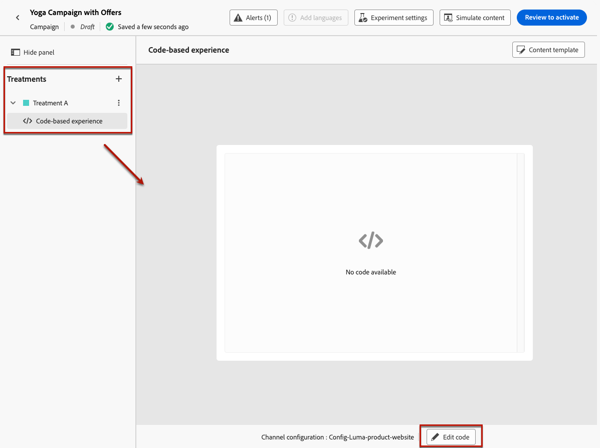

# Utilizzare il decisioning in un’esperienza basata su codice con un esperimento sui contenuti {#experience-decisioning-uc}

Questo caso d&#39;uso presenta tutti i passaggi necessari per utilizzare Decisioning con il canale basato su codice [!DNL Journey Optimizer].

>[!NOTE]
>
>La funzionalità di gestione delle decisioni legacy non è supportata con il canale di esperienza basato su codice.

In questo esempio, non sei sicuro se una formula di classificazione specifica funzionerà meglio delle priorità di offerta preassegnate. Per misurare quale funziona meglio per il tuo pubblico di destinazione, crea una campagna utilizzando [Esperimento sui contenuti](../content-management/content-experiment.md) in cui definisci due trattamenti di consegna:

* Il primo trattamento utilizza **priority** come metodo di classificazione.
* Il secondo trattamento utilizza **una formula** come metodo di classificazione.

>[!NOTE]
>
>Per informazioni dettagliate sull&#39;implementazione relative ai test e alla deduplicazione quando si utilizzano decisioni nelle esperienze basate su codice, consulta [questa pagina](../code-based/code-based-decisioning-implementations.md).

## Creare strategie di selezione

Innanzitutto, devi creare due strategie di selezione: una con priorità come metodo di classificazione e un’altra con una formula come metodo di classificazione.

>[!NOTE]
>
>Puoi anche creare singoli elementi decisionali senza dover eseguire una strategia di selezione. Verrà applicata la priorità impostata per ogni elemento.

### Creare una strategia utilizzando la priorità

Per creare la prima strategia di selezione con priorità come metodo di classificazione, segui i passaggi riportati di seguito.

1. Crea un elemento di decisione. [Scopri come](items.md)

1. Imposta la **[!UICONTROL Priorità]** dell&#39;elemento di decisione rispetto ad altri. Se un profilo è idoneo per più elementi, una priorità più alta concede la precedenza degli elementi rispetto agli altri.

   {width="90%"}

   >[!NOTE]
   >
   >La priorità è un tipo di dati intero. Tutti gli attributi che sono tipi di dati integer devono contenere valori interi (senza decimali).

1. Impostare l&#39;idoneità dell&#39;elemento di decisione:

   * Definisci tipi di pubblico o regole per limitare l’elemento solo a profili specifici. [Ulteriori informazioni](items.md#eligibility)

   * Imposta le regole di limite per definire il numero massimo di volte in cui un’offerta può essere presentata. [Ulteriori informazioni](items.md#capping)

1. Se necessario, ripeti i passaggi precedenti per creare elementi decisionali aggiuntivi.

1. Crea una **raccolta** in cui verranno inclusi gli elementi decisionali. [Ulteriori informazioni](collections.md)

1. Crea una [strategia di selezione](selection-strategies.md#create-selection-strategy) e seleziona la [raccolta](collections.md) che contiene le offerte da considerare.

1. [Scegli il metodo di classificazione](#select-ranking-method) da utilizzare per selezionare l&#39;offerta migliore per ciascun profilo. In questo caso, seleziona **[!UICONTROL Priorità offerta]**: se più offerte sono idonee per questa strategia, il motore di gestione delle decisioni utilizza il valore impostato come **[!UICONTROL Priorità]** nelle offerte. [Ulteriori informazioni](selection-strategies.md#offer-priority)

   {width="90%"}

### Creare un’altra strategia utilizzando una formula

Per creare la seconda strategia di selezione con la selezione di una formula come metodo di classificazione, attieniti alla procedura seguente.

1. Crea un elemento di decisione. [Scopri come](items.md)

   <!--Do you need to set the same **[!UICONTROL Priority]** as for the first decision item, or it won't be considered at all?-->

1. Impostare l&#39;idoneità dell&#39;elemento di decisione:

   * Definisci tipi di pubblico o regole per limitare l’elemento solo a profili specifici. [Ulteriori informazioni](items.md#eligibility)

   * Imposta le regole di limite per definire il numero massimo di volte in cui un’offerta può essere presentata. [Ulteriori informazioni](items.md#capping)

1. Se necessario, ripeti i passaggi precedenti per creare elementi decisionali aggiuntivi.

1. Crea una **raccolta** in cui verranno inclusi gli elementi decisionali. [Ulteriori informazioni](collections.md)

1. Crea una [strategia di selezione](selection-strategies.md#create-selection-strategy) e seleziona la [raccolta](collections.md) che contiene le offerte da considerare.

1. [Scegliere il metodo di classificazione](#select-ranking-method) da utilizzare per selezionare l&#39;offerta migliore per ogni profilo. In questo caso, selezionare **[!UICONTROL Formula]** per utilizzare un punteggio calcolato specifico per determinare quale offerta idonea distribuire. [Ulteriori informazioni](selection-strategies.md#ranking-formula)

   {width="90%"}

## Creare una campagna di esperienza basata su codice

<!--To present the best dynamic offer and experience to your visitors on your website or mobile app, add a decision policy to a code-based campaign.

Define two delivery treatments each containing a different decision policy.-->

Dopo aver configurato le due strategie di selezione, crea una campagna di esperienza basata su codice in cui definisci un trattamento diverso per ogni strategia, al fine di confrontare quale funziona meglio.

1. Crea una campagna e seleziona l&#39;azione **[!UICONTROL Esperienza basata su codice]**. [Ulteriori informazioni](../code-based/create-code-based.md)

1. Dalla pagina di riepilogo della campagna, fai clic su **[!UICONTROL Crea esperimento]** per configurare l&#39;esperimento sui contenuti. [Scopri come](../content-management/content-experiment.md)

   {width="90%"}

1. Dalla pagina di riepilogo della campagna, seleziona una configurazione basata su codice e fai clic su **[!UICONTROL Modifica contenuto]**.

   {width="90%"}

1. Dalla finestra dell&#39;edizione del contenuto, per iniziare a personalizzare **il trattamento A**, fai clic su **[!UICONTROL Modifica codice]**.

   {width="90%"}

1. Dall&#39;[editor di codice](../code-based/create-code-based.md#edit-code), seleziona **[!UICONTROL Criterio decisione]**, fai clic su **[!UICONTROL Aggiungi criterio decisione]** e compila i dettagli della decisione. [Ulteriori informazioni](create-decision.md#add)

   {width="90%"}

1. Nella sezione **[!UICONTROL Sequenza strategica]**, fare clic sul pulsante **[!UICONTROL Aggiungi]** e scegliere **[!UICONTROL Strategia di selezione]**. [Ulteriori informazioni](create-decision.md#select)

   {width="80%"}

   >[!NOTE]
   >
   >Puoi anche selezionare **[!UICONTROL Elemento decisione]** per aggiungere singoli elementi senza dover eseguire una strategia di selezione. Verrà applicata la priorità impostata per ogni elemento.

1. Seleziona la prima strategia creata, quella con priorità come metodo di classificazione.

   {width="90%"}

1. Salva le modifiche e fai clic su **[!UICONTROL Crea]**. La nuova decisione viene aggiunta in **[!UICONTROL Criteri di decisione]**.

1. Fare clic sul pulsante **[!UICONTROL Inserisci criterio]**. Viene aggiunto il codice corrispondente al criterio di decisione. Quindi aggiungi al codice tutti gli attributi che desideri, inclusi quelli del profilo. [Ulteriori informazioni](create-decision.md#create-decision)

   {width="90%"}

1. Salva le modifiche.

1. Torna alla finestra dell&#39;edizione del contenuto, seleziona il pulsante + per aggiungere **Trattamento B**, selezionalo e fai clic su **[!UICONTROL Modifica codice]**.

   {width="90%"}

1. Ripeti i passaggi 5 e 6 per creare un altro criterio di decisione e seleziona la seconda strategia di selezione creata, quella con la formula come metodo di classificazione. <!--Do you need to create exactly the same content to compare only the ranking method?-->

   {width="90%"}

1. Modifica il criterio decisionale come desiderato (vedi i passaggi 8 e 9 sopra).

1. Salva le modifiche e [pubblica la tua campagna basata su codice](../code-based/publish-code-based.md).

Dopo aver eseguito l&#39;esperimento, tieni traccia delle prestazioni dei trattamenti della campagna con il [rapporto sulla campagna di sperimentazione](../reports/campaign-global-report-cja-experimentation.md).<!-- and [report on decisioning](cja-reporting.md).--> È quindi possibile interpretare i risultati dell&#39;esperimento. [Scopri come](../content-management/get-started-experiment.md#interpret-results)

Se il risultato è conclusivo:

* Puoi inviare il trattamento con la classificazione delle prestazioni migliori a tutti i tuoi clienti.
* Oppure puoi creare una nuova campagna utilizzando la strategia di selezione in cui viene replicato il metodo di classificazione con le prestazioni migliori.