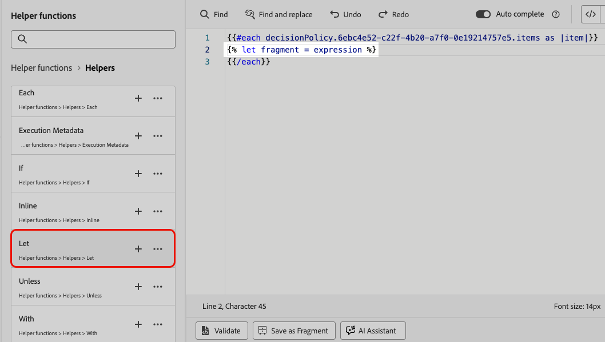

# Sfruttare i frammenti nei criteri decisionali {#fragments}

Se il criterio di decisione contiene elementi di decisione, inclusi frammenti, puoi sfruttarli nel codice del criterio di decisione. [Ulteriori informazioni sui frammenti](../content-management/fragments.md)

>[!AVAILABILITY]
>
>Questa funzionalità è attualmente disponibile solo per il canale **Esperienza basata su codice** e per un set di organizzazioni (disponibilità limitata). Per ulteriori informazioni, contatta il tuo rappresentante Adobe.

Ad esempio, supponiamo che tu voglia visualizzare contenuti diversi per diversi modelli di dispositivi mobili. Accertati di aver aggiunto frammenti corrispondenti a tali dispositivi all’elemento decisionale utilizzato nel criterio di decisione. [Scopri come](items.md#attributes).

{width=70%}

Al termine, puoi utilizzare uno dei seguenti metodi:

>[!BEGINTABS]

>[!TAB Inserisci direttamente il codice]

È sufficiente copiare e incollare il blocco di codice riportato di seguito nel codice del criterio di decisione. Sostituisci `variable` con l&#39;ID frammento e `placement` con la chiave di riferimento frammento:

```

{{fragment id = variable}}
```

>[!TAB Segui i passaggi dettagliati]

1. Passare alle **[!UICONTROL Funzioni helper]** e aggiungere la funzione **Let** ` {{variable}}` al riquadro del codice, in cui è possibile dichiarare la variabile per il frammento.

   

1. Utilizza la **Mappa** > **Ottieni** funzione `` per generare la tua espressione. La mappa è il frammento a cui si fa riferimento nell&#39;elemento di decisione e la stringa può essere il modello di dispositivo immesso nell&#39;elemento di decisione come **[!UICONTROL chiave di riferimento frammento]**.

   

1. Puoi anche utilizzare un attributo contestuale che contenga questo ID modello dispositivo.

   

1. Aggiungi la variabile scelta per il frammento come ID frammento.

   

>[!ENDTABS]

L&#39;ID frammento e la chiave di riferimento verranno selezionati dalla sezione **[!UICONTROL Frammenti]** dell&#39;elemento di decisione.

>[!WARNING]
>
>Se la chiave del frammento non è corretta o se il contenuto del frammento non è valido, il rendering non riuscirà e verrà generato un errore nella chiamata di Edge.

## Guardrail quando si utilizzano frammenti {#fragments-guardrails}

**Attributi di contesto ed elemento della decisione**

Gli attributi degli elementi decisionali e gli attributi contestuali non sono supportati per impostazione predefinita nei frammenti [!DNL Journey Optimizer]. Tuttavia, puoi utilizzare in alternativa le variabili globali, come descritto di seguito.

Supponiamo che desideri utilizzare la variabile *sport* nel frammento.

1. Fai riferimento a questa variabile nel frammento, ad esempio:

   ```
   Elevate your practice with new {{sport}} gear!
   ```

1. Definisci la variabile con la funzione **Let** all&#39;interno del blocco dei criteri di decisione. Nell&#39;esempio seguente, *sport* è definito con l&#39;attributo elemento decisione:

   ```
   {#each decisionPolicy.13e1d23d-b8a7-4f71-a32e-d833c51361e0.items as |item|}}
   
   {{fragment id = get(item._experience.decisioning.offeritem.contentReferencesMap, "placement1").id }}
   {{/each}}
   ```

**Convalida del contenuto del frammento di elemento decisione**

* A causa della natura dinamica di questi frammenti, quando vengono utilizzati in una campagna, la convalida del messaggio durante la creazione del contenuto della campagna viene ignorata per i frammenti a cui si fa riferimento negli elementi decisionali.

* La convalida del contenuto del frammento viene eseguita solo durante la creazione e la pubblicazione del frammento.

* In caso di frammenti JSON, la validità dell’oggetto JSON non è garantita. Assicurati che il contenuto del frammento di espressione sia un JSON valido in modo che possa essere utilizzato negli elementi decisionali.

In fase di esecuzione, viene convalidato il contenuto della campagna (incluso il contenuto del frammento dagli elementi decisionali). In caso di errore di convalida, la campagna non verrà rappresentata.
