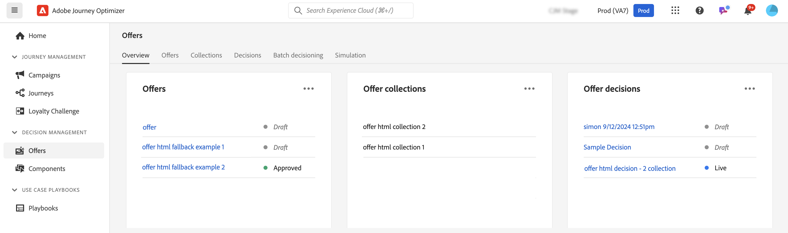

# Introduzione alle funzionalità decisionali in [!DNL Journey Optimizer] {#gs-decision}

Le funzionalità decisionali di [!DNL Journey Optimizer] ti consentono di offrire ai tuoi clienti le migliori offerte ed esperienze personalizzate in tutti i punti di contatto, proprio nel momento giusto. Queste funzionalità semplificano la personalizzazione attraverso un catalogo centralizzato di offerte di marketing e un motore decisionale avanzato, che utilizza regole e criteri di classificazione per fornire i contenuti più rilevanti per ogni singolo utente.

Vantaggi principali:

* Miglioramento delle prestazioni delle campagne grazie alla distribuzione di offerte personalizzate su più canali.
* Flussi di lavoro migliorati: anziché creare più consegne o campagne, i team di marketing possono ottimizzare i flussi di lavoro creando un’unica consegna e variare le offerte in parti differenti del modello.
* Potrai controllare il numero di volte in cui un’offerta viene visualizzata nelle varie campagne e dai diversi clienti.

Attualmente, [!DNL Journey Optimizer] fornisce le due soluzioni di base descritte di seguito.

## Funzione Decisioni {#decisioning}

Il nostro framework decisionale di nuova generazione, progettato per unificare i flussi di lavoro Journey Optimizer esistenti e gettare le basi per la gestione di cataloghi di contenuti aggiuntivi. Decisioning delle offerte:

* Gestione del catalogo di elementi basata su schema: maggiore flessibilità associando metadati personalizzati a ogni offerta
* Regole di raccolta flessibili: è possibile raggruppare facilmente le offerte per le valutazioni future basate su vari criteri
* Configurazione criterio di decisione e strategia di selezione aggiornate: consenti la riutilizzabilità dei componenti di decisione
* Funzionalità di sperimentazione: verifica della logica decisionale rispetto ad altri componenti di contenuto per misurare le prestazioni

Decisioning è disponibile per tutti i clienti per i canali **Esperienza basata su codice**, **Notifica push** e **SMS**. Le decisioni per il canale **E-mail** sono disponibili in Disponibilità limitata. Per richiedere l’accesso a E-mail decisioning, contatta il tuo rappresentante Adobe. Per informazioni dettagliate sul ciclo di rilascio e sulle fasi di disponibilità, consulta [Ciclo di rilascio di Journey Optimizer](../rn/releases.md).

➡️ [Introduzione a Decisioning](../experience-decisioning/gs-experience-decisioning.md)

>[!NOTE]
>
>Per migrare da Gestione decisioni a Decisioning, consulta la [documentazione sulla migrazione](../experience-decisioning/migrate-to-decisioning.md) e la [guida API per la migrazione](../experience-decisioning/decisioning-migration-api.md).

## Gestione delle decisioni {#decision-management}

La nostra consolidata funzione in Journey Optimizer, Decision Management utilizza una libreria centrale di offerte di marketing e un motore decisionale che applica regole e vincoli ai profili dei clienti in tempo reale, sfruttando i dati di Adobe Experience Platform per fornire l’offerta giusta al momento giusto.

La funzione di gestione delle decisioni supporta i seguenti canali: e-mail, messaggistica in-app, notifiche push, SMS e direct mail.

➡️ [Introduzione alla gestione delle decisioni](../offers/get-started/starting-offer-decisioning.md)
