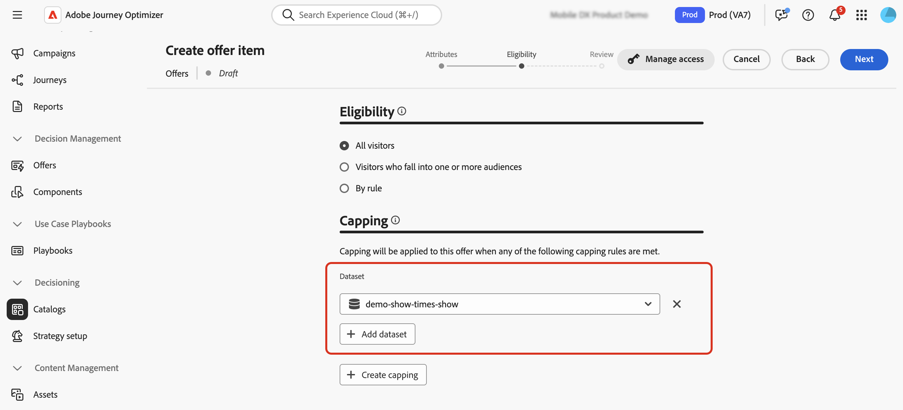

# Creare il primo elemento decisionale {#items}

>[!CONTEXTUALHELP]
>id="ajo_exd_items"
>title="Gestire gli elementi decisionali"
>abstract="Journey Optimizer consente di creare offerte di marketing, note come elementi decisionali, da creare e organizzare in un catalogo e in raccolte centralizzati. Attualmente, tutti gli elementi decisionali creati sono consolidati all’interno di un singolo catalogo “Offerte”. Da questa schermata, puoi anche accedere allo schema del catalogo utilizzando il pulsante **Modifica schema** e creare attributi personalizzati per gli elementi decisionali."

Journey Optimizer consente di creare offerte di marketing, note come elementi decisionali, da creare e organizzare in un catalogo e in raccolte centralizzati. Sono costituiti da attributi standard e personalizzati progettati per allinearsi con precisione alle tue esigenze. Inoltre, incorporano vincoli di profilo che ti consentono di definire a chi può essere visualizzato un elemento decisionale.

Prima di creare un elemento di decisione, assicurati di aver creato una **regola di decisione** se desideri impostare le condizioni per determinare a chi può essere visualizzato l&#39;elemento di decisione. [Scopri come creare regole di decisione](rules.md).

Per creare un elemento di decisione, passa a **[!UICONTROL Decisioning]** > **[!UICONTROL Cataloghi]**, quindi fai clic su **[!UICONTROL Crea elemento]** e segui i passaggi descritti nelle sezioni seguenti.

## Definire gli attributi dell’elemento decisionale {#attributes}

>[!CONTEXTUALHELP]
>id="ajo_exd_item_priority"
>title="Definire la priorità dell’elemento decisionale"
>abstract="Se un profilo è idoneo per più elementi, la priorità consente di confrontare questo elemento decisionale con altri. Una priorità più alta concede la precedenza di un elemento rispetto agli altri."

Per iniziare, definisci gli attributi standard e personalizzati dell’elemento decisionale:

1. Immetti un nome e una descrizione.
1. Specifica le date di inizio e fine. L’elemento verrà preso in considerazione solo dal motore decisionale entro queste date.
1. Imposta **[!UICONTROL Priorità]** dell&#39;elemento di decisione rispetto ad altri, se un profilo è idoneo per più elementi. Una priorità più alta concede la precedenza di un elemento rispetto agli altri.

   >[!NOTE]
   >
   >La priorità è un tipo di dati intero. Tutti gli attributi che sono tipi di dati integer devono contenere valori interi (senza decimali).

1. Il campo **Tag** consente di assegnare tag unificati Adobe Experience Platform agli elementi decisionali. Questo consente di classificarli facilmente e di migliorare la ricerca. [Scopri come utilizzare i tag](../start/search-filter-categorize.md#tags)

1. Utilizza i frammenti per aggiungere più contenuti all’elemento decisionale, ad esempio se desideri visualizzare contenuti diversi per diversi modelli di dispositivi mobili. [Ulteriori informazioni sui frammenti](../content-management/fragments.md)

   >[!AVAILABILITY]
   >
   >I frammenti negli elementi decisionali sono attualmente disponibili solo per un set di organizzazioni (disponibilità limitata). Per ulteriori informazioni, contatta il tuo rappresentante Adobe.

   Nella sezione **[!UICONTROL Frammenti]**, seleziona i frammenti pubblicati che desideri utilizzare e assegna loro una chiave di riferimento. Puoi quindi sfruttare questi frammenti nei criteri decisionali. [Scopri come](use-decision-policy.md#fragments)

   {width=70%}

   Puoi selezionare solo frammenti pubblicati e aggiungere fino a sei frammenti in un elemento decisionale.

   >[!WARNING]
   >
   >Attualmente sono supportati solo [frammenti di espressione](../personalization/use-expression-fragments.md).
   >
   >Impossibile utilizzare frammenti nidificati (frammenti che fanno riferimento ad altri frammenti). Se aggiungi un frammento di questo tipo, l&#39;[approvazione](#approve) dell&#39;elemento di decisione non riuscirà.

1. Specificare gli attributi personalizzati (facoltativo). Gli attributi personalizzati sono attributi specifici personalizzati in base alle proprie esigenze, che si possono assegnare a un elemento decisionale. Sono definite nello schema di catalogo degli elementi decisionali. [Scopri come utilizzare i cataloghi](catalogs.md)

1. Una volta definiti gli attributi dell&#39;elemento decisionale, fare clic su **[!UICONTROL Avanti]**.

## Configurare l’idoneità dell’elemento decisionale {#eligibility}

>[!CONTEXTUALHELP]
>id="ajo_exd_item_constraints"
>title="Aggiungere tipi di pubblico o regole di decisione"
>abstract="Per impostazione predefinita, tutti i profili sono idonei a ricevere l’elemento decisionale, ma puoi utilizzare tipi di pubblico o regole per limitare l’elemento solo a profili specifici."

<!--
>"additional-url="https://experienceleague.adobe.com/en/docs/journey-optimizer/using/audiences-profiles-identities/audiences/about-audiences" text="Use audiences"
>additional-url="https://experienceleague.adobe.com/en/docs/journey-optimizer/using/decisioning/experience-decisioning/rules" text="Use decision rules"
-->

Per impostazione predefinita, tutti i profili sono idonei a ricevere l’elemento decisione, ma puoi utilizzare tipi di pubblico o regole per limitare l’elemento solo a profili specifici, entrambe le soluzioni corrispondenti a utilizzi diversi. Per ulteriori informazioni, espandi la sezione seguente:

+++Utilizzo dei tipi di pubblico e delle regole di decisione

In sostanza, l’output di un pubblico è un elenco di profili, mentre una regola di decisione è una funzione eseguita su richiesta su un singolo profilo durante il processo decisionale.

* **Tipi di pubblico**: da un lato, i tipi di pubblico sono un gruppo di profili di Adobe Experience Platform che corrispondono a una determinata logica basata sugli attributi del profilo e sugli eventi di esperienza. Tuttavia, Gestione delle offerte non ricalcola il pubblico, che potrebbe non essere aggiornato al momento della presentazione dell’offerta.

* **Regole di decisione**: al contrario, una regola di decisione si basa sui dati disponibili in Adobe Experience Platform e determina a chi può essere visualizzata un&#39;offerta. Una volta selezionata in un’offerta o in una decisione per un determinato posizionamento, la regola viene eseguita ogni volta che viene presa una decisione, in modo che ogni profilo ottenga l’offerta più recente e migliore.

+++

* Per limitare la presentazione dell&#39;elemento decisionale ai membri di uno o più tipi di pubblico di Adobe Experience Platform, seleziona l&#39;opzione **[!UICONTROL Visitatori che rientrano in uno o più tipi di pubblico]**, quindi aggiungi uno o più tipi di pubblico dal riquadro di sinistra e combinali utilizzando gli operatori logici **[!UICONTROL And]** / **[!UICONTROL Or]**. [Ulteriori informazioni sui tipi di pubblico](../audience/about-audiences.md)

* Per associare una regola di decisione specifica all&#39;elemento di decisione, selezionare **[!UICONTROL Per regola]**, quindi trascinare la regola desiderata dal riquadro di sinistra nell&#39;area centrale. [Ulteriori informazioni sulle regole di decisione](rules.md)

Quando selezioni tipi di pubblico o regole di decisione, puoi visualizzare informazioni sui profili qualificati stimati. Fai clic su **[!UICONTROL Aggiorna]** per aggiornare i dati.

>[!NOTE]
>
>Le stime del profilo non sono disponibili quando i parametri della regola includono dati non presenti nel profilo, come i dati contestuali. Ad esempio, una regola di idoneità che richiede che il tempo corrente sia di ≥80 gradi.

## Impostare le regole di limitazione {#capping}

>[!CONTEXTUALHELP]
>id="ajo_exd_item_capping_expression"
>title="Espressione"
>abstract="Piuttosto che utilizzare un valore statico per la soglia di limitazione, puoi definire la tua espressione. Questo consente di calcolare la soglia in modo dinamico utilizzando gli attributi di decisione e/o gli attributi esterni da un set di dati di Adobe Experience Platform.  Le **espressioni** della regola di limitazione sono attualmente disponibili come disponibilità limitata per tutti gli utenti. Sono supportati solo per il tipo di limitazione **[!UICONTROL In totale]**."

Il limite viene utilizzato come vincolo per definire il numero massimo di volte in cui un articolo di offerta può essere presentato. Limitare il numero di volte in cui gli utenti ricevono offerte specifiche consente di evitare di sollecitare eccessivamente i clienti e quindi di ottimizzare ogni punto di contatto con l’offerta migliore. Puoi creare fino a 10 maiuscole per un determinato elemento decisionale.

>[!NOTE]
>
>
>L&#39;aggiornamento del valore del contatore di limite può richiedere fino a 3 secondi. Ad esempio, supponiamo che tu stia visualizzando un banner web che mostra un’offerta sul tuo sito web. Se un determinato utente passa alla pagina successiva del sito Web in meno di 3 secondi, il valore del contatore non verrà incrementato per tale utente.

Durante la configurazione delle regole di limitazione di utilizzo, puoi fare riferimento agli attributi memorizzati nei set di dati di Adobe Experience Platform per definire le soglie. Per utilizzare un set di dati, selezionarlo nella sezione **[!UICONTROL Set di dati]**.

>[!NOTE]
>
>Questa funzionalità è attualmente disponibile come Disponibilità limitata per tutti gli utenti. Informazioni dettagliate su come utilizzarlo sono disponibili in questa sezione: [Utilizzare i dati di Adobe Experience Platform per Decisioning](../experience-decisioning/aep-data-exd.md)

Per impostare le regole di limitazione per l&#39;elemento di decisione, fare clic sul pulsante **[!UICONTROL Crea limitazione]**, quindi seguire i passaggi descritti di seguito.

1. Definisci quale **[!UICONTROL evento di limitazione]** verrà preso in considerazione per aumentare il contatore.

   * **[!UICONTROL Evento decisionale]** (valore predefinito): numero massimo di volte in cui è possibile presentare un&#39;offerta.
   * **[!UICONTROL Impression]** (solo canali in entrata): numero massimo di volte che l&#39;offerta può essere visualizzata a un utente.
   * **[!UICONTROL Clic]**: numero massimo di volte in cui un utente può fare clic sull&#39;elemento decisionale.
   * **[!UICONTROL Evento personalizzato]**: è possibile definire un evento personalizzato che verrà utilizzato per limitare il numero di volte in cui l&#39;elemento viene inviato. Ad esempio, puoi limitare il numero di rimborsi fino a quando non raggiungono 10.000 oppure fino a quando un determinato profilo non avrà rimborsato 1 volta. Per farlo, utilizza [schemi XDM](https://experienceleague.adobe.com/docs/experience-platform/xdm/home.html?lang=it){target="_blank"} di Adobe Experience Platform per generare una regola evento personalizzata.

   >[!NOTE]
   >
   >Per tutti gli eventi di limitazione ad eccezione di quelli decisionali, il feedback di gestione delle decisioni potrebbe non essere raccolto automaticamente e il contatore di limitazione potrebbe non essere incrementato correttamente. Per garantire che ogni evento di limitazione venga tracciato e contabilizzato nel contatore delle limitazioni, accertati che lo schema utilizzato per raccogliere gli eventi di esperienza includa il gruppo di campi corretto per tale evento. Informazioni dettagliate sulla raccolta dei dati sono disponibili nella documentazione relativa alla gestione delle decisioni di Journey Optimizer:
   >* [Raccolta dati gestione decisioni](data-collection/data-collection.md)
   >* [Configura raccolta dati](data-collection/schema-requirement.md)

1. Scegliere il tipo di limite:

   * Seleziona **[!UICONTROL In totale]** per definire quante volte l&#39;elemento può essere proposto per il pubblico target combinato, ovvero per tutti gli utenti. Ad esempio, se sei un retailer di elettronica con un&#39;offerta &quot;TV Doorbuster&quot;, vuoi che l&#39;offerta venga restituita solo 200 volte in tutti i profili.

   * Seleziona **[!UICONTROL Per profilo]** per definire quante volte l&#39;offerta può essere proposta allo stesso utente. Ad esempio, se sei una banca con un&#39;offerta &quot;Carta di credito Platino&quot;, non vuoi che questa offerta venga visualizzata più di 5 volte per profilo. In effetti, si ritiene che se l&#39;utente ha visto l&#39;offerta 5 volte e non ha agito di conseguenza, ha una maggiore possibilità di agire sulla migliore offerta successiva.

1. Definisci la soglia di limite. A questo scopo, puoi immettere un valore statico o calcolare la soglia utilizzando un’espressione. Per ulteriori informazioni, espandi le sezioni seguenti.

   +++Soglia statica

   Nel campo **[!UICONTROL Limite conteggio limite]**, specifica quante volte l&#39;offerta può essere presentata a tutti gli utenti o per profili, a seconda del tipo di limite selezionato. Il numero deve essere un numero intero maggiore di 0.

   Ad esempio, hai definito un evento di limite personalizzato, come il numero di checkout presi in considerazione. Se immetti 10 nel campo **[!UICONTROL Limite conteggio limite]**, non verranno inviate altre offerte dopo 10 estrazioni.

   +++

   +++Soglia di espressione

   Piuttosto che utilizzare un valore statico per la soglia di limitazione, puoi definire la tua espressione. Questo consente di calcolare la soglia in modo dinamico utilizzando gli attributi di decisione e/o gli attributi esterni da un set di dati di Adobe Experience Platform.

   Ad esempio, un addetto marketing può decidere di aggiungere un moltiplicatore per regolare l’esposizione. Ad esempio, possono moltiplicare l’inventario disponibile per due, consentendo di mostrare l’offerta a un numero di clienti doppio rispetto alle unità disponibili. Questo approccio prevede che non tutti i clienti si convertiranno, garantendo una migliore portata senza vendite eccessive.

   >[!NOTE]
   >
   >Le **espressioni** della regola di limitazione di utilizzo sono attualmente disponibili come disponibilità limitata per tutti gli utenti. Sono supportati solo per il tipo di limitazione **[!UICONTROL In totale]**.

   Per utilizzare un&#39;espressione, abilitare l&#39;opzione **[!UICONTROL Espressione]**, quindi modificare l&#39;espressione come desiderato.

   

   +++

1. Nell&#39;elenco a discesa **[!UICONTROL Reimposta la frequenza di limitazione]**, impostare la frequenza di reimpostazione del contatore di limitazione. A questo scopo, definisci il periodo di tempo per il conteggio (giornaliero, settimanale o mensile) e inserisci il numero di giorni/settimane/mesi desiderato. Ad esempio, se desideri reimpostare il conteggio dei limiti ogni 2 settimane, seleziona **[!UICONTROL Settimanale]** dall&#39;elenco a discesa corrispondente e digita **2** nell&#39;altro campo.

   * La reimpostazione del contatore dei limiti di frequenza si verifica alle **12:00 UTC**, nel giorno definito o nel primo giorno della settimana/mese, se applicabile. Il giorno di inizio della settimana è **domenica**. La durata scelta non può superare **2 anni** (ovvero il numero corrispondente di mesi, settimane o giorni).

   * Dopo aver pubblicato l’elemento decisionale, non potrai modificare il periodo di tempo (mensile, settimanale o giornaliero) selezionato per la frequenza. Puoi comunque modificare il limite di frequenza se l&#39;elemento ha lo stato **[!UICONTROL Bozza]** e non è mai stato pubblicato prima con il limite di frequenza abilitato.

   * Può trascorrere un tempo di buffer fino a 15 minuti prima che gli eventi vengano conteggiati per i vincoli di quota limite, quando l’elemento decisionale viene approvato o quando viene creato il limite, a seconda di quale evento si verifica per ultimo.

1. Fai clic su **[!UICONTROL Crea]** per confermare la creazione della regola di limitazione di utilizzo. Puoi creare fino a 10 regole per un singolo elemento decisionale. A tale scopo, fare clic sul pulsante **[!UICONTROL Crea limite]** e ripetere i passaggi precedenti.

   

<!--* Identifying how many times a given customer has been shown a decision item. 
If a marketer wants to determine how many times a specific customer has been shown an offer, they can do that. Go to Profiles menu, Attributes tab. You'll see all counter values. The alphanumeric string is associated to the offer. To make the map, go to an item, in the URL check the last alphanumeric strings. D stands for day, w stands for week, m for month. "Ce" custom event-->

## Rivedi e approva l&#39;elemento di decisione {#approve}

1. Una volta definite l&#39;idoneità dell&#39;elemento decisionale e le regole di limite, fare clic su **[!UICONTROL Avanti]** per rivedere e salvare l&#39;elemento.

1. L&#39;elemento di decisione viene ora visualizzato nell&#39;elenco, con lo stato **[!UICONTROL Bozza]**. Quando è pronto per essere presentato ai profili, fai clic sul pulsante con i puntini di sospensione e seleziona **[!UICONTROL Approva]**.

   

## Gestire gli elementi decisionali {#manage}

Dall&#39;elenco degli elementi di decisione è possibile modificare un elemento di decisione, modificarne lo stato (**Bozza**, **Approvato**, **Archiviato**), duplicarlo o eliminarlo.

Per modificare un elemento di decisione, aprilo, apporta le modifiche e salvalo.

Selezionando un elemento di decisione o facendo clic sul pulsante con i puntini di sospensione si abilitano le azioni descritte di seguito.

* **[!UICONTROL Approva]**: imposta lo stato dell&#39;elemento di decisione su Approvato.
* **[!UICONTROL Annulla approvazione]**: ripristina lo stato dell&#39;elemento di decisione su **[!UICONTROL Bozza]**.
* **[!UICONTROL Duplicato]**: crea un elemento di decisione con attributi e vincoli identici. Per impostazione predefinita, il nuovo elemento ha lo stato **[!UICONTROL Bozza]**.
* **[!UICONTROL Elimina]**: rimuove l&#39;elemento di decisione dall&#39;elenco.

  >[!IMPORTANT]
  >
  >Una volta eliminata, l’elemento decisionale e il relativo contenuto non sono più accessibili. Questa azione non può essere annullata.

  Gli elementi di offerta approvati non possono essere eliminati se sono utilizzati in una raccolta o in una decisione. Per eliminarli, cambiarne lo stato in &quot;Bozza&quot;. A tale scopo, fare clic sul pulsante con i puntini di sospensione e selezionare **[!UICONTROL Annulla approvazione]**.

  

* **[!UICONTROL Archivio]**: imposta lo stato dell&#39;elemento di decisione su **[!UICONTROL Archiviato]**. L&#39;elemento di decisione è ancora disponibile nell&#39;elenco, ma non è possibile impostarne lo stato su **[!UICONTROL Bozza]** o **[!UICONTROL Approvato]**. Puoi solo duplicarlo o eliminarlo.

