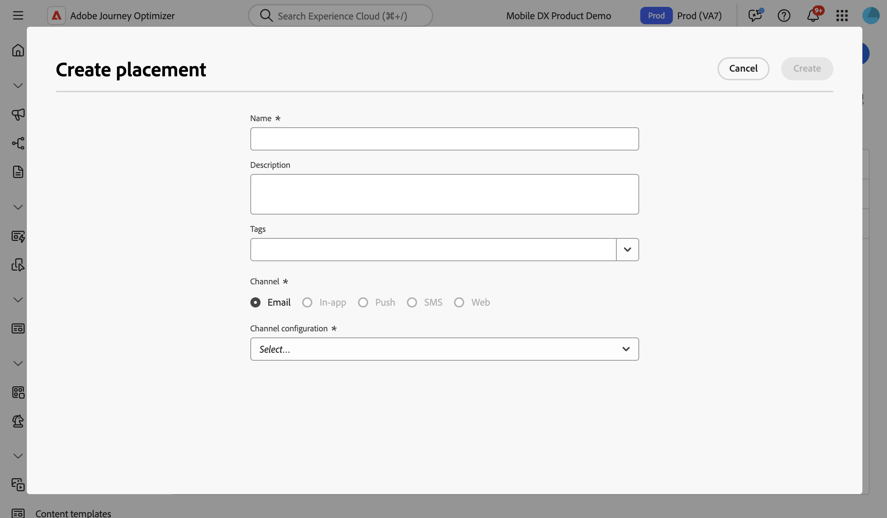

# Utilizzare i posizionamenti {#create-decision}

## Informazioni sui posizionamenti {#about}

Un posizionamento è un contenitore utilizzato per mostrare gli elementi decisionali. In questo modo il contenuto dell’offerta corretta verrà visualizzato nella posizione corretta all’interno del messaggio.

Quando aggiungi un criterio di decisione a un’e-mail, devi associare un posizionamento al componente che mostri gli elementi di decisione restituiti. Questo consente, ad esempio, di tenere traccia delle prestazioni degli elementi decisionali tra diversi posizionamenti nel reporting.

L&#39;elenco dei posizionamenti è accessibile nel menu **[!UICONTROL Impostazione strategia]**. I filtri sono disponibili per aiutarti a recuperare i posizionamenti in base a una superficie di canale o a tag specifici.

>[!NOTE]
>
>Per il momento, i posizionamenti sono disponibili solo per il canale e-mail.

## Creare un posizionamento {#create}

Per creare un posizionamento, effettuate le seguenti operazioni:

1. Passa al menu **[!UICONTROL Configurazione strategia]**, seleziona **[!UICONTROL E-mail]** e fai clic sul pulsante **[!UICONTROL Crea posizionamento]**.

   Puoi anche creare un posizionamento direttamente dall’e-mail designer quando aggiungi un criterio di decisione. [Scopri come associare un posizionamento a un componente e-mail](../experience-decisioning/create-decision.md#save)

1. Definite le proprietà del posizionamento:

   

   * **[!UICONTROL Nome]**: nome del posizionamento. Assicurati di definire un nome significativo per recuperarlo più facilmente.
   * **[!UICONTROL Descrizione]**: descrizione del posizionamento.
   * **[!UICONTROL Tag]**: assegna i tag unificati Adobe Experience Platform al posizionamento. Questo consente di classificarli facilmente e di migliorare la ricerca. [Scopri come utilizzare i tag](../start/search-filter-categorize.md#tags)
   * **[!UICONTROL Canale]**: canale per il quale verrà utilizzato il posizionamento. Per il momento i posizionamenti sono disponibili solo per le e-mail.
   * **[!UICONTROL Configurazione canale]**: associa una configurazione canale al posizionamento. [Scopri come impostare la configurazione di canale](../configuration/channel-surfaces.md).

1. Fai clic su **[!UICONTROL Crea]**.

Una volta creato, il posizionamento viene visualizzato nell’elenco dei posizionamenti quando si aggiunge un criterio di decisione in un messaggio e-mail. Puoi selezionarlo per visualizzarne le proprietà e modificarlo. [Scopri come creare i criteri di decisione](../experience-decisioning/create-decision.md)

