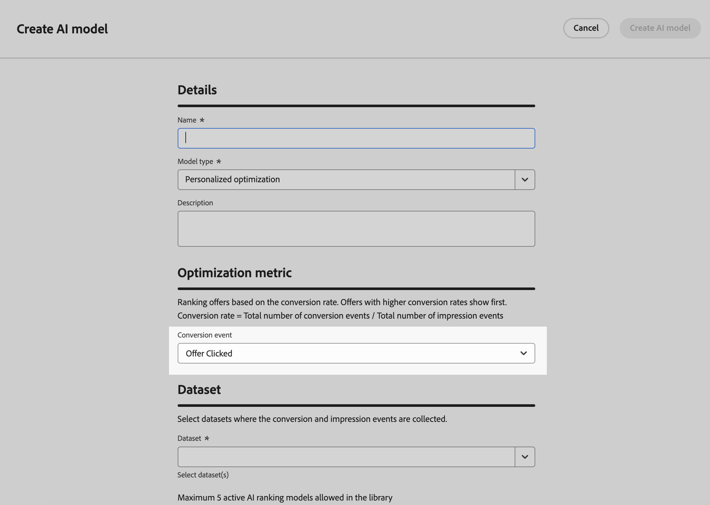

# Metodi di classificazione {#rankings}

>[!CONTEXTUALHELP]
>id="ajo_exd_config_formulas"
>title="Creare formule di classificazione"
>abstract="Le formule consentono di definire regole che determinano quale elemento deve essere presentato per primo, anziché tenere conto dei punteggi di priorità dell’elemento. Una volta creato un metodo di classificazione, puoi assegnarlo a una strategia di selezione per definire quali elementi devono essere selezionati per primi."

I metodi di classificazione consentono di classificare gli elementi da visualizzare per un determinato profilo. Una volta creato un metodo di classificazione, puoi assegnarlo a una strategia di selezione per definire quali elementi devono essere selezionati per primi.

Sono disponibili due tipi di metodi di classificazione:

* **Le formule** consentono di definire regole che determinano quale elemento deve essere presentato per primo, anziché tenere conto dei punteggi di priorità dell&#39;elemento.

* I **modelli AI** consentono di utilizzare sistemi di modelli addestrati che sfrutteranno più punti dati per determinare quale elemento deve essere presentato per primo.

## Creare metodi di classificazione {#create}

Per creare un metodo di classificazione, effettua le seguenti operazioni:

1. Passa al menu **[!UICONTROL Configurazione strategia]**, quindi seleziona il menu **[!UICONTROL Formule]** o **[!UICONTROL Modelli AI]** in base al tipo di classificazione che desideri utilizzare.

1. Fai clic sul pulsante **[!UICONTROL Crea formula]** o **[!UICONTROL Crea modello di IA]** nell&#39;angolo superiore destro dello schermo.

   

1. Configura la formula o il modello di IA in base alle tue esigenze, quindi salvalo.

   Informazioni dettagliate su come creare formule di classificazione e modelli di IA sono disponibili nella documentazione di gestione delle decisioni:

   * [Formule di classificazione](../offers/ranking/create-ranking-formulas.md)
   * [Modelli di intelligenza artificiale](../offers/ranking/ai-models.md)

+++ Ottimizzazione dei modelli sulle metriche [!DNL Customer Journey Analytics] personalizzate

>[!NOTE]
>
>Questa funzionalità è disponibile solo per [!DNL Customer Journey Analytics] clienti con diritti di amministratore.
>
>Prima di iniziare, assicurati di aver integrato Journey Optimizer con Customer Journey Analytics per esportare i set di dati di Journey Optimizer nelle visualizzazioni dati predefinite. [Scopri come sfruttare [!DNL Journey Optmizer] i dati in [!DNL Customer Journey Analytics]](../reports/cja-ajo.md)

I modelli di ottimizzazione personalizzati sono un tipo di modello di intelligenza artificiale che consente di definire gli obiettivi aziendali e utilizza i dati dei clienti per addestrare modelli orientati al business per distribuire offerte personalizzate e massimizzare i KPI. Informazioni dettagliate su come creare un modello di IA personalizzato sono disponibili nella [documentazione di gestione delle decisioni](../offers/ranking/personalized-optimization-model.md).

Per impostazione predefinita, i modelli di ottimizzazione personalizzati utilizzano **clic sull&#39;offerta** come metrica di ottimizzazione. Se lavori con [!DNL Customer Journey Analytics], [!DNL Decisioning] ti consente di sfruttare le tue metriche personalizzate per ottimizzare il tuo modello su.

A questo scopo, accedi alla schermata di creazione del modello di intelligenza artificiale personalizzato ed espandi il menu a discesa **[!UICONTROL Evento di conversione]**. Tutte le metriche della [!DNL Customer Journey Analytics] [visualizzazione dati](https://experienceleague.adobe.com/en/docs/analytics-platform/using/cja-dataviews/data-views){target="_blank"} predefinita vengono visualizzate nell&#39;elenco. Seleziona la metrica su cui desideri ottimizzare il modello, quindi completa normalmente la creazione del modello di intelligenza artificiale.

>[!NOTE]
>
>Per impostazione predefinita, le metriche in [!DNL Customer Journey Analytics] utilizzano un modello di attribuzione &quot;Last Touch&quot; (Ultimo contatto), che assegna il 100% del credito al punto di contatto che si verifica più di recente prima della conversione.
>
>Anche se è possibile modificare il modello di attribuzione, non tutti i modelli di attribuzione sono ideali per l’ottimizzazione del modello di IA. È consigliabile selezionare con attenzione un modello di attribuzione in linea con gli obiettivi di ottimizzazione per garantire l’accuratezza e le prestazioni del modello.
>
>Per ulteriori dettagli sui modelli di attribuzione disponibili e indicazioni sul loro utilizzo, consulta la [[!DNL Customer Journey Analytics] documentazione](https://experienceleague.adobe.com/en/docs/analytics-platform/using/cja-dataviews/component-settings/attribution){target="_blank"}

+++

## Sfruttare gli attributi degli elementi decisionali nelle formule {#items}

Le formule di classificazione sono espresse in **sintassi PQL** e possono sfruttare vari attributi come gli attributi del profilo, [dati contestuali](context-data.md) e attributi correlati agli elementi decisionali.

Per sfruttare gli attributi relativi agli elementi decisionali nelle formule, assicurati di seguire la sintassi riportata di seguito nel codice della formula di classificazione. Espandi ogni sezione per ulteriori informazioni:

+++Sfruttare gli attributi standard degli elementi decisionali

+++

+++Sfruttare gli attributi personalizzati degli elementi decisionali

+++
