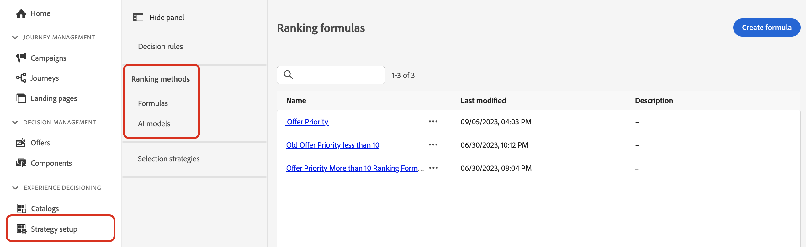

# Metodi di classificazione {#rankings}

>[!BEGINSHADEBOX]

Cosa troverai in questa documentazione:

* [Introduzione a Offer Decisioning](gs-experience-decisioning.md)
* Gestire gli elementi decisionali
   * [Configurare il catalogo degli elementi](catalogs.md)
   * [Creare elementi decisionali](items.md)
   * [Gestire le raccolte di elementi](collections.md)
* Configurare la selezione degli elementi
   * [Creare regole di decisione](rules.md)
   * **[Creare metodi di classificazione](ranking.md)**
* [Creare strategie di selezione](selection-strategies.md)
* [Creare criteri di decisione](create-decision.md)

>[!ENDSHADEBOX]

I metodi di classificazione consentono di classificare gli elementi da visualizzare per un determinato profilo. Una volta creato un metodo di classificazione, puoi assegnarlo a una strategia decisionale per definire quali elementi devono essere selezionati per primi.

I metodi di classificazione sono accessibili dalla sezione **[!UICONTROL Configurazione]** / **[!UICONTROL Metodi di classificazione]** menu. Sono disponibili due tipi di metodi di classificazione:

* **Formule** consente di definire regole che determinano quale elemento deve essere presentato per primo, anziché tenere conto dei punteggi di priorità dell’elemento.

* **Modelli IA** consente di utilizzare sistemi di modelli formati che sfrutteranno più punti dati per determinare quale elemento deve essere presentato per primo.

Informazioni dettagliate su ciascun tipo di metodo di classificazione e su come crearlo sono disponibili nella documentazione di gestione delle decisioni accessibile qui:

* [Formule di classificazione](../offers/ranking/create-ranking-formulas.md)
* [Modelli IA](../offers/ranking/ai-models.md)
