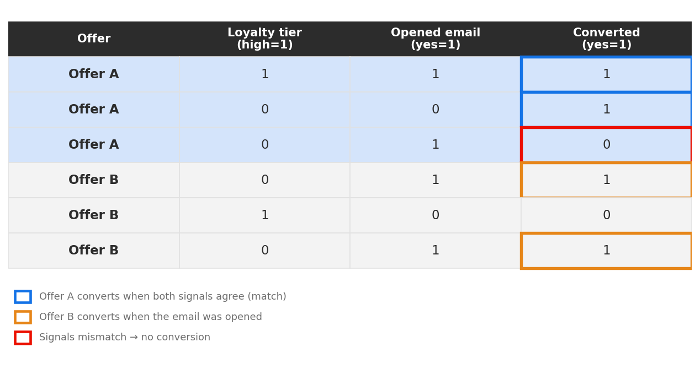
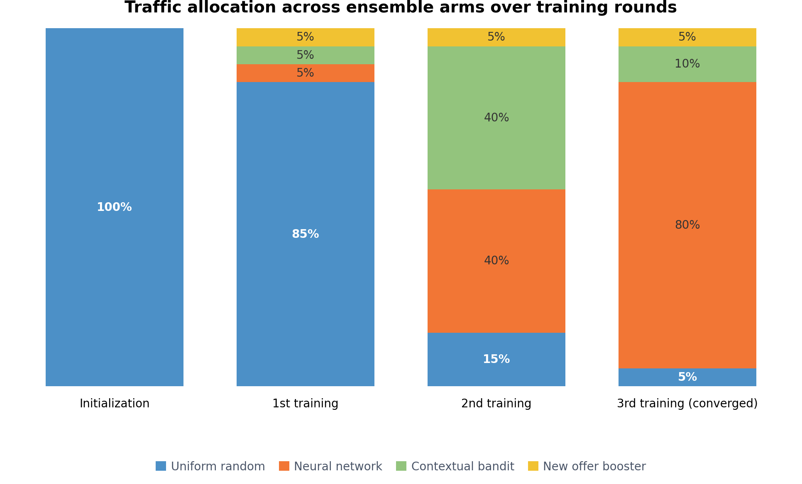

# Modello di ottimizzazione personalizzata {#personalized-optimization-model}

>[!BEGINSHADEBOX]

**In questa pagina:** scopri in che modo il modello di ottimizzazione personalizzata utilizza l&#39;apprendimento automatico per imparare dai dati contestuali, delle offerte e dei clienti, inclusi i casi d&#39;uso, i componenti del modello di insieme, i requisiti dei set di dati, le ipotesi e il comportamento di avvio a freddo, in modo da poter decidere quando utilizzarlo per distribuire offerte personalizzate e massimizzare i KPI.

>[!ENDSHADEBOX]

Sfruttando le tecnologie all’avanguardia nell’apprendimento automatico supervisionato e nell’apprendimento profondo, l’ottimizzazione personalizzata consente a un utente aziendale (addetto al marketing) di definire gli obiettivi aziendali e utilizzare i dati dei clienti per addestrare modelli orientati al business a fornire offerte personalizzate e massimizzare i KPI.

A differenza della classificazione non personalizzata che ottimizza in base alle prestazioni globali di ogni offerta, l’ottimizzazione personalizzata apprende la relazione tra gli attributi di un singolo cliente e le offerte che hanno più probabilità di determinare l’indicatore KPI scelto per quel cliente. Il risultato è una selezione di offerte su misura per ciascun profilo, anziché un’unica offerta migliore distribuita a tutti.

## Casi d’uso e vantaggi {#use-cases}

L’ottimizzazione personalizzata è ideale per scenari decisionali in cui diversi clienti rispondono in modo diverso alle offerte disponibili e in cui il catalogo delle offerte è significativamente differenziato e non cambia spesso. I casi d’uso comuni includono:

* **Selezione dell&#39;offerta migliore successiva**: scegliere quale delle diverse offerte o promozioni concorrenti presentare a ciascun cliente in tempo reale.
* **Personalizzazione dei contenuti**: scelta del contenuto (ad esempio banner, creatività) o del messaggio per ciascun cliente su web, dispositivi mobili, e-mail e altri canali.
* **Personalizzazione in base al pubblico**: incorporazione dell&#39;iscrizione al pubblico e dei segnali contestuali in modo che i consigli riflettano chi è il cliente e il contesto dell&#39;interazione.
* **Ottimizzazione di ricavi e valore**: ottimizzazione verso risultati continui come ricavi o valore del ciclo di vita del cliente, oltre a risultati binari come clic e conversioni.

Vantaggi principali:

* Massimizza il KPI aziendale selezionato distribuendo l’offerta a cui ogni cliente con maggiore probabilità risponderà, anziché una singola offerta ottimale a livello globale.
* Si adatta continuamente all’arrivo di nuovi dati di interazione, bilanciando l’esplorazione di offerte sottotestate con lo sfruttamento di esecutori collaudati.
* Supporta metriche di ottimizzazione sia binarie che continue, con punteggi di classificazione che possono essere utilizzati direttamente nelle espressioni del generatore di formule di modelli AI.
* Riduce lo sforzo manuale di test A/B e authoring delle regole apprendendo automaticamente l’adattamento dell’offerta al cliente.

## Requisiti del set di dati {#dataset}

Per addestrare un modello di ottimizzazione personalizzato, il set di dati deve avere almeno due offerte con almeno 250 eventi di visualizzazione (ad esempio, impression) e un evento di successo (ad esempio, clic o conversione) negli ultimi 30 giorni.

Le offerte con meno di 250 eventi di visualizzazione e/o senza eventi di successo negli ultimi 30 giorni rimarranno idonee per l’inclusione nel traffico di esplorazione. Potranno essere inclusi anche nel traffico di personalizzazione, ma saranno trattati come equivalenti all’offerta di punteggio peggiore prevista nel processo decisionale, fino a quando non soddisferanno i requisiti minimi di visualizzazione/successo e il modello non verrà riqualificato.

Fino alla prima volta che viene addestrato un modello di ottimizzazione personalizzato, le offerte all’interno di una strategia di selezione che utilizza un modello di ottimizzazione personalizzato verranno servite a caso.

## Come funziona {#how}

Il modello apprende interazioni complesse tra le funzioni di offerte, informazioni sugli utenti e informazioni contestuali per consigliare offerte personalizzate agli utenti finali. Le feature sono input nel modello.

Esistono 3 tipi di funzionalità:

| Tipi di funzionalità | Come aggiungere feature ai modelli |
|--------------|----------------------------|
| Oggetti decisioning (placementID, activityID, decisionScopeID) | Parte del feedback di gestione delle decisioni Eventi di esperienza inviati ad AEP |
| Tipi di pubblico | È possibile aggiungere 0-50 tipi di pubblico come funzioni durante la creazione del modello di IA per la classificazione |
| Dati contestuali | Parte del feedback decisionale Eventi di esperienza inviati ad AEP. Dati contestuali disponibili da aggiungere allo schema: Dettagli Commerce, Dettagli canale, Dettagli applicazione, Dettagli web, Dettagli ambiente, Dettagli dispositivo, placeContext |

Il modello prevede due fasi:

* Nella fase **apprendimento del modello offline**, un modello viene addestrato apprendendo e memorizzando le interazioni delle funzionalità nei dati storici.
* Nella fase di **inferenza online**, le offerte candidate vengono classificate in base ai punteggi in tempo reale generati dal modello. A differenza delle tecniche di filtro collaborativo tradizionali, con le quali è difficile includere funzionalità per utenti e offerte, l’ottimizzazione personalizzata è un metodo di raccomandazione basato sull’apprendimento profondo ed è in grado di includere e imparare pattern di interazione di funzioni complessi e non lineari.

Il modello supporta l’ottimizzazione di variabili continue (come ricavi e valore del ciclo di vita del cliente) oltre a variabili binarie (come clic e conversioni). I valori previsti per una metrica binaria, ad esempio i clic, saranno sempre compresi tra 0 e 1. I valori previsti per una metrica continua, come il valore dell’ordine, saranno sempre un numero maggiore o uguale a zero. I punteggi di classificazione vengono normalizzati per garantire un comportamento coerente tra entrambi i tipi di metrica quando vengono utilizzati in formule o confronti.

## Esempio illustrativo {#illustrative-example}

### Risposta binaria (conversione) {#binary-response}

Considera un set di dati semplificato di interazioni storiche tra utenti e offerte. Ogni riga registra un’offerta visualizzata, due segnali del cliente: il livello di fedeltà (alto = 1) e se il cliente ha aperto un’e-mail recente (sì = 1) e se il cliente ha effettuato la conversione (sì = 1).

Per l&#39;Offerta A, la conversione è più probabile quando entrambi i segnali sono d&#39;accordo (entrambi alti o entrambi bassi). Per l’offerta B, la conversione è più probabile quando l’e-mail è stata aperta, indipendentemente dal livello di fedeltà. In base al modello appreso, il modello può prevedere l’offerta migliore per ogni cliente in base ai suoi segnali.

*Figura 1: nella riga delle mancate corrispondenze evidenziate, l&#39;offerta A veniva visualizzata quando i segnali non erano d&#39;accordo e non venivano convertiti. In base al modello appreso, la prossima volta l&#39;offerta B sarebbe il consiglio migliore per quel cliente.*

Questa è l’essenza dell’approccio: imparare a memorizzare le interazioni delle funzioni storiche e applicarle per generare previsioni personalizzate per ogni cliente.

### Risposta continua (ricavi) {#continuous-response}

La stessa idea si estende ai risultati continui. Invece di prevedere se un cliente effettua la conversione, il modello prevede un valore continuo (ricavi previsti) per ogni offerta e segmento di cliente e classifica le offerte in base a tale valore previsto.

*Figura 2: ricavi previsti per due offerte su quattro segmenti di clienti. Per i clienti altamente fidelizzati che hanno aperto l’e-mail, l’offerta A è destinata a generare il maggior fatturato; per i clienti con bassa fedeltà che hanno aperto l’e-mail, l’offerta B è la scelta più forte. Il modello seleziona l&#39;offerta con il valore più alto previsto per ciascun segmento anziché applicare una regola a tutti i clienti.*

## Assemblare i componenti del modello {#ensemble}

L&#39;ottimizzazione personalizzata viene fornita come modello di insieme: diversi bracci di modelli complementari funzionano insieme e un livello di supervisione determina la quantità di traffico in tempo reale che ciascun braccio riceve. Questa progettazione consente al sistema di perseguire due obiettivi contemporaneamente: l’apprendimento che offre le prestazioni migliori (esplorazione) e la fornitura di offerte già note per ottenere buone prestazioni (sfruttamento).

**Esplorazione e sfruttamento del bilanciamento**

Ogni sistema decisionale si trova di fronte a un compromesso tra l&#39;esplorazione di offerte sottotestate per raccogliere informazioni e lo sfruttamento di offerte comprovate per massimizzare il ritorno immediato. Riservando troppo poco traffico per l&#39;esplorazione non si scoprono le offerte ad alto potenziale; riservando troppo sacrifici si aumenta l&#39;incremento delle offerte già in esecuzione. Il gruppo gestisce automaticamente questo equilibrio tenendo un minimo di esplorazione e spostando il traffico rimanente verso le braccia personalizzate più performanti nel tempo.

Il gruppo è composto da quattro bracci di traffico:

### Uniforme casuale (braccio di esplorazione) {#uniform-random}

Il braccio casuale uniforme assegna offerte ai clienti a caso tra le offerte idonee. Poiché non favorisce alcuna offerta, produce dati imparziali sul modo in cui i clienti rispondono all&#39;intero catalogo — la materia prima da cui le braccia personalizzate apprendono. È l&#39;unico braccio attivo prima che il primo modello venga addestrato, e in seguito continua a mantenere una base minima di esplorazione in modo che il sistema continui ad imparare.

* All’inizializzazione: 100% del traffico.
* Dopo la prima esecuzione di addestramento riuscita: almeno il 5-20% del traffico in base al numero di eventi di impression e conversione osservati per offerta, fino a un massimo dell’85%.

### Rete neurale (braccio personalizzato) {#neural-network}

La rete neurale è un braccio personalizzato che prevede l’offerta migliore per un dato cliente in base ai suoi attributi e alle iscrizioni al pubblico. Impara interazioni complesse e non lineari tra offerte, funzioni del cliente e contesto ed è adatto per acquisire modelli sottili tra molte funzioni.

* All’inizializzazione: 0% del traffico.
* Dopo il primo addestramento riuscito: almeno il 5% del traffico, fino a un massimo dell’85%.

### Bandita contestuale (braccio personalizzato) {#contextual-bandit}

Il bandito contestuale è un secondo braccio personalizzato che prevede anche l’offerta migliore per ogni cliente in base alle iscrizioni al pubblico, utilizzando un approccio bandit che bilancia continuamente l’apprendimento e le prestazioni nel modo in cui serve. L’esecuzione accanto alla rete neurale consente al gruppo di attingere ai punti di forza di due metodi personalizzati distinti.

* All’inizializzazione: 0% del traffico.
* Dopo il primo addestramento riuscito: almeno il 5% del traffico, fino a un massimo dell’85%.

### Nuova offerta booster (braccio non personalizzato) {#new-offer-booster}

Il nuovo booster dell’offerta è un vincitore complessivo di Thompson Sampling bandit (non personalizzato) che fa ipotesi ottimistiche sulle prestazioni delle nuove offerte, quelle con pochi eventi di impression registrati all’interno del periodo di lookback del modello. Ciò offre alle nuove offerte promettenti la tempestiva esposizione necessaria per dimostrarsi, affrontando una nota carenza di avviamento a freddo in cui il modello altrimenti faticava a indirizzare abbastanza traffico verso offerte nuove o ad alte prestazioni ma restrittivamente idonee.

* Man mano che vengono raccolti dati reali sulle impression e di conversione, le prestazioni stimate di ogni offerta si avvicinano rapidamente alle reali prestazioni sottostanti e l’impatto delle ipotesi ottimistiche si avvicina allo zero.
* Quando nessuna offerta è relativamente nuova (ad esempio, quando tutte le offerte hanno un numero simile di impression o tutte hanno più di 1,000 impression), l’effetto ottimistico è vicino a zero e questo braccio si comporta, in effetti, come un modello vincitore complessivo non personalizzato.
* All’inizializzazione: 0% del traffico.
* Dopo la prima esecuzione di addestramento riuscita: 5% del traffico.

### Modalità di ripartizione del traffico tra le braccia {#traffic-allocation}

All&#39;inizializzazione, nessun modello è stato ancora addestrato, quindi il 100% del traffico va alla linea di base casuale uniforme — l&#39;unico braccio con una distribuzione appresa da cui campionare. Dopo la prima fase di addestramento, ogni branca riceve un minimo di traffico (5%) e la banda di sorveglianza ripartisce il traffico rimanente in base alle prestazioni osservate. Mentre il modello si allunga tra turni successivi, il traffico converge verso i bracci con le prestazioni più elevate con una massima allocazione possibile dell&#39;85% di traffico.

*Figura 3: una possibile traiettoria di allocazione del traffico tra i quattro bracci dell&#39;insieme al momento dell&#39;inizializzazione e tra cicli di addestramento successivi. Al momento dell’inizializzazione, tutto il traffico scorre verso la linea di base casuale. Dopo ogni addestramento, la banda di campionamento Thompson di supervisione sposta l&#39;allocazione verso bracci con prestazioni migliori, mantenendo un traffico minimo del 5%. L&#39;allocazione effettiva varia in base alle prestazioni del braccio osservate.*

## Ipotesi e limitazioni principali del modello {#key}

Per massimizzare il vantaggio dell’utilizzo dell’ottimizzazione personalizzata, è necessario conoscere alcuni presupposti e limitazioni chiave.

* **Le offerte sono sufficientemente diverse, cosicché gli utenti avranno preferenze diverse tra le offerte considerate**. Se le offerte sono troppo simili, un modello risultante avrà un impatto minore in quanto le risposte sono apparentemente casuali.Ad esempio, se una banca ha due offerte di carte di credito con l&#39;unica differenza che è il colore, allora potrebbe non importa quale carta è consigliata, ma se ogni carta ha termini diversi, questo fornisce una motivazione per il motivo per cui alcuni clienti sceglierne uno e fornire una differenza sufficiente tra le offerte per costruire un modello più incisivo.
* **La composizione del traffico utente è stabile**. Se la composizione del traffico dell’utente cambia drasticamente durante l’apprendimento e la previsione del modello, le prestazioni del modello potrebbero peggiorare. Ad esempio, supponiamo che nella fase di apprendimento del modello siano disponibili solo i dati per gli utenti nel pubblico A, ma che il modello addestrato venga utilizzato per generare previsioni per gli utenti nel pubblico B, e che le prestazioni del modello possano esserne influenzate.
* **Le prestazioni delle offerte non cambiano drasticamente in un breve periodo di tempo** poiché questo modello viene aggiornato ogni settimana e le modifiche alle prestazioni vengono trasmesse man mano che il modello viene aggiornato. Ad esempio, un prodotto era molto popolare in precedenza, ma un rapporto pubblico identifica il prodotto come dannoso per la nostra salute, e questo prodotto diventa impopolare estremamente veloce. In questo scenario, il modello potrebbe continuare a prevedere questo prodotto fino a quando il modello non si aggiorna con le modifiche nel comportamento dell’utente.

## Problema di avviamento a freddo {#cold-start}

I problemi di avviamento a freddo si verificano quando non ci sono abbastanza dati per fare dei consigli. Per l’ottimizzazione personalizzata, esistono quattro tipi di problemi di avviamento a freddo.

* **Dopo aver creato un nuovo modello di IA senza dati storici**, le offerte verranno distribuite in modo casuale per un periodo di tempo per raccogliere i dati richiesti, che verranno quindi utilizzati per addestrare il primo modello.
* **Dopo il rilascio del primo modello di IA**, una parte del traffico totale viene allocata per l&#39;esplorazione casuale uniforme, mentre il resto viene utilizzato per le raccomandazioni del modello. La distribuzione del traffico tra i componenti bandit di esplorazione e sfruttamento viene regolata automaticamente in base a fattori quali il numero di offerte e le relative soglie di prestazioni.
* **Dopo l&#39;aggiunta di nuove offerte alla raccolta di offerte** selezionata nella strategia associata al modello di classificazione AI, tali offerte diventano candidate idonee per l&#39;esplorazione da parte dei bracci del modello uniforme casuale e del nuovo modello di offerta di richiamo (entro 60 minuti). Durante la prossima esecuzione pianificata di riaddestramento, le prestazioni stimate dell’offerta verranno aggiornate nel nuovo braccio del modello di richiamo dell’offerta e l’offerta potrà essere inclusa nei bracci del modello personalizzato se ha raggiunto la soglia di impression e clic.
* **Dopo aver aggiunto nuovi profili al set di tipi di pubblico esistente** associato alla strategia di selezione associata al modello di classificazione di IA, questi ereditano gli attributi di personalizzazione dal set di tipi di pubblico stesso. Pertanto, inizieranno a ricevere offerte personalizzate basate su tali attributi fin dall’inizio, senza alcun problema di avviamento a freddo.

## Riaddestramento {#re-training}

I modelli verranno riaddestrati per scoprire le ultime interazioni delle funzioni e attenuare il deterioramento settimanale delle prestazioni del modello. Per monitorare lo stato dell&#39;addestramento e le prestazioni del modello, vedere [Monitoraggio del modello AI](ai-model-observability.md).
