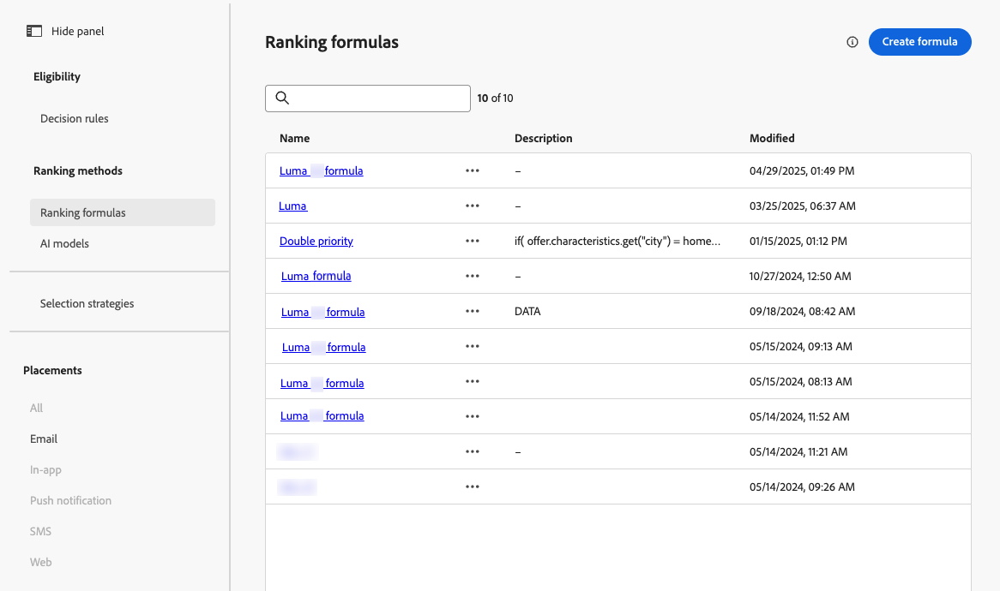
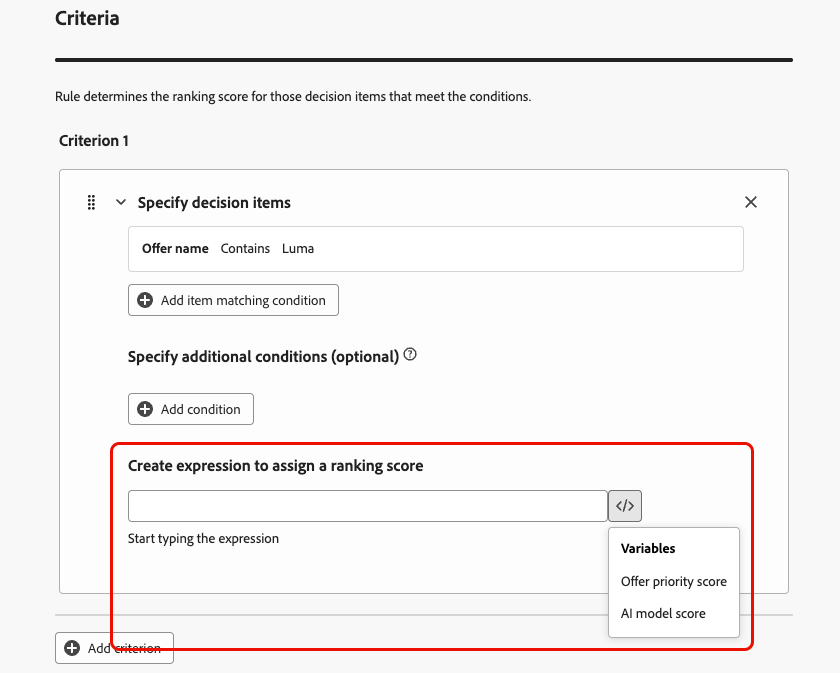
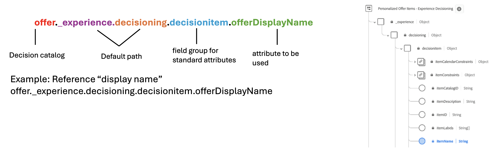
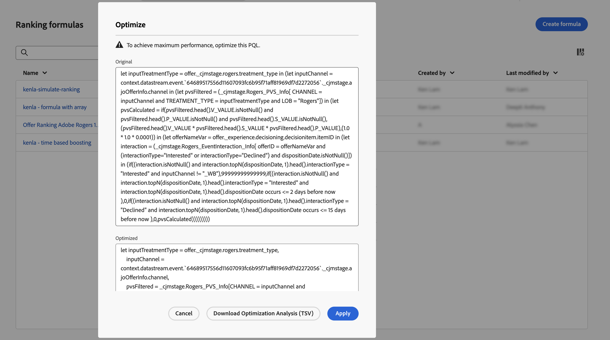

# Creare formule di ranking {#create-ranking-formulas}

**Le formule di classificazione** ti consentono di definire regole che determinano quale offerta deve essere presentata per prima, anziché tenere conto dei punteggi di priorità.

Per creare queste regole, il generatore di formule di IA in **[!UICONTROL Adobe Journey Optimizer]** offre maggiore flessibilità e controllo nella classificazione delle offerte. Invece di affidarti solo a una priorità di offerta statica, ora puoi definire formule di classificazione personalizzate che combinano punteggi di modelli AI, priorità di offerta, attributi di profilo, attributi di offerta e segnali contestuali tramite un’interfaccia guidata.

Questo approccio consente di regolare dinamicamente la classificazione delle offerte in base a qualsiasi combinazione di propensione basata sull’intelligenza artificiale, valore aziendale e contesto in tempo reale, semplificando l’allineamento delle decisioni con gli obiettivi di marketing e le esigenze dei clienti. Il generatore di formule di IA supporta formule semplici o avanzate a seconda del livello di controllo che si desidera applicare.

Una volta creata una formula di classificazione, puoi assegnarla a una [strategia di selezione](../selection-strategies.md). Se più offerte sono idonee per essere presentate quando si utilizza questa strategia di selezione, il motore decisionale utilizzerà la formula selezionata per calcolare quale offerta consegnare per prima.

➡️ [Scopri questa funzione nel video](#video)

## Guardrail e limitazioni {#ranking-guardrails}

Prima di creare formule di classificazione, tenete presenti i seguenti vincoli:

* Il generatore di formule di IA non supporta [modelli di ottimizzazione personalizzati](personalized-optimization-model.md) che utilizzano metriche continue.
* Quando un modello di IA viene utilizzato in una formula di classificazione, i dati non vengono rispecchiati nel rapporto [Tasso di conversione per il traffico basato su modello e il blocco](../../reports/campaign-global-report-cja-code.md#conversion-rate).
* La profondità di nidificazione in una formula di classificazione è limitata a 30 livelli, misurati contando `)` nella stringa PQL.
* Una stringa della formula di classificazione può contenere fino a 8 KB per i caratteri con codifica UTF-8 (8.000 caratteri ASCII o 2.000-4.000 caratteri non ASCII).
* I periodi di lookback non sono supportati nelle formule di classificazione (ad esempio, gli eventi di esperienza dell’ultimo mese). I tentativi di salvataggio di tali formule generano un errore.
* L&#39;ottimizzazione delle formule [basate sull&#39;intelligenza artificiale](#optimize) si applica solo alle formule di classificazione la cui espressione PQL basata sul codice è maggiore di **2 KB** nelle dimensioni con codifica UTF-8; le formule più piccole non vengono analizzate.

## Creare la formula di classificazione e impostare le proprietà {#create-ranking-formula}

>[!CONTEXTUALHELP]
>id="ajo_exd_config_formulas"
>title="Creare formule di ranking"
>abstract="Le formule consentono di definire regole che determinano quale elemento decisionale deve essere presentato per primo, anziché tenere conto dei punteggi di priorità dell’elemento. Una volta creata una formula di classificazione, puoi assegnarla a una strategia di selezione."

Per creare una formula di classificazione, segui i passaggi seguenti.

1. Accedi al menu **[!UICONTROL Imposta strategia]**, quindi seleziona la scheda **[!UICONTROL Classifica formule]**. Viene visualizzato l&#39;elenco delle formule create in precedenza.

   

1. Fare clic su **[!UICONTROL Crea formula]**.

1. Specificare il nome della formula e aggiungere una descrizione, se necessario.

   {width="80%"}

1. Facoltativamente, fai clic su **[!UICONTROL Seleziona modello di IA]** per impostare il modello che verrà utilizzato come riferimento per creare la formula di classificazione.

   Ogni volta che si fa riferimento a un punteggio di modello durante la definizione della formula seguente, verrà utilizzato il modello di IA selezionato.

1. Definisci le condizioni che determineranno il punteggio di classificazione per gli elementi decisionali corrispondenti. Puoi eseguire le seguenti operazioni:

   * Compila la sezione **[!UICONTROL Criteri]** utilizzando il [generatore di formule](#ranking-select-criteria) e/o
   * Fai clic su **[!UICONTROL Passa all&#39;editor di codice]** per definire o perfezionare la logica di classificazione con [PQL nell&#39;editor di codice](#ranking-code-editor).

## Utilizzare i dati di Adobe Experience Platform {#aep-data}

Nella sezione **[!UICONTROL Ricerca set di dati]**, puoi utilizzare i dati di Adobe Experience Platform per regolare dinamicamente la logica di classificazione in modo da riflettere le condizioni del mondo reale.

Questa funzione è particolarmente utile per gli attributi che cambiano frequentemente, ad esempio la disponibilità del prodotto o il prezzo in tempo reale. [Scopri come utilizzare i dati di Adobe Experience Platform per prendere decisioni](../aep-data-exd.md)


## Definire i criteri utilizzando il generatore di formule {#ranking-select-criteria}

Definisci i **criteri** che determineranno il punteggio di classificazione per gli elementi decisionali corrispondenti.

Con un’interfaccia intuitiva, puoi ottimizzare il processo decisionale regolando i punteggi di IA (propensione), il valore dell’offerta (priorità), le leve contestuali e le propensione al profilo esterno, singolarmente o in combinazione tra loro, per ottimizzare ogni interazione. <!--Whether you are maximizing revenue, promoting strategic offers, or balancing business goals with real-time context, the formula builder gives you total control in defining ranking strategies.-->

<!--{width="80%"}-->

1. Se necessario, fare clic su **[!UICONTROL Passa all&#39;editor di codice]** per aggiungere un&#39;espressione che utilizza la **sintassi PQL** insieme al generatore di formule. Questa opzione integra i campi dell’interfaccia utente nei passaggi seguenti, in modo da poter combinare entrambi gli approcci nella stessa formula di classificazione. Per ulteriori informazioni su come utilizzare la sintassi PQL, consulta la [documentazione dedicata](https://experienceleague.adobe.com/docs/experience-platform/segmentation/pql/overview.html?lang=it). La sintassi per gli attributi degli elementi decisionali e gli esempi di copia e incolla sono forniti nella sezione [Utilizza l&#39;editor di codice](#ranking-code-editor).

   

   >[!NOTE]
   >
   >Passando all’editor di codice, l’input basato su espressioni viene aggiunto ai criteri e non vengono rimossi gli altri campi dell’interfaccia utente.

1. Nella sezione **[!UICONTROL Criterio 1]**, specificare gli elementi decisionali a cui si desidera applicare un punteggio di classificazione eseguendo le operazioni seguenti:
   * seleziona un [attributo elemento decisione](../items.md#attributes)
   * seleziona un operatore logico
   * aggiungi una condizione corrispondente. puoi digitare un valore oppure selezionare un attributo di profilo o [dati contestuali](../context-data.md)

   {width="70%"}

1. Facoltativamente, puoi specificare elementi aggiuntivi per perfezionare le condizioni di corrispondenza affinché i criteri siano veri.

   {width="80%"}

   Ad esempio, hai definito il criterio 1 come l&#39;attributo personalizzato *Meteo* *Equivale* alla condizione *caldo*. Inoltre, è possibile aggiungere un&#39;altra condizione, ad esempio se la prima condizione è soddisfatta e se la temperatura supera i 75 gradi al momento della richiesta, allora il criterio 1 è vero.<!--Add a screenshot with the example-->

1. Crea un’espressione che assegnerà un punteggio di classificazione agli elementi decisionali che soddisfano la condizione definita sopra. È possibile fare riferimento a uno dei seguenti elementi:

   * il punteggio ottenuto dal modello di intelligenza artificiale che hai selezionato facoltativamente nella sezione **[!UICONTROL Details]** [ABOVE](#create-ranking-formula);
   * la priorità dell&#39;elemento di decisione, che è un valore assegnato manualmente durante la [creazione di un elemento di decisione](../items.md#attributes); <!--If a profile qualifies for multiple decision items, a higher priority grants the item precedence over others.-->
   * qualsiasi attributo che potrebbe risiedere nel profilo, ad esempio qualsiasi punteggio di propensione derivato esternamente;
   * un valore statico che puoi assegnare in un formato libero;
   * qualsiasi combinazione di quanto sopra.

   {width="70%"}

   >[!NOTE]
   >
   >Fai clic sull’icona accanto al campo per aggiungere variabili predefinite.

1. Fai clic su **[!UICONTROL Aggiungi criterio]** per aggiungere uno o più criteri il numero di volte necessario. La logica è la seguente:
   * Se il primo criterio è vero per un determinato elemento di decisione, ha la precedenza su quelli successivi.
   * Se non è vero, il motore decisionale passa al secondo criterio e così via.

1. Nell’ultimo campo puoi creare un’espressione che verrà assegnata a tutti gli elementi decisionali che non soddisfano i criteri di cui sopra.

   {width="70%"}

   +++Esempio di formula di classificazione

   {width="80%"}

   Se l’area geografica dell’elemento decisione (attributo personalizzato) è uguale all’etichetta geografica del profilo (attributo profilo), il punteggio di classificazione espresso qui (che è una combinazione della priorità dell’elemento decisione, del punteggio del modello di IA e di un valore statico) verrà applicato a tutti gli elementi decisione che soddisfano tale condizione.

   +++

1. Quando la formula è pronta, fai clic su **[!UICONTROL Crea]**.

Ora puoi accedere alla formula di classificazione dall’elenco per visualizzarne i dettagli e modificarla o eliminarla. È pronto per essere utilizzato in una [strategia di selezione](../selection-strategies.md) per classificare gli elementi decisionali idonei.

## Definire i criteri utilizzando l’editor di codice {#ranking-code-editor}

Utilizza **[!UICONTROL Passa all&#39;editor di codice]** per scrivere o modificare la logica di classificazione come espressione di **PQL**.


>[!NOTE]
>
>Questa azione ti impedirà di tornare alla vista predefinita del generatore per questa formula.

Puoi sfruttare gli attributi del profilo, [dati contestuali](../context-data.md) e [attributi degli elementi di decisione](../items.md#attributes).

Ad esempio, se il tempo è caldo, vuoi aumentare la priorità di tutte le offerte con l’attributo &quot;caldo&quot;. A questo scopo, **contextData.weather=hot** è stato passato alla chiamata di decisioning.

{width="80%"}

Per sfruttare gli attributi relativi agli elementi decisionali nelle formule, assicurati di seguire la sintassi corretta nel codice della formula di classificazione. Espandi ogni sezione per ulteriori informazioni:

+++Utilizzo degli attributi standard degli elementi decisionali



+++

+++Sfruttare gli attributi personalizzati degli elementi decisionali


+++

Puoi creare diverse formule di classificazione basate su codice in base alle tue esigenze. Di seguito sono riportati alcuni esempi.

+++Incrementa le offerte con un determinato attributo di offerta basato sull’attributo del profilo

Se il profilo risiede nella città corrispondente all’offerta, allora raddoppia la priorità per tutte le offerte in quella città.

**Formula di classificazione:**

```
if( offer.characteristics.get("city") = homeAddress.city, offer.rank.priority * 2, offer.rank.priority)
```

+++

+++Incrementa le offerte la cui data di fine è inferiore a 24 ore

**Formula di classificazione:**

```
if( offer.selectionConstraint.endDate occurs <= 24 hours after now, offer.rank.priority * 3, offer.rank.priority)
```

+++

+++Incrementa le offerte in base alla propensione dei clienti ad acquistare il prodotto che viene offerto

Puoi aumentare il punteggio di un’offerta in base al punteggio di tendenza del cliente.

In questo esempio, il tenant dell&#39;istanza è *_salesvelocity* e lo schema del profilo contiene un intervallo di punteggi archiviati in un array:


Considerato questo, per un profilo come:

```
{"_salesvelocity": {"individualScoring": [
                    {"core": {
                            "category":"insurance",
                            "propensityScore": 96.9
                        }},
                    {"core": {
                            "category":"personalLoan",
                            "propensityScore": 45.3
                        }},
                    {"core": {
                            "category":"creditCard",
                            "propensityScore": 78.1
                        }}
                    ]}
}
```

+++

+++Incrementa le offerte in base al codice postale di un profilo e al reddito annuo

In questo esempio, il sistema cerca sempre di mostrare prima un’offerta con corrispondenza ZIP, e se non viene trovata alcuna corrispondenza ricorre a un’offerta generale, evitando di mostrare offerte destinate ad altri codici ZIP.

```pql
if( offer._luma.offerDetails.zipCode = _luma.zipCode,luma.annualIncome / 1000 + 10000, if( not offer.luma.offerDetails.zipCode,_luma.annualIncome / 1000, -9999) )
```

Funzionamento della formula:

* Se l’offerta ha lo stesso codice postale dell’utente, assegnagli un punteggio molto alto in modo che venga selezionata per prima.
* Se l’offerta non ha alcun codice postale (si tratta di un’offerta generale), assegnale un punteggio normale in base al reddito dell’utente.
* Se l’offerta ha un codice postale diverso da quello dell’utente, assegna un punteggio molto basso in modo che non sia selezionata.

+++

+++Incrementa le offerte in base ai dati contestuali

[!DNL Journey Optimizer] consente di aumentare alcune offerte in base ai dati contestuali trasmessi nella chiamata. Ad esempio, se `contextData.weather=hot` viene passato, la priorità di tutte le offerte con `attribute=hot` deve essere aumentata.

>[!NOTE]
>
>Per informazioni dettagliate su come trasmettere i dati contestuali<!-- using the **Edge Decisioning** and **Decisioning** APIs-->, consultare [questa sezione](../context-data.md).

Tieni presente che quando utilizzi l&#39;API **Decisioning**, i dati contestuali vengono aggiunti all&#39;elemento profilo nel corpo della richiesta, come nell&#39;esempio seguente:

```
"xdm:profiles": [
{
    "xdm:identityMap": {
        "crmid": [
            {
            "xdm:id": "CRMID1"
            }
        ]
    },
    "xdm:contextData": [
        {
            "@type":"_xdm.context.additionalParameters;version=1",
            "xdm:data":{
                "xdm:weather":"hot"
            }
        }
    ]
    
}],
```

+++

## Ottimizzazione delle formule basata su IA {#optimize}

[!DNL Journey Optimizer] può analizzare automaticamente le formule di classificazione e suggerire semplificazioni che mantengono la logica originale. Sono idonee solo le formule la cui espressione PQL è maggiore di **2 KB** (codifica UTF-8). Le espressioni più piccole non vengono analizzate. Quando viene individuata una semplificazione, accanto al nome della formula nell&#39;elenco viene visualizzato un indicatore rosso.


>[!NOTE]
>
>L&#39;ottimizzazione delle formule basata sull&#39;intelligenza artificiale si basa sulle stesse funzionalità di intelligenza artificiale generativa di **AI Assistant** e utilizza gli stessi controlli di accesso. Agli utenti deve essere concessa l&#39;autorizzazione **[!UICONTROL Generate Content]** per la risorsa **[!UICONTROL AI Assistant]**. Per ulteriori informazioni, vedere [Accesso all&#39;Assistente di IA](../../content-management/gs-generative.md#generative-access).

Per ottimizzare una formula di classificazione:

1. Nell&#39;elenco delle formule di classificazione fare clic sull&#39;icona dell&#39;indicatore rosso accanto al nome della formula.

1. Viene visualizzata la finestra **[!UICONTROL Ottimizza]**, con l&#39;espressione PQL originale e la versione suggerita dall&#39;intelligenza artificiale.

   

1. Per verificare che entrambe le espressioni producano risultati di classificazione identici, fare clic su **[!UICONTROL Scarica analisi di ottimizzazione (TSV)]** per scaricare un file che mostra il modo in cui i profili simulati vengono valutati rispetto a ogni versione.

1. Al termine, fare clic su **[!UICONTROL Applica]** per sostituire l&#39;espressione originale con quella ottimizzata.

## Video introduttivo {#video}

Scopri come utilizzare il generatore di formule IA in Adobe Journey Optimizer per creare strategie di classificazione delle offerte personalizzate.

>[!VIDEO](https://video.tv.adobe.com/v/3464446/?learn=on&enablevpops)
