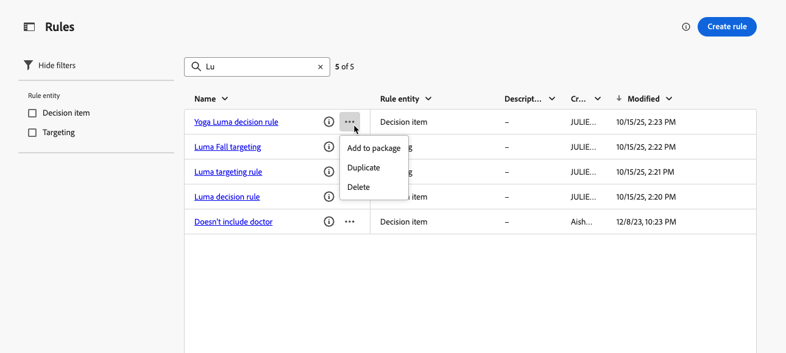
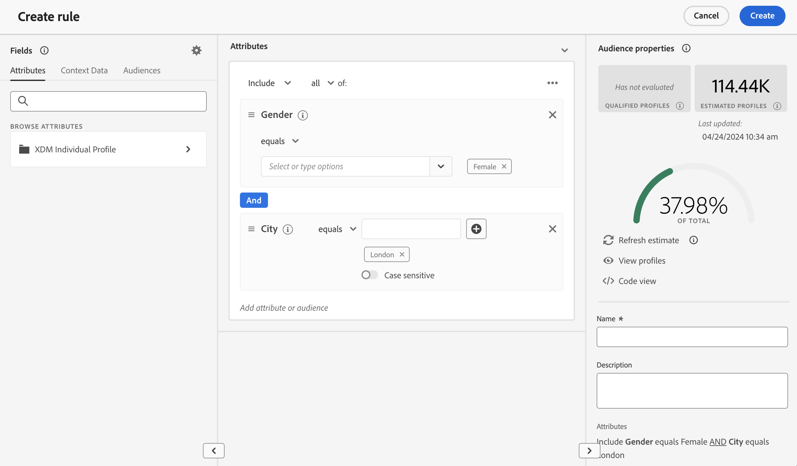
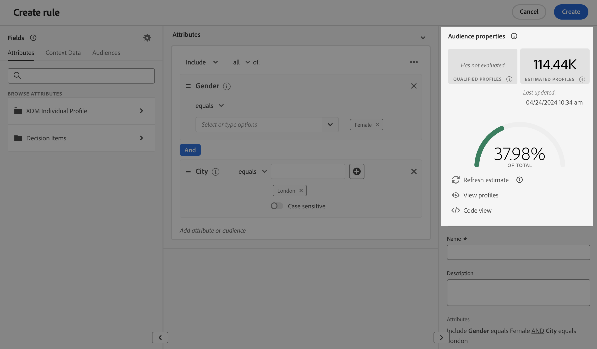
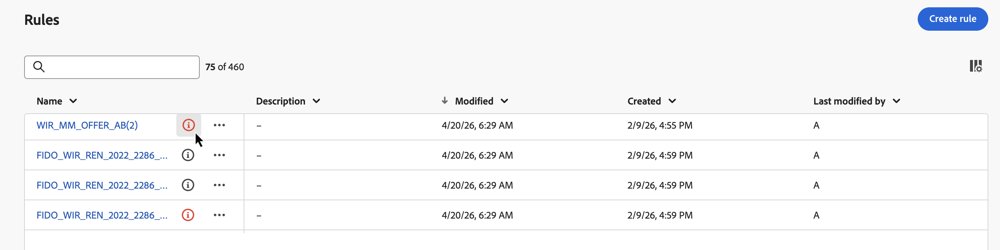

# Creare regole {#rules}

>[!CONTEXTUALHELP]
>id="ajo_exd_config_rules"
>title="Creare le regole"
>abstract="Puoi creare due tipi di regole: **regole di decisione** che possono essere utilizzate negli elementi di decisione o nelle strategie di selezione, per controllare quali elementi devono essere presentati a quale pubblico, oppure **regole di targeting** per determinare segmenti di pubblico specifici idonei a ricevere contenuti personalizzati, o per immettere un percorso di percorso specifico.  Durante la creazione di una regola di decisione, è possibile selezionare **[!UICONTROL Abilita ricerca set di dati]** per utilizzare i dati di Adobe Experience Platform. Ciò ti consente di definire criteri di idoneità in base ad attributi esterni dinamici, garantendo che gli elementi decisionali vengano visualizzati solo se pertinenti."

## Informazioni sulle regole {#about}

In [!DNL Journey Optimizer] è possibile creare due tipi di regole riutilizzabili:

* [Regole di decisione](#decision-rules)
* [Regole di targeting](#targeting-rules)

### Regole di decisione {#decision-rules}

Le regole di decisione ti consentono di definire il pubblico per gli elementi di decisione applicando vincoli, direttamente a livello di elemento di decisione o all’interno di una strategia di selezione specifica. Ciò consente di controllare con precisione quali elementi devono essere presentati a chi.

Ad esempio, consideriamo uno scenario in cui si hanno elementi decisionali con prodotti relativi allo yoga progettati per le donne. Con le regole di decisione, puoi specificare che questi elementi devono essere visualizzati solo ai profili il cui genere è &quot;Femmina&quot; e che hanno indicato un &quot;Punto di interesse&quot; in &quot;Yoga&quot;.

>[!NOTE]
>
>Oltre alle regole di decisione a livello di articolo e di strategia di selezione, puoi anche definire il pubblico a cui rivolgerti a livello di campagna. [Ulteriori informazioni](../campaigns/create-campaign.md#audience)

### Regole di targeting {#targeting-rules}

>[!AVAILABILITY]
>
>Le regole di targeting sono attualmente a disponibilità limitata. Per ottenere l’accesso, contatta il rappresentante Adobe.
>
>Questa funzionalità è disponibile solo per le organizzazioni che hanno acquistato il componente aggiuntivo **Decisioning**. Verrà introdotto progressivamente per tutti i clienti.

Le regole di targeting consentono di determinare le qualifiche specifiche che devono essere soddisfatte affinché un cliente sia idoneo a ricevere contenuti personalizzati o a immettere un percorso di percorso specifico, in base a segmenti di pubblico specifici, che consente di eseguire il targeting di pubblici secondari nei percorsi e nelle campagne.

Spesso si tratta di una combinazione di più attributi, oltre a eventi di comportamento del cliente e dati contestuali. Per risparmiare tempo e fatica, puoi creare regole di targeting una volta e riutilizzarle in tutti i tuoi percorsi e campagne, con la possibilità di modificarle rapidamente in linea al momento dell’authoring.

Puoi utilizzare queste regole:

* Durante la creazione di [targeting di ottimizzazione del contenuto](../building-journeys/path-targeting.md) in percorsi o campagne;
* Durante la creazione di [ottimizzazione del percorso di percorso](../building-journeys/path-targeting.md).

➡️ [Scopri questa funzione nel video](#video)

## Regole di accesso {#access}

L&#39;elenco delle regole è accessibile nel menu **[!UICONTROL Decisioning]** > **[!UICONTROL Imposta strategia]**.

Sono disponibili le seguenti azioni:

* Puoi filtrare in base all&#39;entità regola (**[!UICONTROL Elemento decisione]** o **[!UICONTROL Impostazione destinazione]** - [Ulteriori informazioni](#about)).

* Seleziona una regola facendo clic sul nome e modificala utilizzando il generatore di regole. [Scopri come](#create)

* Dal pulsante **[!UICONTROL Altre azioni]** accanto a ogni elemento, puoi effettuare le seguenti operazioni:

   * Se hai selezionato l&#39;entità **[!UICONTROL Elemento decisione]**, aggiungi la regola a un pacchetto per esportarla in un&#39;altra sandbox. Scopri come [esportare gli oggetti in un&#39;altra sandbox](../configuration/copy-objects-to-sandbox.md).
   * Duplica una regola.
   * Eliminare una regola.

{width=100%}

* Fai clic sull&#39;icona **[!UICONTROL Ulteriori informazioni]** per visualizzare la formula che costituisce la regola.

{width=60%}

## Creare una regola {#create}

Per creare una regola, effettua le seguenti operazioni:

1. Passa a **[!UICONTROL Decisioning]** > **[!UICONTROL Configurazione strategia]** > **[!UICONTROL Regole]**, quindi fai clic sul pulsante **[!UICONTROL Crea regola]**.

1. Seleziona l’entità regola per specificare per quale tipo di oggetto viene creata la regola.

   {width=90%}

   * **[!UICONTROL Elemento decisione]** - La regola può essere applicata a un [elemento decisione](#decision-rules) nel contesto di Decisioning;
   * **[!UICONTROL Targeting]** - La regola può essere utilizzata durante la creazione di [regole di targeting](#targeting-rules), come parte della [ottimizzazione del contenuto](../building-journeys/path-targeting.md) in una campagna o in un percorso, nell&#39;attività [Ottimizza percorso](../building-journeys/path-targeting.md).

1. Se crei una regola di tipo **[!UICONTROL Elemento decisione]**, puoi selezionare **[!UICONTROL Abilita ricerca set di dati]** per utilizzare i dati di Adobe Experience Platform per arricchire la logica decisionale con dati esterni. Questa funzione è particolarmente utile per gli attributi che cambiano frequentemente, ad esempio la disponibilità del prodotto o il prezzo in tempo reale. [Scopri come utilizzare i dati di Adobe Experience Platform per prendere decisioni](../experience-decisioning/aep-data-exd.md)

1. Viene visualizzata la schermata di creazione della regola. Denomina la regola e fornisci una descrizione.

1. Crea la regola in base alle tue esigenze utilizzando il Generatore di segmenti di Adobe Experience Platform. A questo scopo, puoi sfruttare diverse origini dati, ad esempio:
   * Attributi del profilo;
   * Attributi degli elementi di decisione - disponibili solo durante la creazione di una regola **[!UICONTROL Elemento di decisione]**;
   * Pubblico;
   * Dati contestuali provenienti da Adobe Experience Platform. [Scopri come sfruttare i dati contestuali](context-data.md)

   {width=85%}

   >[!NOTE]
   >
   >Il Generatore di segmenti fornito per la creazione di regole presenta alcune specificità rispetto a quello utilizzato con il servizio di segmentazione di Adobe Experience Platform. Tuttavia, il processo globale descritto nella documentazione è valido per la generazione di regole in [!DNL Journey Optimizer]. [Scopri come creare le definizioni dei segmenti](../audience/creating-a-segment-definition.md)

1. Durante l&#39;aggiunta e la configurazione di nuovi campi nell&#39;area di lavoro, nel riquadro **[!UICONTROL Proprietà pubblico]** vengono visualizzate informazioni sui profili stimati appartenenti al pubblico. Fai clic su **[!UICONTROL Aggiorna stima]** per aggiornare i dati.

   {width=85%}

   >[!NOTE]
   >
   >Le stime del profilo non sono disponibili quando i parametri della regola includono dati non memorizzati nel profilo, come i dati contestuali.

1. Quando la regola è pronta, fai clic su **[!UICONTROL Crea]**. La regola creata viene visualizzata nell&#39;elenco e, a seconda dell&#39;entità creata, è disponibile per l&#39;uso:

   * In **elementi decisionali** e **strategie di selezione** per gestire la presentazione degli elementi decisionali ai profili;
   * Oppure durante la creazione di **targeting** nell&#39;ottimizzazione del contenuto o del percorso.

>[!NOTE]
>
>La profondità di nidificazione in una regola è limitata a 30 livelli. Questo viene misurato contando le parentesi di chiusura `)` nella stringa PQL.
>
>Una stringa di regola può avere dimensioni fino a 15 KB per caratteri con codifica UTF-8. Equivale a 15.000 caratteri ASCII (1 byte ciascuno) o 3.750-7.500 caratteri non ASCII (2-4 byte ciascuno).
>
>[Ulteriori informazioni sulle regole di idoneità Guardrail e limitazioni](decisioning-guardrails.md#eligibility-rules)

## Ottimizzazione delle regole basate su AI {#optimize}

[!DNL Journey Optimizer] può analizzare automaticamente le regole e suggerire semplificazioni che mantengono la logica originale. Sono idonee solo le regole con espressione PQL di dimensioni superiori a **2 KB** (codifica UTF-8). Le espressioni più piccole non vengono analizzate. Quando viene trovata una semplificazione, accanto alla regola nell&#39;inventario viene visualizzato un indicatore rosso **[!UICONTROL Ottimizza]**.

>[!NOTE]
>
>L&#39;ottimizzazione delle regole basate sull&#39;intelligenza artificiale si basa sulle stesse funzionalità di intelligenza artificiale generativa di **AI Assistant** e utilizza gli stessi controlli di accesso. Agli utenti deve essere concessa l&#39;autorizzazione **[!UICONTROL Generate Content]** per la risorsa **[!UICONTROL AI Assistant]**. Per ulteriori informazioni, vedere [Accesso all&#39;Assistente di IA](../content-management/gs-generative.md#generative-access).

Per ottimizzare una regola:

1. Nell’inventario delle regole, fai clic sull’icona dell’indicatore rosso accanto al nome della regola.

1. Viene visualizzata la finestra **[!UICONTROL Ottimizza]**, con l&#39;espressione PQL originale e la versione suggerita dall&#39;intelligenza artificiale.

   

1. Per verificare che entrambe le espressioni si comportino in modo identico, fare clic su **[!UICONTROL Scarica analisi di ottimizzazione (TSV)]** per scaricare un file che mostra il modo in cui i profili simulati vengono valutati rispetto a ogni versione.

1. Al termine, fare clic su **[!UICONTROL Applica]** per sostituire l&#39;espressione originale con quella ottimizzata.

## Video tutorial {#video}

Scopri come creare, duplicare e applicare **regole di targeting** riutilizzabili in Adobe Journey Optimizer per personalizzare in modo efficiente le campagne in base agli attributi del cliente come area geografica, lingua e comportamento, risparmiando tempo e migliorando la precisione del pubblico.

>[!VIDEO](https://video.tv.adobe.com/v/3476127/?quality=12)
