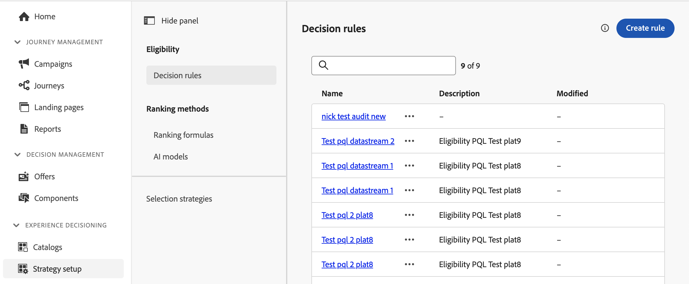

# Regole di decisione {#rules}

>[!CONTEXTUALHELP]
>id="ajo_exd_config_rules"
>title="Creare regole di decisione"
>abstract="Le regole di decisione consentono di definire il pubblico per gli elementi decisionali applicando vincoli, direttamente a livello dell’elemento decisionale o all’interno di una strategia di selezione specifica. Ciò consente di controllare con precisione quali elementi devono essere presentati a chi."

>[!BEGINSHADEBOX &quot;Cosa troverai in questa guida alla documentazione&quot;]

* [Introduzione a Experience Decisioning](gs-experience-decisioning.md)
* Gestire gli elementi decisionali: [Configurare il catalogo articoli](catalogs.md) - [Creare elementi decisionali](items.md) - [Gestire le raccolte elementi](collections.md)
* Configura la selezione degli elementi: **[Creare regole di decisione](rules.md)** - [Creare metodi di classificazione](ranking.md)
* [Creare strategie di selezione](selection-strategies.md)
* [Creare criteri di decisione](create-decision.md)

>[!ENDSHADEBOX]

Le regole di decisione consentono di definire il pubblico per gli elementi decisionali applicando vincoli, direttamente a livello dell’elemento decisionale o all’interno di una strategia di selezione specifica. Ciò consente di controllare con precisione quali elementi devono essere presentati a chi.

Ad esempio, consideriamo uno scenario in cui si hanno elementi decisionali con prodotti relativi allo yoga progettati per le donne. Con le regole di decisione, puoi specificare che questi elementi devono essere visualizzati solo ai profili il cui genere è &quot;Femmina&quot; e che hanno indicato un &quot;Punto di interesse&quot; in &quot;Yoga&quot;.

>[!NOTE]
>
>Oltre alle regole di decisione a livello di articolo e di strategia di selezione, puoi anche definire il pubblico a cui rivolgerti a livello di campagna. [Ulteriori informazioni](../campaigns/create-campaign.md#audience)

L’elenco delle regole di decisione è accessibile nella sezione **[!UICONTROL Configurazione]** / **[!UICONTROL Regole delle decisioni]** menu.

## Creare una regola di decisione {#create}

Per creare una regola di decisione, effettua le seguenti operazioni:

1. Accedi a **[!UICONTROL Configurazione]** / **[!UICONTROL Regole di decisione]** quindi fai clic su **[!UICONTROL Crea regola]** pulsante.

1. Viene visualizzata la schermata di creazione delle regole di decisione. Denomina la regola e fornisci una descrizione.

1. Crea la regola di decisione in base alle tue esigenze utilizzando Adobe Experience Platform Segment Builder. A tal fine, puoi sfruttare diverse origini dati, come attributi di profilo, tipi di pubblico o dati contestuali provenienti da Adobe Experience Platform. [Scopri come sfruttare i dati contestuali nelle regole di decisione](#context-data)

   

   >[!NOTE]
   >
   >Il Generatore di segmenti fornito per creare regole di decisione presenta alcune specificità rispetto a quello utilizzato con il servizio di segmentazione di Adobe Experience Platform.  Tuttavia, il processo globale descritto nella documentazione è ancora valido per creare regole di decisioni. [Scopri come creare le definizioni dei segmenti](../audience/creating-a-segment-definition.md)

1. Durante l’aggiunta e la configurazione di nuovi campi nell’area di lavoro, il **[!UICONTROL Proprietà del pubblico]** Questo riquadro mostra informazioni sui profili stimati appartenenti al pubblico. Clic **[!UICONTROL Aggiorna stima]** per aggiornare i dati.

   >[!NOTE]
   >
   >Le stime del profilo non sono disponibili quando i parametri della regola includono dati non presenti nel profilo, come i dati contestuali.

1. Quando la regola di decisione è pronta, fai clic su **[!UICONTROL Salva]**. La regola creata viene visualizzata nell’elenco ed è disponibile per l’utilizzo in elementi di decisione e strategie di selezione per gestire la presentazione di elementi di decisione ai profili.

## Sfruttare i dati contestuali nelle regole di decisione {#context-data}

La schermata di creazione delle regole di Experience Decisioning consente di sfruttare qualsiasi informazione disponibile in Adobe Experience Platform per creare regole di decisione. Ad esempio, puoi progettare una regola di decisione che richiede che il tempo corrente sia di ≥80 gradi.

A questo scopo, devi innanzitutto definire i dati da rendere disponibili in Experience Decisioning. Al termine, questi dati si integrano perfettamente in Experience Decisioning in **[!UICONTROL Dati contestuali]** disponibile durante la creazione di una regola di decisione.

I passaggi per alimentare Experience Decisioning con i dati di Adobe Experience Platform sono i seguenti:

1. Creare un **Schema Experience Event**  in Adobe Experience Platform e relativi **set di dati**. [Scopri come creare schemi](https://experienceleague.adobe.com/en/docs/experience-platform/xdm/ui/resources/schemas){target="_blank"}

1. Crea un nuovo flusso di dati Adobe Experience Platform:

   1. Accedi a **[!UICONTROL Flussi di dati]** menu e seleziona **[!UICONTROL Nuovo flusso di dati]**.

   1. In **[!UICONTROL Schema Evento]** , seleziona lo schema Experience Event creato in precedenza e fai clic su **[!UICONTROL Salva]**.

      

   1. Clic **[!UICONTROL Aggiungi servizio]** e selezionare &quot;Adobe Experience Platform&quot; come servizio. In **[!UICONTROL Set di dati evento]** , seleziona il set di dati evento creato in precedenza e abilita **[!UICONTROL Adobe Journey Optimizer]** opzione.

      

Una volta salvato lo stream di dati, le informazioni del set di dati selezionato vengono recuperate automaticamente e integrate in Experience Decisioning, diventando in genere disponibili entro circa 24 ore.

Per ulteriori informazioni su come lavorare con Adobe Experience Platform, consulta le risorse seguenti:

* [Schemi Experience Data Model (XDM)](https://experienceleague.adobe.com/en/docs/experience-platform/xdm/schema/composition){target="_blank"}
* [Set di dati](https://experienceleague.adobe.com/en/docs/experience-platform/catalog/datasets/overview){target="_blank"}
* [Flussi di dati](https://experienceleague.adobe.com/en/docs/experience-platform/datastreams/overview){target="_blank"}
