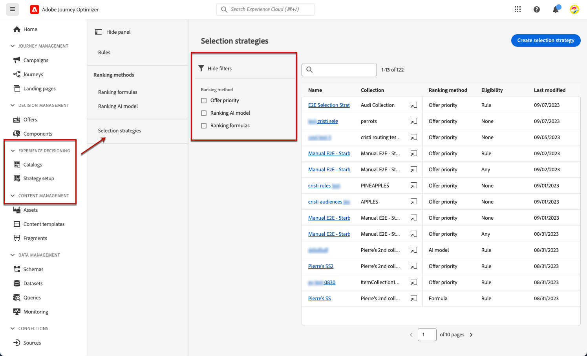
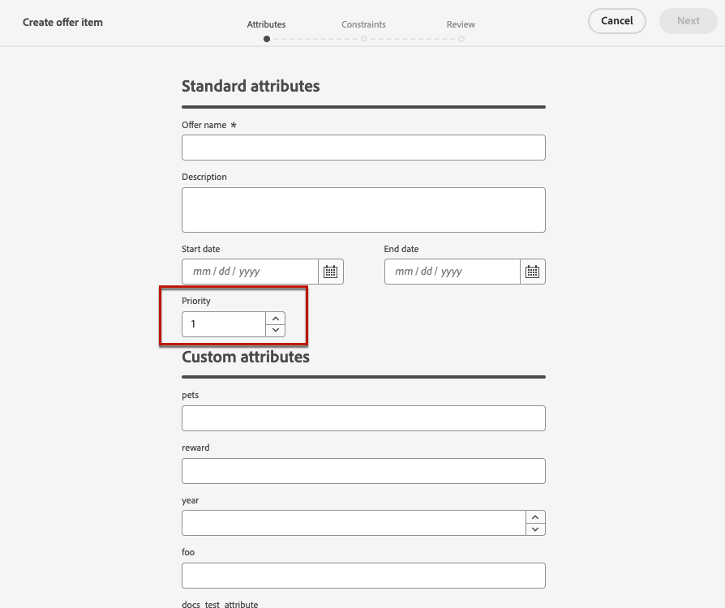

# Creare strategie di selezione {#selection-strategies}

>[!CONTEXTUALHELP]
>id="ajo_exd_config_strategies"
>title="Definire le strategie di selezione"
>abstract="Una strategia di selezione è riutilizzabile e consiste in una raccolta associata a un vincolo di idoneità e a un metodo di classificazione per determinare le offerte da visualizzare quando vengono selezionate in un criterio di decisione."
>additional-url="https://experienceleague.adobe.com/en/docs/journey-optimizer/using/decisioning/experience-decisioning/decision-policies/create-decision" text="Creare criteri di decisione"

>[!CONTEXTUALHELP]
>id="ajo_exd_strategy_eligibility"
>title="Limitare i profili idonei"
>abstract="Puoi limitare la selezione delle offerte per questa strategia di selezione. Per impostazione predefinita, tutti i profili sono idonei, ma puoi utilizzare tipi di pubblico o regole per limitare la selezione dell’offerta solo a profili specifici."
>additional-url="https://experienceleague.adobe.com/it/docs/journey-optimizer/using/audiences-profiles-identities/audiences/about-audiences" text="Utilizzare i tipi di pubblico"
>additional-url="https://experienceleague.adobe.com/it/docs/journey-optimizer/using/decisioning/experience-decisioning/rules" text="Utilizzare le regole di decisione"

Una strategia di selezione è riutilizzabile ed è costituita da una raccolta associata a un vincolo di idoneità e a un metodo di classificazione per determinare le offerte da mostrare quando vengono selezionate in un [criterio di decisione](create-decision.md).

## Accesso e gestione delle strategie di selezione

1. Vai a **[!UICONTROL Decisioning]** > **[!UICONTROL Configurazione strategia]** > **[!UICONTROL Strategie di selezione]**.

1. Vengono elencate tutte le strategie di selezione create finora. Sono disponibili filtri per aiutarti a recuperare le strategie in base al metodo di classificazione.

   

1. Fare clic sul nome di una strategia di selezione per modificarla.

1. Vengono inoltre visualizzati la raccolta, il metodo di classificazione e l’idoneità selezionati per ciascuna strategia. Puoi fare clic sull&#39;icona accanto al nome di ogni raccolta per modificarla direttamente.

   

## Creare una strategia di selezione {#create-selection-strategy}

Per creare una strategia di selezione, segui i passaggi indicati di seguito.

1. Nell&#39;inventario **[!UICONTROL Strategie di selezione]**, fare clic su **[!UICONTROL Crea strategia di selezione]**.

   

1. Aggiungi un nome per la strategia.

   >[!NOTE]
   >
   >Attualmente è disponibile solo il catalogo predefinito **[!UICONTROL Offerte]**.

1. Compila i dettagli per la strategia di selezione, iniziando dal nome.

   

1. Selezionare la [raccolta](collections.md) contenente le offerte da considerare.

1. Utilizza il campo **[!UICONTROL Idoneità]** per limitare la selezione delle offerte per questa strategia di selezione.

   

   * Per limitare la selezione delle offerte ai membri di un pubblico Experience Platform, seleziona **[!UICONTROL Tipi di pubblico]** e scegli un pubblico dall&#39;elenco. [Scopri come utilizzare i tipi di pubblico](../audience/about-audiences.md)

   * Se desideri aggiungere un vincolo di selezione con una regola di decisione, utilizza l&#39;opzione **[!UICONTROL Regola di decisione]** e seleziona la regola desiderata. [Scopri come creare una regola](rules.md)

1. Definisci il metodo di classificazione da utilizzare per selezionare l’offerta migliore per ciascun profilo. [Ulteriori informazioni](#select-ranking-method)

   

   * Per impostazione predefinita, se più offerte sono idonee per questa strategia, il metodo [Priorità offerta](#offer-priority) utilizza il valore definito nelle offerte.

   * Se si desidera utilizzare un punteggio calcolato specifico per scegliere l&#39;offerta idonea da consegnare, selezionare [Formula](#ranking-formula) o [Modello di IA](#ai-ranking).

1. Fai clic su **[!UICONTROL Crea]**. Ora può essere utilizzato in un [criterio di decisione](create-decision.md)

## Selezionare un metodo di classificazione {#select-ranking-method}

>[!CONTEXTUALHELP]
>id="ajo_exd_strategy_ranking"
>title="Definire la modalità di classificazione delle offerte"
>abstract="Se più offerte sono idonee per una determinata strategia di selezione, scegli il metodo che selezionerà l’offerta migliore per ciascun profilo durante la creazione di una strategia di selezione: priorità o formula di classificazione."
>additional-url="https://experienceleague.adobe.com/docs/journey-optimizer/using/decisioning/experience-decisioning/decision-policies/create-decision.html" text="Creare criteri di decisione"

Se più offerte sono idonee per una determinata strategia di selezione, puoi scegliere il metodo con cui selezionare l’offerta migliore per ciascun profilo al momento di creare una strategia di selezione. Puoi classificare le offerte in base a:

* [Priorità offerte](#offer-priority)
* [Formula](#ranking-formula)
* [Classificazione basata su IA](#ai-ranking)

### Priorità offerte {#offer-priority}

Per impostazione predefinita, quando più offerte sono idonee in un criterio di decisione, gli elementi con la **priorità** più elevata verranno consegnati prima ai clienti.

{width=85%}

I punteggi di priorità delle offerte vengono assegnati durante la creazione di un [elemento di decisione](items.md).

### Formula di classificazione {#ranking-formula}

Oltre alla priorità dell&#39;offerta, Journey Optimizer consente di creare **formule di classificazione**. Si tratta di formule che determinano quale offerta deve essere presentata per prima per un determinato posizionamento, anziché tenere conto dei punteggi di priorità delle offerte.

Ad esempio, puoi aumentare la priorità di tutte le offerte la cui data di fine è inferiore a 24 ore da ora, oppure puoi aumentare le offerte dalla categoria &quot;in esecuzione&quot; se il punto di interesse del profilo è &quot;in esecuzione&quot;. Scopri come creare una formula di classificazione in [questa sezione](ranking/ranking-formulas.md).

Una volta creata, è possibile utilizzare questa formula in una strategia di selezione. Se più offerte sono idonee per essere presentate quando si utilizza questa strategia di selezione, la decisione utilizzerà la formula selezionata per calcolare quale offerta consegnare per prima.

### Classificazione basata su IA {#ai-ranking}

Puoi anche utilizzare un sistema di modelli addestrato che classifica automaticamente le offerte da visualizzare per un determinato profilo selezionando un modello di intelligenza artificiale. Scopri come creare un modello di IA in [questa sezione](ranking/create-ai-models.md).

Una volta creato un modello di IA, puoi utilizzarlo in una strategia di selezione. Se sono ammesse più offerte, il sistema di modelli addestrato determinerà quale offerta deve essere presentata per prima per questa strategia di selezione.

>[!NOTE]
>
>Attualmente il rapporto [Lift Measurement](ranking/auto-optimization-model.md#lift) è disponibile solo per il modello di intelligenza artificiale [Personalized optimization](ranking/personalized-optimization-model.md).

